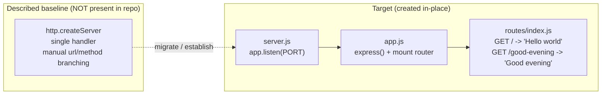
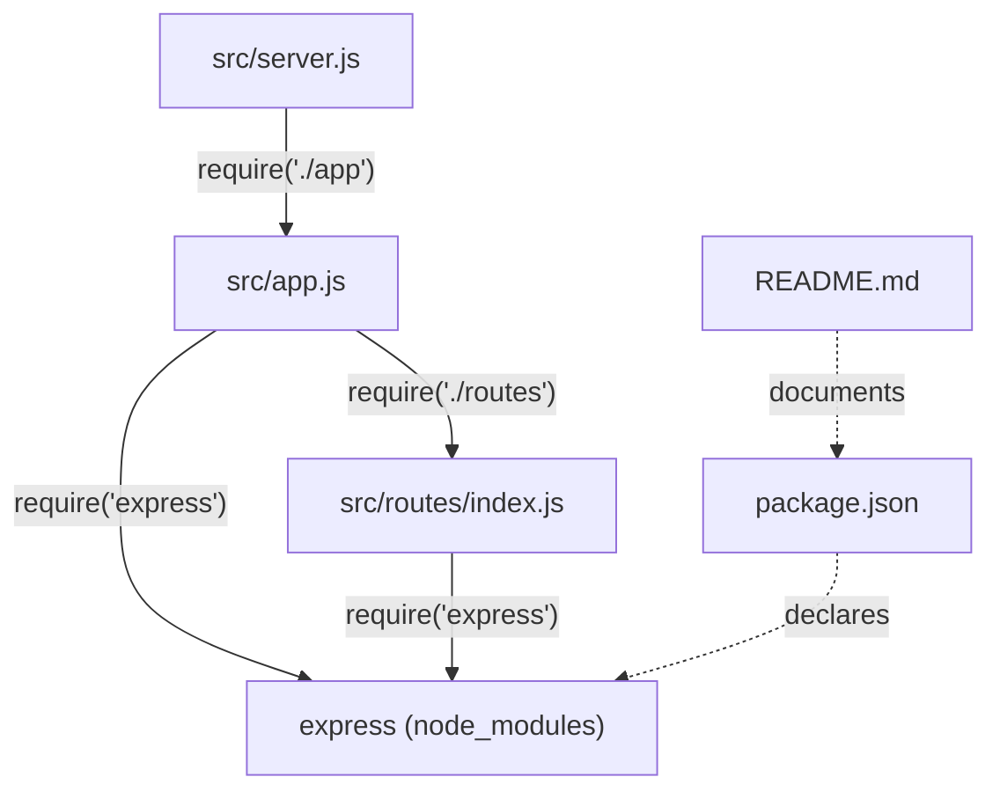

# Technical Specification

# 0. Agent Action Plan

## 0.1 Intent Clarification

This Agent Action Plan interprets the user's request as a **REFACTOR**-flavored change — specifically a web-framework (tech-stack) migration — augmented by one additive endpoint. The plan below restates the intent with technical precision, surfaces implicit requirements, and reconciles the request against the *verified* state of the repository.

### 0.1.1 Core Refactoring Objective

**User Request (preserved verbatim):**

> "add feature to a existing product. this is a tutorial of node js server hosting one endpoint that returns the response 'Hello world'. Could you add expressjs into the project and add another endpoint that return the reponse of 'Good evening'?"

**Based on the prompt, the Blitzy platform understands that the refactoring objective is to** migrate the project's HTTP layer from a vanilla Node.js `http`-module server onto the **Express.js** web framework, and to extend the routing surface with a **second endpoint** that returns the plain-text response `Good evening`, while **preserving** the existing `Hello world` endpoint and its behavior.

- **Refactoring type:** Tech-stack migration (framework adoption: native Node `http` → Express.js) combined with **modularity** improvements (introduction of an app/server/router separation).
- **Target repository:** Same repository, **in-place** transformation (this is *not* a new-repository migration).

**Enumerated refactoring goals (with enhanced clarity):**

- **Goal 1 — Adopt Express.js:** Introduce Express as the project's web framework and route the HTTP server through `express()` instead of `http.createServer`.
- **Goal 2 — Add the new endpoint (the "feature"):** Expose a new route, `GET /good-evening`, whose response body is exactly `Good evening`.
- **Goal 3 — Preserve the existing endpoint:** Keep the original endpoint, `GET /`, returning exactly `Hello world`.

**Critical repository-state finding (Empty Repository Management).** The prompt describes an *existing* Node.js "Hello world" server; however, the repository does not contain one. The indexed repository root contains a **single file**, `README.md`, whose entire content is the line `# Artifact6` [README.md:L1]. There is no server code, no `package.json`, no lockfile, and no `src/`/`test/` directories. This is corroborated by the Technical Specification: the system overview records that no language, framework, or runtime has been adopted and that a Node.js `package.json` is absent [§1.2.2]; the scope section states that "the project consists, today, of the name Artifact6 and nothing else" [§1.3.3]; and the frameworks chapter states that "No frameworks or libraries are in use by the Artifact6 system" [§3.3.1]. **Resolution:** the user's intent is honored faithfully by *establishing* the Node.js + Express baseline the user expects — most files are therefore **CREATE** operations, and `README.md` is the only **UPDATE** target. The plan documents the true current state truthfully rather than assuming a server exists.

**Implicit requirements surfaced (not stated, but necessary):**

- A Node package manifest (`package.json`) must be created to declare the `express` dependency and run scripts, since none exists today [§1.2.2].
- A dependency lockfile (`package-lock.json`) must be generated to pin exact versions for reproducible installs.
- The original "Hello world" response body must remain byte-for-byte identical (`Hello world`) during the framework swap (behavioral preservation).
- The server's listening port must be preserved/configurable (`process.env.PORT || 3000`) so the tutorial continues to behave predictably.
- Project documentation (`README.md`) should be updated to reflect the new stack, install/run steps, and the two endpoints, while retaining the existing `# Artifact6` title [README.md:L1].

**Ambiguities flagged (resolved as documented assumptions):**

- **Route paths** — the existing endpoint is assumed to be `GET /`; the new endpoint is assumed to be `GET /good-evening`. The user may rename either; these are reasonable, conventional defaults.
- **Response Content-Type/format** — responses are emitted via Express `res.send(<string>)`; the resulting header behavior and an optional plain-text parity option are analyzed in §0.6.

### 0.1.2 Technical Interpretation

**This refactoring translates to the following technical transformation strategy:** replace the conceptual native-`http` request pipeline (a single `http.createServer((req, res) => …)` callback that branches on `req.url`/`req.method` and writes responses with `res.writeHead`/`res.end`) with an Express application that declares routes declaratively via `app.get(path, handler)` and emits responses with `res.send(body)`. Because no server source presently exists [§1.3.3], the "current architecture" is the user-*described* baseline, and the target architecture is *created* fresh as a clean, modular Express project.

**Current → Target architecture mapping:**

| Concern | Described baseline (native `http`, not materialized) | Target (Express.js) |
|---------|------------------------------------------------------|---------------------|
| Server creation | `http.createServer(handler)` | `express()` application object |
| Routing | Manual `if (req.url === …)` branching inside one handler | Declarative `router.get('/', …)` / `router.get('/good-evening', …)` |
| Response write | `res.writeHead(200, …); res.end('Hello world')` | `res.send('Hello world')` |
| Process bootstrap | `server.listen(PORT)` | `app.listen(PORT)` in a dedicated `server.js` |
| Module layout | Single file | `server.js` → `app.js` → `routes/index.js` (separation of concerns) |



**Transformation rules and patterns to apply:**

- **Framework swap:** every HTTP entry point is expressed through Express; the native `http` module is not used directly in application code.
- **Declarative routing:** one route registration per endpoint (`router.get`), each with a thin single-responsibility handler.
- **App/Server decoupling:** `app.js` builds and exports the configured Express app; `server.js` imports it and binds the port — making the app importable (e.g., for future tests) without opening a socket.
- **Behavioral preservation:** response body strings are copied exactly (`Hello world`, `Good evening`); the listening port remains `process.env.PORT || 3000`.
- **Structure-only intent:** aside from the *additive* `/good-evening` route, no business behavior is altered — this is a structural/framework refactor, not a functional rewrite.


## 0.2 Scope Boundaries

The scope is fully enumerable because the repository contains only `README.md` [README.md:L1]; there is no hidden source surface to discover. Two confirmatory semantic searches — one for a Node HTTP server entry point and one for a `package.json` manifest — both returned empty, and the Technical Specification independently confirms the absence of source code and dependency manifests [§1.3.3], [§3.3.1]. The boundaries below are therefore exhaustive rather than illustrative.

### 0.2.1 Exhaustively In Scope

All in-scope files live in the same (in-place) repository. Six are **CREATE** (no equivalent source file exists) and one is **UPDATE**.

**Source / application files (CREATE):**

- `src/server.js` — process bootstrap; requires the app and calls `app.listen(process.env.PORT || 3000)`.
- `src/app.js` — constructs the Express application (`express()`), mounts the router, and exports the app.
- `src/routes/index.js` — `express.Router()` declaring `GET /` → `Hello world` and `GET /good-evening` → `Good evening`.

**Dependency-management / manifest files (CREATE):**

- `package.json` — npm manifest declaring the `express` dependency, the `start` script, the `main` entry, and the `engines.node` constraint.
- `package-lock.json` — npm-generated lockfile that pins the exact `express` version and its transitive dependency tree.

**Version-control hygiene (CREATE):**

- `.gitignore` — ignores `node_modules/`, `npm-debug.log*`, and `.env`.

**Documentation update (UPDATE):**

- `README.md` — currently only `# Artifact6` [README.md:L1]; expand with a stack description (Node.js + Express), prerequisites (Node ≥ 18), install (`npm install`) and run (`npm start`) instructions, and an endpoint reference table. The existing title is **preserved**, not replaced.

**Import corrections:** Not applicable — there are no pre-existing source files containing import/`require` statements to rewrite (every `require` is introduced fresh in the new files).

**Rule-mandated files:** None. The user-specified rules list is empty, so no additional files (migration scripts, fixtures, config templates) are forced into scope.

| In-scope path | Mode | Category |
|---------------|------|----------|
| `package.json` | CREATE | Manifest |
| `package-lock.json` | CREATE | Lockfile |
| `.gitignore` | CREATE | VCS hygiene |
| `README.md` | UPDATE | Documentation |
| `src/server.js` | CREATE | Source (bootstrap) |
| `src/app.js` | CREATE | Source (app assembly) |
| `src/routes/index.js` | CREATE | Source (routing) |

### 0.2.2 Explicitly Out of Scope

The following are intentionally excluded — none were requested by the user, and the rules list is empty:

- **Persistence:** databases, ORMs, migrations, or any data-storage layer.
- **Authentication/authorization:** no auth, sessions, tokens, or user management.
- **Front-end / UI:** no HTML templating engine, static asset pipeline, SPA, or styling — this is a backend HTTP service with no user-interface surface (consistent with the Technical Specification's verified UI absence in §7).
- **Additional middleware:** CORS, `helmet`, `body-parser`/`express.json`, logging middleware, etc., beyond Express defaults — not required for two static-text GET endpoints.
- **Language/tooling migration:** no TypeScript, Babel, or bundler; the project remains JavaScript on CommonJS modules.
- **Containerization & delivery:** no Dockerfile, CI/CD pipelines, or deployment manifests (none exist [§1.3.3], and none were requested).
- **Automated test framework:** the user did not request tests; verification is manual (e.g., `curl`). A test layer is noted only as a future extension.
- **Secrets/configuration files:** no `.env` secrets file is created — `PORT` is defaulted and there are no secrets to manage.
- **Existing content:** the `# Artifact6` README title is retained, not deleted [README.md:L1].


## 0.3 Target Design

The target is a clean, minimal, standalone Node.js + Express project created in-place. Because the repository is empty apart from `README.md` [README.md:L1], the design specifies **every** file required for standalone operation (manifest, lockfile, VCS hygiene, source, and documentation).

### 0.3.1 Refactored Structure Planning

The following is the complete target layout. All paths are relative to the repository root (`Artifact6/`).

```
Artifact6/
├── package.json            (CREATE) npm manifest; express ^5.2.1 dependency; "start" script; engines.node ">=18"
├── package-lock.json       (CREATE) npm-generated lockfile pinning exact versions
├── .gitignore              (CREATE) ignores node_modules/, npm-debug.log*, .env
├── README.md               (UPDATE) preserve "# Artifact6"; add stack, prerequisites, install/run, endpoint table
└── src/
    ├── server.js           (CREATE) bootstrap: require('./app'); PORT = process.env.PORT || 3000; app.listen(PORT)
    ├── app.js              (CREATE) const app = express(); app.use('/', routes); module.exports = app
    └── routes/
        └── index.js        (CREATE) express.Router(): GET '/' -> 'Hello world'; GET '/good-evening' -> 'Good evening'
```

Representative (illustrative, ≤ 3 lines each) shapes for the three source files:

```javascript
// src/routes/index.js
const router = require('express').Router();
router.get('/', (req, res) => res.send('Hello world'));
router.get('/good-evening', (req, res) => res.send('Good evening'));
```

```javascript
// src/app.js
const express = require('express');
const app = express();
app.use('/', require('./routes')); module.exports = app;
```

```javascript
// src/server.js
const app = require('./app');
const PORT = process.env.PORT || 3000;
app.listen(PORT, () => console.log(`Listening on ${PORT}`));
```

**Alternative considered (not chosen):** a single root `index.js` containing the app, routes, and `listen()` is acceptable for a pure tutorial. The modular three-file split is chosen deliberately to demonstrate clean separation of concerns and router composition for this refactor; the trade-off is one extra directory level for a small gain in clarity and testability.

### 0.3.2 Web Search Research Conducted

Research was conducted to anchor versions and conventions to current, non-placeholder values:

- **Express current stable version** — verified as Express **5.2.1** on the npm registry; Express advertises itself as a "fast, unopinionated, minimalist web framework," which directly suits two static-text endpoints.
- **Express runtime requirement** — Express 5 requires **Node.js ≥ 18**; this drives the `engines.node` constraint and the recommended runtime.
- **Node.js LTS guidance** — production usage should target an Active/Maintenance LTS line; the recommendation is to develop on a current LTS (Node 22.x verified available locally, or 24.x) while declaring a pragmatic `>=18` floor.
- **Express project-structure conventions** — Express is unopinionated; small apps commonly begin from a single entry file, but the widely recommended clean pattern separates an `app.js` (build/configure/export the app) from a `server.js` (read `PORT`, call `app.listen`), with a `routes/` folder using `express.Router()` and thin handlers. Standard root files are `package.json`, `.gitignore`, and `README.md`.
- **Migration semantics** — `res.send(<string>)` default header behavior (Content-Type, X-Powered-By, ETag) was confirmed to inform the parity analysis in §0.6.

### 0.3.3 Design Pattern Applications

- **Separation of Concerns (app vs. server):** `app.js` assembles and exports the Express application; `server.js` performs the network bootstrap (`app.listen`). The app is importable without binding a port — enabling future testing and reuse.
- **Router / Front-Controller pattern:** endpoints are declared with `express.Router()` in `src/routes/index.js` and mounted via `app.use('/', router)`, replacing native `req.url`/`req.method` branching with declarative, composable routing.
- **Single Responsibility Principle:** each route handler returns exactly one response; handlers are thin and side-effect free.
- **Configuration via environment (12-factor):** the listening port is read as `process.env.PORT || 3000`; no secrets or hardcoded environment values.
- **Module pattern (CommonJS):** `require`/`module.exports` provide loose coupling along the chain `server.js → app.js → routes/index.js`.
- **Intentional simplicity (no premature layering):** a separate controllers/services/models layer is *deliberately omitted* — for two trivial static-text endpoints it would be over-engineering. A controller layer is documented only as a possible future extension.

### 0.3.4 User Interface Design

**Not applicable.** This is a backend HTTP service/tutorial with no user-interface surface, consistent with the Technical Specification's verified UI absence (§7). There are no Figma attachments and no component library or design system specified; consequently, the Design System Compliance protocol does not apply and that sub-section is intentionally omitted. Endpoint responses are plain strings emitted via `res.send()`.


## 0.4 Transformation Mapping

This section maps every target file to its source (or explicitly notes "no equivalent source"), documents the resulting `require` graph, defines wildcard policy, and affirms single-phase execution.

### 0.4.1 File-by-File Transformation Plan

Because the repository is empty apart from `README.md` [README.md:L1], six targets are **CREATE** with no equivalent source, and `README.md` is the only **UPDATE**. No target is a **REFERENCE**-only file (there are no in-repo patterns to mirror).

| Target File | Transformation | Source File | Key Changes |
|-------------|----------------|-------------|-------------|
| `package.json` | CREATE | *(no equivalent source — repo empty [§1.3.3])* | New npm manifest: `name`, `version`, `main: "src/server.js"`, `scripts.start: "node src/server.js"`, `engines.node: ">=18"`, `dependencies.express: "^5.2.1"`. |
| `package-lock.json` | CREATE | *(no equivalent source)* | Generated by `npm install`; pins exact `express` 5.2.1 and its transitive dependency tree. |
| `.gitignore` | CREATE | *(no equivalent source)* | Ignore `node_modules/`, `npm-debug.log*`, `.env`. |
| `src/server.js` | CREATE | *(no equivalent source)* | Bootstrap: `const app = require('./app'); const PORT = process.env.PORT || 3000; app.listen(PORT, …)`. |
| `src/app.js` | CREATE | *(no equivalent source)* | `const express = require('express'); const app = express(); app.use('/', require('./routes')); module.exports = app`. |
| `src/routes/index.js` | CREATE | *(no equivalent source)* | `express.Router()`: `router.get('/', (req,res)=>res.send('Hello world'))`; `router.get('/good-evening', (req,res)=>res.send('Good evening'))`; `module.exports = router`. |
| `README.md` | UPDATE | `README.md` [README.md:L1] | Preserve the `# Artifact6` title; append project description (Node.js + Express), prerequisites (Node ≥ 18), install (`npm install`), run (`npm start`), and an endpoint table (`GET /` → `Hello world`; `GET /good-evening` → `Good evening`). |

No user-provided Figma URLs exist, so no file requires a Figma reference.

### 0.4.2 Cross-File Dependencies

The new files form a simple, acyclic `require` chain. There are **no pre-existing imports to rewrite** — all `require` statements are introduced fresh (forward references only), so the conventional "import correction" task of a refactor is not applicable here.



**New `require` statements introduced (no legacy transformation):**

- `src/server.js`: `const app = require('./app');`
- `src/app.js`: `const express = require('express'); const routes = require('./routes');`
- `src/routes/index.js`: `const express = require('express');`

**Configuration linkage:** `package.json` declares `express` (consumed by `app.js` and `routes/index.js`) and the `start` script that runs `src/server.js`; `README.md` documents those scripts and endpoints.

### 0.4.3 Wildcard Patterns

The in-scope set is small and fully enumerated (seven explicit files), so **no wildcard patterns are required or used**. Should a pattern ever be necessary, only **trailing** forms are permitted (e.g., `src/**/*.js`), never leading patterns (e.g., `**/routes/*.js`). None are needed for this transformation.

### 0.4.4 One-Phase Execution

The entire refactor executes in a **single Blitzy phase**. All seven files (six CREATE + one UPDATE) are authored together — there is no multi-phase split, staging, or sequencing across phases. The `package-lock.json` is produced by running `npm install` as part of the same phase once `package.json` is written.

## 0.5 Dependency Inventory

All versions below are verified, non-placeholder values. The project currently declares **no dependencies** because no manifest exists [§1.2.2], [§3.3.1]; this refactor introduces exactly one direct runtime dependency.

### 0.5.1 Key Packages

| Registry | Package / Runtime | Version | Purpose |
|----------|-------------------|---------|---------|
| npm | `express` | `^5.2.1` (resolves to 5.2.1, verified latest) | Minimalist web framework providing declarative routing and middleware; replaces the native `http` server. **New** direct dependency. |
| — | Node.js (runtime) | `>=18` (Express 5 minimum); recommend Active LTS (Node 22.x verified locally, or 24.x) | JavaScript runtime executing the server. |
| npm (bundled) | npm (tooling) | 10.x / 11.x (11.1.0 verified locally) | Dependency install + script runner (`npm install`, `npm start`). |

**Transitive dependencies:** Express 5 pulls in its own transitive tree (router, finalhandler, body-parser, etc.). These are resolved and pinned automatically into `package-lock.json` by `npm install`; they are not hand-authored and are not enumerated individually here.

### 0.5.2 Import Refactoring

**Legacy import rewriting is not applicable** — there are no pre-existing source files or `require`/`import` statements in the repository [§1.3.3]. This is greenfield code creation within an otherwise empty repository, so there is no `from old_module import *`-style transformation to perform. The only `require` statements are the new, forward-referencing CommonJS imports introduced by the created files:

- `src/server.js` → `require('./app')`
- `src/app.js` → `require('express')`, `require('./routes')`
- `src/routes/index.js` → `require('express')`

### 0.5.3 External Reference Updates

- **Build / manifest files:** `package.json` (CREATE — declares `express`, `start` script, `engines`) and `package-lock.json` (CREATE — pins versions).
- **Documentation:** `README.md` (UPDATE — install/run steps and the endpoint table), preserving the existing `# Artifact6` title [README.md:L1].
- **VCS hygiene:** `.gitignore` (CREATE — `node_modules/`, logs, `.env`).
- **Config / CI-CD files:** none exist and none are requested — no `**/*.config.*`, `**/*.yaml`, `.github/workflows/*`, or `.gitlab-ci.yml` updates are in scope [§1.3.3].

**Dependency change summary:** ADD `express ^5.2.1` (the sole direct dependency); REMOVE none; UPDATE none (no prior manifest existed); `devDependencies` none (no test framework or linter was requested).


## 0.6 Special Analysis: Migration Parity (Native http → Express)

Because this refactor swaps the HTTP engine, the dominant risk is *response parity* — the new Express responses should match user expectations for the preserved `Hello world` endpoint. The analysis below documents the behavioral deltas between a hand-rolled native `http` server and Express's `res.send`, and the constraints that keep the migration faithful. (No native server exists in the repo today [§1.3.3]; the "baseline" is the conventional tutorial implementation the user described.)

### 0.6.1 Response Header Parity

Conventional native baseline: `res.writeHead(200, { 'Content-Type': 'text/plain' }); res.end('Hello world')`. Express equivalent: `res.send('Hello world')`. The resulting header deltas are:

| Aspect | Native baseline (`res.end`) | Express (`res.send(<string>)`) | Parity action |
|--------|-----------------------------|--------------------------------|---------------|
| Status code | `200` | `200` (default) | None — identical |
| `Content-Type` | Whatever is hand-set (often `text/plain`) | `text/html; charset=utf-8` (default for strings) | Optional: `res.type('text/plain')` to match a prior `text/plain` server |
| `Content-Length` | Set if provided | Set automatically for string bodies | None — equivalent |
| `ETag` | Usually absent | Weak `ETag` auto-generated (enables conditional `304`) | Acceptable (beneficial); may disable via app setting if strict parity desired |
| `X-Powered-By` | Absent | `Express` (default) | Optional: `app.disable('x-powered-by')` for parity/security |

These differences are minor and generally beneficial. The **chosen Content-Type should be documented**; the recommendation is to accept the Express `text/html` default for a tutorial, or explicitly set `text/plain` if exact parity with a classic native server is desired.

### 0.6.2 Routing and 404 Semantics

- A native single-handler server typically returns the **same body for every path/method** (no routing). Express instead matches declared routes and returns its **default `404 Not Found`** (via `finalhandler`) for unmatched routes — a behavior change that is an improvement (correct HTTP semantics).
- Resulting behavior: `GET /` → `Hello world`; `GET /good-evening` → `Good evening`; all other paths → `404`.
- **Method scoping:** `app.get()` matches only `GET`; a non-`GET` request to a `GET`-only path yields Express's default `404`. This is acceptable for these read-only endpoints.

### 0.6.3 Behavioral Preservation Constraints

The following constraints govern a faithful migration and must hold in the generated code:

- **Exact response bodies:** emit `Hello world` and `Good evening` byte-for-byte (exact case and spacing, matching the user's request).
- **Preserve the existing endpoint:** `GET /` continues to return `Hello world`; the framework swap introduces no functional change to that response body — the `/good-evening` route is the only *additive* behavior.
- **Preserve the listening port:** `process.env.PORT || 3000`, so the tutorial's runtime behavior is unchanged.
- **Express 5 prerequisite:** requires Node ≥ 18; the simple `app.get(path, handler)` + `res.send` usage is unaffected by Express 5 breaking changes (e.g., `path-to-regexp` v8), so no compatibility shims are needed.


## 0.7 Refactoring Rules & Special Instructions

The user supplied **no explicit implementation rules** (the rules list is empty) and **no setup instructions**. Consequently, no rule-mandated files are forced into scope. The directives below are the *implicit* refactoring rules derived from the request, plus the documented assumptions resolving the request's ambiguities.

### 0.7.1 Refactoring-Specific Rules (Implicit)

- **Preserve existing functionality:** the `Hello world` endpoint must continue to work exactly as before; the framework migration must not alter its response body.
- **Behavior-preserving migration:** apart from the additive `/good-evening` route, this is a structural/framework change only — no business logic is introduced or changed.
- **Adopt Express as the web layer:** all HTTP handling routes through Express; the native `http` module is not used directly in application code.
- **Reproducible dependencies:** pin versions via a generated `package-lock.json`; declare `express ^5.2.1` and an `engines.node` floor of `>=18`.
- **Preserve existing content:** retain the `# Artifact6` README title [README.md:L1] when updating documentation.

### 0.7.2 Special Instructions and Constraints

- **Preserved user examples (verbatim):**
  - User Example — existing endpoint response: `Hello world`
  - User Example — new endpoint response: `Good evening`
  - These strings must be reproduced exactly (case and spacing) in `src/routes/index.js`.
- **Port preservation:** keep the server reachable on `process.env.PORT || 3000`.
- **No new-repository migration:** all work is in-place in the current repository.
- **Web-search requirement satisfied:** current Express stable (`5.2.1`), the Node ≥ 18 requirement, and recommended Express project structure were researched and applied (see §0.3.2).

### 0.7.3 Documented Assumptions (Ambiguity Resolutions)

Because the repository contains no server to inspect [§1.3.3], the following defaults are assumed and are easily overridable by the user:

| Ambiguity | Assumption | Rationale |
|-----------|------------|-----------|
| Existing endpoint path | `GET /` returns `Hello world` | Conventional root route for a "Hello world" tutorial |
| New endpoint path | `GET /good-evening` returns `Good evening` | Kebab-case slug derived from the requested response text |
| Listening port | `process.env.PORT || 3000` | 12-factor configurability with the common Node tutorial default |
| Response Content-Type | Express `res.send` default (`text/html`); plain-text optional | Tutorial-appropriate; parity option documented in §0.6.1 |
| Module system | CommonJS (`require`/`module.exports`) | No build tooling requested; simplest for a tutorial |

### 0.7.4 Optional Hardening (Non-Blocking Recommendations)

- Optionally `app.disable('x-powered-by')` to suppress the framework-disclosure header (security/parity).
- Optionally set `res.type('text/plain')` if exact `text/plain` parity with a classic native server is preferred.

These are recommendations only; they do not change the requested functional behavior.


## 0.8 Attachments

**No attachments were provided** for this project. `review_attachments` returned "No attachments found for this project."

- **File attachments (PDFs, images, documents):** None.
- **Figma screens (frame name + URL):** None. No Figma URLs were supplied; therefore the Figma Design Analysis and Design System Compliance protocols are not applicable and are intentionally omitted.
- **Externally cited reference files / URLs (instructional):** None cited in the prompt or rules. The only external resources consulted were public web references used to verify the Express version and project-structure conventions documented in §0.3.2 (Express on the npm registry; Express/Node LTS guidance).

The sole pre-existing repository file relevant to this plan is `README.md`, whose complete content is the single line `# Artifact6` [README.md:L1]; it is treated as an UPDATE target in §0.4.1 rather than an attachment.


