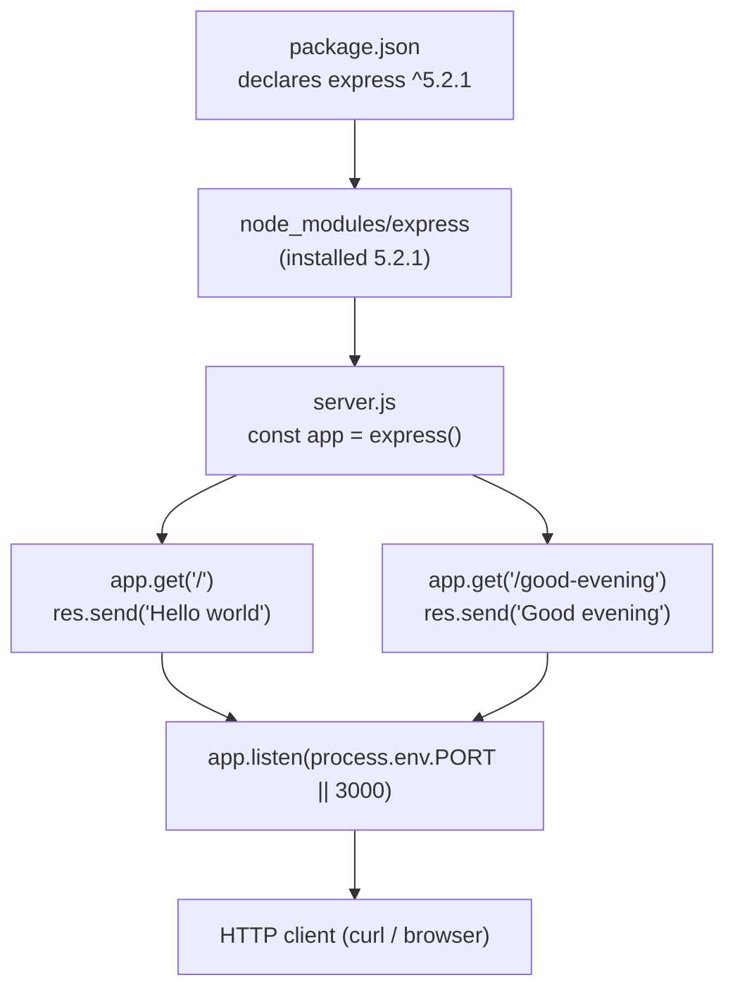

# Technical Specification

# 0. Agent Action Plan

## 0.1 Intent Clarification

Based on the prompt, the Blitzy platform understands that the new feature requirement is to **adopt the Express.js web framework and expose a second HTTP endpoint that returns the greeting "Good evening"**, alongside the tutorial's baseline endpoint that returns "Hello world".

The user's request is preserved verbatim below:

> **User request (verbatim):** "add feature to a existing product. this is a tutorial of node js server hosting one endpoint that returns the response 'Hello world'. Could you add expressjs into the project and add another endpoint that return the reponse of 'Good evening'?"

**Critical repository-state finding.** The request frames this as a change to *an existing product* and presumes a Node.js server that already serves the "Hello world" endpoint. Verification of the committed repository shows that this server does not exist: the entire tracked content is a single `README.md` (11 bytes) whose body is the literal heading `# Artifact6` [README.md:L1], and the Technical Specification confirms the project is in a "pre-implementation, placeholder state" [Tech Spec §2.1.1] in which "no technology stack, programming language, framework, runtime, build toolchain, packaging strategy, or architectural pattern has been adopted" [Tech Spec §1.2.2]. Consequently, the baseline "Hello world" server is treated as an **implicit prerequisite that must be created**, not merely modified, before the new endpoint can be "added."

### 0.1.1 Core Feature Objective

The feature decomposes into three explicit requirements:

- **FR-1 — Adopt Express.js:** Introduce Express.js as a managed runtime dependency and use it as the HTTP server and routing framework for the project.
- **FR-2 — Baseline greeting endpoint:** Serve an HTTP `GET` endpoint that returns the exact response body **`Hello world`** — the tutorial's pre-existing endpoint, which must be (re)created because no server currently exists [Tech Spec §1.2.2].
- **FR-3 — New greeting endpoint:** Add a second HTTP `GET` endpoint that returns the exact response body **`Good evening`**.

The following implicit requirements were surfaced during analysis:

- **Project initialization:** A `package.json` manifest must be created (none exists [Tech Spec §1.2.2]) to declare the project and the Express dependency.
- **Dependency materialization:** Installing the dependency produces a `package-lock.json` lockfile and a `node_modules/` tree.
- **Server entrypoint:** A single application file (for example, `server.js`) must instantiate the Express app, register both routes, and bind an HTTP listener.
- **Backward compatibility:** The "Hello world" endpoint must remain functional after Express is introduced — the word "another" in the request establishes that the first endpoint persists.
- **Repository hygiene and documentation:** A `.gitignore` should exclude `node_modules/`, and `README.md` should document how to install, run, and call both endpoints.

### 0.1.2 Special Instructions and Constraints

- **Exact response strings (non-negotiable):** The endpoints must return the literals **`Hello world`** and **`Good evening`** verbatim — case-sensitive, with no added punctuation or surrounding whitespace.
  - User Example: `Hello world`
  - User Example: `Good evening`
- **Framework directive:** Express.js must be the framework that serves the endpoints ("add expressjs into the project"); routes are defined with idiomatic `app.get(...)` handlers returning their bodies via `res.send(...)`.
- **Backward compatibility:** Preserve the baseline endpoint while adding the new one.
- **Minimal, tutorial-grade scope:** No authentication, persistence, user interface, or external integrations were requested; the implementation should remain a minimal tutorial server.
- **Web research performed:** The current Express release line and its Node.js runtime requirement were verified against the npm registry and the official Express documentation (see Section 0.3). Express **5.2.1** is the current stable release and requires **Node.js 18 or higher**.

### 0.1.3 Technical Interpretation

These feature requirements translate to the following technical implementation strategy:

| Requirement | Technical Action |
|---|---|
| FR-1 — Adopt Express.js | To introduce the framework, **create** `package.json` declaring `express` at `^5.2.1` and **generate** `package-lock.json` + `node_modules/` via `npm install`. |
| FR-2 — "Hello world" endpoint | To establish the baseline, **create** `server.js` that instantiates an Express app and registers `GET /` returning `Hello world`. |
| FR-3 — "Good evening" endpoint | To add the new endpoint, **extend** `server.js` with `GET /good-evening` returning `Good evening` on the same app instance. |
| Run and serve | To run the server, **add** an `app.listen(...)` binding (port `3000`, overridable via `process.env.PORT`) and a `start` script in `package.json`. |
| Documentation | To document usage, **update** `README.md` with prerequisites, install/run commands, and an endpoint reference table. |

> **Assumption (flagged for confirmation):** The user did not specify URL paths. The baseline endpoint is mapped to `GET /` (matching Express's official quick-start, which serves the greeting at the root) and the new endpoint to `GET /good-evening`. If a different path (for example, `/evening`) is preferred, only the route string in `server.js` changes; no other file is affected.

## 0.2 Repository Scope Discovery

### 0.2.1 Comprehensive File Analysis

The repository was exhaustively inspected — working tree, all git references, and hidden files. The complete current inventory is minimal:

| Path | Type | Size | Status | Disposition |
|---|---|---|---|---|
| `README.md` | File | 11 bytes | Only tracked file [README.md:L1] | **UPDATE** — document the feature |
| `.git/` | Directory | — | Version-control metadata | Not modified |

No source files, dependency manifests, or configuration of any kind exist [Tech Spec §1.2.2]. The maximum directory depth is one (root → `README.md`); there are no subdirectories.

**Integration-point discovery (greenfield).** Because no application code exists, there are no pre-existing integration points to modify; every integration surface below must instead be **created**:

| Integration Surface | Present Today | Action |
|---|---|---|
| API endpoints / routes | None | Create `GET /` and `GET /good-evening` in `server.js` |
| HTTP server bootstrap | None | Create the Express app and `app.listen(...)` in `server.js` |
| Dependency manifest | None [Tech Spec §1.2.2] | Create `package.json` |
| Database models / migrations | None | Not required (feature is stateless) |
| Service classes / controllers | None | Not required (routes handled inline) |
| Middleware / interceptors | None | Not required |

### 0.2.2 Web Search Research Conducted

The following research was performed to ground version and pattern decisions for this feature:

- **Current Express release and version:** Confirmed via the npm registry and npmjs.com that the current stable Express release is **5.2.1** (the default `latest` dist-tag), with **4.22.2** as the maintained 4.x line. The caret-pinned `^5.2.1` is selected as the target.
- **Runtime requirement:** The official Express 5 release notes and the npm package page state that **Node.js 18 or higher is required**, and Node.js 22 is part of the Express 5 CI test matrix. The environment runs **Node v22.22.2**, which satisfies this requirement.
- **Canonical server pattern:** The official Express quick-start uses `const app = express()`, `app.get('/', (req, res) => res.send('Hello World'))`, and `app.listen(3000, ...)`. This pattern maps directly to the tutorial requirement; the new endpoint is simply an additional `app.get(...)` handler.
- **Project bootstrap guidance:** For brand-new projects, Express documentation instructs creating `package.json` (via `npm init`) before running `npm install express`.

### 0.2.3 New File Requirements

New source and configuration files to create:

- `package.json` — Node project manifest declaring `express ^5.2.1`, the `start` script, and `engines.node >=18`.
- `server.js` — Express application entrypoint that instantiates the app, registers both routes, and binds the listener.
- `package-lock.json` — generated lockfile pinning the exact resolved dependency tree (Express 5.2.1 + transitive packages).
- `.gitignore` — excludes `node_modules/` from version control.

Generated (not hand-authored):

- `node_modules/` — the installed Express dependency tree (gitignored).

Optional (recommended, beyond the explicit request):

- `test/server.test.js` — smoke tests asserting each endpoint's exact response body.

## 0.3 Dependency Inventory

This feature introduces the project's first dependency. There are no removals or version upgrades, because no dependencies currently exist [Tech Spec §3.3.1].

### 0.3.1 Public Package Additions

| Registry | Package | Version | Purpose |
|---|---|---|---|
| npm | `express` | `^5.2.1` | Minimalist web framework providing the HTTP server, routing (`app.get`), and response helpers (`res.send`) for both endpoints. |

- **Version basis:** `5.2.1` is the current stable `latest` release, verified directly against the npm registry; no placeholder version is used. The caret range `^5.2.1` permits compatible patch and minor updates within the 5.x line.
- **Transitive dependencies:** Installing Express 5.2.1 resolves approximately 28 direct sub-dependencies, which are pinned automatically in `package-lock.json`. These are not hand-authored and are not individually in scope for editing.

### 0.3.2 Runtime Requirement

| Runtime | Required | Environment (Verified) | Declaration |
|---|---|---|---|
| Node.js | `>= 18` (Express 5 minimum) | v22.22.2 | `engines.node` in `package.json` |
| npm | bundled with Node.js | 11.1.0 | — |

Express 5 dropped support for Node.js versions before 18; Node.js 22 is included in the Express 5 CI matrix, so the installed runtime is fully supported.

### 0.3.3 Dependency and Import Updates

- **Import rewrites:** Not applicable. No pre-existing source files contain imports to transform [Tech Spec §1.2.2]. The only module import introduced is `const express = require('express');` (CommonJS) inside the new `server.js`.
- **External reference updates:** The new dependency is referenced only by the files created in this effort (`package.json`, `server.js`) and documented in `README.md`. There are no existing build, CI/CD, or configuration files to reconcile.

## 0.4 Integration Analysis

### 0.4.1 Existing Code Touchpoints

Because the repository is in a placeholder state [Tech Spec §2.1.1], there is exactly one pre-existing file that this feature touches; every other touchpoint is newly created:

| Touchpoint | Exists Today? | Modification |
|---|---|---|
| `README.md` | Yes [README.md:L1] | **UPDATE** — replace the lone `# Artifact6` heading with usage docs and an endpoint table |
| `package.json` | No | **CREATE** — declare Express, scripts, and engines |
| `server.js` | No | **CREATE** — Express app, both routes, listener |
| Dependency injection / service container | No | Not applicable — none exists or is required |
| Database / schema / migrations | No | Not applicable — feature is stateless |
| Middleware / interceptor registry | No | Not applicable — none required |

### 0.4.2 Endpoint Composition and Wiring

The new `GET /good-evening` route integrates into the **same Express application instance and HTTP listener** as the baseline `GET /` route — there is a single composition root (`server.js`) and a single bound port. `package.json` wires Express into the dependency graph, and `server.js` provides the application bootstrap that a tutorial would otherwise implement with Node's native `http.createServer`.



The diagram shows the single dependency-to-application-to-route flow: the manifest declares Express, the installed package backs the application instance, both route handlers are mounted on that instance, and both are served by one listener.

## 0.5 Technical Implementation

### 0.5.1 File-by-File Execution Plan

Every file below must be created or modified. Modes are **CREATE** (new file), **UPDATE** (modify existing), and **GENERATED** (produced by tooling, not hand-authored).

**Group 1 — Core feature files**

| Mode | Path | Action |
|---|---|---|
| CREATE | `package.json` | Manifest: `name`, `version`, `"main": "server.js"`, `scripts.start = "node server.js"`, `dependencies.express = "^5.2.1"`, `engines.node = ">=18"` |
| CREATE | `server.js` | Instantiate Express app; register `GET /` → `Hello world` and `GET /good-evening` → `Good evening`; bind `app.listen(...)` |

**Group 2 — Supporting infrastructure**

| Mode | Path | Action |
|---|---|---|
| GENERATED | `package-lock.json` | Produced by `npm install`; pins Express 5.2.1 + transitive tree for reproducible installs |
| CREATE | `.gitignore` | Exclude `node_modules/` (and optionally logs / `.env`) |
| GENERATED | `node_modules/**` | Installed dependency tree (gitignored) |

**Group 3 — Documentation**

| Mode | Path | Action |
|---|---|---|
| UPDATE | `README.md` | Project overview, prerequisites (Node ≥ 18), install/run commands, and endpoint reference table |

**Group 4 — Optional (recommended, beyond the explicit request)**

| Mode | Path | Action |
|---|---|---|
| CREATE | `test/server.test.js` | Smoke tests asserting each endpoint's exact response (for example, via `supertest`) |

### 0.5.2 Implementation Approach per File

The build proceeds in dependency order:

- **Step 1 — `package.json`:** Initialize the project manifest declaring Express and the `start` script. This establishes the Node project that does not yet exist [Tech Spec §1.2.2].
- **Step 2 — Install Express:** Run `npm install express`, which materializes `node_modules/` and writes `package-lock.json` pinning Express 5.2.1.
- **Step 3 — `server.js`:** Author the Express composition root. The two route handlers are the heart of the feature:

```js
app.get('/', (req, res) => res.send('Hello world'));
app.get('/good-evening', (req, res) => res.send('Good evening'));
```

The application then binds a listener via `app.listen(process.env.PORT || 3000)`.
- **Step 4 — `.gitignore`:** Add `node_modules/` so installed dependencies are not committed.
- **Step 5 — `README.md`:** Replace the placeholder heading [README.md:L1] with install/run instructions and the endpoint table.
- **Verification:** Start with `npm start`, then confirm that `curl localhost:3000/` returns `Hello world` and `curl localhost:3000/good-evening` returns `Good evening`.

> **Response-string fidelity:** `res.send('Hello world')` and `res.send('Good evening')` must use the exact literals (case-sensitive, no trailing punctuation). `res.send` defaults to `Content-Type: text/html`, which is acceptable for these plain greetings; `res.type('text/plain')` may be added optionally.

No file references any user-provided Figma URL, because none were supplied (see Section 0.8).

### 0.5.3 User Interface Design

Not applicable. The feature is a backend HTTP server that returns plain-text greeting strings; there is no graphical user interface, front-end framework, or design asset involved. The Technical Specification independently confirms that the repository "does not declare, define, or implement a user interface in any form" [Tech Spec §7.1.1]. No screens, components, styling, or design tokens are in scope.

## 0.6 Scope Boundaries

### 0.6.1 Exhaustively In Scope

- **Application source:** `server.js` (Express app, both route handlers, and the HTTP listener)
- **Project manifest and lockfile:** `package.json`, `package-lock.json`
- **Dependencies:** `node_modules/**` (Express 5.2.1 + transitive tree; generated, gitignored)
- **Repository hygiene:** `.gitignore`
- **Documentation:** `README.md` (feature section, prerequisites, install/run, endpoint table)
- **Optional / recommended tests:** `test/**/*.test.js` (smoke tests for both endpoints)
- **Endpoints:** `GET /` → `Hello world`; `GET /good-evening` → `Good evening`

### 0.6.2 Explicitly Out of Scope

- Migrating a predecessor native-`http` server — none exists [Tech Spec §1.2.2]; the baseline endpoint is created fresh, not migrated
- Databases, persistence, ORMs, or migrations (the feature is stateless)
- Authentication, authorization, sessions, or security middleware
- Front-end / user interface, HTML templating, or view engines [Tech Spec §7.1.1]
- Additional endpoints beyond the two specified, and request validation, CORS, or rate limiting (unless requested later)
- Deployment, CI/CD, containerization (Dockerfile / Compose), or orchestration [Tech Spec §8.1.1]
- TypeScript migration, bundlers, or build tooling
- Performance optimization, clustering, structured logging, or observability tooling

## 0.7 Rules for Feature Addition

No explicit user-specified implementation rules were provided for this project (the rules set is empty). In the absence of project-specific rules, the following operative constraints — derived from the prompt and from the verified repository state — govern this feature addition:

- **Exact response fidelity:** Endpoints must return `Hello world` and `Good evening` exactly as written (case-sensitive, no added punctuation or whitespace).
- **Backward compatibility:** The baseline `GET /` endpoint must remain functional after Express is introduced; adding the new endpoint must not remove or alter it.
- **Express as the serving framework:** Both endpoints must be served by Express (`app.get` + `res.send`), satisfying the explicit "add expressjs into the project" directive.
- **Pinned, verified versions:** Use `express ^5.2.1` (current stable, registry-verified) and declare `engines.node >=18`; no placeholder versions such as `latest` or `1.0.0`.
- **Single composition root:** Keep both routes on one Express app instance in `server.js` for tutorial clarity; a separate routes module is optional and not required.
- **Minimalism:** Do not introduce databases, authentication, UI, or external services that the request did not ask for.
- **Repository hygiene:** Exclude `node_modules/` via `.gitignore`, and keep the existing `README.md` accurate by documenting both endpoints and the run procedure.

No rule-mandated files (such as migration scripts or fixtures) are required, because the rules set is empty and the feature is stateless.

## 0.8 Attachments

No attachments were provided with this request.

- **Document / image attachments:** None. No PDFs, images, or other files were supplied.
- **Figma designs:** None. No Figma frames or URLs were provided; consequently, no design-to-component mapping, design-token resolution, or design-system compliance analysis is applicable to this feature.

All requirements for this feature derive solely from the user's textual prompt (reproduced verbatim in Section 0.1) and from the verified state of the repository.

