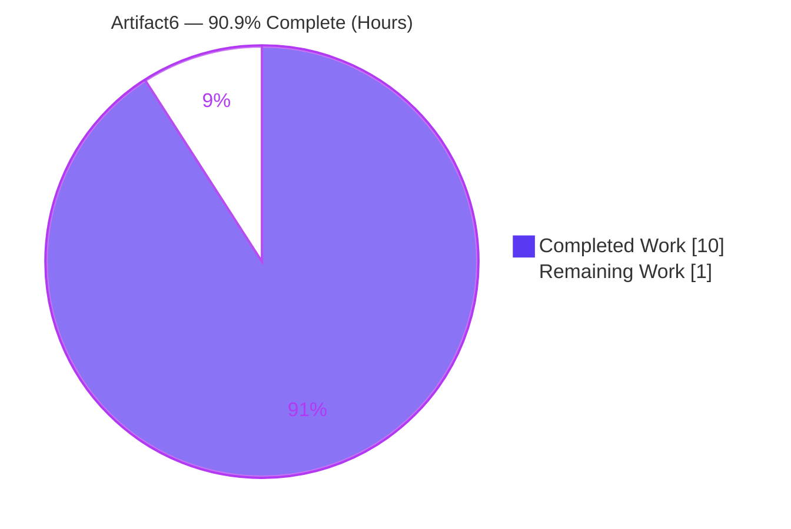
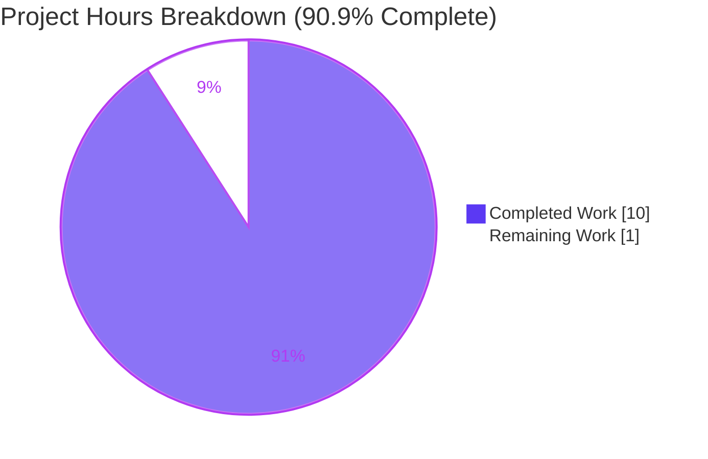
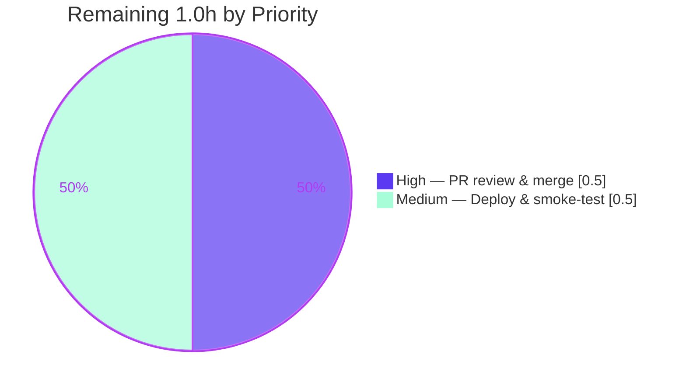

# Blitzy Project Guide — Artifact6 (Node.js + Express)

> **Project:** Artifact6 — Node.js + Express tutorial HTTP server
> **Branch:** `blitzy-2125381e-3141-4b96-98ee-b3e46b1e606a` · **HEAD:** `ebc0ee4`
> **Completion:** **90.9%** · **Total 11.0h** · **Completed 10.0h** · **Remaining 1.0h**

---

## 1. Executive Summary

### 1.1 Project Overview

Artifact6 migrates a minimal Node.js HTTP service onto the **Express.js** web framework and adds one new endpoint. The repository began effectively empty (only a `README.md` containing `# Artifact6`), so the work established a clean, modular Express baseline in place. The delivered service exposes two plain-text `GET` endpoints — `GET /` → `Hello world` (preserved) and `GET /good-evening` → `Good evening` (new) — using a `server.js → app.js → routes/index.js` separation of concerns on CommonJS modules. Target users are tutorial readers and developers needing a reference Express skeleton. Technical scope is backend-only: no database, authentication, or UI. Business impact: a correct, reproducible, documented starting point for Express-based services.

### 1.2 Completion Status



> **Center metric:** **90.9% Complete** — calculated as Completed ÷ Total = 10.0 ÷ 11.0.
> Color key: **Completed = Dark Blue `#5B39F3`** · **Remaining = White `#FFFFFF`**.

| Metric | Value |
| --- | --- |
| **Total Hours** | **11.0** |
| **Completed Hours (AI + Manual)** | **10.0** (10.0 AI + 0.0 Manual) |
| **Remaining Hours** | **1.0** |
| **Percent Complete** | **90.9%** |

### 1.3 Key Accomplishments

- ✅ **Express.js adopted** — HTTP layer routed through `express()`; native `http.createServer` is not used in application code.
- ✅ **New endpoint delivered** — `GET /good-evening` returns the exact body `Good evening`.
- ✅ **Existing endpoint preserved** — `GET /` still returns the exact body `Hello world` (byte-for-byte, no trailing newline).
- ✅ **Modular architecture** — clean `server.js → app.js → routes/index.js` separation of concerns with an acyclic `require` chain.
- ✅ **Reproducible dependencies** — `express ^5.2.1` declared; `package-lock.json` pins the exact tree (66 packages); `npm ci` succeeds; `npm audit` reports **0 vulnerabilities**.
- ✅ **Documentation** — `README.md` preserves the `# Artifact6` title and adds stack, prerequisites, install/run steps, an endpoint table, and project structure.
- ✅ **Security hardening** — `X-Powered-By` response header disabled (`app.disable('x-powered-by')`).
- ✅ **All 7 in-scope files** created/updated, committed by `agent@blitzy.com`, and validated; working tree clean.

### 1.4 Critical Unresolved Issues

| Issue | Impact | Owner | ETA |
| --- | --- | --- | --- |
| _None_ | No unresolved issues block release or validation. All 5 autonomous production-readiness gates passed; zero defects were found. | — | — |

### 1.5 Access Issues

| System/Resource | Type of Access | Issue Description | Resolution Status | Owner |
| --- | --- | --- | --- | --- |
| _None_ | — | No access issues identified. The project requires no repository permissions beyond the working branch, no service credentials, and no third-party API access. | N/A | — |

**No access issues identified.**

### 1.6 Recommended Next Steps

1. **[High]** Review the 7-file pull request diff and merge branch `blitzy-2125381e-3141-4b96-98ee-b3e46b1e606a` to the mainline.
2. **[Medium]** Deploy/host the validated server in the target environment and run a smoke test (`npm ci && npm start`, then `curl` both endpoints).
3. **[Low]** (Optional, out of AAP scope) Add an automated test suite (Jest + Supertest) to guard against future regressions.
4. **[Low]** (Optional, out of AAP scope) Add a `/health` endpoint and structured logging if deploying to an orchestrated environment.
5. **[Low]** (Optional, out of AAP scope) Add containerization (Dockerfile) and a CI/CD pipeline for automated delivery.

---

## 2. Project Hours Breakdown

### 2.1 Completed Work Detail

| Component | Hours | Description |
| --- | --- | --- |
| Express framework adoption & modular architecture | 2.0 | Express 5 adoption; `server.js → app.js → routes/index.js` separation-of-concerns design; Express version/structure research (§0.3.2). |
| `src/routes/index.js` — routing layer | 1.0 | `express.Router()` declaring `GET /` → `Hello world` and `GET /good-evening` → `Good evening`, with JSDoc. |
| `src/app.js` — application assembly | 1.0 | `express()` app, router mount at `/`, `X-Powered-By` hardening, module export, with JSDoc. |
| `src/server.js` — process bootstrap | 1.0 | Imports the app, resolves `process.env.PORT || 3000`, calls `app.listen(...)`, with JSDoc. |
| `package.json` — npm manifest | 0.5 | `express ^5.2.1`, `start` script, `engines.node >=18`, `main: src/server.js`. |
| `package-lock.json` — dependency lockfile | 0.5 | Generated via `npm install`; pins express 5.2.1 + transitive tree (66 packages). |
| `.gitignore` — version-control hygiene | 0.5 | Ignores `node_modules/`, `npm-debug.log*`, `.env`. |
| `README.md` — project documentation | 1.5 | Preserves `# Artifact6`; adds stack, prerequisites, install/run, endpoint table, curl examples, structure. |
| Autonomous validation & behavioral verification | 2.0 | 5 production-readiness gates: dependency integrity, compilation, behavioral assertions (7/7), runtime HTTP checks, zero-error/zero-placeholder review. |
| **Total Completed** | **10.0** | |

### 2.2 Remaining Work Detail

| Category | Hours | Priority |
| --- | --- | --- |
| Human PR review & merge approval (path-to-production) | 0.5 | High |
| Deploy/host validated server in target environment & smoke-test (path-to-production) | 0.5 | Medium |
| **Total Remaining** | **1.0** | |

> **Note on scope:** The remaining 1.0h consists solely of human-gated path-to-production activities. All AAP-specified feature/refactor work is complete. AAP-**excluded** items (automated test framework, security middleware, Docker, CI/CD — see §0.2.2) are intentionally **not** counted here; they are listed as optional future enhancements in §8 and the human task list.

### 2.3 Total Project Hours & Completion Formula

| Quantity | Hours |
| --- | --- |
| Section 2.1 — Completed | 10.0 |
| Section 2.2 — Remaining | 1.0 |
| **Total Project Hours** | **11.0** |

**Completion % = Completed ÷ (Completed + Remaining) × 100 = 10.0 ÷ 11.0 × 100 = 90.9%.**

Cross-section integrity: Section 2.1 (10.0) + Section 2.2 (1.0) = 11.0 = Section 1.2 Total. Section 2.2 (1.0) = Section 1.2 Remaining = Section 7 pie "Remaining Work".

---

## 3. Test Results

All entries below originate from Blitzy's autonomous validation logs for this project (Final Validator GATEs 1–4) and were independently reproduced during this assessment. There is **no automated test framework** in scope (AAP §0.2.2); `npm test` intentionally reports `Missing script: "test"`. "Tests" below are the autonomous validation checks executed against the codebase.

| Test Category | Framework / Method | Total Tests | Passed | Failed | Coverage % | Notes |
| --- | --- | --- | --- | --- | --- | --- |
| Compilation | `node --check` | 3 | 3 | 0 | N/A | All 3 source files parse/compile (`server.js`, `app.js`, `routes/index.js`). |
| Dependency Integrity | `npm ci` / `npm ls` / `npm audit` | 3 | 3 | 0 | N/A | Reproducible install; clean dependency tree (express@5.2.1); **0 vulnerabilities**. |
| Behavioral (in-process) | Node assertions (ephemeral) | 7 | 7 | 0 | N/A | Exact bodies, 200 statuses, `X-Powered-By` suppressed, 404 for unknown path and POST on GET-only route. Not committed (no framework in scope). |
| Runtime / API | `curl` over HTTP | 6 | 6 | 0 | N/A | `GET /`, `GET /good-evening`, unknown→404, `POST /`→404, and PORT-override checks on 3000 & 8080. |
| **Total** | | **19** | **19** | **0** | **N/A** | **100% pass rate. Zero failing, zero blocked.** |

**Test framework note:** Per AAP §0.2.2, no automated test framework (Jest/Mocha/etc.) was in scope; therefore code-coverage percentage is not applicable. Behavioral correctness was proven via in-process assertions and real-HTTP `curl` checks.

---

## 4. Runtime Validation & UI Verification

**Runtime health (real HTTP, Node v20.20.2):**

- ✅ **Server startup** — `npm start` → stdout `Listening on 3000`. Operational.
- ✅ **`GET /`** — body `Hello world`, HTTP `200`, `Content-Length: 11`. Operational.
- ✅ **`GET /good-evening`** — body `Good evening`, HTTP `200`. Operational.
- ✅ **404 semantics** — unknown path → `404`; `POST /` (method mismatch) → `404`. Operational.
- ✅ **PORT override** — `PORT=8080 npm start` → `Listening on 8080`; both endpoints serve correctly. Operational.
- ✅ **Security header** — `X-Powered-By` **absent** (confirms `app.disable('x-powered-by')`). Operational.
- ✅ **Response headers** — `Content-Type: text/html; charset=utf-8` (Express `res.send` default per AAP §0.6.1); weak `ETag` present. Operational.

**API integration outcomes:** No external integrations exist (no database, third-party APIs, or credentials) — by design (AAP §0.2.2). Nothing to validate; ✅ not applicable.

**UI verification:** ✅ **Not applicable.** Artifact6 is a backend HTTP service with no user-interface surface (AAP §0.3.4). No Figma frames, component library, or design system were specified.

---

## 5. Compliance & Quality Review

AAP deliverables cross-mapped to Blitzy quality and compliance benchmarks. **Fixes applied during autonomous validation: none — zero issues were found.**

| Benchmark / AAP Deliverable | Status | Progress | Notes |
| --- | --- | --- | --- |
| Goal 1 — Adopt Express.js | ✅ Pass | 100% | `express()` in `app.js`; no `http.createServer` in app code. |
| Goal 2 — Add `GET /good-evening` → `Good evening` | ✅ Pass | 100% | Declared in `routes/index.js`; runtime-verified `200`. |
| Goal 3 — Preserve `GET /` → `Hello world` | ✅ Pass | 100% | Byte-exact body; runtime-verified `200`. |
| Behavioral parity — exact bodies | ✅ Pass | 100% | 11/12 bytes, no trailing newline (§0.6.3). |
| Port configurability | ✅ Pass | 100% | `process.env.PORT || 3000`; `PORT=8080` verified. |
| Dependency — `express ^5.2.1` + lockfile | ✅ Pass | 100% | Pinned 5.2.1; `npm ci` reproducible; 66 packages. |
| Documentation — `README.md` | ✅ Pass | 100% | `# Artifact6` preserved; full stack/install/run/endpoints docs. |
| VCS hygiene — `.gitignore` | ✅ Pass | 100% | `node_modules/`, logs, `.env` ignored. |
| Module system — CommonJS | ✅ Pass | 100% | `require` / `module.exports` throughout. |
| Architecture — separation of concerns | ✅ Pass | 100% | `server.js → app.js → routes/index.js` acyclic chain. |
| Security — vulnerabilities | ✅ Pass | 100% | `npm audit` = 0 vulnerabilities. |
| Optional hardening — `X-Powered-By` disabled | ✅ Pass | 100% | Header confirmed absent (§0.7.4). |
| Zero Placeholder Policy | ✅ Pass | 100% | No TODO/FIXME/stub/placeholder in any in-scope file. |
| Documentation excellence (CQ2) | ✅ Pass | 100% | Source files carry thorough JSDoc/inline comments. |

**Outstanding compliance items (AAP scope):** None.

---

## 6. Risk Assessment

Overall posture: **LOW** risk. No High/Medium-severity risks. Residual items are either AAP-excluded-by-design (Accepted) or already Mitigated/Resolved.

| Risk | Category | Severity | Probability | Mitigation | Status |
| --- | --- | --- | --- | --- | --- |
| No committed automated test suite (regression guard) | Technical | Low | Medium | Add Jest + Supertest (future enhancement) | Accepted (out of AAP scope §0.2.2) |
| Express 5 is a recent major version | Technical | Low | Low | Trivial `app.get`+`res.send` usage unaffected by breaking changes; version pinned | Mitigated |
| No graceful shutdown (SIGTERM/SIGINT) | Technical | Low | Low | Add signal handlers if orchestrated | Accepted (out of scope) |
| Dependency vulnerabilities | Security | Low | Low | `npm audit` = 0; lockfile + periodic audit | Resolved |
| No security middleware (helmet/CORS/rate-limit) | Security | Low | Low | Two static GET endpoints, no user input; add helmet if publicly exposed | Accepted (out of scope) |
| No authentication | Security | Low | N/A | Public static text by design; no sensitive data | By design |
| No health-check endpoint | Operational | Low | Low | Add `/health` if deploying to orchestrator | Accepted (out of scope) |
| Minimal logging (startup line only) | Operational | Low | Low | Add logging middleware for observability | Accepted (out of scope) |
| No process manager / restart policy | Operational | Low | Low | Use pm2/systemd/container restart at deploy | Accepted |
| No external integrations | Integration | Low | N/A | None present (no DB/API/credentials) — eliminates a risk class | N/A by design |
| Default port 3000 conflict in target env | Integration | Low | Low | Configurable `PORT` env var (verified) | Mitigated |

**No blocking risks.** The single most actionable item (automated tests) is explicitly out of AAP scope and excluded from the completion calculation.

---

## 7. Visual Project Status

**Project hours breakdown** (Completed = Dark Blue `#5B39F3`, Remaining = White `#FFFFFF`):



**Remaining work by priority** (hours from Section 2.2):



> **Integrity check:** Pie "Remaining Work" = **1.0h** = Section 1.2 Remaining = Section 2.2 total. Pie "Completed Work" = **10.0h** = Section 2.1 total. The two priority slices (0.5 + 0.5) sum to the 1.0h remaining.

---

## 8. Summary & Recommendations

**Achievements.** Artifact6 fully satisfies every AAP-specified requirement. The HTTP layer was migrated to **Express.js**, the new `GET /good-evening` → `Good evening` endpoint was added, and the original `GET /` → `Hello world` endpoint was preserved byte-for-byte. The implementation follows a clean `server.js → app.js → routes/index.js` separation of concerns, declares `express ^5.2.1` with a pinned lockfile, disables the `X-Powered-By` header, and documents the project thoroughly. All 7 in-scope files are committed and validated.

**Remaining gaps.** Only **1.0h** of human-gated path-to-production work remains: reviewing/merging the pull request and deploying + smoke-testing in the target environment. No code defects remain — the autonomous validator found zero issues across all five production-readiness gates.

**Critical path to production.** (1) Human PR review & merge → (2) Deploy with `npm ci && npm start` (set `PORT` as needed) → (3) Smoke-test both endpoints with `curl`.

**Success metrics.** 19/19 autonomous validation checks pass (100%); `npm audit` = 0 vulnerabilities; reproducible `npm ci`; exact response bodies confirmed over real HTTP; clean working tree.

**Production readiness assessment.** The project is **90.9% complete** (10.0 of 11.0 hours). The codebase is functionally complete, validated, and production-ready for its tutorial scope; the remaining 1.0 hour reflects standard human-gated review/merge and deployment steps rather than any outstanding engineering work. Optional, out-of-scope enhancements (automated tests, security middleware, `/health`, structured logging, graceful shutdown, Docker, CI/CD) are recommended only if the service evolves beyond its tutorial purpose and do not affect the completion figure.

| Metric | Value |
| --- | --- |
| Completion | 90.9% |
| Total / Completed / Remaining hours | 11.0 / 10.0 / 1.0 |
| Autonomous validation checks | 19/19 passed |
| Known vulnerabilities | 0 |
| Blocking issues | 0 |

---

## 9. Development Guide

### 9.1 System Prerequisites

- **Node.js ≥ 18** (required by Express 5; validated on **v20.20.2**).
- **npm** (bundled with Node.js; validated on **11.1.0**).
- Any OS that runs Node.js; negligible hardware requirements.
- No database, cache, message queue, or external service is required.

Verify your toolchain:

```bash
node --version    # expect v18+ (tested: v20.20.2)
npm --version     # tested: 11.1.0
```

### 9.2 Environment Setup

- Clone the repository and change into its root directory.
- **No required environment variables.** `PORT` is optional and defaults to `3000`.
- No `.env` file is needed (the service manages no secrets).

```bash
git clone <repository-url>
cd Artifact6        # repository root (contains package.json)
```

### 9.3 Dependency Installation

```bash
# First-time / general install:
npm install

# OR reproducible install from the committed lockfile (recommended for CI/deploy):
npm ci
```

Expected: Express 5.2.1 and its transitive tree (66 packages) install, ending with `found 0 vulnerabilities`.

Optional verification:

```bash
npm audit          # expect: found 0 vulnerabilities
npm ls --all       # expect: artifact6@1.0.0 └─┬ express@5.2.1 ...
```

### 9.4 Application Startup

```bash
# Start on the default port 3000:
npm start
# -> Listening on 3000

# Start on a custom port:
PORT=8080 npm start
# -> Listening on 8080

# Run detached (simple hosting); prefer pm2/systemd/container in production:
nohup npm start > app.log 2>&1 &
```

`npm start` runs `node src/server.js` (the `start` script in `package.json`).

### 9.5 Verification Steps

With the server running:

```bash
curl http://localhost:3000/
# Hello world

curl http://localhost:3000/good-evening
# Good evening

# Status codes and a 404 check:
curl -s -o /dev/null -w '%{http_code}\n' http://localhost:3000/            # 200
curl -s -o /dev/null -w '%{http_code}\n' http://localhost:3000/good-evening # 200
curl -s -o /dev/null -w '%{http_code}\n' http://localhost:3000/nope         # 404

# Inspect headers (note: X-Powered-By is intentionally absent):
curl -sI http://localhost:3000/
```

### 9.6 Example Usage

| Method | Path | Response body | Status |
| --- | --- | --- | --- |
| GET | `/` | `Hello world` | 200 |
| GET | `/good-evening` | `Good evening` | 200 |
| GET | (any other path) | (Express default 404) | 404 |
| POST | `/` | (Express default 404 — GET-only route) | 404 |

### 9.7 Troubleshooting

- **`Error: listen EADDRINUSE` / port already in use** — another process holds the port. Start on a free port: `PORT=8080 npm start`.
- **`Unexpected token` / `engine "node" is incompatible`** — your Node.js is older than 18. Upgrade to Node ≥ 18.
- **`npm error Missing script: "test"`** — expected. No test framework is in scope (AAP §0.2.2). Use the `curl` verification steps above to confirm behavior.
- **Install drift / corrupted `node_modules`** — clean and reinstall reproducibly: `rm -rf node_modules && npm ci`.
- **Endpoint returns 404 unexpectedly** — confirm method/path: only `GET /` and `GET /good-evening` are defined; all else returns Express's default 404.

---

## 10. Appendices

### A. Command Reference

| Command | Purpose |
| --- | --- |
| `npm install` | Install dependencies (general). |
| `npm ci` | Reproducible install from `package-lock.json`. |
| `npm start` | Start the server (`node src/server.js`). |
| `PORT=8080 npm start` | Start on a custom port. |
| `npm audit` | Check for dependency vulnerabilities (expect 0). |
| `npm ls --all` | Print the resolved dependency tree. |
| `node --check <file>` | Syntax-check a source file without executing it. |
| `curl http://localhost:3000/` | Exercise the `Hello world` endpoint. |
| `curl http://localhost:3000/good-evening` | Exercise the `Good evening` endpoint. |

### B. Port Reference

| Port | Service | Configurable via | Default |
| --- | --- | --- | --- |
| 3000 | Express HTTP server | `PORT` env var | Yes (`process.env.PORT || 3000`) |

### C. Key File Locations

| Path | Role |
| --- | --- |
| `package.json` | npm manifest (express dependency, `start` script, `engines`, `main`). |
| `package-lock.json` | Pinned dependency lockfile (66 packages; express 5.2.1). |
| `.gitignore` | Ignores `node_modules/`, `npm-debug.log*`, `.env`. |
| `README.md` | Project documentation (preserves `# Artifact6`). |
| `src/server.js` | Process bootstrap — `app.listen(process.env.PORT || 3000)`. |
| `src/app.js` | Express app assembly — `express()`, router mount, `x-powered-by` disabled, export. |
| `src/routes/index.js` | `express.Router()` — `GET /` and `GET /good-evening`. |

### D. Technology Versions

| Component | Version | Notes |
| --- | --- | --- |
| Node.js | ≥ 18 (tested v20.20.2) | Express 5 minimum runtime. |
| npm | 11.1.0 (tested) | Install + script runner. |
| Express | ^5.2.1 (resolves 5.2.1) | Sole direct runtime dependency. |
| Module system | CommonJS | `require` / `module.exports`. |
| Lockfile | lockfileVersion 3 | 66 packages pinned. |

### E. Environment Variable Reference

| Variable | Required | Default | Purpose |
| --- | --- | --- | --- |
| `PORT` | No | `3000` | TCP port the server listens on. |

_No secrets or other environment variables are used._

### F. Developer Tools Guide

| Tool | Usage |
| --- | --- |
| `node --check` | Fast syntax validation of `.js` files (used in the compilation gate). |
| `npm ci` | Deterministic installs in CI/deploy from the lockfile. |
| `npm audit` | Dependency vulnerability scanning. |
| `curl` | Manual endpoint verification (no UI to test). |
| `git diff --stat` / `--name-status` | Review the 7-file change set before merge. |

### G. Glossary

| Term | Definition |
| --- | --- |
| **AAP** | Agent Action Plan — the authoritative requirements for this project. |
| **CommonJS** | Node's `require`/`module.exports` module system (no ESM/build step here). |
| **Express.js** | Minimalist Node.js web framework providing declarative routing. |
| **Router** | `express.Router()` — a mountable, composable set of route handlers. |
| **Separation of concerns** | Splitting bootstrap (`server.js`), assembly (`app.js`), and routing (`routes/index.js`). |
| **Path-to-production** | Standard human-gated steps (review/merge, deploy, smoke-test) to ship validated code. |
| **Lockfile** | `package-lock.json` pinning exact dependency versions for reproducible installs. |

---

*Completion 90.9% · Total 11.0h · Completed 10.0h · Remaining 1.0h · Brand colors: Completed `#5B39F3`, Remaining `#FFFFFF`.*