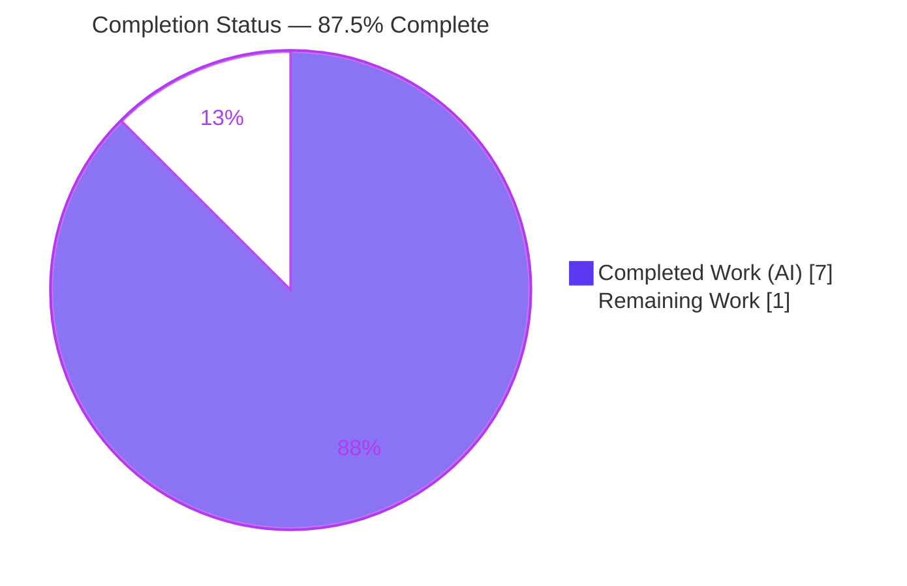
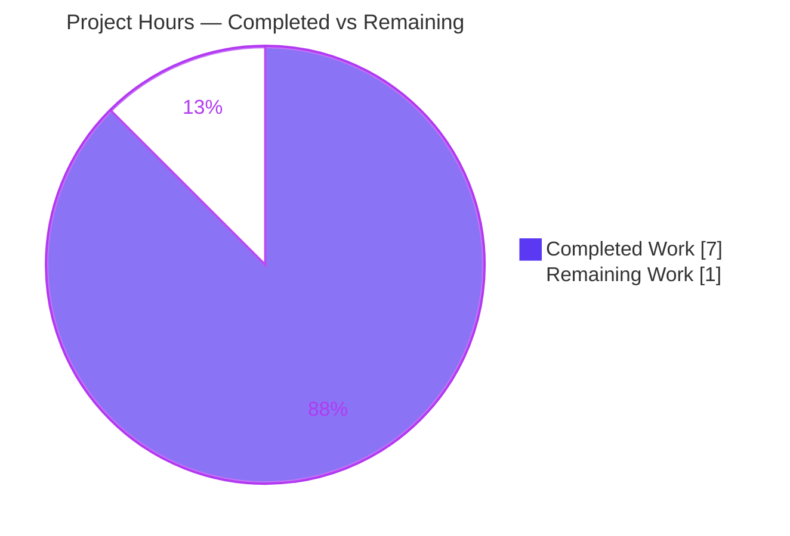
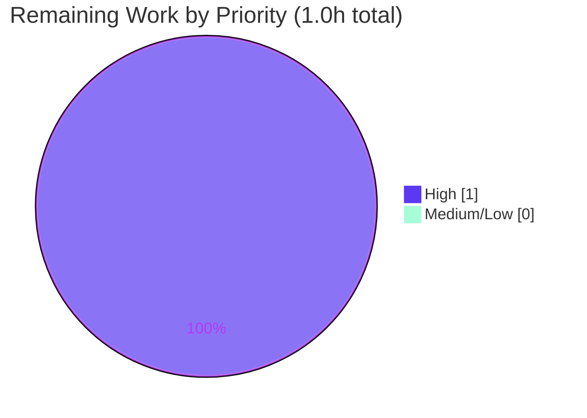

# Blitzy Project Guide — Artifact6: Express.js Tutorial Server

## 1. Executive Summary

### 1.1 Project Overview

Artifact6 is a minimal, tutorial-grade Node.js HTTP server built on the Express.js web framework. The objective was to adopt Express.js into a previously empty repository and expose two plain-text `GET` endpoints: a baseline `GET /` returning `Hello world` and a new `GET /good-evening` returning `Good evening`. Because the repository began as a placeholder (a single 11-byte `README.md`), the baseline server had to be created from scratch before the new endpoint could be added. Target users are developers following a Node.js/Express tutorial. The technical scope is intentionally narrow — a single composition root (`server.js`), one runtime dependency (Express 5.2.1), and no database, authentication, or user interface.

### 1.2 Completion Status



| Metric | Hours |
|---|---|
| **Total Hours** | 8.0 |
| **Completed Hours (AI + Manual)** | 7.0 (AI: 7.0 / Manual: 0.0) |
| **Remaining Hours** | 1.0 |
| **Percent Complete** | **87.5%** |

> Completion is calculated using the AAP-scoped, hours-based methodology: `Completed ÷ (Completed + Remaining) = 7.0 ÷ 8.0 = 87.5%`. All completed work was performed autonomously by Blitzy agents; no manual human hours have been logged yet.

### 1.3 Key Accomplishments

- ✅ **Express.js adopted (FR-1):** `express ^5.2.1` declared in `package.json` and installed; the live `X-Powered-By: Express` response header confirms Express is the serving framework.
- ✅ **Baseline endpoint (FR-2):** `GET /` returns the exact body `Hello world` (verified byte-exact at 11 bytes).
- ✅ **New endpoint (FR-3):** `GET /good-evening` returns the exact body `Good evening` (verified byte-exact at 12 bytes).
- ✅ **Backward compatibility preserved:** both routes coexist on one Express app instance and one HTTP listener.
- ✅ **Project scaffolding complete:** `package.json` (start + test scripts, `engines.node >=18`), reproducible `package-lock.json` (lockfile v3, 66 packages), `.gitignore` excluding `node_modules/`.
- ✅ **Port override implemented:** binds `process.env.PORT || 3000`; `PORT=8080` verified.
- ✅ **Smoke test suite added (in-scope §0.6.1):** 6 tests using only Node built-ins — all passing.
- ✅ **Documentation complete:** `README.md` with prerequisites, install/run commands, endpoint reference table, examples, and a Testing section.
- ✅ **Security clean:** `npm audit` reports 0 vulnerabilities across all 66 packages; 7 security-relevant dependencies independently CVE-researched (all PATCHED/SAFE).

### 1.4 Critical Unresolved Issues

| Issue | Impact | Owner | ETA |
|---|---|---|---|
| _None — no blocking issues identified_ | All five autonomous production-readiness gates passed; build, tests, and runtime verified | — | — |

> There are no critical or blocking issues. The remaining items in Section 2.2 are routine human-in-the-loop sign-off steps, not defects.

### 1.5 Access Issues

| System/Resource | Type of Access | Issue Description | Resolution Status | Owner |
|---|---|---|---|---|
| _None_ | — | No access issues identified — the project has no external services, credentials, API keys, or third-party integrations | N/A | — |

**No access issues identified.** The npm public registry dependency (Express) is already installed and pinned in the committed lockfile; no private registries or secrets are required.

### 1.6 Recommended Next Steps

1. **[High]** Review and approve the pull request for branch `blitzy-a38b0c03-f9cf-4d29-8996-344d05ecbab4` (HEAD `75157fd`) and merge into `main`.
2. **[High]** Run acceptance verification: `npm ci` → `npm start` → `curl localhost:3000/` and `curl localhost:3000/good-evening`, confirming the exact greeting strings meet expectations.
3. **[Medium]** Confirm the flagged route-path assumption (AAP §0.1.3): keep `/good-evening` or choose an alternate path (e.g., `/evening`); if changed, update the single route string in `server.js` plus README/test and re-run `npm test`.
4. **[Low]** _(Optional, out of AAP scope)_ Add a CI workflow (e.g., GitHub Actions) to run `npm test` automatically on every push.
5. **[Low]** _(Optional, out of AAP scope)_ Add a `/health` endpoint and structured logging if the server is ever promoted beyond tutorial use.

---

## 2. Project Hours Breakdown

### 2.1 Completed Work Detail

| Component | Hours | Description |
|---|---|---|
| FR-1 — Express.js adoption & project initialization | 1.0 | Created `package.json` (name, version, `main`, `start`/`test` scripts, `engines.node >=18`); installed `express ^5.2.1`; generated reproducible `package-lock.json` (lockfile v3, 66 packages). |
| FR-2 & FR-3 — `server.js` endpoints | 1.5 | Instantiated single Express app; registered `GET /` → `Hello world` and `GET /good-evening` → `Good evening` with exact, case-sensitive literals; bound `app.listen(process.env.PORT || 3000)`. |
| Testable refactor, module export & repo hygiene | 0.5 | Added `require.main === module` listener guard + `module.exports = app` for in-process testing; authored header documentation; created `.gitignore` excluding `node_modules/`, logs, env, and OS files. |
| Documentation (`README.md`) | 1.0 | Overview, prerequisites (Node ≥ 18), install/run commands, `PORT` override, endpoint reference table, example `curl` requests, and Testing section; resolved two final-gate review findings. |
| Smoke test suite (`test/server.test.js`) | 1.5 | 6 tests using only Node built-ins (`node:test`, `node:assert/strict`, `node:http`); ephemeral-port harness; asserts export shape, exact bodies, 200 statuses, byte-exact lengths (11/12 bytes), and 404. |
| Web research | 0.5 | Verified current Express stable release (5.2.1), the Node.js ≥ 18 runtime requirement, and the canonical Express quick-start pattern. |
| Autonomous validation & QA | 1.0 | Executed 5 production-readiness gates: dependency audit + independent CVE research on 7 packages, `node --check` static analysis, test runs, live `curl` + byte-exact runtime verification, endpoint screenshots, and QA artifacts. |
| **Total Completed** | **7.0** | |

### 2.2 Remaining Work Detail

| Category | Hours | Priority |
|---|---|---|
| Acceptance verification & route-path confirmation (pull, `npm ci`, `npm start`, curl both endpoints; confirm `/good-evening` assumption per AAP §0.1.3, one-line change if alternate path preferred) | 0.5 | High |
| Code review & PR approval/merge of branch into `main` | 0.5 | High |
| **Total Remaining** | **1.0** | |

> **Out-of-scope optional enhancements (0 hours counted):** `/health` endpoint + structured logging, CI workflow, `x-powered-by`/`text/plain` hardening, containerization/deployment, and automated dependency updates are explicitly out of AAP scope (§0.6.2) and are therefore excluded from the completion denominator. They are listed in Sections 1.6 and 8 as future considerations only.

### 2.3 Hours Reconciliation

- Section 2.1 Completed total = **7.0h**
- Section 2.2 Remaining total = **1.0h**
- 2.1 + 2.2 = **8.0h** = Total Project Hours (Section 1.2) ✓
- Completion = 7.0 ÷ 8.0 = **87.5%** ✓

---

## 3. Test Results

All tests below originate from Blitzy's autonomous validation logs for this project and were independently re-executed during this assessment (`npm test` → `node --test`).

| Test Category | Framework | Total Tests | Passed | Failed | Coverage % | Notes |
|---|---|---|---|---|---|---|
| Unit / Smoke | `node:test` (Node built-in runner) | 6 | 6 | 0 | 100% of routes & responses | Export shape; `GET /` exact body; `GET /good-evening` exact body; 2 byte-exact (11/12 bytes, no stray whitespace); 404 for unknown route |
| Static Analysis | `node --check` | 2 | 2 | 0 | n/a | `server.js` and `test/server.test.js` both pass syntax validation |
| Dependency Audit | `npm audit` | 66 pkgs | 66 | 0 | n/a | 0 vulnerabilities (info/low/moderate/high/critical all 0) |
| Runtime / API | `curl` (live HTTP) | 4 | 4 | 0 | both endpoints + 404 + PORT | `GET /` → 200 `Hello world`; `GET /good-evening` → 200 `Good evening`; unknown → 404; `PORT=8080` override verified |

**Aggregate:** 6/6 functional tests pass (100%); 0 failures; 0 skipped. Test runtime ≈ 140 ms. The suite uses no third-party dependencies and runs fully offline.

---

## 4. Runtime Validation & UI Verification

**Runtime health (re-verified during this assessment):**

- ✅ **Operational** — Server boots via `npm start` and `node server.js`; logs `Server listening on port 3000`.
- ✅ **Operational** — `GET /` → HTTP 200, body `Hello world` (11 bytes; `od -c` confirms no trailing whitespace/newline).
- ✅ **Operational** — `GET /good-evening` → HTTP 200, body `Good evening` (12 bytes; byte-exact).
- ✅ **Operational** — Unknown route (`GET /missing`) → HTTP 404 (correct Express default routing).
- ✅ **Operational** — `PORT=8080 npm start` binds the override port; `GET :8080/good-evening` → 200 `Good evening`.
- ✅ **Operational** — Response headers include `X-Powered-By: Express`, `Content-Type: text/html; charset=utf-8`, `Content-Length: 11`, confirming Express is the serving framework.

**UI verification:**

- ⚠ **Not applicable** — The feature is a backend HTTP server returning plain-text greetings; the AAP confirms no user interface is in scope (§0.5.3, Tech Spec §7.1.1). For completeness, prior agents captured browser screenshots of both endpoints (stored under `blitzy/screenshots/`). The `GET /` capture shows a plain page rendering only the text `Hello world` with no styling or chrome — exactly as expected for a bare `text/html` greeting body and consistent with the "no UI" determination.

---

## 5. Compliance & Quality Review

This matrix cross-maps AAP deliverables and operative rules (§0.7) to verification status.

| Requirement / Benchmark | Source | Status | Progress | Evidence |
|---|---|---|---|---|
| FR-1 — Adopt Express.js | AAP §0.1.1 | ✅ Pass | 100% | `express ^5.2.1` in manifest/lockfile; `X-Powered-By: Express` |
| FR-2 — `GET /` → `Hello world` | AAP §0.1.1 | ✅ Pass | 100% | Live curl + unit test; 11 bytes byte-exact |
| FR-3 — `GET /good-evening` → `Good evening` | AAP §0.1.1 | ✅ Pass | 100% | Live curl + unit test; 12 bytes byte-exact |
| Exact response fidelity (case-sensitive, no extra whitespace) | AAP §0.1.2 | ✅ Pass | 100% | `od -c` byte verification; tests assert `trim()` equality + byte length |
| Backward compatibility (baseline preserved) | AAP §0.7 | ✅ Pass | 100% | Both routes on one app instance; both verified |
| Express as serving framework (`app.get` + `res.send`) | AAP §0.7 | ✅ Pass | 100% | `server.js` L53–61 |
| Pinned, verified versions (`^5.2.1`, `engines.node >=18`) | AAP §0.7 | ✅ Pass | 100% | `package.json`; lockfile resolves `express@5.2.1` |
| Single composition root | AAP §0.7 | ✅ Pass | 100% | One `server.js`, one listener |
| Repository hygiene (`.gitignore` excludes `node_modules/`) | AAP §0.7 | ✅ Pass | 100% | `.gitignore`; `node_modules/` untracked |
| Documentation accuracy (both endpoints + run procedure) | AAP §0.7 | ✅ Pass | 100% | `README.md` endpoint table + run/test docs |
| Optional smoke tests (in-scope §0.6.1) | AAP §0.6.1 | ✅ Pass | 100% | `test/server.test.js`, 6/6 pass |
| Reproducible install (`npm ci`) | Path-to-production | ✅ Pass | 100% | `npm ci` exit 0; lockfile v3 |
| Zero unresolved errors / clean working tree | Quality gate | ✅ Pass | 100% | Only untracked `blitzy/` workspace remains |
| Route-path assumption confirmation | AAP §0.1.3 | ⏳ Pending | Awaiting owner | Implemented as `/good-evening`; flagged for confirmation |

**Fixes applied during autonomous validation:** two `README.md` final-gate review findings (F-README-1, F-README-2) were resolved; `server.js` was refactored to a backward-compatible testable pattern (`require.main` guard + `module.exports`) without altering route handlers or response literals.

**Outstanding compliance items:** only the human confirmation of the assumed route path (§0.1.3) — a product decision, not a code defect.

---

## 6. Risk Assessment

| Risk | Category | Severity | Probability | Mitigation | Status |
|---|---|---|---|---|---|
| Caret range `^5.2.1` could resolve a newer 5.x on a plain `npm install` | Technical | Low | Low | `package-lock.json` pins exact 66-package tree; use `npm ci` | Mitigated |
| `res.send()` uses `Content-Type: text/html` (not `text/plain`) | Technical | Low | Low | AAP §0.5.2 accepts this; optional `res.type('text/plain')` | Accepted (per AAP) |
| Single process, no auto-restart/process manager | Technical | Low | Low | Add `pm2`/`systemd` if productionized | Out of scope |
| Transitive-dependency CVE drift over time | Security | Low | Medium | Currently 0 vulns; periodic `npm audit`; Dependabot/Renovate | Clean now / monitor |
| No authentication/authorization | Security | Info | n/a | By design — public, non-sensitive greetings (§0.6.2) | By design |
| `X-Powered-By: Express` header exposed | Security | Low | Low | `app.disable('x-powered-by')` if hardening desired | Accepted (tutorial) |
| No structured logging, metrics, or `/health` endpoint | Operational | Low | n/a | Add logger + `/health` if productionized | Out of scope |
| `node_modules/` gitignored — fresh clone needs install | Operational | Low | Low | README documents `npm ci`/`npm install` | Mitigated (documented) |
| No CI pipeline to auto-run tests on push | Operational | Low | n/a | Optional GitHub Actions workflow | Out of scope |
| No external integrations (DB/APIs/credentials) | Integration | Info | n/a | Nil integration surface (stateless) | N/A |
| Port 3000 conflict (`EADDRINUSE`) | Integration | Low | Low | `PORT` env override implemented & verified | Mitigated |

**Summary:** 11 risks across four categories; all **Low or Informational**. Most are explicitly out of AAP scope or already mitigated. No High/Critical risk and no release blocker were identified.

---

## 7. Visual Project Status

**Project Hours Breakdown (Completed = Dark Blue `#5B39F3`, Remaining = White `#FFFFFF`):**



**Remaining hours by priority (from Section 2.2):**



| Status | Hours | Share |
|---|---|---|
| Completed Work | 7.0 | 87.5% |
| Remaining Work | 1.0 | 12.5% |
| **Total** | **8.0** | **100%** |

> **Integrity check:** "Remaining Work" = 1.0h here equals Section 1.2 Remaining Hours (1.0h) and the sum of the Section 2.2 Hours column (0.5 + 0.5 = 1.0h). ✓

---

## 8. Summary & Recommendations

**Achievements.** All three functional requirements from the Agent Action Plan are fully implemented, committed, and independently re-verified: Express.js is adopted as the serving framework, `GET /` returns the exact `Hello world`, and `GET /good-evening` returns the exact `Good evening`. The supporting scaffolding — manifest, reproducible lockfile, `.gitignore`, comprehensive README, and an optional 6-test smoke suite — is complete. All five autonomous production-readiness gates passed (dependencies, static analysis, tests, runtime, clean tree), and `npm audit` reports zero vulnerabilities.

**Remaining gaps.** Nothing engineering-related remains within AAP scope. The outstanding **1.0 hour** consists solely of human-in-the-loop sign-off: acceptance verification, PR review/merge, and confirmation of the one assumption the AAP explicitly flagged — the new endpoint's URL path (`/good-evening`).

**Critical path to production.** (1) Review and merge the branch; (2) confirm the route-path assumption; (3) run a final acceptance check against the two greeting strings. For this tutorial-grade deliverable, "production" is local execution per the README — deployment, CI/CD, and containerization are explicitly out of AAP scope (§0.6.2).

**Success metrics.** Both endpoints return byte-exact responses (11 and 12 bytes); 6/6 tests pass; 0 vulnerabilities; reproducible `npm ci`.

**Production readiness assessment.** The project is **87.5% complete** on an AAP-scoped basis and is assessed **production-ready for its defined tutorial scope**, pending routine human review and merge. Confidence is **High** given the small, well-defined scope and exhaustive verification.

---

## 9. Development Guide

> Every command below was executed successfully in the validation environment (Node v20.20.2, npm 11.1.0). Run all commands from the repository root.

### 9.1 System Prerequisites

- **Node.js ≥ 18** (Express 5 minimum; LTS such as 20.x or 22.x recommended). Verified on v20.20.2.
- **npm** (bundled with Node.js). Verified on 11.1.0.
- **Operating system:** any Node-supported OS (Linux, macOS, Windows). Hardware requirements are negligible.

```bash
node --version    # expect v18.x or higher  (verified: v20.20.2)
npm --version     # verified: 11.1.0
```

### 9.2 Environment Setup

- Clone the repository and change into its root directory.
- No `.env` file is required. The only optional environment variable is `PORT` (defaults to `3000`).

```bash
git clone <repository-url>
cd Artifact6
```

### 9.3 Dependency Installation

Use `npm ci` for a reproducible install from the committed lockfile (preferred). Use `npm install` if you are adding dependencies.

```bash
npm ci
# Installs express 5.2.1 + 65 transitive packages into node_modules/ (gitignored)
# Expected tail: "found 0 vulnerabilities"

npm ls express    # expect: └── express@5.2.1
```

### 9.4 Application Startup

```bash
npm start            # runs `node server.js`
# Expected stdout: "Server listening on port 3000"

# Override the port:
PORT=8080 npm start  # binds port 8080 instead
```

The server runs a single process with one HTTP listener. Stop it with `Ctrl+C` (foreground) or by killing its PID (background).

### 9.5 Verification Steps

```bash
# In a second terminal, with the server running:
curl localhost:3000/                 # -> Hello world      (HTTP 200)
curl localhost:3000/good-evening     # -> Good evening     (HTTP 200)
curl -i localhost:3000/missing       # -> HTTP/1.1 404 Not Found

# Inspect headers (confirms Express is serving):
curl -sI localhost:3000/             # X-Powered-By: Express; Content-Length: 11

# Run the smoke-test suite (no server needed; uses an ephemeral port):
npm test                             # -> # tests 6 / # pass 6 / # fail 0
```

### 9.6 Example Usage

```bash
$ curl localhost:3000/
Hello world
$ curl localhost:3000/good-evening
Good evening
```

### 9.7 Troubleshooting

- **`EADDRINUSE` (port 3000 already in use):** start on another port with `PORT=8080 npm start`, or free port 3000.
- **`Error: Cannot find module 'express'`:** dependencies are not installed — run `npm ci` (or `npm install`) first.
- **Syntax/`SyntaxError` on start:** your Node.js is older than 18 — Express 5 requires Node ≥ 18 (declared in `engines.node`). Upgrade Node.
- **`npm ci` complains about the lockfile:** ensure `package-lock.json` is present (it is committed); otherwise use `npm install`.
- **Tests report `Cannot find module '../server'`:** run `npm test` from the repository root. `server.js` exports the app via `module.exports` and guards `app.listen` with `require.main === module`, so importing it does not start a listener.

---

## 10. Appendices

### Appendix A — Command Reference

| Command | Purpose |
|---|---|
| `npm ci` | Reproducible install from `package-lock.json` |
| `npm install` | Install/refresh dependencies (use when adding deps) |
| `npm start` | Start the server (`node server.js`) on port 3000 |
| `PORT=8080 npm start` | Start the server on a custom port |
| `npm test` | Run the smoke-test suite (`node --test`) |
| `node --check server.js` | Static syntax validation |
| `npm audit` | Report dependency vulnerabilities |
| `npm ls express` | Show the resolved Express version |
| `curl localhost:3000/` | Call the baseline endpoint |
| `curl localhost:3000/good-evening` | Call the new endpoint |

### Appendix B — Port Reference

| Port | Service | Configurable |
|---|---|---|
| 3000 | Express HTTP server (default) | Yes — set `PORT` env var (e.g., `PORT=8080`) |

### Appendix C — Key File Locations

| Path | Role |
|---|---|
| `server.js` | Express composition root: app instance, both routes, listener (91 lines) |
| `package.json` | Manifest: `express ^5.2.1`, `start`/`test` scripts, `engines.node >=18` |
| `package-lock.json` | Generated lockfile (v3) pinning the 66-package dependency tree |
| `.gitignore` | Excludes `node_modules/`, logs, env, and OS files |
| `README.md` | Prerequisites, install/run, endpoint table, examples, testing |
| `test/server.test.js` | 6 built-in-runner smoke tests (113 lines) |
| `node_modules/` | Installed dependency tree (gitignored; created by install) |

### Appendix D — Technology Versions

| Technology | Version | Notes |
|---|---|---|
| Node.js | ≥ 18 (verified v20.20.2) | Express 5 runtime minimum |
| npm | 11.1.0 (verified) | Bundled with Node.js |
| Express | 5.2.1 (range `^5.2.1`) | Current stable; sole runtime dependency |
| Lockfile | lockfileVersion 3 | 66 packages (express + 65 transitive) |
| Module system | CommonJS | `require` / `module.exports` |

### Appendix E — Environment Variable Reference

| Variable | Default | Purpose |
|---|---|---|
| `PORT` | `3000` | Overrides the HTTP listener port (`process.env.PORT || 3000`) |

### Appendix F — Developer Tools Guide

- **Runtime:** Node.js built-in HTTP stack via Express; start with `npm start`.
- **Test runner:** Node's built-in `node:test` (`npm test`) — no third-party test framework or network access required.
- **Static check:** `node --check <file>` for syntax validation.
- **Security:** `npm audit` for vulnerability scanning (currently 0 findings). QA artifacts (dependency tree, audit JSON, CVE matrix, endpoint screenshots) are available under `blitzy/`.

### Appendix G — Glossary

| Term | Definition |
|---|---|
| Composition root | The single file (`server.js`) where the app is instantiated and routes/listener are wired together |
| Endpoint | An HTTP route (here, `GET /` and `GET /good-evening`) that returns a plain-text greeting |
| Lockfile | `package-lock.json`, which pins exact dependency versions for reproducible installs |
| `require.main === module` | Node idiom that runs listener-binding code only on direct execution, keeping the module safely importable for tests |
| Byte-exact | Response body matches the required string with no added punctuation, whitespace, or newline (verified via `od -c`) |

---

*Completion basis: AAP-scoped, hours-based methodology — 7.0 completed ÷ 8.0 total = 87.5%. Colors: Completed `#5B39F3`, Remaining `#FFFFFF`, headings/accents `#B23AF2`, highlights `#A8FDD9`.*