# Technical Specification

# 1. Introduction

This Introduction establishes the foundational context for the Technical Specification of the project identified in the repository as **Artifact6**. It is written against an exhaustively verified inventory of the repository's contents. Where the repository contains no evidence to support a particular specification element, this is stated explicitly rather than inferred, extrapolated, or fabricated. Subsequent revisions of this section will be required once the repository is populated with substantive implementation, configuration, and documentation artifacts.

## 1.1 EXECUTIVE SUMMARY

### 1.1.1 Project Overview

The repository under specification is identified solely by the Markdown heading `# Artifact6` contained in its only tracked file, `README.md`. The repository was initialized with a single commit ("Initial commit") on Thursday, May 28, 2026, and currently exists in a **pre-implementation, placeholder state**. No source code, configuration manifests, dependency declarations, build artifacts, architectural diagrams, or supporting documentation have been committed at the time this specification is being authored.

| Repository Attribute | Verified Value |
|---|---|
| Project Identifier | `Artifact6` |
| Primary Branch | `main` |
| Total Commits | 1 (Initial commit, hash `6c6e455e3f59eb8208dcb9f11b1319b21e7cf3e5`) |
| Tracked Files | 1 (`README.md`, 11 bytes) |
| Repository Lifecycle Stage | Placeholder / Pre-implementation |

### 1.1.2 Core Business Problem

No business problem statement, use-case narrative, opportunity assessment, or problem-domain analysis has been committed to the repository. The repository does not yet articulate a problem to be solved, a market need to be addressed, or an internal capability gap to be filled.

| Specification Element | Status in Repository |
|---|---|
| Problem statement | Not defined |
| Use case narrative | Not defined |
| Domain analysis | Not defined |
| Justification for the system | Not defined |

### 1.1.3 Key Stakeholders and Users

No stakeholder register, user persona catalog, audience analysis, or actor model has been committed to the repository. The only individual identifiable from repository metadata is the initial committer recorded in the git history.

| Stakeholder Category | Verified Information |
|---|---|
| Project Sponsor / Product Owner | Not identified |
| End-User Population | Not identified |
| Administrative / Operational Users | Not identified |
| Initial Repository Committer | `Blitzy-Test-01 <blitzytest01@gmail.com>` |

### 1.1.4 Expected Business Impact and Value Proposition

No value proposition, return-on-investment analysis, benefit statement, qualitative impact narrative, or quantitative impact projection has been committed to the repository. These elements remain to be defined in future iterations of this Technical Specification, contingent upon the introduction of substantive content to the codebase.

## 1.2 SYSTEM OVERVIEW

### 1.2.1 Project Context

#### Business Context and Market Positioning

The repository does not contain any documentation describing the business context, target market, competitive positioning, or strategic intent of the Artifact6 project. No market analysis, positioning statement, customer segmentation, or competitive landscape artifact is present in the working tree or git history.

#### Current System Limitations

There is no evidence in the repository that Artifact6 is intended to replace, upgrade, or extend a predecessor system. No legacy code, deprecation notices, migration plans, compatibility layers, or references to existing systems are present.

#### Integration with Existing Enterprise Landscape

No integration documentation, dependency declarations, API contracts, message-bus configurations, service registries, identity-provider configurations, or enterprise architecture artifacts are present. The project, as currently committed, has no defined relationships with any external system.

| Project Context Dimension | Documented in Repository |
|---|---|
| Business context | No |
| Market positioning | No |
| Predecessor system / migration path | No |
| Enterprise integration landscape | No |

### 1.2.2 High-Level Description

#### Primary System Capabilities

No functional capabilities, feature catalogs, behavioral specifications, or capability statements have been committed to the repository. The system, as represented in the current codebase, performs no operations and exposes no functionality.

#### Major System Components

No system components have been defined. The repository contains no canonical source directories (`src/`, `app/`, `lib/`, `pkg/`, `internal/`, or equivalent), no module structure, no service decomposition, no shared library partitioning, and no architectural delineations of any kind.

#### Core Technical Approach

No technology stack, programming language, framework, runtime, build toolchain, packaging strategy, or architectural pattern has been adopted. The repository contains no manifest files of any recognized ecosystem, as enumerated below:

| Ecosystem | Typical Manifest Filename(s) | Present |
|---|---|---|
| Node.js / JavaScript / TypeScript | `package.json` | No |
| Python | `requirements.txt`, `pyproject.toml`, `setup.py` | No |
| Java / JVM | `pom.xml`, `build.gradle`, `build.gradle.kts` | No |
| Rust | `Cargo.toml` | No |
| Go | `go.mod`, `go.sum` | No |
| Ruby | `Gemfile`, `*.gemspec` | No |
| PHP | `composer.json` | No |
| .NET | `*.csproj`, `*.sln` | No |
| Containerization | `Dockerfile`, `docker-compose.yml` | No |
| Orchestration | Kubernetes manifests, Helm charts | No |
| CI/CD | `.github/workflows/`, `Jenkinsfile`, `.gitlab-ci.yml` | No |

### 1.2.3 Success Criteria

No success criteria, acceptance criteria, performance budgets, service-level objectives, service-level agreements, observability targets, or measurement frameworks have been committed to the repository.

| Success Criteria Category | Defined in Repository |
|---|---|
| Measurable objectives | No |
| Critical success factors | No |
| Key performance indicators (KPIs) | No |
| Service-level objectives (SLOs) / agreements (SLAs) | No |

## 1.3 SCOPE

The scope of the Artifact6 project, as represented by the present state of the repository, cannot be enumerated by reference to committed artifacts. The subsections below catalog the requested scope elements and the verified absence of evidence for each. The verified-state diagram in Section 1.3.4 summarizes the relationship between the single piece of established information (the project name) and the broader scope elements that remain undefined.

### 1.3.1 In-Scope Elements

#### Core Features and Functionalities

No core features, must-have capabilities, primary user workflows, essential integrations, or key technical requirements have been declared, designed, prototyped, or implemented. The repository's tracked content does not establish any functional or non-functional requirement.

| In-Scope Requirement Category | Documented |
|---|---|
| Must-have capabilities | No |
| Primary user workflows | No |
| Essential integrations | No |
| Key technical requirements | No |

#### Implementation Boundaries

No context diagrams, system-boundary maps, user-group catalogs, role definitions, geographic constraints, regulatory-jurisdiction declarations, or data-domain inventories exist in the repository.

| Implementation Boundary Dimension | Documented |
|---|---|
| System boundaries / context map | No |
| User groups covered | No |
| Geographic or market coverage | No |
| Data domains included | No |

### 1.3.2 Out-of-Scope Elements

Because no in-scope elements are defined in the repository, an exclusion-based definition of "Out of Scope" cannot be meaningfully derived from committed evidence. The Technical Specification cannot enumerate items as explicitly excluded when no positive scope has been established. The following requested out-of-scope topics are accordingly all undefined:

| Out-of-Scope Topic | Documented |
|---|---|
| Explicitly excluded features / capabilities | No |
| Future phase considerations / roadmap | No |
| Integration points not covered | No |
| Unsupported use cases | No |

### 1.3.3 Implicit Scope Boundary

In the absence of a positive scope declaration, the only defensible boundary statement that can be drawn from the repository's verified contents is the following: the project consists, today, of the name **Artifact6** and nothing else. Any further scope assertion would constitute fabrication and is therefore deliberately omitted from this specification.

### 1.3.4 Verified-State Diagram

The diagram below summarizes the verified relationship between the single established fact (the project identifier) and the broader specification elements that remain undefined. It is intended as a structural reference for readers to immediately apprehend the gap between what has been committed and what a complete Technical Specification would otherwise contain.

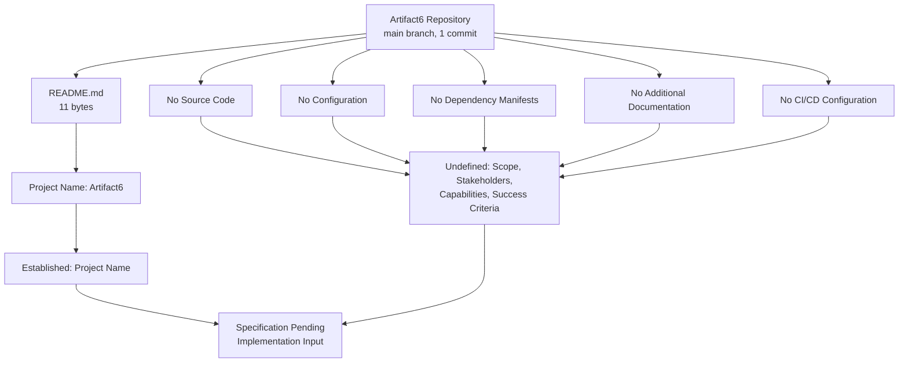

## 1.4 DOCUMENT STATUS AND RECOMMENDATIONS

### 1.4.1 Document Status

This Introduction section accurately reflects the verified state of the Artifact6 repository as of Thursday, May 28, 2026. It is intended as a baseline document that establishes the existence of the repository, its sole declared identifier, and the comprehensive absence of substantive content at this stage. Subsequent sections of this Technical Specification (e.g., Product Requirements, System Architecture, Technology Stack, Data Design, Security, Deployment) will similarly be constrained by the absence of committed evidence until implementation artifacts are introduced.

### 1.4.2 Recommended Next Steps

| Recommendation | Description |
|---|---|
| Populate substantive content | Commit source code, configuration files, and project documentation that establish the system's purpose, scope, and technical approach. |
| Define stakeholders | Author a stakeholder register, user persona catalog, and audience-segmentation analysis. |
| Establish technology baseline | Commit a manifest file (e.g., `package.json`, `pyproject.toml`, `go.mod`, or equivalent) declaring the chosen language, runtime, and initial dependencies. |
| Re-issue this section | Revise this Introduction once the above artifacts have been committed, replacing the current "Not defined" entries with substantive content. |

## 1.5 REFERENCES

### 1.5.1 Files Examined

- `README.md` — The sole content-bearing file in the repository; contains only the Markdown heading `# Artifact6` (11 bytes total). Verified via direct file read and analytical file summary. This file provides the project identifier "Artifact6" and no further factual information.

### 1.5.2 Folders Explored

- `/` (repository root, depth 0) — Contains exactly one tracked file (`README.md`) and no subdirectories. Verified via recursive folder-content retrieval at the maximum achievable depth. No canonical source folders (`src/`, `app/`, `lib/`, `pkg/`, `internal/`), configuration folders (`config/`, `etc/`), documentation folders (`docs/`, `doc/`), test folders (`test/`, `tests/`, `spec/`), or CI folders (`.github/`, `.gitlab/`) exist.

### 1.5.3 Repository Metadata Inspected

- **Git branch listing** — Confirmed only the `main` branch exists locally and on the remote origin.
- **Git commit history** — Confirmed exactly one commit (`6c6e455e3f59eb8208dcb9f11b1319b21e7cf3e5`, "Initial commit") authored by `Blitzy-Test-01 <blitzytest01@gmail.com>` on Thursday, May 28, 2026, containing a single insertion of `README.md`.
- **Working tree inspection** at `/tmp/blitzy/Artifact6/main_0d6e40/` — Confirmed only `README.md` and `.git/` are present at the working-tree level.
- **`.blitzyignore` search** — Confirmed no `.blitzyignore` files exist anywhere on the filesystem.

### 1.5.4 Semantic Searches Performed (Verifying Absence of Content)

| Search Intent | Result |
|---|---|
| Source code, implementation modules, application logic | 0 results |
| Configuration files, dependencies, package manifest | 0 results |
| Application source code, modules, components (folder search) | 0 results |
| README / project description / introduction | 0 results |
| Documentation / specification / architecture | 0 results |
| Documentation / root repository (folder search) | Only repository root returned |

### 1.5.5 Cross-References to Other Specification Sections

No other Technical Specification sections were retrievable at the time of authoring; the provided cross-reference index was empty. This Introduction therefore relies exclusively on direct repository evidence and does not depend on any sibling section of this document for factual support.

# 2. Product Requirements

This section enumerates the product requirements established by the Artifact6 repository. Consistent with the methodology adopted in Section 1, the subsections below catalog the requested requirements elements—Feature Catalog, Functional Requirements Table, Feature Relationships, Implementation Considerations, and Traceability Matrix—and the verified state of each within the present repository. In strict accordance with the section prompt's explicit directives ("Only include sections and items that are actually relevant to this system, based on your analysis of its requirements," "Don't add any features of your own, or any items that aren't clearly applicable," "Only document feature relationships that are clearly evident in the requirements or source code," and "Don't imagine any feature relationships of your own"), every claim made below is grounded in direct repository evidence. No requirement, feature, relationship, or constraint has been inferred, imagined, or fabricated.

## 2.1 STATEMENT OF REPOSITORY STATE RELATIVE TO PRODUCT REQUIREMENTS

### 2.1.1 Baseline Repository State

As established in Section 1.1.1, the Artifact6 repository is in a **pre-implementation, placeholder state**. The complete tracked content of the repository consists of a single file (`README.md`, 11 bytes) whose entire body is the literal Markdown heading `# Artifact6`. No source code, configuration manifests, requirements documents, user stories, design specifications, acceptance criteria, behavioral specifications, or supporting artifacts of any kind have been committed.

| Baseline Attribute | Verified Value |
|---|---|
| Repository Lifecycle Stage | Placeholder / Pre-implementation |
| Tracked Files | 1 (`README.md`, 11 bytes) |
| Tracked Subdirectories | 0 |
| Substantive Requirements Artifacts | None present |

Because the repository contains no requirements-bearing artifact of any kind, the present section is necessarily authored as a *verified-absence specification* paralleling the structure adopted in Section 1.3.

### 2.1.2 Methodological Premise

The methodology adopted in this section is the evidence-based approach used throughout the broader Technical Specification: every requirement statement must be supported by a verified artifact in the committed repository, and no requirement, feature, or relationship may be introduced through inference, assumption, or fabrication. Where the repository contains no evidence for a requested element, this section reports verified absence rather than synthesizing speculative content. This premise is doubly enforced by the section prompt itself, which mandates the prohibitions tabulated below.

| Prompt Constraint | Application in This Section |
|---|---|
| "Only include sections and items that are actually relevant to this system" | Verified-absence reporting in place of fabricated catalogs |
| "Don't add any features of your own" | No feature identifiers (F-XXX) are coined |
| "Only document feature relationships that are clearly evident" | No relationships are inferred where none exist |
| "Don't imagine any feature relationships of your own" | Section 2.4 reports verified absence |

### 2.1.3 Verified-State Reference

The Mermaid verified-state diagram authored in Section 1.3.4 serves as the canonical visual representation of the gap between the single established fact (the project name) and the broader specification elements that remain undefined. That diagram is incorporated here by reference. To make the requirements-authoring decision flow explicit at this section's level of detail, the supplementary diagram below depicts the four primary subsections of Section 2 and the evidence-presence determination that governs each.

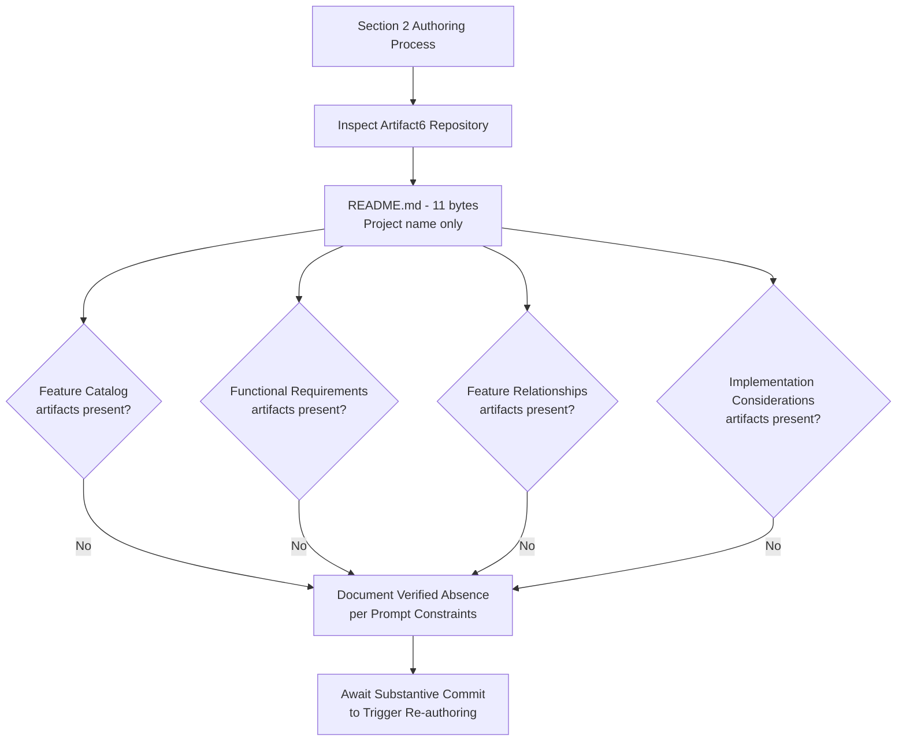

## 2.2 FEATURE CATALOG

### 2.2.1 Feature Inventory Status

A Feature Catalog enumerates each discrete, testable feature of the product alongside its metadata, description, and dependencies. The Artifact6 repository contains no features to enumerate. This finding is consistent with Section 1.2.2 ("Primary System Capabilities"), which has already established that no functional capabilities, feature catalogs, behavioral specifications, or capability statements have been committed to the repository, and with Section 1.3.1 ("Core Features and Functionalities"), which has likewise established the absence of must-have capabilities, user workflows, integrations, and key technical requirements.

| Feature Catalog Question | Answer Grounded in Repository Evidence |
|---|---|
| Does the repository declare any features? | No |
| Are any candidate feature names committed to source? | No |
| Are any feature identifiers (format F-XXX) defined? | No |
| Are any feature categories established? | No |

### 2.2.2 Feature Metadata Verification

Because no features have been declared, none of the required Feature Metadata fields can be populated with substantive content. The table below restates each requested metadata field together with its verified status in the repository.

| Feature Metadata Field | Status in Repository |
|---|---|
| Unique ID (format: F-XXX) | None defined |
| Feature Name | None defined |
| Feature Category | None defined |
| Priority Level (Critical / High / Medium / Low) | None defined |

| Feature Metadata Field (continued) | Status in Repository |
|---|---|
| Status (Proposed / Approved / In Development / Completed) | None defined |

No defensible feature identifier in the F-XXX namespace can be coined in this section. Coining identifiers absent candidate features would constitute fabrication and is prohibited by the section prompt.

### 2.2.3 Feature Description Verification

Feature descriptions—overview narratives, business value statements, user benefit articulations, and technical context discussions—are likewise absent. No design document, vision statement, or product brief exists from which these descriptions could be derived. The sole content of `README.md` is the single-line heading `# Artifact6`, which establishes the project's name and nothing further.

| Feature Description Field | Status in Repository |
|---|---|
| Overview narrative | None defined |
| Business value statement | None defined |
| User benefit articulation | None defined |
| Technical context discussion | None defined |

### 2.2.4 Feature Dependencies Verification

No dependency declarations of any kind exist in the repository. As enumerated in Section 1.2.2, no manifest files of any recognized ecosystem (`package.json`, `requirements.txt`, `pyproject.toml`, `pom.xml`, `Cargo.toml`, `go.mod`, `Gemfile`, `composer.json`, `*.csproj`, `Dockerfile`, Kubernetes manifests, or CI/CD configurations) are present. Consequently, neither prerequisite-feature relationships nor system, external, or integration dependencies can be identified.

| Feature Dependency Field | Status in Repository |
|---|---|
| Prerequisite Features | None defined (no features exist) |
| System Dependencies | None declared (no manifests committed) |
| External Dependencies | None declared (no manifests committed) |
| Integration Requirements | None declared (no API contracts present) |

## 2.3 FUNCTIONAL REQUIREMENTS

### 2.3.1 Functional Requirements Inventory Status

The Functional Requirements Table enumerates each individual requirement together with its acceptance criteria, technical specifications, and validation rules. The Artifact6 repository contains no functional requirements to enumerate. This is consistent with Section 1.3.1, which established that no core features, must-have capabilities, primary user workflows, essential integrations, or key technical requirements have been declared, designed, prototyped, or implemented, and that the repository's tracked content does not establish any functional or non-functional requirement.

| Functional Requirements Question | Answer Grounded in Repository Evidence |
|---|---|
| Does the repository contain a requirements document? | No |
| Does the repository contain user stories or use cases? | No |
| Does the repository contain acceptance criteria? | No |
| Are any requirement identifiers (format F-XXX-RQ-YYY) defined? | No |

### 2.3.2 Requirement Details Verification

Because no requirements have been authored, each Requirement Details field requested by the section prompt is verified absent. The tables below make this absence explicit on a field-by-field basis. No defensible requirement identifier in the F-XXX-RQ-YYY namespace can be coined in this section without violating the prompt's prohibition on fabrication.

| Requirement Details Field | Status in Repository |
|---|---|
| Requirement ID (format: F-XXX-RQ-YYY) | None defined |
| Description | None defined |
| Acceptance Criteria | None defined |
| Priority (Must-Have / Should-Have / Could-Have) | None defined |

| Requirement Details Field (continued) | Status in Repository |
|---|---|
| Complexity (High / Medium / Low) | None defined |

### 2.3.3 Technical Specifications Verification

The section prompt requests, for each functional requirement, a set of technical specifications comprising input parameters, output/response, performance criteria, and data requirements. None of these elements can be sourced from the repository, which contains no interface declarations, data schemas, API contracts, performance budgets, or service-level objectives. The verified absence of all such artifacts has been established in Section 1.2.3 ("Success Criteria") for performance dimensions and in Section 1.2.2 ("Core Technical Approach") for interface and data dimensions.

| Technical Specification Field | Status in Repository |
|---|---|
| Input Parameters | None defined |
| Output / Response | None defined |
| Performance Criteria | None defined |
| Data Requirements | None defined |

### 2.3.4 Validation Rules Verification

The section prompt further requests, for each functional requirement, a set of validation rules covering business rules, data validation, security requirements, and compliance requirements. The repository contains no policy declarations, validation logic, security configuration, or compliance attestations from which these rules could be sourced.

| Validation Rule Field | Status in Repository |
|---|---|
| Business Rules | None defined |
| Data Validation | None defined |
| Security Requirements | None defined |
| Compliance Requirements | None defined |

## 2.4 FEATURE RELATIONSHIPS

### 2.4.1 Relationship Inventory Status

The section prompt explicitly instructs: *"Only document feature relationships that are clearly evident in the requirements or source code. Don't imagine any feature relationships of your own."* Because Section 2.2 has established the verified absence of any features in the repository, there are by definition no relationships between features that can be documented in this section. This finding is further reinforced by Section 1.2.1 ("Integration with Existing Enterprise Landscape"), which established that no integration documentation, dependency declarations, API contracts, message-bus configurations, service registries, identity-provider configurations, or enterprise architecture artifacts are present, and that the project as currently committed has no defined relationships with any external system.

### 2.4.2 Verified Absence of Relationships

The table below records the verified absence of each requested relationship category.

| Relationship Category | Status in Repository |
|---|---|
| Feature Dependency Map | None defined (no features exist) |
| Integration Points | None defined (no integration artifacts present) |
| Shared Components | None defined (no components decomposed) |
| Common Services | None defined (no services declared) |

### 2.4.3 Diagrammatic Reference

No dependency diagram, sequence diagram, component interaction diagram, or architectural overlay can be produced from committed evidence. The Mermaid verified-state diagram in Section 1.3.4 remains the canonical structural reference for the repository, and the supplementary flowchart in Section 2.1.3 represents the only diagram appropriate to this section's level of detail.

## 2.5 IMPLEMENTATION CONSIDERATIONS

### 2.5.1 Considerations Inventory Status

The section prompt requests, for each feature, a documented set of implementation considerations covering technical constraints, performance requirements, scalability considerations, security implications, and maintenance requirements. Because no features exist (Section 2.2) and no technology stack, framework, runtime, or architectural pattern has been adopted (Section 1.2.2, "Core Technical Approach"), no implementation considerations can be honestly documented at this time. The verified absence of a technology baseline directly precludes the derivation of constraints, performance budgets, scaling envelopes, threat models, or maintenance plans.

### 2.5.2 Verified Absence by Dimension

The tables below restate each requested implementation-consideration dimension together with its verified status in the repository.

| Implementation Consideration | Status in Repository |
|---|---|
| Technical Constraints | None defined |
| Performance Requirements | None defined |
| Scalability Considerations | None defined |
| Security Implications | None defined |

| Implementation Consideration (continued) | Status in Repository |
|---|---|
| Maintenance Requirements | None defined |

### 2.5.3 Evidentiary Basis for Absence

The verified absence of these considerations follows directly from three independently established facts in Section 1:

| Established Fact | Source Subsection |
|---|---|
| No manifest files of any ecosystem are present | Section 1.2.2 (Core Technical Approach) |
| No success criteria, KPIs, SLOs, or SLAs are defined | Section 1.2.3 (Success Criteria) |
| No CI/CD or observability configuration exists | Section 1.2.2 (manifest enumeration table) |

## 2.6 TRACEABILITY MATRIX

### 2.6.1 Matrix Status

The section prompt requires the inclusion of a traceability matrix linking features to their constituent requirements, acceptance criteria, and validation rules. Because Section 2.2 has established that no features exist and Section 2.3 has established that no requirements exist, the traceability matrix for the present state of the repository is verifiably empty.

### 2.6.2 Empty Traceability Reference

The placeholder structure below illustrates the matrix that will be populated once features and requirements are committed; in the current state, every column is verified absent.

| Feature ID | Requirement ID | Acceptance Criterion | Status |
|---|---|---|---|
| (none defined) | (none defined) | (none defined) | No candidate artifacts present |

No traceability links can be drawn between features and requirements, between requirements and acceptance criteria, or between acceptance criteria and validation rules, because none of these artifacts exist in the repository.

### 2.6.3 Matrix Re-population Conditions

The matrix above will become populable in lockstep with the re-issuance triggers enumerated in Section 2.7.2. Each new feature commit will add a row; each new requirement commit will add a linked entry under the new feature; each new acceptance criterion will populate the third column; and the Status column will reflect the lifecycle state declared at the time of commit.

## 2.7 DOCUMENT STATUS AND RE-ISSUANCE TRIGGER

### 2.7.1 Current Document Status

This Product Requirements section accurately reflects the verified state of the Artifact6 repository as of the date of the sole "Initial commit" (Thursday, May 28, 2026). It establishes a baseline that, like Section 1, may be revised once substantive content is committed. The section is consistent with the document-status framework articulated in Section 1.4.1, which anticipates that subsequent sections of this Technical Specification—including Product Requirements, System Architecture, Technology Stack, Data Design, Security, and Deployment—will be constrained by the absence of committed evidence until implementation artifacts are introduced.

### 2.7.2 Re-issuance Trigger Conditions

The following events should trigger a complete re-authoring of this Product Requirements section, replacing the verified-absence tables with substantive feature and requirement catalogs.

| Trigger Event | Required Re-authoring Activity |
|---|---|
| First feature commit (source code, design doc, or specification artifact) | Populate Feature Catalog (Section 2.2) with declared features and metadata |
| First requirements document or user-story file committed | Populate Functional Requirements (Section 2.3) with identifiers and acceptance criteria |
| First integration or dependency declaration committed | Populate Feature Relationships (Section 2.4) with verified linkages |
| First technology baseline committed (manifest, framework, runtime) | Populate Implementation Considerations (Section 2.5) with verified constraints |

The recommended actions enumerated in Section 1.4.2 ("Populate substantive content," "Define stakeholders," "Establish technology baseline," "Re-issue this section") apply with equal force to this Product Requirements section.

### 2.7.3 Assumptions and Constraints

| Assumption / Constraint | Statement |
|---|---|
| Authoring Constraint | This section was authored solely from verified repository evidence as of the date of the Initial commit. |
| Versioning Assumption | This is Version 1.0 of Section 2, baselined against commit `6c6e455e3f59eb8208dcb9f11b1319b21e7cf3e5`. |
| Fabrication Prohibition | No features, requirements, or relationships have been inferred or imagined, in compliance with the section prompt. |
| Future-State Assumption | Future versions will be authored once substantive content is committed; no schedule for that commitment is currently established. |

## 2.8 REFERENCES

### 2.8.1 Files Examined

- `README.md` — Sole tracked file in the repository (11 bytes); contains only the Markdown heading `# Artifact6`. Provides the project identifier and no requirements-bearing content. Verified via direct file read and analytical file summary.

### 2.8.2 Folders Explored

- `/` (repository root, depth 0) — Verified to contain exactly one tracked file (`README.md`) and no subdirectories. Confirms the absence of any `src/`, `app/`, `lib/`, `pkg/`, `internal/`, `requirements/`, `docs/`, `spec/`, `test/`, `tests/`, or `.github/` folders that would typically host requirements-bearing artifacts.

### 2.8.3 Semantic Searches Performed (Verifying Absence of Content)

| Search Intent | Result |
|---|---|
| Product requirements, features, specifications | 0 results |
| Functional requirements, user stories, acceptance criteria | 0 results |
| Requirements documentation, specifications (folder search) | 0 results |
| Application source code, modules, components | 0 results |

### 2.8.4 Technical Specification Sections Cross-Referenced

- **Section 1.1.1 (Project Overview)** — Establishes the pre-implementation lifecycle stage and verified Git metadata that constrain this section's findings.
- **Section 1.2.1 (Integration with Existing Enterprise Landscape)** — Confirms the verified absence of integration documentation; supports Section 2.4.
- **Section 1.2.2 (High-Level Description)** — Confirms the verified absence of capabilities, components, and technology stack; supports Sections 2.2 and 2.5.
- **Section 1.2.3 (Success Criteria)** — Confirms the verified absence of success criteria, KPIs, and SLOs/SLAs; supports Sections 2.3.3 and 2.5.
- **Section 1.3.1 (Core Features and Functionalities)** — Confirms the verified absence of features and functional requirements; supports Sections 2.2 and 2.3.
- **Section 1.3.4 (Verified-State Diagram)** — Provides the canonical Mermaid visual reference incorporated by reference in Sections 2.1.3 and 2.4.3.
- **Section 1.4.1 (Document Status)** — Establishes the baseline document-status framework that Section 2.7.1 inherits.
- **Section 1.4.2 (Recommended Next Steps)** — Provides the re-issuance trigger language adapted in Section 2.7.2.
- **Section 1.5 (References)** — Provides the verification methodology and search-result inventory underpinning this section.

# 3. Technology Stack

This section enumerates the technology stack adopted by the Artifact6 project. Consistent with the methodology established in Section 1.3 (Scope) and Section 2.1 (Statement of Repository State Relative to Product Requirements), and explicitly anticipated in Section 1.4.1 (which notes that "subsequent sections of this Technical Specification (e.g., Product Requirements, System Architecture, Technology Stack, Data Design, Security, Deployment) will similarly be constrained by the absence of committed evidence until implementation artifacts are introduced"), the subsections below catalog the requested technology-stack elements—Programming Languages, Frameworks & Libraries, Open Source Dependencies, Third-Party Services, Databases & Storage, and Development & Deployment—and the verified state of each within the present repository. Every claim made below is grounded in direct repository evidence; no language, framework, library, service, database, or tool has been inferred, imagined, or fabricated.

## 3.1 REPOSITORY STATE AND AUTHORING METHODOLOGY

### 3.1.1 Baseline Repository State

As established in Section 1.1.1 and reiterated in Section 2.1.1, the Artifact6 repository is in a **pre-implementation, placeholder state**. The complete tracked content consists of a single file (`README.md`, 11 bytes) whose entire body is the literal Markdown heading `# Artifact6`. No source code, configuration manifests, dependency declarations, build artifacts, containerization assets, infrastructure-as-code descriptors, or CI/CD configurations have been committed.

| Baseline Attribute | Verified Value |
|---|---|
| Repository Lifecycle Stage | Placeholder / Pre-implementation |
| Tracked Files | 1 (`README.md`, 11 bytes) |
| Tracked Subdirectories | 0 |
| Substantive Technology-Stack Artifacts | None present |
| Baseline Commit | `6c6e455e3f59eb8208dcb9f11b1319b21e7cf3e5` (Initial commit, Thursday, May 28, 2026) |

Because the repository contains no technology-bearing artifact of any kind, the present section is necessarily authored as a *verified-absence specification* paralleling the structure adopted in Sections 1.3, 2.1, and 2.5.

### 3.1.2 Methodological Premise

The methodology adopted in this section is identical to the evidence-based approach articulated in Section 2.1.2: every technology-stack claim must be supported by a verified artifact in the committed repository, and no language, framework, library, service, datastore, or tooling choice may be introduced through inference, assumption, or fabrication. Where the repository contains no evidence for a requested element, this section reports verified absence rather than synthesizing speculative content. The "Fabrication Prohibition" enumerated in Section 2.7.3 applies with equal force to every subsection below.

| Methodological Constraint | Application in This Section |
|---|---|
| Evidence-based authoring | Each subsection reports the verified absence of stack artifacts |
| Fabrication Prohibition (Section 2.7.3) | No languages, frameworks, services, or tools are coined |
| Cross-reference rather than restate | Section 1.2.2 manifest enumeration is incorporated by reference |
| Re-issuance on commit | Trigger conditions defined in Section 3.9 mirror Section 2.7.2 |

### 3.1.3 Treatment of the Default Technology Stack

The authoring prompt for this section provided a "Default Technology Stack" enumerating candidate technologies across Core Infrastructure (AWS, Docker, Terraform, GitHub Actions), Backend (Python, Flask, Auth0, MongoDB, Langchain), Frontend (React with TypeScript, TailwindCSS, React-Native with TypeScript), and Native Applications (Swift, Kotlin, Objective-C, ElectronJS). These defaults are recorded here for traceability but **cannot be adopted as the current technology stack** for the following verified reasons:

| Default Stack Component | Reason Adoption Is Precluded |
|---|---|
| AWS (cloud platform) | No AWS SDK configuration, no IAM artifacts, no environment templates referencing AWS regions or services are present in the repository |
| Docker (containerization) | Section 1.2.2 manifest table confirms no `Dockerfile` or `docker-compose.yml` is committed |
| Terraform (IaC) | No `*.tf`, `*.tfvars`, or Terraform module structure exists in the repository |
| GitHub Actions (CI/CD) | Section 1.2.2 manifest table confirms no `.github/workflows/` directory exists; Section 1.5.2 confirms no `.github/` folder at all |
| Python / Flask (backend) | Section 1.2.2 manifest table confirms no `requirements.txt`, `pyproject.toml`, or `setup.py` is present; no `.py` source files exist |
| Auth0 (authentication) | No identity-provider configuration is present (Section 1.2.1) |
| MongoDB (database) | No database connection configuration, schema, or driver dependency is committed (Section 3.6) |
| Langchain (AI framework) | No Python manifest exists in which Langchain could be declared as a dependency |
| React + TypeScript (frontend web) | Section 1.2.2 manifest table confirms no `package.json` is committed; no `.ts`, `.tsx`, `.js`, or `.jsx` files exist |
| TailwindCSS (CSS framework) | No `tailwind.config.js`, `postcss.config.js`, or stylesheet file exists |
| React-Native + TypeScript (mobile) | No React-Native manifest (`package.json` with RN entries), no `metro.config.js`, no `ios/` or `android/` projects exist |
| Swift (iOS), Kotlin (Android), Objective-C (macOS), ElectronJS (desktop) | No platform-specific project structures, manifests, or source files of any kind exist |

The Default Technology Stack therefore functions as a **forward-looking candidate set** that may inform future implementation decisions. It does not, and cannot, describe the current verified state. The recommendation enumerated in Section 1.4.2—"Establish technology baseline — Commit a manifest file (e.g., `package.json`, `pyproject.toml`, `go.mod`, or equivalent) declaring the chosen language, runtime, and initial dependencies"—remains the authoritative next step. Once a manifest is committed, this Technology Stack section will be re-authored in accordance with the re-issuance trigger conditions defined in Section 3.9.

## 3.2 PROGRAMMING LANGUAGES

### 3.2.1 Verified Status

**No programming languages are in use by the Artifact6 system.** The repository contains a single Markdown file (`README.md`), which is a documentation format rather than a programming language by which the system is implemented. No source files of any language extension—`.py`, `.js`, `.ts`, `.jsx`, `.tsx`, `.java`, `.kt`, `.scala`, `.go`, `.rs`, `.rb`, `.php`, `.cs`, `.fs`, `.vb`, `.swift`, `.m`, `.mm`, `.c`, `.cc`, `.cpp`, `.cxx`, `.h`, `.hpp`, or equivalent—exist in the working tree.

| Language Selection Dimension | Verified Status |
|---|---|
| Primary backend language | None selected |
| Primary frontend language | None selected |
| Mobile language(s) | None selected |
| Desktop / native language(s) | None selected |
| Scripting / automation language | None selected |
| Runtime version pinning | None declared |

### 3.2.2 Ecosystem-by-Ecosystem Verification

The table below restates the language-ecosystem enumeration originally presented in Section 1.2.2 (Core Technical Approach), reframed against the Programming Languages dimension. Every ecosystem listed was checked for the presence of its canonical manifest file(s), and every check returned a negative result.

| Language Ecosystem | Canonical Manifest(s) | Manifest Present | Source Files Present |
|---|---|---|---|
| Node.js / JavaScript / TypeScript | `package.json` | No | No (`.js`, `.ts`, `.jsx`, `.tsx`) |
| Python | `requirements.txt`, `pyproject.toml`, `setup.py` | No | No (`.py`) |
| Java / JVM | `pom.xml`, `build.gradle`, `build.gradle.kts` | No | No (`.java`, `.kt`, `.scala`) |
| Rust | `Cargo.toml` | No | No (`.rs`) |
| Go | `go.mod`, `go.sum` | No | No (`.go`) |
| Ruby | `Gemfile`, `*.gemspec` | No | No (`.rb`) |
| PHP | `composer.json` | No | No (`.php`) |
| .NET | `*.csproj`, `*.sln` | No | No (`.cs`, `.fs`, `.vb`) |
| Swift / Objective-C | `Package.swift`, `*.xcodeproj` | No | No (`.swift`, `.m`, `.mm`) |
| C / C++ | `CMakeLists.txt`, `Makefile` | No | No (`.c`, `.cpp`, `.h`, `.hpp`) |

### 3.2.3 Selection Criteria, Constraints, and Dependencies

Because no programming language has been selected, no selection criteria, evaluation matrix, or trade-off analysis can be honestly documented from committed evidence. The repository contains no architectural decision records (ADRs), no language-evaluation memos, and no design documents from which selection rationale could be extracted.

| Selection Artifact | Status in Repository |
|---|---|
| Architectural decision record (ADR) for language choice | Not present |
| Performance benchmarks / evaluation criteria | Not defined |
| Runtime-compatibility constraints | Not declared |
| Inter-language interop requirements | Not declared |
| Team-skills inventory or hiring constraint | Not documented |

## 3.3 FRAMEWORKS & LIBRARIES

### 3.3.1 Verified Status

**No frameworks or libraries are in use by the Artifact6 system.** As established in Section 1.2.2 (Core Technical Approach), "no technology stack, programming language, framework, runtime, build toolchain, packaging strategy, or architectural pattern has been adopted." The absence of any language manifest (see Section 3.2.2) is logically dispositive: without a declared language ecosystem, no framework or library declaration is possible.

| Framework / Library Dimension | Verified Status |
|---|---|
| Core backend framework | None adopted |
| Core frontend framework | None adopted |
| Mobile / cross-platform framework | None adopted |
| ORM / data-access library | None adopted |
| Testing framework | None adopted |
| Logging / observability library | None adopted |
| AI / ML framework | None adopted |

### 3.3.2 Configuration Artifacts Examined

The following framework-configuration filenames are canonical entry points for the most widely adopted frameworks across web, mobile, and backend ecosystems. None of these files exists in the Artifact6 working tree.

| Framework Category | Canonical Configuration Files | Present in Repository |
|---|---|---|
| Web bundler / build tool | `vite.config.ts`, `webpack.config.js`, `rollup.config.js`, `esbuild.config.js`, `parcel.json` | No |
| React meta-framework | `next.config.js`, `remix.config.js`, `gatsby-config.js` | No |
| Angular | `angular.json`, `nx.json` | No |
| Vue meta-framework | `nuxt.config.ts`, `vite.config.ts` | No |
| Python web framework | `manage.py` (Django), `app.py` / `wsgi.py` (Flask), `main.py` (FastAPI) | No |
| Ruby web framework | `config/application.rb` (Rails) | No |
| Java framework | `application.yml` / `application.properties` (Spring Boot) | No |
| Mobile / cross-platform | `metro.config.js` (React Native), `pubspec.yaml` (Flutter), `Podfile` (iOS) | No |
| Testing | `jest.config.js`, `vitest.config.ts`, `pytest.ini`, `phpunit.xml` | No |
| Styling | `tailwind.config.js`, `postcss.config.js` | No |

### 3.3.3 Compatibility Requirements

No compatibility matrix, version-pinning policy, or framework-interoperability constraint has been declared in the repository. Section 1.2.3 (Success Criteria) confirms that no "performance budgets, service-level objectives, service-level agreements, observability targets, or measurement frameworks" exist; this absence extends to framework-level compatibility requirements.

| Compatibility Dimension | Documented in Repository |
|---|---|
| Minimum framework version | No |
| Browser / runtime support matrix | No |
| Polyfill / shim policy | No |
| Long-term-support (LTS) commitments | No |

## 3.4 OPEN SOURCE DEPENDENCIES

### 3.4.1 Verified Status

**No open-source dependencies are declared in the Artifact6 repository.** As established in Section 2.2.4 (Feature Dependencies Verification, referenced via Section 1.2.2), no dependency declarations of any kind exist in the repository. This finding follows necessarily from the absence of any package manifest across all ecosystems enumerated in Section 3.2.2.

| Dependency Dimension | Verified Status |
|---|---|
| Declared direct dependencies | None |
| Declared dev / test dependencies | None |
| Declared peer dependencies | None |
| Declared optional dependencies | None |
| Pinned versions / version ranges | None |
| Registry sources (e.g., npm, PyPI, Maven Central, crates.io) | None configured |

### 3.4.2 Package Manifests and Lockfiles Examined

The presence of a lockfile is the canonical indicator that an ecosystem's resolver has been executed against a manifest. The absence of every lockfile listed below corroborates the verified absence of dependency declarations.

| Ecosystem | Canonical Manifest | Canonical Lockfile | Manifest Present | Lockfile Present |
|---|---|---|---|---|
| npm | `package.json` | `package-lock.json` | No | No |
| Yarn | `package.json` | `yarn.lock` | No | No |
| pnpm | `package.json` | `pnpm-lock.yaml` | No | No |
| Pip | `requirements.txt` | `pip-tools` compiled file | No | No |
| Poetry | `pyproject.toml` | `poetry.lock` | No | No |
| Pipenv | `Pipfile` | `Pipfile.lock` | No | No |
| Cargo | `Cargo.toml` | `Cargo.lock` | No | No |
| Go modules | `go.mod` | `go.sum` | No | No |
| Bundler (Ruby) | `Gemfile` | `Gemfile.lock` | No | No |
| Composer (PHP) | `composer.json` | `composer.lock` | No | No |
| Maven | `pom.xml` | (none) | No | (n/a) |
| Gradle | `build.gradle(.kts)` | `gradle.lockfile` | No | No |

### 3.4.3 Vendored and Embedded Dependencies

No vendored, embedded, or in-tree dependency directories are present in the repository. The following canonical directory names were checked against the working tree at `/tmp/blitzy/Artifact6/main_0d6e40/` and against the recursive folder enumeration documented in Section 1.5.2; all are absent.

| Vendored Dependency Directory | Ecosystem | Present in Repository |
|---|---|---|
| `node_modules/` | Node.js | No |
| `vendor/` | Go / PHP / Ruby | No |
| `.venv/` / `venv/` | Python | No |
| `target/` | Rust / Java | No |
| `Pods/` | CocoaPods (iOS) | No |
| `Packages/` | .NET / Swift Package Manager | No |
| `third_party/` | Vendored C/C++ | No |

## 3.5 THIRD-PARTY SERVICES

### 3.5.1 Verified Status

**No third-party services are integrated with the Artifact6 system.** As established in Section 1.2.1 (Integration with Existing Enterprise Landscape), "no integration documentation, dependency declarations, API contracts, message-bus configurations, service registries, identity-provider configurations, or enterprise architecture artifacts are present. The project, as currently committed, has no defined relationships with any external system."

| Third-Party Service Category | Verified Status |
|---|---|
| External APIs / REST clients | None integrated |
| Authentication / identity providers | None configured |
| Payment processors | None configured |
| Messaging / notification services | None configured |
| Monitoring / observability platforms | None configured |
| Error-tracking services | None configured |
| Analytics platforms | None configured |
| Cloud platform (compute, networking) | None configured |
| Content delivery network (CDN) | None configured |

### 3.5.2 External APIs, Authentication, Monitoring, and Cloud Services

The canonical artifacts by which third-party-service integrations are configured were each enumerated and verified absent. The verified absences below directly contradict the candidate components of the Default Technology Stack listed in Section 3.1.3.

| Integration Artifact | Typical Filename(s) / Conventions | Present in Repository |
|---|---|---|
| Environment-variable templates | `.env`, `.env.example`, `.env.sample`, `.env.local` | No |
| Authentication SDK config | Auth0 tenant config, OAuth client secrets, JWT signing keys | No |
| Cloud provider credentials / config | `~/.aws/credentials` reference, `terraform.tfvars`, `gcp-service-account.json`, `azure.json` | No |
| Monitoring / APM agent config | `newrelic.yml`, `datadog.yaml`, Sentry DSN configuration | No |
| Email / messaging SDK config | SendGrid API key reference, Twilio config, AWS SES setup | No |
| Payment SDK config | Stripe publishable / secret key reference | No |
| Object-storage SDK config | S3 bucket reference, Azure Blob connection string, GCS credentials | No |

### 3.5.3 Integration Requirements

Because no third-party service is integrated, no integration requirements (authentication scheme, rate limits, retry policy, circuit-breaker thresholds, idempotency tokens, webhook signing) can be derived from committed evidence. Section 2.3.3 (referenced via Section 2.4.2) confirms that no "interface declarations, data schemas, API contracts, performance budgets, or service-level objectives" exist; the same absence applies to third-party-service integration requirements.

| Integration Requirement | Documented in Repository |
|---|---|
| Authentication scheme (OAuth, API key, mTLS) | No |
| Rate-limit / quota policy | No |
| Retry and back-off policy | No |
| Circuit-breaker / bulkhead policy | No |
| Webhook signing / verification policy | No |
| PII / data-residency constraints | No |

## 3.6 DATABASES & STORAGE

### 3.6.1 Verified Status

**No databases or storage services are configured for the Artifact6 system.** No database schema, migration directory, connection configuration, ORM model, caching infrastructure declaration, or object-storage SDK reference exists in the repository.

| Database / Storage Dimension | Verified Status |
|---|---|
| Primary database engine | None selected |
| Secondary / analytical database | None selected |
| Caching layer | None configured |
| Message broker / event store | None configured |
| Object / blob storage | None configured |
| File-system storage strategy | None defined |
| Backup / disaster-recovery plan | None defined |

### 3.6.2 Database Engines, Caching, and Storage Services

The artifacts by which database and storage layers are conventionally introduced into a repository were each verified absent.

| Persistence Artifact | Typical Filename(s) / Conventions | Present in Repository |
|---|---|---|
| SQL schema definition | `schema.sql`, `*.sql` files in a `schemas/` or `sql/` directory | No |
| Migration directory | `migrations/`, `alembic/`, `prisma/migrations/`, `db/migrate/` (Rails), `flyway/`, `liquibase/` | No |
| ORM schema / config | `prisma/schema.prisma`, `models/` (Django/Rails), `sequelize/` config, `entities/` (TypeORM) | No |
| Database connection config | `database.yml` (Rails), `.env` DB URLs, `knexfile.js`, `mongoose` config, `pymongo` connection string | No |
| Caching configuration | `redis.conf`, `memcached.conf`, in-app cache wiring | No |
| Object-storage SDK references | AWS S3, Azure Blob Storage, Google Cloud Storage, MinIO SDK imports | No |
| Search-engine configuration | Elasticsearch, OpenSearch, Algolia, Meilisearch config | No |

The Default Technology Stack listed MongoDB as the candidate primary database; however, no `mongoose`, `pymongo`, MongoDB Atlas connection string, or `mongod.conf` artifact appears in the repository, so MongoDB cannot be recorded as the current database.

### 3.6.3 Data Persistence Strategies

Because no database or storage layer is configured, no persistence strategy can be honestly documented from committed evidence. Section 2.3.3 (Data Requirements) confirms that "data requirements: none defined," and the same is true for caching strategies, replication topology, sharding strategy, and durability guarantees.

| Persistence Strategy Dimension | Documented in Repository |
|---|---|
| Read / write consistency model | No |
| Sharding / partitioning strategy | No |
| Replication topology | No |
| Backup cadence / retention policy | No |
| Encryption-at-rest configuration | No |
| Data-retention / GDPR-erasure policy | No |

## 3.7 DEVELOPMENT & DEPLOYMENT

### 3.7.1 Verified Status

**No development or deployment tooling is established in the Artifact6 repository.** Section 2.5.1 explicitly confirms that "no technology stack, framework, runtime, or architectural pattern has been adopted." The manifest-enumeration table in Section 1.2.2 confirms that no containerization (`Dockerfile`, `docker-compose.yml`), orchestration (Kubernetes manifests, Helm charts), or CI/CD (`.github/workflows/`, `Jenkinsfile`, `.gitlab-ci.yml`) artifacts are present.

| Development / Deployment Dimension | Verified Status |
|---|---|
| Development tooling (linters, formatters, type-checkers) | None configured |
| Editor / workspace configuration | None present |
| Build system | None configured |
| Containerization | None configured |
| Container orchestration | None configured |
| Infrastructure-as-Code (IaC) | None configured |
| CI/CD pipelines | None configured |
| Release / versioning tooling | None configured |

### 3.7.2 Development Tooling

No editor configuration, linter configuration, formatter configuration, type-checker configuration, or pre-commit hook configuration exists in the working tree.

| Development Tooling Artifact | Canonical Filename(s) | Present in Repository |
|---|---|---|
| Editor configuration | `.editorconfig`, `.vscode/`, `.idea/` | No |
| JavaScript / TypeScript linter | `.eslintrc`, `.eslintrc.json`, `.eslintrc.js`, `eslint.config.js` | No |
| Python linter / formatter | `.flake8`, `ruff.toml`, `pyproject.toml` (ruff/black sections) | No |
| Universal formatter | `.prettierrc`, `.prettierrc.json`, `prettier.config.js` | No |
| Type-checker config | `tsconfig.json`, `mypy.ini`, `pyrightconfig.json` | No |
| Pre-commit hooks | `.pre-commit-config.yaml`, `.husky/`, `lefthook.yml` | No |
| Code-owner / review policy | `CODEOWNERS`, `.github/CODEOWNERS` | No |

### 3.7.3 Build System and Containerization

No build script, task runner, container definition, or orchestration manifest is committed to the repository.

| Build / Container Artifact | Canonical Filename(s) | Present in Repository |
|---|---|---|
| Generic task runner | `Makefile`, `justfile`, `Taskfile.yml`, `tox.ini` | No |
| Node.js task entries | `scripts` block in `package.json` | No (`package.json` absent) |
| Python build / packaging | `setup.py`, `setup.cfg`, `pyproject.toml` (build-system table) | No |
| Containerization | `Dockerfile`, `docker-compose.yml`, `Containerfile` | No |
| Container build optimization | `.dockerignore`, multi-stage `Dockerfile` patterns | No |
| Kubernetes manifests | `*.yaml` under `k8s/`, `manifests/`, `deploy/` | No |
| Helm chart | `Chart.yaml`, `values.yaml`, `templates/` | No |
| Kustomize | `kustomization.yaml` | No |

The Default Technology Stack named Docker as the candidate containerization technology; however, no `Dockerfile`, `docker-compose.yml`, or `.dockerignore` exists, so Docker cannot be recorded as the current containerization solution.

### 3.7.4 CI/CD Configuration

No CI/CD configuration is committed. Section 1.5.2 explicitly confirms that no `.github/` folder exists at any depth in the repository.

| CI/CD Platform | Canonical Configuration Path | Present in Repository |
|---|---|---|
| GitHub Actions | `.github/workflows/*.yml` | No |
| GitLab CI | `.gitlab-ci.yml` | No |
| CircleCI | `.circleci/config.yml` | No |
| Jenkins | `Jenkinsfile` | No |
| Azure Pipelines | `azure-pipelines.yml` | No |
| Travis CI | `.travis.yml` | No |
| Buildkite | `.buildkite/pipeline.yml` | No |
| Drone CI | `.drone.yml` | No |

The Default Technology Stack named GitHub Actions as the candidate CI/CD platform; however, the absence of any `.github/` folder—confirmed in Section 1.5.2—precludes recording GitHub Actions as the current CI/CD platform.

| Infrastructure-as-Code Tool | Canonical Filename(s) | Present in Repository |
|---|---|---|
| Terraform | `*.tf`, `*.tfvars`, `terraform.lock.hcl` | No |
| Pulumi | `Pulumi.yaml`, `Pulumi.*.yaml` | No |
| AWS CloudFormation | `template.yaml`, `cloudformation.json` | No |
| AWS CDK | `cdk.json` | No |
| Ansible | `playbook.yml`, `inventory.ini`, `ansible/` | No |
| Serverless Framework | `serverless.yml` | No |

The Default Technology Stack named Terraform as the candidate Infrastructure-as-Code tool and AWS as the candidate cloud platform; neither can be recorded as adopted given the verified absence of any IaC or cloud-configuration artifact.

## 3.8 VERIFIED-STATE DIAGRAM

The Mermaid verified-state diagram authored in Section 1.3.4 serves as the canonical visual representation of the gap between the single established fact (the project name) and the broader specification elements that remain undefined. That diagram is incorporated here by reference. The supplementary diagram below maps each Technology Stack subsection to its verified-absence finding and to the single re-issuance trigger defined in Section 1.4.2.

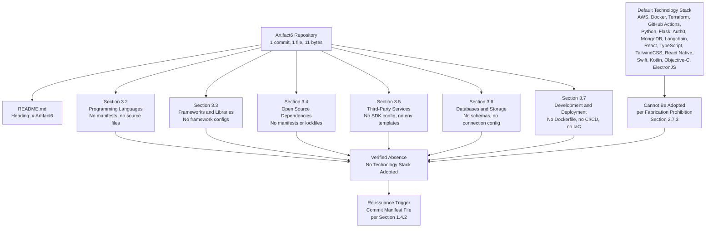

## 3.9 RE-ISSUANCE TRIGGER CONDITIONS

Consistent with the re-issuance framework established in Section 2.7.2, the following events should trigger a complete re-authoring of this Technology Stack section, replacing the verified-absence tables with substantive language, framework, library, service, database, and tooling catalogs.

| Trigger Event | Required Re-authoring Activity |
|---|---|
| First language manifest committed (`package.json`, `pyproject.toml`, `go.mod`, `Cargo.toml`, or equivalent) | Populate Section 3.2 (Programming Languages) with declared language(s), runtime version(s), and selection rationale |
| First framework configuration committed (`vite.config.ts`, `next.config.js`, Django `settings.py`, Flask `app.py`, Spring Boot `application.yml`, or equivalent) | Populate Section 3.3 (Frameworks & Libraries) with declared frameworks, versions, and compatibility requirements |
| First dependency declaration committed within a manifest | Populate Section 3.4 (Open Source Dependencies) with declared dependencies, versions, and registry sources |
| First third-party service configuration committed (`.env.example`, Auth0 config, Stripe SDK reference, monitoring-agent config, or equivalent) | Populate Section 3.5 (Third-Party Services) with declared integrations and authentication schemes |
| First database, cache, or storage artifact committed (schema, migration, ORM model, connection config, or SDK reference) | Populate Section 3.6 (Databases & Storage) with declared engines, persistence strategy, and caching layer |
| First containerization, IaC, or CI/CD artifact committed (`Dockerfile`, `*.tf`, `.github/workflows/`, `Jenkinsfile`, or equivalent) | Populate Section 3.7 (Development & Deployment) with declared build system, container strategy, and CI/CD pipelines |

| Assumption / Constraint | Statement |
|---|---|
| Authoring Constraint | This section was authored solely from verified repository evidence as of the date of the Initial commit (Thursday, May 28, 2026). |
| Versioning Assumption | This is Version 1.0 of Section 3, baselined against commit `6c6e455e3f59eb8208dcb9f11b1319b21e7cf3e5`. |
| Fabrication Prohibition | Per Section 2.7.3, no language, framework, library, service, database, or tool has been inferred or imagined, even where a candidate appears in the Default Technology Stack supplied with the authoring prompt. |
| Default-Stack Treatment | The Default Technology Stack is preserved in Section 3.1.3 as a forward-looking candidate set but is explicitly excluded from the verified state. |
| Future-State Assumption | Future versions of this section will be authored once the manifest commitment recommended in Section 1.4.2 (and the related artifacts enumerated in Section 3.9) has been satisfied. |

## 3.10 REFERENCES

### 3.10.1 Files Examined

- `README.md` — The sole content-bearing file in the repository; contains only the Markdown heading `# Artifact6` (11 bytes total). Provides the project identifier "Artifact6" and no language, framework, library, service, database, or tooling information.

### 3.10.2 Folders Explored

- `/` (repository root, depth 0) — Contains exactly one tracked file (`README.md`) and no subdirectories. No canonical source folders (`src/`, `app/`, `lib/`, `pkg/`, `internal/`), configuration folders (`config/`, `etc/`), build folders (`build/`, `dist/`, `target/`), container folders (`docker/`, `containers/`), IaC folders (`terraform/`, `infrastructure/`, `iac/`), or CI folders (`.github/`, `.gitlab/`, `.circleci/`) exist.

### 3.10.3 Repository Metadata Inspected

- **Working tree inspection** at `/tmp/blitzy/Artifact6/main_0d6e40/` — Confirmed only `README.md` and `.git/` are present at the working-tree level.
- **`.blitzyignore` search** — Confirmed no `.blitzyignore` files exist anywhere on the filesystem.
- **Git commit history** — Confirmed exactly one commit (`6c6e455e3f59eb8208dcb9f11b1319b21e7cf3e5`, "Initial commit") authored on Thursday, May 28, 2026, containing a single insertion of `README.md`.

### 3.10.4 Semantic Searches Performed (Verifying Absence of Technology Stack Content)

| Search Intent | Result |
|---|---|
| Source code, implementation, manifest, dependency, configuration | 0 results |
| Application source code, modules, components, packages (folder search) | 0 results |
| `package.json`, `pyproject.toml`, `requirements.txt`, `Dockerfile`, build configuration | 0 results |

### 3.10.5 Cross-References to Other Specification Sections

- **Section 1.1.1 (Project Overview)** — Repository baseline (1 commit, 1 file, 11 bytes, May 28, 2026) used in Section 3.1.1.
- **Section 1.2.1 (Integration with Existing Enterprise Landscape)** — Verified absence of integration documentation, dependency declarations, API contracts, and identity-provider configurations underpins Section 3.5.
- **Section 1.2.2 (Core Technical Approach)** — Canonical manifest-enumeration table reproduced and extended throughout Sections 3.2, 3.3, 3.4, and 3.7.
- **Section 1.2.3 (Success Criteria)** — Verified absence of performance budgets and SLOs underpins Section 3.3.3 and Section 3.6.3.
- **Section 1.3.4 (Verified-State Diagram)** — Canonical Mermaid diagram incorporated by reference in Section 3.8.
- **Section 1.4.1 (Document Status)** — Explicitly anticipates that this Technology Stack section will be "constrained by the absence of committed evidence until implementation artifacts are introduced."
- **Section 1.4.2 (Recommended Next Steps)** — Source of the "Establish technology baseline" recommendation referenced as the primary re-issuance trigger in Section 3.9.
- **Section 1.5.1 / 1.5.2 (Files Examined / Folders Explored)** — Source of the single-file, zero-subdirectory finding mirrored in Sections 3.10.1 and 3.10.2.
- **Section 2.1.1 (Baseline Repository State)** — Pre-implementation lifecycle stage restated in Section 3.1.1.
- **Section 2.1.2 (Methodological Premise)** — Evidence-based methodology adopted verbatim in Section 3.1.2.
- **Section 2.5.1 (Considerations Inventory Status)** — Source of the explicit statement that "no technology stack, framework, runtime, or architectural pattern has been adopted," cited in Section 3.7.1.
- **Section 2.7.1 (Current Document Status)** — Explicitly names Technology Stack as one of the sections constrained by absence; aligns the re-issuance posture of Section 3.9.
- **Section 2.7.2 (Re-issuance Trigger Conditions)** — Trigger-table pattern adopted in Section 3.9.
- **Section 2.7.3 (Assumptions and Constraints)** — Fabrication Prohibition adopted as the controlling constraint for the Default Technology Stack treatment in Section 3.1.3.

# 4. Process Flowchart

This section enumerates the process-flowchart elements requested by the authoring prompt—core business processes, integration workflows, flowchart requirements, validation rules, state management, error handling, and required diagrams—and catalogs, for each, the verified absence of evidence in the Artifact6 repository. The methodology applied here is identical to that adopted in Sections 1.3, 2.1, 2.5, 3.1, and 3.8: every claim must be supported by a verified artifact in the committed repository, and no workflow, decision point, actor, swim lane, state transition, or recovery procedure may be introduced through inference, assumption, or fabrication. The "Fabrication Prohibition" enumerated in Section 2.7.3 applies with equal and explicit force to every subsection below.

## 4.1 Repository State and Authoring Methodology

### 4.1.1 Baseline Repository State

As established in Section 1.1.1 and reiterated in Sections 2.1.1 and 3.1.1, the Artifact6 repository is in a **pre-implementation, placeholder state**. The complete tracked content of the repository consists of a single file (`README.md`, 11 bytes) whose entire body is the literal Markdown heading `# Artifact6`. No source code, configuration manifests, dependency declarations, build artifacts, behavioral specifications, sequence diagrams, state machines, integration contracts, or process-flow documents of any kind have been committed.

| Baseline Attribute | Verified Value |
|---|---|
| Repository Lifecycle Stage | Placeholder / Pre-implementation |
| Tracked Files | 1 (`README.md`, 11 bytes) |
| Tracked Subdirectories | 0 |
| Baseline Commit | `6c6e455e3f59eb8208dcb9f11b1319b21e7cf3e5` (Initial commit, Thursday, May 28, 2026) |
| Substantive Workflow Artifacts | None present |
| Substantive Process-Flow Artifacts | None present |

Because the repository contains no workflow- or process-bearing artifact of any kind, the present section is necessarily authored as a *verified-absence specification* paralleling the structure adopted in Sections 1.3, 2.1, 2.5, and 3.1.

### 4.1.2 Methodological Premise

The methodology adopted in this section is the evidence-based approach articulated in Sections 2.1.2 and 3.1.2: every process-flow claim must be supported by a verified artifact in the committed repository, and no workflow, decision diamond, swim lane, system boundary, actor, error state, retry policy, fallback process, transaction boundary, or timing constraint may be introduced through inference, assumption, or fabrication. Where the repository contains no evidence for a requested element, this section reports verified absence rather than synthesizing speculative content.

| Methodological Constraint | Application in This Section |
|---|---|
| Evidence-based authoring | Each subsection reports the verified absence of process-flow artifacts |
| Fabrication Prohibition (Section 2.7.3) | No workflows, sequences, state transitions, or recovery procedures are invented |
| Cross-reference rather than restate | Findings from Sections 2.3, 2.4, 3.5, 3.6, and 3.7 are incorporated by reference |
| Re-issuance on commit | Trigger conditions defined in Section 4.6.2 mirror Sections 2.7.2 and 3.9 |

### 4.1.3 Treatment of Required Workflow Elements

The authoring prompt for this section enumerated a comprehensive catalog of workflow elements to be flowcharted, including: core business processes, end-to-end user journeys, system interactions, decision points, error handling paths, integration workflows, data flows between systems, API interactions, event processing flows, batch processing sequences, start/end points, process steps, decision diamonds, system boundaries, user touchpoints, error states and recovery paths, timing and SLA considerations, business rules, data validation requirements, authorization checkpoints, regulatory compliance checks, state transitions, data persistence points, caching requirements, transaction boundaries, retry mechanisms, fallback processes, error notification flows, and recovery procedures.

Each of the above elements is recorded here for traceability but **cannot be populated with substantive content** because, as the verified-absence inventory in Sections 4.2 through 4.4 demonstrates, none of these elements is evidenced in the committed repository. In keeping with the Fabrication Prohibition, no hypothetical or candidate workflow, sequence, or state diagram is constructed in any subsection below.

## 4.2 System Workflows

### 4.2.1 Core Business Processes — Verified Absence

The requested category of "Core Business Processes" comprises end-to-end user journeys, system interactions, decision points, and error handling paths. The evidentiary basis for the verified absence of each is grounded in prior sections of this Technical Specification.

| Required Workflow Element | Status in Repository | Authoritative Cross-Reference |
|---|---|---|
| End-to-end user journeys | None defined | Section 1.3.1 ("No core features, must-have capabilities, primary user workflows, essential integrations, or key technical requirements have been declared, designed, prototyped, or implemented") |
| System interactions | None defined | Section 1.2.2 ("No system components have been defined… no module structure, no service decomposition, no shared library partitioning") |
| Decision points | None defined | Section 2.3.4 ("Business Rules: None defined") |
| Error handling paths | None defined | Section 3.5.3 ("Retry and back-off policy: No"; "Circuit-breaker / bulkhead policy: No") |
| Actors / user touchpoints | None defined | Section 1.1.3 ("No stakeholder register, user persona catalog, audience analysis, or actor model has been committed") |
| Swim lanes (per actor / system) | None definable | Sections 1.1.3 and 1.2.2 (no actors and no components) |

Because the repository contains no requirements document, user-story file, or behavioral specification (Section 2.3.1), there exists no foundation from which an end-to-end user journey could be drawn without fabrication.

### 4.2.2 Integration Workflows — Verified Absence

The requested category of "Integration Workflows" comprises data flow between systems, API interactions, event processing flows, and batch processing sequences. The verified absence of each is grounded in Sections 1.2.1, 2.4, 3.5, and 3.7.

| Required Integration Element | Status in Repository | Authoritative Cross-Reference |
|---|---|---|
| Data flow between systems | None defined | Section 1.2.1 ("no integration documentation, dependency declarations, API contracts, message-bus configurations, service registries, identity-provider configurations, or enterprise architecture artifacts are present") |
| API interactions | None defined | Section 3.5.1 ("External APIs / REST clients: None integrated") |
| Event processing flows | None defined | Section 3.6.1 ("Message broker / event store: None configured") |
| Batch processing sequences | None defined | Section 3.7.4 (no CI/CD or scheduling artifacts; no `Jenkinsfile`, no `.github/workflows/`, no orchestration manifests) |
| Sequence diagrams between systems | None producible | Section 2.4.3 ("No dependency diagram, sequence diagram, component interaction diagram, or architectural overlay can be produced from committed evidence") |
| External-system relationships | None defined | Section 2.4.2 ("Integration Points: None defined (no integration artifacts present)") |

Per Section 2.4.1, there are "by definition no relationships between features that can be documented," and per Section 3.5.1, "no third-party services are integrated with the Artifact6 system." Both findings independently preclude the construction of an integration-workflow diagram.

## 4.3 Flowchart Requirements Verification

### 4.3.1 Per-Workflow Element Inventory

The authoring prompt requires that "for each major workflow," a set of standard flowchart elements be included. Because no workflows exist in the repository, the per-workflow elements requested are each verified absent. The table below makes this absence explicit on an element-by-element basis.

| Per-Workflow Flowchart Element | Status in Repository | Authoritative Cross-Reference |
|---|---|---|
| Start and end points | None plottable | Section 2.3.1 (no requirements, no acceptance criteria) |
| Process steps | None enumerable | Section 1.2.2 ("The system… performs no operations and exposes no functionality") |
| Decision diamonds | None plottable | Section 2.3.4 ("Business Rules: None defined") |
| System boundaries | None definable | Section 1.3.1 ("System boundaries / context map: No") |
| User touchpoints | None definable | Section 1.1.3 ("End-User Population: Not identified") |
| Error states | None definable | Section 3.5.3 (no error-handling policy committed) |
| Recovery paths | None definable | Section 3.6.1 ("Backup / disaster-recovery plan: None defined") |
| Timing constraints | None definable | Section 1.2.3 ("Service-level objectives (SLOs) / agreements (SLAs): No") |
| SLA considerations | None definable | Section 1.2.3 ("Measurable objectives: No"; "Key performance indicators (KPIs): No") |

### 4.3.2 Validation Rules Verification

The authoring prompt further requires, for each major workflow, the documentation of business rules at each step, data validation requirements, authorization checkpoints, and regulatory compliance checks. As established in Section 2.3.4, none of these rules exists in committed form, and the verified absence is restated here at the level of detail appropriate to Section 4.

| Validation / Compliance Element | Status in Repository | Authoritative Cross-Reference |
|---|---|---|
| Business rules at each step | None defined | Section 2.3.4 ("Business Rules: None defined") |
| Data validation requirements | None defined | Section 2.3.4 ("Data Validation: None defined") |
| Authorization checkpoints | None defined | Section 2.3.4 ("Security Requirements: None defined"); Section 3.5.1 ("Authentication / identity providers: None configured") |
| Regulatory compliance checks | None defined | Section 2.3.4 ("Compliance Requirements: None defined") |
| Data-residency / PII constraints | None defined | Section 3.5.3 ("PII / data-residency constraints: No") |
| Data-retention / GDPR-erasure policy | None defined | Section 3.6.3 ("Data-retention / GDPR-erasure policy: No") |

## 4.4 Technical Implementation

### 4.4.1 State Management — Verified Absence

The authoring prompt requires the documentation of state transitions, data persistence points, caching requirements, and transaction boundaries. Each is verified absent on the evidentiary basis of Sections 2.3.3, 3.6.1, and 3.6.3.

| State Management Dimension | Status in Repository | Authoritative Cross-Reference |
|---|---|---|
| State transitions | None defined | Section 2.3.3 ("Input Parameters: None defined"; "Output / Response: None defined") |
| Data persistence points | None defined | Section 3.6.1 ("Primary database engine: None selected") |
| Caching requirements | None defined | Section 3.6.1 ("Caching layer: None configured") |
| Transaction boundaries | None defined | Section 3.6.3 ("Read / write consistency model: No") |
| Sharding / partitioning strategy | None defined | Section 3.6.3 ("Sharding / partitioning strategy: No") |
| Replication topology | None defined | Section 3.6.3 ("Replication topology: No") |
| Encryption-at-rest configuration | None defined | Section 3.6.3 ("Encryption-at-rest configuration: No") |

Because no database schema, migration directory, connection configuration, ORM model, or caching infrastructure declaration exists (Section 3.6.1), no state machine, persistence diagram, or transaction-scope diagram can be produced from committed evidence.

### 4.4.2 Error Handling — Verified Absence

The authoring prompt requires the documentation of retry mechanisms, fallback processes, error notification flows, and recovery procedures. Each is verified absent on the evidentiary basis of Sections 3.5.1, 3.5.3, and 3.6.1.

| Error Handling Dimension | Status in Repository | Authoritative Cross-Reference |
|---|---|---|
| Retry mechanisms | None defined | Section 3.5.3 ("Retry and back-off policy: No") |
| Fallback processes | None defined | Section 3.5.3 ("Circuit-breaker / bulkhead policy: No") |
| Error notification flows | None defined | Section 3.5.1 ("Error-tracking services: None configured"; "Monitoring / observability platforms: None configured") |
| Recovery procedures | None defined | Section 3.6.1 ("Backup / disaster-recovery plan: None defined") |
| Webhook signing / verification policy | None defined | Section 3.5.3 ("Webhook signing / verification policy: No") |
| Rate-limit / quota policy | None defined | Section 3.5.3 ("Rate-limit / quota policy: No") |

Because no error-tracking service, monitoring platform, retry library, circuit-breaker configuration, or disaster-recovery plan is committed, no error-handling flowchart, retry-state diagram, or notification-routing diagram can be produced from committed evidence.

## 4.5 Required Diagrams

The authoring prompt requires five diagram classes: (1) a high-level system workflow, (2) detailed process flows for each core feature, (3) error handling flowcharts, (4) integration sequence diagrams, and (5) state transition diagrams. Per the verified-absence methodology, none of these diagrams can be honestly authored from committed evidence; constructing them would constitute fabrication under Section 2.7.3. In place of fabricated workflow content, this section provides (a) incorporation by reference of the canonical verified-state diagram in Section 1.3.4, (b) an original Mermaid diagram mapping each Section 4 subsection to its verified-absence finding, and (c) an authoring-decision-flow diagram that mirrors the pattern established in Section 2.1.3.

### 4.5.1 Canonical Verified-State Diagram — Incorporation by Reference

The Mermaid verified-state diagram authored in Section 1.3.4 serves as the canonical visual representation of the gap between the single established fact (the project name) and the broader specification elements that remain undefined, including all process-flow elements requested by this section. That diagram is incorporated here by reference and remains the structural anchor for every "None defined" finding tabulated in Sections 4.2, 4.3, and 4.4.

### 4.5.2 Section 4 Verified-Absence Mapping Diagram

The supplementary diagram below maps each Section 4 subsection to its verified-absence finding and to the re-issuance trigger conditions defined in Section 4.6.2. It mirrors the structural pattern established in Section 3.8 and re-uses the same anchor node (the Artifact6 repository) so that readers may trace process-flow absences back to their evidentiary basis.

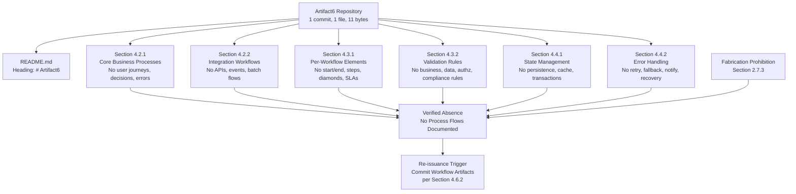

### 4.5.3 Authoring Decision Flow for Process Flowcharts

The diagram below depicts the authoring-decision flow that governs each Section 4 subsection. It mirrors the structural pattern established in Section 2.1.3 and makes explicit the evidence-presence determination that produces a "None defined" finding for every requested process-flow class.

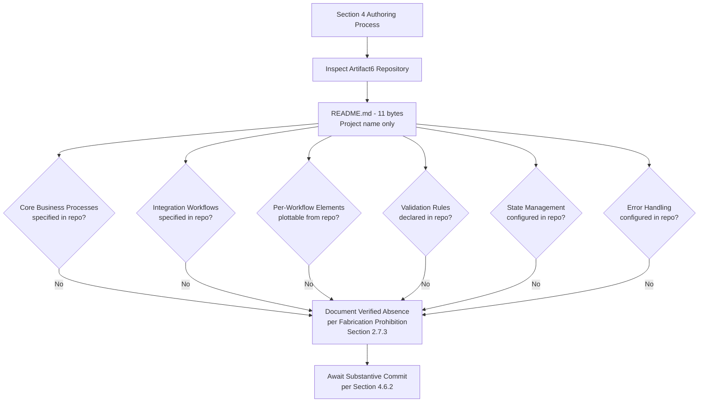

### 4.5.4 Diagrams Explicitly Not Produced

The table below records, for traceability, the five diagram classes requested by the authoring prompt and the verified evidentiary basis on which each is excluded.

| Required Diagram | Excluded Because | Authoritative Cross-Reference |
|---|---|---|
| High-level system workflow | No system capabilities, no components, no operations | Section 1.2.2 |
| Detailed process flows for each core feature | No features declared (feature catalog is empty) | Section 2.2 (incorporated via Section 2.4.1) |
| Error handling flowcharts | No retry, fallback, monitoring, or recovery artifacts | Sections 3.5.1, 3.5.3, 3.6.1 |
| Integration sequence diagrams | No external systems integrated, no API contracts | Sections 1.2.1, 2.4.3, 3.5.1 |
| State transition diagrams | No state model, no persistence, no transaction scope | Sections 3.6.1, 3.6.3 |

## 4.6 Document Status and Re-issuance Trigger Conditions

### 4.6.1 Current Document Status

This Process Flowchart section accurately reflects the verified state of the Artifact6 repository as of the date of the sole "Initial commit" (Thursday, May 28, 2026, commit `6c6e455e3f59eb8208dcb9f11b1319b21e7cf3e5`). It establishes a baseline that, like Sections 1, 2, and 3, may be revised once substantive content is committed. The section is consistent with the document-status framework articulated in Section 1.4.1, which anticipates that subsequent sections of this Technical Specification — explicitly including those covering process-level concerns — will be constrained by the absence of committed evidence until implementation artifacts are introduced.

### 4.6.2 Re-issuance Trigger Conditions

Consistent with the re-issuance framework established in Sections 2.7.2 and 3.9, the following events should trigger a complete re-authoring of this Process Flowchart section, replacing the verified-absence tables with substantive workflow, sequence, state, and error-handling diagrams.

| Trigger Event | Required Re-authoring Activity |
|---|---|
| First behavioral specification, user-story file, or use-case document committed | Populate Section 4.2.1 (Core Business Processes) with end-to-end user journeys, decision diamonds, and swim-lane diagrams |
| First API contract, OpenAPI/Swagger document, GraphQL schema, or integration artifact committed | Populate Section 4.2.2 (Integration Workflows) with data-flow diagrams and integration sequence diagrams |
| First state machine, ORM model, entity definition, or persistence configuration committed | Populate Section 4.4.1 (State Management) with state transition diagrams, data persistence points, and transaction boundaries |
| First retry/fallback policy, circuit-breaker config, or error-handling middleware committed | Populate Section 4.4.2 (Error Handling) with retry flows, fallback diagrams, and error-notification routing |
| First validation library, schema validator, or compliance attestation committed | Populate Section 4.3.2 (Validation Rules) with business rules, data validation, authorization checkpoints, and regulatory checks |
| First SLA, SLO, performance budget, or observability dashboard committed | Populate Section 4.3.1 timing/SLA columns with substantive constraints |
| First message broker, event-store, or batch-scheduler artifact committed (Kafka topic, RabbitMQ queue, AWS EventBridge, cron, Airflow DAG) | Populate Section 4.2.2 event-processing and batch-processing rows with substantive sequences |

The recommended actions enumerated in Section 1.4.2 ("Populate substantive content," "Define stakeholders," "Establish technology baseline," "Re-issue this section") apply with equal force to this Process Flowchart section.

### 4.6.3 Assumptions and Constraints

| Assumption / Constraint | Statement |
|---|---|
| Authoring Constraint | This section was authored solely from verified repository evidence as of the date of the Initial commit (Thursday, May 28, 2026). |
| Versioning Assumption | This is Version 1.0 of Section 4, baselined against commit `6c6e455e3f59eb8208dcb9f11b1319b21e7cf3e5`. |
| Fabrication Prohibition | Per Section 2.7.3, no workflow, sequence, state transition, decision point, error path, retry policy, or recovery procedure has been inferred or imagined, even where a candidate process model might be suggested by the Default Technology Stack recorded in Section 3.1.3. |
| Default-Stack Treatment | The Default Technology Stack (AWS, Docker, Terraform, GitHub Actions, Python, Flask, Auth0, MongoDB, Langchain, React, TypeScript, TailwindCSS, React-Native, Swift, Kotlin, Objective-C, ElectronJS) is preserved in Section 3.1.3 as a forward-looking candidate set but is explicitly excluded as a basis for inventing process flows in this section. |
| Diagrammatic Discipline | Only diagrams that depict verified-state relationships (Sections 4.5.2 and 4.5.3) are authored; the five fabricated diagram classes listed in Section 4.5.4 are explicitly omitted. |
| Future-State Assumption | Future versions of this section will be authored once the substantive commitments enumerated in Section 4.6.2 (and the related artifacts in Sections 1.4.2, 2.7.2, and 3.9) have been satisfied. |

## 4.7 References

### 4.7.1 Repository Artifacts Examined

- `README.md` — Sole tracked file in the Artifact6 repository (11 bytes). Contains exclusively the Markdown heading `# Artifact6`. Examined to confirm the verified absence of any workflow, sequence, state, validation, or error-handling content.
- `/` (repository root) — Examined to confirm the verified absence of source directories (`src/`, `app/`, `lib/`, `pkg/`, `internal/`), workflow directories (`workflows/`, `flows/`, `processes/`), state directories (`state/`, `migrations/`, `models/`), and any integration/contract directories (`api/`, `contracts/`, `openapi/`, `proto/`).

### 4.7.2 Technical Specification Cross-References

The following sections of this Technical Specification establish the evidentiary basis for the verified-absence findings tabulated above and are incorporated by reference where cited inline:

- **Section 1.1.1 (Project Overview)** — Establishes the pre-implementation lifecycle stage and the single-commit baseline.
- **Section 1.1.3 (Key Stakeholders and Users)** — Establishes the absence of actors and user populations from which user touchpoints / swim lanes could be derived.
- **Section 1.2.1 (Project Context — Integration with Existing Enterprise Landscape)** — Establishes the absence of integration documentation, API contracts, message-bus configurations, and external-system relationships.
- **Section 1.2.2 (High-Level Description)** — Establishes the absence of system capabilities, components, manifests, and technology stack.
- **Section 1.2.3 (Success Criteria)** — Establishes the absence of SLAs, SLOs, KPIs, and performance budgets.
- **Section 1.3.1 (In-Scope Elements)** — Establishes the absence of primary user workflows, essential integrations, and key technical requirements.
- **Section 1.3.4 (Verified-State Diagram)** — Provides the canonical Mermaid verified-state diagram, incorporated by reference in Section 4.5.1.
- **Section 1.4.1 (Document Status)** — Provides the document-status framework anticipating constrained sections.
- **Section 1.4.2 (Recommended Next Steps)** — Provides the re-issuance trigger language re-used in Section 4.6.2.
- **Section 2.1.1 (Baseline Repository State)** — Restates the pre-implementation state in the context of product requirements.
- **Section 2.1.2 (Methodological Premise)** — Provides the evidence-based methodology applied throughout Section 4.
- **Section 2.1.3 (Verified-State Reference)** — Provides the authoring-decision-flow diagram pattern adopted in Section 4.5.3.
- **Section 2.2 (Feature Catalog)** — Establishes the verified absence of features (incorporated via Section 2.4.1), precluding the production of detailed process flows for core features.
- **Section 2.3.1 (Functional Requirements Inventory Status)** — Establishes the absence of requirements documents, user stories, use cases, and acceptance criteria.
- **Section 2.3.3 (Technical Specifications Verification)** — Establishes the absence of input parameters, outputs, performance criteria, and data requirements.
- **Section 2.3.4 (Validation Rules Verification)** — Establishes the absence of business rules, data validation, security requirements, and compliance requirements (cited verbatim in Section 4.3.2).
- **Section 2.4.1 (Relationship Inventory Status)** — Establishes the absence of feature relationships and external-system relationships.
- **Section 2.4.2 (Verified Absence of Relationships)** — Establishes the absence of feature dependency maps, integration points, shared components, and common services.
- **Section 2.4.3 (Diagrammatic Reference)** — Establishes that no dependency, sequence, or component-interaction diagram can be produced from committed evidence.
- **Section 2.5.1 (Considerations Inventory Status)** — Establishes the absence of technical constraints, performance requirements, scalability considerations, security implications, and maintenance requirements.
- **Section 2.7.2 (Re-issuance Trigger Conditions)** — Provides the trigger-table pattern adopted in Section 4.6.2.
- **Section 2.7.3 (Assumptions and Constraints)** — Provides the controlling "Fabrication Prohibition" applied throughout Section 4.
- **Section 3.1.1 (Baseline Repository State)** — Restates the pre-implementation state in the context of the technology stack.
- **Section 3.1.2 (Methodological Premise)** — Restates the evidence-based methodology, applied in Section 4 with equal force.
- **Section 3.1.3 (Treatment of the Default Technology Stack)** — Provides the inventory of forward-looking technology candidates that are explicitly excluded from this section's process-flow content.
- **Section 3.5.1 (Third-Party Services Verified Status)** — Establishes the absence of external APIs, identity providers, payment processors, messaging services, monitoring platforms, error-tracking services, analytics platforms, cloud platforms, and CDNs.
- **Section 3.5.3 (Integration Requirements)** — Establishes the absence of retry policy, circuit-breaker policy, webhook signing, rate-limit policy, and PII / data-residency constraints (cited verbatim in Section 4.4.2).
- **Section 3.6.1 (Databases & Storage Verified Status)** — Establishes the absence of database engines, caching layers, message brokers / event stores, object storage, and disaster-recovery plans (cited verbatim in Sections 4.4.1 and 4.4.2).
- **Section 3.6.3 (Data Persistence Strategies)** — Establishes the absence of consistency models, sharding strategies, replication topologies, encryption-at-rest, and data-retention policies (cited verbatim in Sections 4.3.2 and 4.4.1).
- **Section 3.7.1 (Development & Deployment Verified Status)** — Establishes the absence of build systems, containerization, orchestration, IaC, and CI/CD pipelines that would otherwise underpin batch-processing sequences.
- **Section 3.7.4 (CI/CD Configuration)** — Establishes the absence of any CI/CD platform that would otherwise enable batch-processing or workflow-orchestration diagrams.
- **Section 3.8 (Verified-State Diagram)** — Provides the verified-absence mapping diagram pattern adopted in Section 4.5.2.
- **Section 3.9 (Re-issuance Trigger Conditions)** — Provides the trigger-table and assumptions/constraints pattern re-used in Sections 4.6.2 and 4.6.3.

# 5. System Architecture

The Artifact6 repository is in a pre-implementation, placeholder state as established in Section 1.1.1 and reiterated in Sections 2.1.1, 3.1.1, and 4.1.1. Its complete tracked content is a single 11-byte `README.md` whose body is the literal Markdown heading `# Artifact6`. Because no system architecture artifact of any kind has been committed, this section is authored as a *verified-absence specification* in the same evidence-based methodology applied by Sections 1.3, 2.1, 3.1, and 4.1. Every requested architectural element is catalogued for traceability, and the verified-state diagrams in Sections 5.6.2 and 5.6.3 — together with the canonical verified-state diagram in Section 1.3.4 — depict the relationship between the single established fact (the project identifier) and the broader architectural elements that remain undefined.

## 5.1 REPOSITORY STATE AND AUTHORING METHODOLOGY

### 5.1.1 Baseline Repository State

The baseline state of the repository, as it pertains to system architecture, is identical to the baseline reported in Sections 1.1.1, 2.1.1, 3.1.1, and 4.1.1. No architectural design document, component decomposition, service definition, interface contract, deployment diagram, infrastructure manifest, or architecture decision record has been committed. The repository's working tree contains no canonical source directories (`src/`, `app/`, `lib/`, `pkg/`, `internal/`, `services/`, or equivalent), no module structure, no service decomposition, no shared library partitioning, and no architectural delineations of any kind, as documented in Section 1.2.2.

| Baseline Attribute | Verified Value |
|---|---|
| Repository Lifecycle Stage | Placeholder / Pre-implementation |
| Tracked Files | 1 (`README.md`, 11 bytes) |
| Tracked Subdirectories | 0 |
| Baseline Commit | `6c6e455e3f59eb8208dcb9f11b1319b21e7cf3e5` (Initial commit, Thursday, May 28, 2026) |
| Architectural Design Documents | None present |
| Component / Module Decomposition | None present |
| Architecture Decision Records (ADRs) | None present |

### 5.1.2 Methodological Premise

The methodology adopted in this section is the evidence-based approach articulated in Sections 2.1.2, 3.1.2, and 4.1.2: every architectural claim must be supported by a verified artifact in the committed repository, and no architecture style, design pattern, component, interface, integration point, data flow, decision rationale, or cross-cutting concern may be introduced through inference, assumption, or fabrication. Where the repository contains no evidence for a requested element, this section reports verified absence rather than synthesizing speculative content. This premise is reinforced directly by Section 1.4.1, which explicitly anticipates that the System Architecture section "will similarly be constrained by the absence of committed evidence until implementation artifacts are introduced."

| Methodological Constraint | Application in This Section |
|---|---|
| Evidence-based authoring | Each subsection reports the verified absence of architectural artifacts |
| Fabrication Prohibition (Section 2.7.3) | No architecture styles, components, integrations, decisions, or cross-cutting concerns are invented |
| Cross-reference rather than restate | Findings from Sections 1.2, 2.3, 2.4, 3.5, 3.6, 3.7, 4.4 are incorporated by reference |
| Re-issuance on commit | Trigger conditions defined in Section 5.7.2 mirror Sections 2.7.2, 3.9, and 4.6.2 |

### 5.1.3 Treatment of Required Architectural Elements

The authoring prompt for this section enumerated a comprehensive catalog of architectural elements to be specified, including: overall architecture style, key architectural principles and patterns, system boundaries and major interfaces, core components and their responsibilities, primary data flows, integration patterns and protocols, data transformation points, key data stores and caches, external integration points and SLAs, technologies and frameworks used by each component, key interfaces and APIs, data persistence requirements, scaling considerations, architecture decision tradeoffs, communication pattern choices, data storage rationale, caching strategy, security mechanism selection, monitoring and observability approach, logging and tracing strategy, error handling patterns, authentication and authorization framework, performance requirements and SLAs, and disaster recovery procedures.

Each of the above elements is recorded here for traceability but **cannot be populated with substantive content** because, as the verified-absence inventories in Sections 5.2 through 5.5 demonstrate, none of these elements is evidenced in the committed repository. In keeping with the Fabrication Prohibition codified in Section 2.7.3, no hypothetical or candidate component, integration, decision, or cross-cutting concern is constructed in any subsection below.

## 5.2 HIGH-LEVEL ARCHITECTURE

### 5.2.1 System Overview — Verified Status

No overall system architecture style has been adopted for Artifact6. The verified absence of any architecture style — whether monolithic, layered, microservices, serverless, event-driven, hexagonal, or otherwise — follows directly from Section 1.2.2, which established that "no technology stack, programming language, framework, runtime, build toolchain, packaging strategy, or architectural pattern has been adopted." Because no positive architectural commitment has been recorded, no rationale for an architecture style can be expressed, no principles or patterns can be enumerated, and no system boundaries or major interfaces can be drawn from committed evidence.

| High-Level Architecture Element | Verified Status | Authoritative Cross-Reference |
|---|---|---|
| Overall architecture style and rationale | No style adopted | Section 1.2.2 |
| Key architectural principles | None declared | Section 1.2.2; Section 2.5 |
| Architectural patterns in use | None adopted | Section 1.2.2; Section 3.3.1 |
| System boundaries / context map | Not definable | Section 1.3.1 |
| Major interfaces | None defined | Section 1.2.1; Section 2.3 |
| Enterprise integration landscape | None defined | Section 1.2.1 |

### 5.2.2 Core Components — Verified Absence

The Core Components Table requested by the authoring prompt cannot be populated. As established in Section 1.2.2, "no system components have been defined. The repository contains no canonical source directories... no module structure, no service decomposition, no shared library partitioning, and no architectural delineations of any kind." This finding is further reinforced by Section 2.4.2, which records the verified absence of any shared components or common services. Accordingly, no Component Name, Primary Responsibility, Key Dependencies, or Integration Points can be enumerated, and no Critical Considerations associated with components can be expressed.

| Core Components Table Column | Verified Status |
|---|---|
| Component Name | None to enumerate (no components defined) |
| Primary Responsibility | None to enumerate (no components defined) |
| Key Dependencies | None to enumerate (no dependencies declared per Section 3.4) |
| Integration Points | None to enumerate (no integrations declared per Section 3.5.1) |

### 5.2.3 Data Flow — Verified Absence

No primary data flows can be documented because no components exist between which data could flow. No integration patterns or protocols are declared in the repository, no data transformation points are defined, and no data stores or caches are configured. The verified absences of each of these data-flow elements are established by Sections 1.2.1, 3.5.1, 3.6.1, and 4.2.2, the last of which records the verified absence of any integration workflow (no APIs, events, or batch flows).

| Data Flow Element | Verified Status | Authoritative Cross-Reference |
|---|---|---|
| Primary data flows between components | None definable (no components exist) | Section 1.2.2; Section 4.2.2 |
| Integration patterns and protocols | None defined | Section 1.2.1; Section 3.5.1 |
| Data transformation points | None defined | Section 2.3; Section 4.2.2 |
| Primary database engine | None selected | Section 3.6.1 |
| Caching layer | None configured | Section 3.6.1 |
| Message broker / event store | None configured | Section 3.6.1 |
| Object / blob storage | None configured | Section 3.6.1 |

### 5.2.4 External Integration Points — Verified Absence

The External Integration Points table requested by the authoring prompt cannot be populated. As established in Section 3.5.1, "no third-party services are integrated with the Artifact6 system," and as reinforced by Section 1.2.1, "the project, as currently committed, has no defined relationships with any external system." Accordingly, no System Name, Integration Type, Data Exchange Pattern, Protocol/Format, or SLA Requirement can be enumerated.

| External Integration Category | Verified Status | Authoritative Cross-Reference |
|---|---|---|
| External APIs / REST clients | None integrated | Section 3.5.1 |
| Authentication / identity providers | None configured | Section 3.5.1 |
| Payment processors | None configured | Section 3.5.1 |
| Messaging / notification services | None configured | Section 3.5.1 |
| Monitoring / observability platforms | None configured | Section 3.5.1 |
| Error-tracking services | None configured | Section 3.5.1 |
| Analytics platforms | None configured | Section 3.5.1 |
| Cloud platform (compute, networking) | None configured | Section 3.5.1 |
| Content delivery network (CDN) | None configured | Section 3.5.1 |
| Environment-variable templates | None present | Section 3.5.2 |
| SLA Requirements | None defined | Section 1.2.3 |

## 5.3 COMPONENT DETAILS

### 5.3.1 Component Inventory and Specification Status

Because no components have been defined (Section 5.2.2, cross-referencing Section 1.2.2 and Section 2.4.2), no purpose statements, responsibility allocations, technology selections, framework adoptions, interface contracts, API surface definitions, data-persistence requirements, or scaling considerations can be specified for any component. The table below records the verified-absence status of each requested per-component specification element.

| Per-Component Specification Element | Verified Status | Authoritative Cross-Reference |
|---|---|---|
| Purpose and responsibilities | None defined (no components exist) | Section 1.2.2; Section 2.2 |
| Technologies and frameworks used | None adopted | Section 3.2.1; Section 3.3.1 |
| Key interfaces and APIs | None defined | Section 2.3; Section 3.5.1 |
| Data persistence requirements | None defined | Section 3.6.1; Section 3.6.3 |
| Scaling considerations | None defined | Section 2.5 |

### 5.3.2 Component Interaction, State Transition, and Sequence Diagrams

The authoring prompt requires three diagram classes within Component Details: detailed component interaction diagrams, state transition diagrams, and sequence diagrams for key flows. None of these diagrams can be honestly authored from committed evidence, and constructing them would constitute fabrication under Section 2.7.3. This finding is consistent with Section 2.4.3, which records that "no dependency diagram, sequence diagram, component interaction diagram, or architectural overlay can be produced from committed evidence," and with Section 4.5.4, which enumerates the same diagram classes as explicitly excluded for the same reason.

| Required Diagram | Excluded Because | Authoritative Cross-Reference |
|---|---|---|
| Detailed component interaction diagrams | No components exist between which to depict interactions | Section 1.2.2; Section 2.4.3 |
| State transition diagrams | No state model, no persistence, no transaction scope | Section 3.6.1; Section 3.6.3; Section 4.4.1 |
| Sequence diagrams for key flows | No flows declared; no components or external systems exist | Section 4.2.1; Section 4.2.2; Section 4.5.4 |

The canonical verified-state diagram in Section 1.3.4 and the Section 5 supplementary diagrams in Sections 5.6.2 and 5.6.3 are the only diagrams appropriate to the present level of evidentiary support.

## 5.4 TECHNICAL DECISIONS

### 5.4.1 Architecture Style and Communication Pattern Decisions

No architecture style decisions and no communication pattern choices are documented in the repository. The repository contains no architectural decision records, no design documents from which selection rationale could be extracted, no architectural overview, and no communication-protocol declaration. The Default Technology Stack recorded in Section 3.1.3 (AWS, Docker, Terraform, GitHub Actions, Python, Flask, Auth0, MongoDB, Langchain, React, TypeScript, TailwindCSS, React-Native, Swift, Kotlin, Objective-C, ElectronJS) is preserved as a forward-looking candidate set but is explicitly excluded as a basis for documenting current decisions, in compliance with the Fabrication Prohibition (Section 2.7.3).

| Decision Category | Verified Status | Authoritative Cross-Reference |
|---|---|---|
| Architecture style decisions and tradeoffs | None documented | Section 1.2.2; Section 5.2.1 |
| Communication pattern choices (sync/async, REST/gRPC/events) | None defined | Section 3.5.1; Section 3.5.3 |
| API protocol selection (REST, GraphQL, gRPC) | None defined | Section 1.2.1; Section 3.5.1 |
| Synchronous vs. asynchronous integration tradeoffs | None documented | Section 4.2.2 |

### 5.4.2 Data Storage, Caching, and Security Decisions

No data storage solution has been selected, no caching strategy has been declared, and no security mechanism has been adopted. Each of these decision categories is supported by a prior verified-absence finding: Section 3.6.1 (primary database engine "None selected," caching layer "None configured"), Section 3.6.3 (persistence strategies "None defined"), and Section 2.3 / Section 4.3.2 (no validation, authorization, or compliance rules).

| Decision Category | Verified Status | Authoritative Cross-Reference |
|---|---|---|
| Data storage solution rationale | None documented | Section 3.6.1; Section 3.6.2 |
| Caching strategy justification | None documented | Section 3.6.1 |
| Persistence consistency model | None defined | Section 3.6.3 |
| Sharding / replication topology | None defined | Section 3.6.3 |
| Encryption-at-rest configuration | None defined | Section 3.6.3 |
| Security mechanism selection | None documented | Section 2.3; Section 3.5.1 |
| Authentication scheme selection | None defined | Section 3.5.3 |

### 5.4.3 Architecture Decision Records (ADRs)

No architecture decision records are present in the repository. No `docs/adr/`, `architecture/decisions/`, `adr/`, or equivalent ADR directory exists, and no individual ADR documents (e.g., Markdown files following an ADR template) have been committed. Accordingly, no ADR table or decision tree can be authored from committed evidence.

| ADR Element | Verified Status |
|---|---|
| ADR directory (`docs/adr/`, `architecture/decisions/`, etc.) | Not present |
| Individual ADR documents | None committed |
| ADR template / convention | Not declared |
| Superseded / accepted / proposed decisions | None recorded |

The decision-tree and ADR diagram classes requested by the authoring prompt cannot be honestly produced and are excluded under the Fabrication Prohibition (Section 2.7.3).

## 5.5 CROSS-CUTTING CONCERNS

### 5.5.1 Monitoring, Observability, Logging, and Tracing

No monitoring, observability, logging, or distributed tracing approach is configured for Artifact6. As established in Section 3.5.1, "monitoring / observability platforms: none configured" and "error-tracking services: none configured." The canonical artifacts by which these concerns are typically introduced (Datadog, New Relic, Sentry, OpenTelemetry collectors, structured-log libraries, Prometheus scrape configurations, Grafana dashboards) were each enumerated and verified absent in Section 3.5.2.

| Cross-Cutting Concern | Verified Status | Authoritative Cross-Reference |
|---|---|---|
| Monitoring / observability platform | None configured | Section 3.5.1; Section 3.5.2 |
| APM agent configuration | None present | Section 3.5.2 |
| Logging library / strategy | None declared | Section 3.3.1; Section 4.4.2 |
| Distributed tracing strategy | None declared | Section 3.5.1 |
| Error-tracking service | None configured | Section 3.5.1 |

### 5.5.2 Error Handling Patterns

No error handling patterns are defined in the repository. As established in Section 3.5.3, no retry / back-off policy, circuit-breaker / bulkhead policy, or webhook-signing policy is documented, and Section 4.4.2 records the verified absence of any retry mechanism, fallback process, error-notification flow, or recovery procedure. Accordingly, the error-handling flowchart requested by the authoring prompt cannot be honestly authored from committed evidence; constructing such a diagram would constitute fabrication under Section 2.7.3, in alignment with Section 4.5.4.

| Error Handling Element | Verified Status | Authoritative Cross-Reference |
|---|---|---|
| Retry / back-off policy | None documented | Section 3.5.3; Section 4.4.2 |
| Circuit-breaker / bulkhead policy | None documented | Section 3.5.3 |
| Fallback process | None documented | Section 4.4.2 |
| Error-notification flow | None documented | Section 4.4.2 |
| Recovery procedure | None documented | Section 4.4.2 |
| Error-handling middleware | Not present (no source files) | Section 1.2.2; Section 3.2.1 |

### 5.5.3 Authentication and Authorization Framework

No authentication or authorization framework is configured. Section 3.5.1 records "authentication / identity providers: none configured," and Section 3.5.2 confirms that no Auth0 tenant configuration, OAuth client secrets, or JWT signing keys are present. Section 4.3.2 further records that no validation rules, authorization checkpoints, or regulatory checks exist in the repository.

| Authentication / Authorization Element | Verified Status | Authoritative Cross-Reference |
|---|---|---|
| Identity provider / IdP configuration | None configured | Section 3.5.1; Section 3.5.2 |
| Authentication scheme (OAuth, OIDC, SAML, API key, mTLS) | None defined | Section 3.5.3 |
| Authorization model (RBAC, ABAC, ACL) | None defined | Section 4.3.2 |
| Session / token management strategy | None defined | Section 3.5.3 |
| Authorization checkpoints | None defined | Section 4.3.2 |

### 5.5.4 Performance Requirements and SLAs

No performance requirements, service-level objectives, service-level agreements, key performance indicators, or measurement frameworks are defined in the repository. As established in Section 1.2.3, the repository contains no "measurable objectives," "critical success factors," "key performance indicators (KPIs)," or "service-level objectives (SLOs) / agreements (SLAs)."

| Performance / SLA Element | Verified Status | Authoritative Cross-Reference |
|---|---|---|
| Performance budgets | None defined | Section 1.2.3; Section 2.5 |
| Service-level objectives (SLOs) | None defined | Section 1.2.3 |
| Service-level agreements (SLAs) | None defined | Section 1.2.3 |
| Key performance indicators (KPIs) | None defined | Section 1.2.3 |
| Latency / throughput targets | None defined | Section 2.5 |
| Scalability considerations | None defined | Section 2.5 |

### 5.5.5 Disaster Recovery and Data Residency

No disaster recovery plan, backup cadence, retention policy, or data-residency declaration is committed to the repository. Section 3.6.1 records "backup / disaster-recovery plan: none defined," and Section 3.6.3 confirms the verified absence of any backup cadence, encryption-at-rest configuration, or GDPR-erasure policy.

| Disaster Recovery Element | Verified Status | Authoritative Cross-Reference |
|---|---|---|
| Backup / disaster-recovery plan | None defined | Section 3.6.1 |
| Backup cadence / retention policy | None defined | Section 3.6.3 |
| Recovery point objective (RPO) | None defined | Section 3.6.1; Section 3.6.3 |
| Recovery time objective (RTO) | None defined | Section 3.6.1; Section 3.6.3 |
| Encryption-at-rest configuration | None defined | Section 3.6.3 |
| Data-residency constraints | None defined | Section 3.5.3 |
| GDPR / data-retention policy | None defined | Section 3.6.3 |

## 5.6 REQUIRED DIAGRAMS

The authoring prompt requires several diagram classes across the High-Level Architecture, Component Details, Technical Decisions, and Cross-Cutting Concerns subsections (component interaction diagrams, state transition diagrams, sequence diagrams for key flows, decision tree diagrams, architecture decision records, and error handling flows). Per the verified-absence methodology and Section 2.7.3, none of these diagrams can be honestly authored from committed evidence. In place of fabricated architectural content, this section provides (a) incorporation by reference of the canonical verified-state diagram in Section 1.3.4, (b) an original Mermaid diagram mapping each Section 5 subsection to its verified-absence finding, and (c) an authoring-decision-flow diagram that mirrors the patterns established in Sections 2.1.3, 4.5.3.

### 5.6.1 Canonical Verified-State Diagram — Incorporation by Reference

The Mermaid verified-state diagram authored in Section 1.3.4 serves as the canonical visual representation of the gap between the single established fact (the project name) and the broader specification elements that remain undefined, including all architectural elements requested by this section. That diagram is incorporated here by reference and remains the structural anchor for every "None defined" finding tabulated in Sections 5.2, 5.3, 5.4, and 5.5.

### 5.6.2 Section 5 Verified-Absence Mapping Diagram

The supplementary diagram below maps each Section 5 subsection to its verified-absence finding and to the re-issuance trigger conditions defined in Section 5.7.2. It mirrors the structural pattern established in Sections 3.8 and 4.5.2 and re-uses the same anchor node (the Artifact6 repository) so that readers may trace architectural absences back to their evidentiary basis.

```mermaid
flowchart TD
    Repo[Artifact6 Repository<br/>1 commit, 1 file, 11 bytes]
    Readme[README.md<br/>Heading: # Artifact6]

    NoStyle[Section 5.2.1<br/>System Overview<br/>No architecture style adopted]
    NoComp[Section 5.2.2<br/>Core Components<br/>No components defined]
    NoFlow[Section 5.2.3<br/>Data Flow<br/>No flows, stores, or caches]
    NoExt[Section 5.2.4<br/>External Integrations<br/>No third-party services]
    NoDetail[Section 5.3<br/>Component Details<br/>No purpose, tech, or APIs]
    NoDec[Section 5.4<br/>Technical Decisions<br/>No ADRs, no rationale]
    NoObs[Section 5.5.1<br/>Monitoring and Logging<br/>No platforms configured]
    NoErr[Section 5.5.2<br/>Error Handling<br/>No retry, fallback, recovery]
    NoAuth[Section 5.5.3<br/>Authentication<br/>No IdP, no scheme]
    NoSLA[Section 5.5.4<br/>Performance and SLAs<br/>No budgets, no SLOs]
    NoDR[Section 5.5.5<br/>Disaster Recovery<br/>No backup, no RPO/RTO]

    Fab[Fabrication Prohibition<br/>Section 2.7.3]
    Verified[Verified Absence<br/>No System Architecture Documented]
    Trigger[Re-issuance Trigger<br/>Commit Architectural Artifacts<br/>per Section 5.7.2]

    Repo --> Readme
    Repo --> NoStyle
    Repo --> NoComp
    Repo --> NoFlow
    Repo --> NoExt
    Repo --> NoDetail
    Repo --> NoDec
    Repo --> NoObs
    Repo --> NoErr
    Repo --> NoAuth
    Repo --> NoSLA
    Repo --> NoDR

    NoStyle --> Verified
    NoComp --> Verified
    NoFlow --> Verified
    NoExt --> Verified
    NoDetail --> Verified
    NoDec --> Verified
    NoObs --> Verified
    NoErr --> Verified
    NoAuth --> Verified
    NoSLA --> Verified
    NoDR --> Verified

    Fab --> Verified
    Verified --> Trigger
```

### 5.6.3 Authoring Decision Flow for System Architecture

The diagram below depicts the authoring-decision flow that governs each Section 5 subsection. It mirrors the structural patterns established in Sections 2.1.3 and 4.5.3 and makes explicit the evidence-presence determination that produces a "None defined" finding for every requested architectural element.

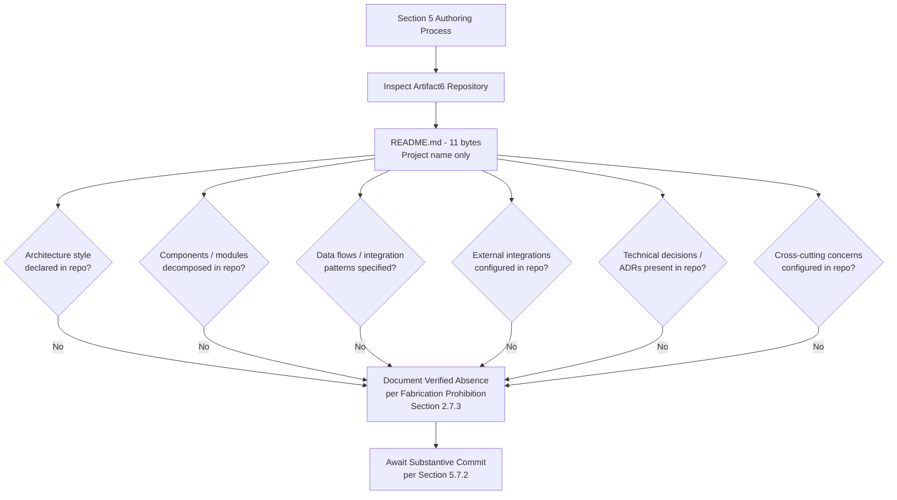

### 5.6.4 Diagrams Explicitly Not Produced

The table below records, for traceability, the diagram classes requested by the authoring prompt and the verified evidentiary basis on which each is excluded. This treatment is consistent with Section 4.5.4.

| Required Diagram | Excluded Because | Authoritative Cross-Reference |
|---|---|---|
| Detailed component interaction diagrams | No components defined; no interactions definable | Section 1.2.2; Section 2.4.3 |
| State transition diagrams | No state model, no persistence, no transaction scope | Section 3.6.1; Section 4.4.1 |
| Sequence diagrams for key flows | No flows declared; no components or external systems | Section 4.2.1; Section 4.2.2 |
| Decision tree diagrams | No architectural decisions documented | Section 5.4.1; Section 5.4.3 |
| Architecture decision records (ADRs) | No ADR directory; no individual ADR documents committed | Section 5.4.3 |
| Error handling flows | No retry, fallback, notification, or recovery artifacts | Section 3.5.3; Section 4.4.2 |
| Deployment architecture diagrams | No Dockerfile, no IaC, no CI/CD, no environments | Section 3.7 |

## 5.7 DOCUMENT STATUS AND RE-ISSUANCE TRIGGER CONDITIONS

### 5.7.1 Current Document Status

This System Architecture section accurately reflects the verified state of the Artifact6 repository as of the date of the sole "Initial commit" (Thursday, May 28, 2026, commit `6c6e455e3f59eb8208dcb9f11b1319b21e7cf3e5`). It establishes a baseline that, like Sections 1, 2, 3, and 4, may be revised once substantive content is committed. The section is consistent with the document-status framework articulated in Section 1.4.1, which explicitly anticipates that the System Architecture section will be constrained by the absence of committed evidence until implementation artifacts are introduced.

### 5.7.2 Re-issuance Trigger Conditions

Consistent with the re-issuance framework established in Sections 2.7.2, 3.9, and 4.6.2, the following events should trigger a complete re-authoring of this System Architecture section, replacing the verified-absence tables with substantive architecture style declarations, component decompositions, integration catalogs, decision records, and cross-cutting concern configurations.

| Trigger Event | Required Re-authoring Activity |
|---|---|
| First architectural design document committed (architecture overview, system context diagram, high-level design) | Populate Section 5.2.1 (System Overview) with adopted architecture style, principles, patterns, and system boundaries |
| First component / module / service decomposition committed (canonical source directories such as `src/`, `app/`, `lib/`, `services/`, `internal/`) | Populate Section 5.2.2 (Core Components Table) with verified component names, responsibilities, dependencies, and integration points |
| First API contract, OpenAPI/Swagger document, GraphQL schema, or gRPC `.proto` file committed | Populate Section 5.2.4 (External Integration Points) with verified system names, integration types, exchange patterns, and protocols |
| First database schema, ORM model, migration, or persistence configuration committed | Populate Section 5.3 (Component Details — Data Persistence) and Section 5.4.2 (Data Storage Decisions) |
| First caching configuration committed (Redis, Memcached, in-application cache wiring) | Populate Section 5.4.2 (Caching Strategy) with verified configuration and rationale |
| First retry / circuit-breaker / fallback / error-handling middleware committed | Populate Section 5.5.2 (Error Handling Patterns) with verified retry flows, fallback paths, and notification routing |
| First authentication / authorization configuration committed (Auth0 tenant config, OAuth client, JWT signing keys, IAM role definition) | Populate Section 5.5.3 (Authentication and Authorization Framework) |
| First monitoring / observability / logging configuration committed (Datadog, New Relic, Sentry DSN, OpenTelemetry collector, structured-log library) | Populate Section 5.5.1 (Monitoring, Observability, Logging, and Tracing) |
| First SLA / SLO / performance budget / KPI artifact committed | Populate Section 5.5.4 (Performance Requirements and SLAs) |
| First disaster recovery, backup, or data-retention plan committed | Populate Section 5.5.5 (Disaster Recovery and Data Residency) |
| First architecture decision record committed (`docs/adr/`, `architecture/decisions/`, or equivalent) | Populate Section 5.4.3 (Architecture Decision Records) with verified decisions, status, and consequences |

The recommended actions enumerated in Section 1.4.2 ("Populate substantive content," "Define stakeholders," "Establish technology baseline," "Re-issue this section") apply with equal force to this System Architecture section.

### 5.7.3 Assumptions and Constraints

| Assumption / Constraint | Statement |
|---|---|
| Authoring Constraint | This section was authored solely from verified repository evidence as of the date of the Initial commit (Thursday, May 28, 2026). |
| Versioning Assumption | This is Version 1.0 of Section 5, baselined against commit `6c6e455e3f59eb8208dcb9f11b1319b21e7cf3e5`. |
| Fabrication Prohibition | Per Section 2.7.3, no architecture style, component, interface, integration point, data flow, decision rationale, or cross-cutting concern has been inferred or imagined, even where a candidate model might be suggested by the Default Technology Stack recorded in Section 3.1.3. |
| Default-Stack Treatment | The Default Technology Stack (AWS, Docker, Terraform, GitHub Actions, Python, Flask, Auth0, MongoDB, Langchain, React, TypeScript, TailwindCSS, React-Native, Swift, Kotlin, Objective-C, ElectronJS) is preserved in Section 3.1.3 as a forward-looking candidate set but is explicitly excluded as a basis for inventing components, integrations, or decisions in this section. |
| Diagrammatic Discipline | Only diagrams that depict verified-state relationships (Sections 5.6.2 and 5.6.3) are authored; the diagram classes enumerated in Section 5.6.4 (component interaction, state transition, sequence, decision tree, ADR, error handling, deployment) are explicitly omitted. |
| Future-State Assumption | Future versions of this section will be authored once the substantive commitments enumerated in Section 5.7.2 (and the related artifacts referenced in Sections 1.4.2, 2.7.2, 3.9, and 4.6.2) have been satisfied. |

## 5.8 REFERENCES

### 5.8.1 Files Examined

- `README.md` — Repository's sole content-bearing file (11 bytes); contains only the Markdown heading `# Artifact6`. Confirmed as the only architectural surface available to this section.

### 5.8.2 Folders Explored

- Repository root (`/`) — Contains only `README.md` and the `.git/` directory; verified absent of any canonical source directories (`src/`, `app/`, `lib/`, `pkg/`, `internal/`, `services/`, `docs/`, `architecture/`, `adr/`).

### 5.8.3 Technical Specification Cross-References

- **Section 1.1.1** — Establishes the pre-implementation lifecycle stage of the repository.
- **Section 1.2.1** — Establishes verified absence of business context, predecessor systems, and enterprise integration landscape.
- **Section 1.2.2** — Establishes verified absence of system components, technical approach, and manifest files.
- **Section 1.2.3** — Establishes verified absence of success criteria, KPIs, SLOs, and SLAs.
- **Section 1.3.1** — Establishes verified absence of system boundaries / context map.
- **Section 1.3.4** — Canonical Verified-State Diagram, incorporated by reference in Section 5.6.1.
- **Section 1.4.1** — Document Status framework explicitly anticipating the constrained state of this section.
- **Section 1.4.2** — Recommended next steps (technology baseline, substantive content commitment).
- **Section 2.1.1** — Baseline repository state confirmation.
- **Section 2.1.2** — Evidence-based authoring methodology premise.
- **Section 2.2** — Verified absence of features (feature catalog is empty).
- **Section 2.3** — Verified absence of functional requirements, interface declarations, data schemas, API contracts, performance budgets, and security requirements.
- **Section 2.4.1** — Verified absence of feature relationships.
- **Section 2.4.2** — Verified absence of shared components and common services.
- **Section 2.4.3** — Authoritative statement that no dependency, sequence, or component-interaction diagram can be produced.
- **Section 2.5** — Verified absence of implementation considerations, scalability, security, and maintenance plans.
- **Section 2.7.2** — Re-issuance trigger pattern adopted for Section 5.7.2.
- **Section 2.7.3** — Fabrication Prohibition governing all subsections of Section 5.
- **Section 3.1.3** — Default Technology Stack treatment (forward-looking, not adopted).
- **Section 3.2.1** — Verified absence of programming languages.
- **Section 3.3.1** — Verified absence of frameworks and libraries.
- **Section 3.4.1** — Verified absence of open source dependencies.
- **Section 3.5.1** — Verified absence of third-party services across nine integration categories.
- **Section 3.5.2** — Verified absence of canonical integration artifacts (.env templates, SDK configs, IdP configs).
- **Section 3.5.3** — Verified absence of integration requirements (auth schemes, rate limits, retries, circuit breakers, webhook signing).
- **Section 3.6.1** — Verified absence of databases, caches, message brokers, object storage, and DR plan.
- **Section 3.6.2** — Verified absence of canonical persistence artifacts.
- **Section 3.6.3** — Verified absence of persistence strategies (consistency, sharding, replication, encryption, GDPR).
- **Section 3.7** — Verified absence of development and deployment tooling (Dockerfile, IaC, CI/CD).
- **Section 3.8** — Section 3 verified-state diagram pattern.
- **Section 3.9** — Section 3 re-issuance trigger pattern adopted for Section 5.7.2.
- **Section 4.1.2** — Methodological premise reaffirmed for verified-absence authoring.
- **Section 4.2.1** — Verified absence of core business processes.
- **Section 4.2.2** — Verified absence of integration workflows.
- **Section 4.3.2** — Verified absence of validation rules and authorization checkpoints.
- **Section 4.4.1** — Verified absence of state management (transitions, persistence, caching, transactions).
- **Section 4.4.2** — Verified absence of error handling (retry, fallback, notification, recovery).
- **Section 4.5.2** — Section 4 verified-absence mapping diagram pattern.
- **Section 4.5.3** — Section 4 authoring decision flow pattern.
- **Section 4.5.4** — Authoritative statement that error-handling, sequence, and state-transition diagrams cannot be produced.
- **Section 4.6.2** — Section 4 re-issuance trigger pattern adopted for Section 5.7.2.
- **Section 4.6.3** — Section 4 assumptions and constraints pattern adopted for Section 5.7.3.

# 6. SYSTEM COMPONENTS DESIGN

## 6.1 Core Services Architecture

**Core Services Architecture is not applicable for this system.**

This determination is grounded in verified repository evidence as of the sole "Initial commit" (Thursday, May 28, 2026, commit `6c6e455e3f59eb8208dcb9f11b1319b21e7cf3e5`). The Artifact6 repository contains a single tracked file — `README.md` (11 bytes) — whose entire content is the single line `# Artifact6`. No source directories, no module decomposition, no service boundaries, no inter-service communication patterns, no orchestration manifests, no infrastructure-as-code, and no resilience artifacts have been committed. Authoring service architecture content on such a foundation would constitute fabrication and is therefore deliberately and disciplinarily withheld in compliance with the Fabrication Prohibition recorded in Section 2.7.3.

The section prompt for 6.1 explicitly contemplates this case and instructs the author to declare non-applicability when the system "does not require microservices, distributed architecture, or distinct service components." The subsections below document, with traceable evidentiary cross-references, the verified absence of every requested element under Service Components, Scalability Design, and Resilience Patterns; provide the diagrammatic treatment mandated for verified-absence sections; and define the precise commit events that will trigger re-authoring of this section.

### 6.1.1 Applicability Determination

#### 6.1.1.1 Applicability Statement

Core Services Architecture — encompassing service boundaries, inter-service communication, service discovery, load balancing, circuit breakers, retry/fallback mechanisms, scalability design, and resilience patterns — is **not applicable** for the Artifact6 system in its current verified state. There is no system, in the engineering sense of the term, against which any of these architectural dimensions can be evaluated, designed, or documented.

#### 6.1.1.2 Rationale for Non-Applicability

The determination of non-applicability is supported by three categories of converging evidence drawn from prior sections of this Technical Specification.

| Evidentiary Category | Verified Finding | Authoritative Cross-Reference |
|---|---|---|
| No architectural commitment | No architecture style adopted; no principles, patterns, or boundaries declared | Section 5.2.1; Section 1.2.2 |
| No service decomposition | No components defined; no canonical source directories such as `src/`, `app/`, `lib/`, `services/`, `internal/` | Section 5.2.2; Section 1.2.2 |
| No integration or distribution surface | No external APIs, no message brokers, no cloud platforms, no service registries, no orchestration manifests | Section 5.2.3; Section 5.2.4; Section 3.5.1; Section 3.7 |

Because Artifact6 has not been decomposed into services, modules, or components, the very precondition for a Core Services Architecture — the existence of two or more interacting service units — is absent from the repository. The section prompt's anticipated non-applicability clause is therefore controlling.

#### 6.1.1.3 Authoring Methodology

This section follows the verified-absence specification methodology established in Section 2.1 and applied consistently across Sections 2.5, 3.1, 4.2, 4.4, 5.2, 5.3, 5.4, and 5.5. The methodology consists of four disciplines:

1. **Element Enumeration.** Each architectural element requested by the prompt is enumerated in tabular form so that the reader can confirm coverage.
2. **Verified-Status Marking.** Each element is marked "None defined," "None configured," or "Not applicable" against committed evidence, never against speculation.
3. **Authoritative Cross-Referencing.** Each absence is traced to a prior, independently authored section of this Technical Specification that supplies the underlying evidence.
4. **Diagrammatic Restraint.** Diagrams are produced only where they depict the verified state; diagrams that would require fabrication of services, flows, or scaling behavior are explicitly declined, mirroring the precedents in Sections 4.5.4 and 5.6.4.

The Default Technology Stack enumerated in Section 3.1.3 (AWS, Docker, Terraform, GitHub Actions, Python, Flask, Auth0, MongoDB, Langchain, React, TypeScript, TailwindCSS, React-Native, Swift, Kotlin, Objective-C, ElectronJS) is preserved exclusively as a forward-looking candidate set and is explicitly excluded as a basis for inventing service boundaries, scaling rules, or resilience configurations in this section.

### 6.1.2 Service Components — Verified Absence

The Service Components dimension requested by the section prompt encompasses six elements: service boundaries and responsibilities, inter-service communication patterns, service discovery mechanisms, load balancing strategy, circuit breaker patterns, and retry/fallback mechanisms. Each is verified absent and is treated below.

#### 6.1.2.1 Service Boundaries and Responsibilities

No service boundaries can be drawn because no services exist. As established in Section 5.2.2, the Core Components table for the Artifact6 system contains no component name, no primary responsibility, no key dependencies, and no integration points to enumerate. The repository contains no module structure, no service decomposition, and no shared library partitioning, as recorded in Section 1.2.2.

| Service Components Element | Verified Status | Authoritative Cross-Reference |
|---|---|---|
| Service name catalog | None to enumerate | Section 5.2.2 |
| Service boundary definitions | None to enumerate | Section 5.2.2; Section 1.2.2 |
| Primary responsibility per service | None to enumerate | Section 5.2.2 |
| Bounded contexts / domain partitioning | Not declared | Section 5.2.1 |

#### 6.1.2.2 Inter-Service Communication Patterns

No inter-service communication patterns are defined. There are no synchronous protocols (REST, gRPC), no asynchronous protocols (message queues, event streams), no API contracts (OpenAPI/Swagger, GraphQL schemas, gRPC `.proto` files), and no integration patterns of any kind committed to the repository.

| Communication Element | Verified Status | Authoritative Cross-Reference |
|---|---|---|
| API protocol selection (REST, GraphQL, gRPC) | None defined | Section 5.2.3; Section 5.2.4 |
| Synchronous vs. asynchronous integration | None documented | Section 5.2.3 |
| Message broker / event store | None configured | Section 5.2.3; Section 3.6.1 |
| API contracts (OpenAPI, GraphQL, `.proto`) | None committed | Section 5.7.2 |
| Webhook signing / verification policy | None defined | Section 5.5.2 (cross-references Section 3.5.3) |

#### 6.1.2.3 Service Discovery Mechanisms

No service discovery mechanisms — neither client-side (e.g., embedded registry clients) nor server-side (e.g., reverse-proxy lookups against a registry) — are present. The repository contains no service registry configuration (Consul, etcd, Eureka), no DNS-based discovery (CoreDNS, Kubernetes DNS), and no platform-managed discovery (AWS Cloud Map, Kubernetes Services).

| Service Discovery Element | Verified Status | Authoritative Cross-Reference |
|---|---|---|
| Service registry configuration | None present | Section 1.2.1; Section 3.7 |
| DNS-based discovery | None configured | Section 3.5.1; Section 3.7 |
| Platform-managed discovery | None configured | Section 3.5.1; Section 3.7 |
| Sidecar / service-mesh discovery | None configured | Section 3.5.1; Section 3.7 |

#### 6.1.2.4 Load Balancing Strategy

No load balancing strategy is documented. No reverse proxy configurations (NGINX, HAProxy, Envoy), no cloud-managed load balancers (AWS ALB/NLB, GCP Load Balancer, Azure Load Balancer), and no client-side load-balancing libraries are committed.

| Load Balancing Element | Verified Status | Authoritative Cross-Reference |
|---|---|---|
| Layer 4 / Layer 7 load balancer | None configured | Section 5.2.4; Section 3.7 |
| Reverse proxy configuration | None committed | Section 3.7 |
| Client-side load balancing | None implemented | Section 1.2.2 |
| Load-balancing algorithm (round-robin, least-conn, etc.) | None selected | Section 5.2.1 |

#### 6.1.2.5 Circuit Breaker Patterns

No circuit breaker patterns are configured. Section 5.5.2 records that no circuit-breaker or bulkhead policy is documented anywhere in the repository, and there are no circuit-breaker libraries (e.g., Resilience4j, Polly, Hystrix-equivalents) declared in any dependency manifest because no dependency manifests exist (Section 1.2.2).

| Circuit Breaker Element | Verified Status | Authoritative Cross-Reference |
|---|---|---|
| Circuit-breaker policy | None documented | Section 5.5.2 |
| Bulkhead policy | None documented | Section 5.5.2 |
| Failure-threshold configuration | None defined | Section 5.5.2 |
| Half-open / recovery probing strategy | None defined | Section 5.5.2 |

#### 6.1.2.6 Retry and Fallback Mechanisms

No retry or fallback mechanisms are committed. Section 5.5.2 records that no retry / back-off policy, fallback process, error-notification flow, or recovery procedure is defined. No error-handling middleware exists because no source files exist.

| Retry / Fallback Element | Verified Status | Authoritative Cross-Reference |
|---|---|---|
| Retry policy and back-off strategy | None documented | Section 5.5.2 |
| Fallback process | None documented | Section 5.5.2 |
| Error-notification flow | None documented | Section 5.5.2 |
| Recovery procedure | None documented | Section 5.5.2 |
| Error-handling middleware | Not present (no source) | Section 5.5.2; Section 1.2.2 |

### 6.1.3 Scalability Design — Verified Absence

The Scalability Design dimension requested by the section prompt encompasses five elements: horizontal/vertical scaling approach, auto-scaling triggers and rules, resource allocation strategy, performance optimization techniques, and capacity planning guidelines. Each is verified absent and is treated below.

#### 6.1.3.1 Horizontal and Vertical Scaling Approach

No scaling approach has been adopted because no compute units exist to scale. There is no containerization (no Dockerfile), no orchestration (no Kubernetes manifests, no Helm charts), no serverless function definitions, and no cloud-platform compute configuration. Without a deployable unit of work, neither horizontal nor vertical scaling can be parameterized.

| Scaling Approach Element | Verified Status | Authoritative Cross-Reference |
|---|---|---|
| Horizontal scaling strategy | None defined | Section 5.5.4; Section 3.7 |
| Vertical scaling strategy | None defined | Section 5.5.4; Section 3.7 |
| Stateless vs. stateful service design | Not declared | Section 5.2.1; Section 3.6.1 |
| Compute platform selection (VMs, containers, FaaS) | None configured | Section 3.5.1; Section 3.7 |

#### 6.1.3.2 Auto-Scaling Triggers and Rules

No auto-scaling triggers or rules are configured. There is no Horizontal Pod Autoscaler (HPA), no AWS Auto Scaling Group policy, no GCP Managed Instance Group autoscaler, no Azure VM Scale Set rule, no metric-based scaling configuration (CPU, memory, request rate, queue depth), and no scheduled scaling configuration.

| Auto-Scaling Element | Verified Status | Authoritative Cross-Reference |
|---|---|---|
| Auto-scaling controller / policy | None configured | Section 3.7; Section 5.5.4 |
| Metric-based scaling triggers (CPU, RPS, queue) | None defined | Section 5.5.4 |
| Predictive / scheduled scaling rules | None defined | Section 5.5.4 |
| Min/max instance bounds | None defined | Section 5.5.4 |

#### 6.1.3.3 Resource Allocation Strategy

No resource allocation strategy is committed. There are no container resource requests/limits, no node selectors or affinity rules, no cloud-instance type selections, and no quality-of-service classifications. Resource allocation cannot be specified in the absence of a workload definition.

| Resource Allocation Element | Verified Status | Authoritative Cross-Reference |
|---|---|---|
| Compute resource requests/limits | None defined | Section 3.7 |
| Node selection / affinity strategy | None defined | Section 3.7 |
| Quality-of-service classification | None defined | Section 5.5.4 |
| Instance-type / sizing strategy | None defined | Section 3.5.1; Section 3.7 |

#### 6.1.3.4 Performance Optimization Techniques

No performance optimization techniques have been adopted. There is no caching layer, no content delivery network, no database query optimization (no databases exist per Section 5.2.3), no asynchronous processing, and no profiling or benchmarking infrastructure. The verified absence of performance budgets, latency targets, and throughput targets is recorded in Section 5.5.4.

| Performance Optimization Element | Verified Status | Authoritative Cross-Reference |
|---|---|---|
| Caching layer | None configured | Section 5.2.3 |
| Content delivery network (CDN) | None configured | Section 5.2.4 |
| Asynchronous / background processing | None implemented | Section 5.2.3 |
| Profiling / benchmarking artifacts | None present | Section 5.5.4 |

#### 6.1.3.5 Capacity Planning Guidelines

No capacity planning guidelines exist because no capacity model has been established. There are no traffic forecasts, no concurrency models, no peak/sustained load expectations, no growth projections, and — as established by Section 1.2.3 — no measurable objectives, KPIs, SLOs, or SLAs against which capacity could be planned.

| Capacity Planning Element | Verified Status | Authoritative Cross-Reference |
|---|---|---|
| Traffic forecast / load model | None established | Section 5.5.4; Section 1.2.3 |
| Concurrency / throughput target | None defined | Section 5.5.4 |
| Growth projection (3/6/12 months) | None established | Section 1.2.3; Section 2.5 |
| Cost-to-capacity model | None established | Section 1.2.3 |

### 6.1.4 Resilience Patterns — Verified Absence

The Resilience Patterns dimension requested by the section prompt encompasses five elements: fault tolerance mechanisms, disaster recovery procedures, data redundancy approach, failover configurations, and service degradation policies. Each is verified absent and is treated below.

#### 6.1.4.1 Fault Tolerance Mechanisms

No fault tolerance mechanisms are committed. There are no redundant service replicas (no compute platform exists per Section 3.7), no timeout configurations (no source files exist per Section 1.2.2), no circuit breakers (Section 5.5.2), no bulkheads (Section 5.5.2), and no idempotency safeguards.

| Fault Tolerance Element | Verified Status | Authoritative Cross-Reference |
|---|---|---|
| Redundant service replicas | None configured | Section 3.7; Section 5.2.2 |
| Timeout / deadline propagation | None implemented | Section 5.5.2 |
| Circuit breakers and bulkheads | None documented | Section 5.5.2 |
| Idempotency keys / safeguards | None implemented | Section 5.5.2 |

#### 6.1.4.2 Disaster Recovery Procedures

No disaster recovery procedures are defined. Section 5.5.5 records the verified absence of a backup / disaster-recovery plan, backup cadence, retention policy, Recovery Point Objective (RPO), Recovery Time Objective (RTO), encryption-at-rest configuration, and data-residency declarations. No runbooks, no incident-response procedures, and no post-mortem templates are committed.

| Disaster Recovery Element | Verified Status | Authoritative Cross-Reference |
|---|---|---|
| Backup / DR plan | None defined | Section 5.5.5 |
| Recovery Point Objective (RPO) | None defined | Section 5.5.5 |
| Recovery Time Objective (RTO) | None defined | Section 5.5.5 |
| Runbooks / incident-response procedures | None committed | Section 5.5.2 |

#### 6.1.4.3 Data Redundancy Approach

No data redundancy approach is configured. As established in Section 5.2.3, no primary database engine has been selected, no caching layer is configured, no object/blob storage is configured, and no message broker or event store is configured. Without persisted data, there is no data state for which redundancy could be designed.

| Data Redundancy Element | Verified Status | Authoritative Cross-Reference |
|---|---|---|
| Replication topology | None configured | Section 5.5.5; Section 5.2.3 |
| Multi-region data distribution | None configured | Section 5.5.5 |
| Backup cadence and retention | None defined | Section 5.5.5 |
| Sharding / partitioning strategy | None defined | Section 5.5.5 |

#### 6.1.4.4 Failover Configurations

No failover configurations are committed. There are no active-active, active-passive, or warm-standby topologies; no health check definitions; no DNS-failover rules; no multi-AZ or multi-region distributions; and no traffic-shifting controls (no platform exists in which to configure them, per Section 3.7).

| Failover Element | Verified Status | Authoritative Cross-Reference |
|---|---|---|
| Active-active / active-passive topology | None configured | Section 3.7; Section 5.2.4 |
| Health-check definitions | None committed | Section 5.5.1 |
| DNS / traffic-shifting rules | None configured | Section 3.5.1 |
| Multi-AZ / multi-region distribution | None configured | Section 5.5.5 |

#### 6.1.4.5 Service Degradation Policies

No service degradation policies are documented. There are no graceful-degradation pathways, no feature-flag frameworks, no read-only / maintenance-mode strategies, no load-shedding configurations, and no rate-limit or quota policies (the absence of rate-limit policy is recorded transitively via Section 5.5.2's reference to Section 3.5.3).

| Service Degradation Element | Verified Status | Authoritative Cross-Reference |
|---|---|---|
| Graceful degradation pathway | None documented | Section 5.5.2 |
| Feature-flag framework | None configured | Section 3.5.1 |
| Read-only / maintenance mode | None defined | Section 5.5.2 |
| Load shedding / rate limit policy | None defined | Section 5.5.2 |

### 6.1.5 Required Diagrams

The section prompt requires three diagram classes: service interaction diagrams, scalability architecture diagrams, and resilience pattern implementations. Per the verified-absence methodology and the Fabrication Prohibition recorded in Section 2.7.3, none of these diagrams can be honestly authored from committed evidence — each would require the invention of services, scaling rules, or resilience flows that the repository does not contain. In place of fabricated content, this section provides (a) incorporation by reference of the canonical verified-state diagram in Section 1.3.4, (b) an original Mermaid diagram mapping each Section 6.1 sub-area to its verified-absence finding, (c) an authoring-decision-flow diagram, and (d) a traceability table for the diagram classes explicitly not produced. This treatment mirrors the precedents established in Sections 4.5 and 5.6.

#### 6.1.5.1 Canonical Verified-State Diagram — Incorporation by Reference

The Mermaid verified-state diagram authored in Section 1.3.4 serves as the canonical visual representation of the gap between the single established fact (the project name "Artifact6") and the broader specification elements that remain undefined, including all service architecture elements requested by this section. That diagram is incorporated here by reference and remains the structural anchor for every "None defined" finding tabulated in Sections 6.1.2, 6.1.3, and 6.1.4.

#### 6.1.5.2 Section 6.1 Verified-Absence Mapping Diagram

The supplementary diagram below maps each Section 6.1 sub-area (Service Components, Scalability Design, Resilience Patterns) and each constituent element to its verified-absence finding, to the binding Fabrication Prohibition (Section 2.7.3), and to the re-issuance trigger conditions defined in Section 6.1.6.2. It mirrors the structural pattern established in Sections 5.6.2, 4.5.2, and 3.8 and re-uses the same anchor node (the Artifact6 repository) so that readers may trace service-architecture absences back to their evidentiary basis.

```mermaid
flowchart TD
    Repo[Artifact6 Repository<br/>1 commit, 1 file, 11 bytes]
    Readme[README.md<br/>Heading: # Artifact6]

    subgraph ServiceComponents[Service Components - Section 6.1.2]
        SC1[Service Boundaries<br/>None to enumerate]
        SC2[Inter-Service Communication<br/>None defined]
        SC3[Service Discovery<br/>None configured]
        SC4[Load Balancing<br/>None configured]
        SC5[Circuit Breakers<br/>None documented]
        SC6[Retry / Fallback<br/>None documented]
    end

    subgraph ScalabilityDesign[Scalability Design - Section 6.1.3]
        SD1[Horizontal / Vertical Scaling<br/>None defined]
        SD2[Auto-Scaling Triggers<br/>None configured]
        SD3[Resource Allocation<br/>None defined]
        SD4[Performance Optimization<br/>None implemented]
        SD5[Capacity Planning<br/>None established]
    end

    subgraph ResiliencePatterns[Resilience Patterns - Section 6.1.4]
        RP1[Fault Tolerance<br/>None committed]
        RP2[Disaster Recovery<br/>None defined]
        RP3[Data Redundancy<br/>None configured]
        RP4[Failover Configurations<br/>None configured]
        RP5[Service Degradation<br/>None documented]
    end

    Fab[Fabrication Prohibition<br/>Section 2.7.3]
    Verified[Verified Absence<br/>Core Services Architecture<br/>Not Applicable]
    Trigger[Re-Issuance Trigger<br/>Commit Service / Scaling / Resilience Artifacts<br/>per Section 6.1.6.2]

    Repo --> Readme
    Repo --> SC1
    Repo --> SC2
    Repo --> SC3
    Repo --> SC4
    Repo --> SC5
    Repo --> SC6
    Repo --> SD1
    Repo --> SD2
    Repo --> SD3
    Repo --> SD4
    Repo --> SD5
    Repo --> RP1
    Repo --> RP2
    Repo --> RP3
    Repo --> RP4
    Repo --> RP5

    SC1 --> Verified
    SC2 --> Verified
    SC3 --> Verified
    SC4 --> Verified
    SC5 --> Verified
    SC6 --> Verified
    SD1 --> Verified
    SD2 --> Verified
    SD3 --> Verified
    SD4 --> Verified
    SD5 --> Verified
    RP1 --> Verified
    RP2 --> Verified
    RP3 --> Verified
    RP4 --> Verified
    RP5 --> Verified

    Fab --> Verified
    Verified --> Trigger
```

#### 6.1.5.3 Authoring Decision Flow for Core Services Architecture

The diagram below depicts the authoring-decision flow that governed each sub-area of this section. It mirrors the structural patterns established in Sections 2.1.3, 4.5.3, and 5.6.3 and makes explicit the evidence-presence determination that produced a "None defined" finding for every requested service-architecture element. The flow demonstrates that the non-applicability declaration is not a stylistic choice but a deterministic outcome of the verified repository contents.

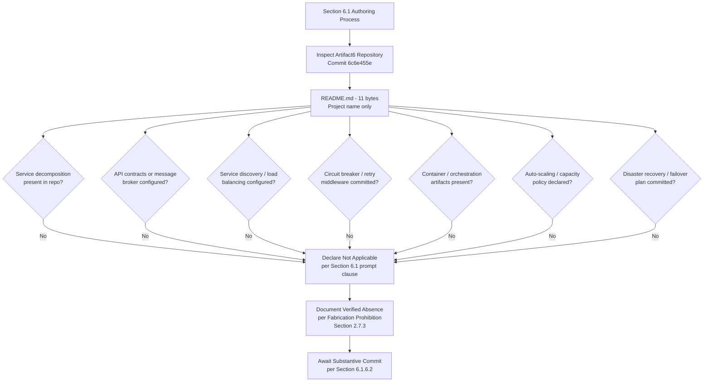

#### 6.1.5.4 Diagrams Explicitly Not Produced

The table below records, for traceability, the diagram classes requested by the Section 6.1 authoring prompt and the verified evidentiary basis on which each is excluded. This treatment is consistent with Sections 4.5.4 and 5.6.4.

| Required Diagram | Excluded Because | Authoritative Cross-Reference |
|---|---|---|
| Service interaction diagrams | No services defined; no interactions definable | Section 5.2.2; Section 1.2.2 |
| Scalability architecture diagrams | No compute platform, no scaling rules, no performance targets | Section 3.7; Section 5.5.4 |
| Resilience pattern implementations | No retry / circuit-breaker / fallback / DR artifacts | Section 5.5.2; Section 5.5.5 |

### 6.1.6 Document Status and Re-Issuance Trigger Conditions

#### 6.1.6.1 Current Document Status

This Core Services Architecture section accurately reflects the verified state of the Artifact6 repository as of the date of the sole "Initial commit" (Thursday, May 28, 2026, commit `6c6e455e3f59eb8208dcb9f11b1319b21e7cf3e5`). It establishes a baseline that, like Sections 1, 2, 3, 4, and 5, will be revised once substantive service decomposition, integration, scaling, or resilience artifacts are committed. The section is consistent with the document-status framework articulated in Section 1.4.1, which anticipates that the System Architecture and Core Services Architecture content will be constrained by the absence of committed evidence until implementation artifacts are introduced.

#### 6.1.6.2 Re-Issuance Trigger Conditions

Consistent with the re-issuance framework established in Sections 2.7.2, 3.9, 4.6.2, and 5.7.2, the following events should trigger a complete re-authoring of this Core Services Architecture section, replacing the verified-absence declaration and the per-element tables with substantive service component catalogs, scaling rules, and resilience patterns.

| Trigger Event | Required Re-Authoring Activity |
|---|---|
| First component / module / service decomposition committed (canonical source directories such as `src/`, `services/`, `internal/`) | Populate Section 6.1.2 (Service Components) with service boundaries, responsibilities, dependencies, and integration points |
| First API contract committed (OpenAPI/Swagger, GraphQL schema, gRPC `.proto`) or first message-broker configuration committed | Populate Section 6.1.2.2 (Inter-Service Communication Patterns) |
| First service registry, reverse-proxy, or service-mesh configuration committed (Consul, etcd, NGINX, Envoy, Istio) | Populate Section 6.1.2.3 (Service Discovery) and Section 6.1.2.4 (Load Balancing) |
| First retry / circuit-breaker / fallback / error-handling middleware committed | Populate Section 6.1.2.5 (Circuit Breakers) and Section 6.1.2.6 (Retry and Fallback) |
| First containerization or orchestration artifact committed (Dockerfile, Kubernetes manifests, Helm chart) | Populate Section 6.1.3.1 (Horizontal / Vertical Scaling Approach) and Section 6.1.3.3 (Resource Allocation Strategy) |
| First auto-scaling policy committed (HPA, ASG, Managed Instance Group, VM Scale Set rule) | Populate Section 6.1.3.2 (Auto-Scaling Triggers and Rules) |
| First SLA / SLO / performance budget / KPI artifact committed | Populate Section 6.1.3.4 (Performance Optimization) and Section 6.1.3.5 (Capacity Planning) |
| First disaster recovery, backup, retention, or replication plan committed | Populate Section 6.1.4.2 (Disaster Recovery) and Section 6.1.4.3 (Data Redundancy) |
| First failover, multi-AZ, multi-region, or health-check configuration committed | Populate Section 6.1.4.4 (Failover Configurations) |
| First service-degradation, feature-flag, rate-limit, or load-shedding configuration committed | Populate Section 6.1.4.5 (Service Degradation Policies) |

The recommended actions enumerated in Section 1.4.2 ("Populate substantive content," "Define stakeholders," "Establish technology baseline," "Re-issue this section") apply with equal force to this Core Services Architecture section.

#### 6.1.6.3 Assumptions and Constraints

| Assumption / Constraint | Statement |
|---|---|
| Authoring Constraint | This section was authored solely from verified repository evidence as of the date of the Initial commit (Thursday, May 28, 2026). |
| Versioning Assumption | This is Version 1.0 of Section 6.1, baselined against commit `6c6e455e3f59eb8208dcb9f11b1319b21e7cf3e5`. |
| Fabrication Prohibition | Per Section 2.7.3, no service boundary, communication pattern, discovery mechanism, load-balancing rule, circuit-breaker policy, retry strategy, scaling rule, resource allocation, performance optimization, capacity plan, fault-tolerance mechanism, disaster-recovery procedure, data-redundancy topology, failover configuration, or service-degradation policy has been inferred or imagined. |
| Default-Stack Treatment | The Default Technology Stack recorded in Section 3.1.3 (AWS, Docker, Terraform, GitHub Actions, Python, Flask, Auth0, MongoDB, Langchain, React, TypeScript, TailwindCSS, React-Native, Swift, Kotlin, Objective-C, ElectronJS) is preserved as a forward-looking candidate set but is explicitly excluded as a basis for inventing services, scaling rules, or resilience configurations in this section. |
| Diagrammatic Discipline | Only diagrams that depict verified-state relationships (Sections 6.1.5.2 and 6.1.5.3) are authored; the diagram classes enumerated in Section 6.1.5.4 (service interaction, scalability architecture, resilience pattern implementations) are explicitly omitted in compliance with Section 2.7.3. |
| Section Applicability | The non-applicability declaration in 6.1.1.1 is invoked under the explicit clause of the Section 6.1 authoring prompt that permits such a declaration when the system "does not require microservices, distributed architecture, or distinct service components." |
| Future-State Assumption | Future versions of this section will be authored once the substantive commitments enumerated in Section 6.1.6.2 (and the related artifacts referenced in Sections 1.4.2, 2.7.2, 3.9, 4.6.2, and 5.7.2) have been satisfied. |

### 6.1.7 References

#### 6.1.7.1 Repository Artifacts Examined

- `README.md` — Sole tracked file in the repository (11 bytes); contains only the single line `# Artifact6`. Establishes the pre-implementation, placeholder state on which the non-applicability declaration for Core Services Architecture rests.
- `/` (repository root) — Inspected at depth 0; confirmed to contain only `README.md` as its first-order child. No `src/`, `services/`, `internal/`, `app/`, `lib/`, `docker/`, `k8s/`, `helm/`, `terraform/`, `.github/`, or any other directory that would establish a service decomposition, integration surface, or scaling/resilience artifact.

#### 6.1.7.2 Technical Specification Sections Referenced

- **Section 1.2.1** — Establishes the verified absence of external systems, service registries, and integration surfaces.
- **Section 1.2.2** — Establishes the verified absence of components, modules, source directories, and architectural patterns.
- **Section 1.2.3** — Establishes the verified absence of measurable objectives, KPIs, SLOs, and SLAs against which capacity could be planned.
- **Section 1.3.1** — Establishes the verified absence of in-scope core features and integrations.
- **Section 1.3.4** — Provides the canonical verified-state diagram incorporated by reference in Section 6.1.5.1.
- **Section 1.4.1 / 1.4.2** — Provides the document-status framework and recommended actions that govern this section's posture.
- **Section 2.5** — Establishes the verified absence of technical constraints, performance requirements, scalability considerations, security implications, and maintenance requirements.
- **Section 2.7.3** — Records the binding Fabrication Prohibition that underwrites every "None defined" finding in this section.
- **Section 3.1.3** — Identifies the Default Technology Stack candidates and explicitly excludes them as a basis for fabrication.
- **Section 3.5.1** — Establishes the verified absence of all third-party services, including cloud platform, CDN, monitoring, auth, and messaging providers.
- **Section 3.5.3** — Establishes the verified absence of retry, circuit-breaker, rate-limit, and webhook-signing policies.
- **Section 3.6.1 / 3.6.3** — Establishes the verified absence of database engines, caching, object storage, message brokers, replication topology, and backup/DR plans.
- **Section 3.7** — Establishes the verified absence of containerization (Dockerfile), orchestration (Kubernetes/Helm), CI/CD pipelines, and infrastructure-as-code.
- **Section 4.2.2** — Establishes the verified absence of integration workflows (APIs, events, batch flows).
- **Section 4.4.2** — Establishes the verified absence of retry mechanisms, fallback processes, error-notification flows, and recovery procedures.
- **Section 4.5.4** — Establishes the precedent for documenting diagrams explicitly not produced.
- **Section 5.2.1** — Establishes the verified absence of an overall architecture style (monolithic, layered, microservices, serverless, event-driven, hexagonal).
- **Section 5.2.2** — Establishes the verified absence of core components, responsibilities, dependencies, and integration points.
- **Section 5.2.3** — Establishes the verified absence of data flows, integration patterns, transformation points, database engines, caches, and message brokers.
- **Section 5.2.4** — Establishes the verified absence of external integration points.
- **Section 5.5.1** — Establishes the verified absence of monitoring, observability, logging, and distributed tracing.
- **Section 5.5.2** — Establishes the verified absence of error-handling patterns, including retry, circuit-breaker, fallback, notification, and recovery.
- **Section 5.5.4** — Establishes the verified absence of performance budgets, SLOs, SLAs, KPIs, latency/throughput targets, and scalability considerations.
- **Section 5.5.5** — Establishes the verified absence of disaster-recovery plans, backup cadence, RPO/RTO, encryption-at-rest, and data-residency declarations.
- **Section 5.6.2 / 5.6.3 / 5.6.4** — Provides the diagrammatic precedents (verified-absence mapping, authoring decision flow, diagrams explicitly not produced) replicated in Section 6.1.5.
- **Section 5.7.2** — Provides the re-issuance trigger catalog that Section 6.1.6.2 extends and specializes for Core Services Architecture.

## 6.2 Database Design

**Database Design is not applicable to this system.**

This determination is grounded in verified repository evidence as of the sole "Initial commit" (Thursday, May 28, 2026, commit `6c6e455e3f59eb8208dcb9f11b1319b21e7cf3e5`). The Artifact6 repository contains a single tracked file — `README.md` (11 bytes) — whose entire content is the single line `# Artifact6`. As established in Section 3.6.1, no databases or storage services are configured for the Artifact6 system, and no database schema, migration directory, connection configuration, ORM model, caching infrastructure declaration, or object-storage SDK reference exists in the repository. Authoring database design content on such a foundation would constitute fabrication and is therefore deliberately withheld in compliance with the Fabrication Prohibition recorded in Section 2.7.3.

The Section 6.2 authoring prompt explicitly contemplates this case and instructs the author to declare non-applicability when "direct database or persistent storage interactions are not clearly evident." The subsections below document, with traceable evidentiary cross-references, the verified absence of every requested element under Schema Design, Data Management, Compliance Considerations, and Performance Optimization; provide the diagrammatic treatment mandated for verified-absence sections; and define the precise commit events that will trigger re-authoring of this section.

### 6.2.1 Applicability Determination

#### 6.2.1.1 Applicability Statement

Database Design — encompassing schema design (entity relationships, data models, indexing, partitioning, replication, backup architecture), data management (migrations, versioning, archival, storage/retrieval mechanisms, caching policies), compliance considerations (data retention, fault tolerance, privacy controls, audit mechanisms, access controls), and performance optimization (query optimization, caching strategy, connection pooling, read/write splitting, batch processing) — is **not applicable** for the Artifact6 system in its current verified state. There is no persistence layer, in the engineering sense of the term, against which any of these database design dimensions can be evaluated, designed, or documented.

#### 6.2.1.2 Rationale for Non-Applicability

The determination of non-applicability is supported by four categories of converging evidence drawn from prior sections of this Technical Specification. Each category is independently sufficient to compel the non-applicability declaration; together, they render the determination unambiguous.

| Evidentiary Category | Verified Finding | Authoritative Cross-Reference |
|---|---|---|
| No database engine selected | No primary database, no secondary/analytical database | Section 3.6.1 |
| No persistence artifacts present | No schema, migration, ORM, connection config, caching, or object-storage SDK | Section 3.6.2 |
| No persistence strategy documented | No consistency model, partitioning, replication, backup, or retention policy | Section 3.6.3 |
| No data requirements declared | No data domains, no entities, no data flows, no state management points | Section 2.3.3; Section 4.4.1; Section 5.2.3 |

Because Artifact6 has not committed any database engine, any schema artifact, any ORM model, any migration tool, or any caching layer, the very precondition for a Database Design — the existence of persisted state and a persistence engine to manage it — is absent from the repository. The section prompt's anticipated non-applicability clause is therefore controlling.

The Default Technology Stack recorded in Section 3.1.3 lists MongoDB as the candidate primary database; however, as expressly noted in Section 3.6.2, no `mongoose`, `pymongo`, MongoDB Atlas connection string, or `mongod.conf` artifact appears in the repository, so MongoDB cannot be recorded as the current database and cannot serve as a basis for inventing schema, indexing, replication, or backup content in this section.

#### 6.2.1.3 Authoring Methodology

This section follows the verified-absence specification methodology established in Section 2.1, applied consistently across Sections 2.5, 3.1, 4.2, 4.4, 5.2, 5.3, 5.4, and 5.5, and directly inherited from Section 6.1. The methodology consists of four disciplines:

1. **Element Enumeration.** Each database design element requested by the prompt is enumerated in tabular form so that the reader can confirm complete coverage of the prompt's four major categories.
2. **Verified-Status Marking.** Each element is marked "None defined," "None configured," "None selected," or "Not applicable" against committed evidence, never against speculation.
3. **Authoritative Cross-Referencing.** Each absence is traced to a prior, independently authored section of this Technical Specification that supplies the underlying evidence.
4. **Diagrammatic Restraint.** Diagrams are produced only where they depict the verified state. Entity-relationship diagrams, data flow diagrams, and replication architecture diagrams that would require fabrication of entities, flows, or replication topologies are explicitly declined, mirroring the precedents in Sections 4.5.4, 5.6.4, and 6.1.5.4.

### 6.2.2 Schema Design — Verified Absence

The Schema Design dimension requested by the section prompt encompasses six elements: entity relationships, data models and structures, indexing strategy, partitioning approach, replication configuration, and backup architecture. Each is verified absent and is treated below.

#### 6.2.2.1 Entity Relationships

No entity relationships can be enumerated because no entities exist in the repository. Section 3.6.2 verifies that no SQL schema definition (`schema.sql`, `*.sql` files), no ORM schema/config (`prisma/schema.prisma`, `models/`, `sequelize/` config, `entities/` for TypeORM), and no database connection configuration are present. Section 2.3.3 confirms that "data requirements: none defined," meaning no data entities, no attribute catalogs, and no relationship cardinalities have been declared.

| Entity Relationship Element | Verified Status | Authoritative Cross-Reference |
|---|---|---|
| Entity catalog (tables, collections, documents) | None defined | Section 3.6.2; Section 2.3.3 |
| Primary key / unique identifier strategy | None defined | Section 3.6.2 |
| Foreign key / relationship cardinality | None defined | Section 3.6.2 |
| Bounded-context entity ownership | Not declared | Section 5.2.1; Section 6.1.2.1 |

#### 6.2.2.2 Data Models and Structures

No data models or structures are documented. There is no logical data model, no physical data model, no schema definition language artifact (DDL, JSON Schema, Avro, Protobuf), and no document-shape specification. The verified absence of state-management documentation in Section 4.4.1 — state transitions, data persistence points, and transaction boundaries are all "None defined" — confirms that no data structures exist to be modeled.

| Data Model Element | Verified Status | Authoritative Cross-Reference |
|---|---|---|
| Logical data model | None defined | Section 3.6.2; Section 4.4.1 |
| Physical data model | None defined | Section 3.6.2 |
| Schema definition language artifact (DDL, JSON Schema, Avro, Protobuf) | None committed | Section 3.6.2 |
| Document / collection shape specification | None defined | Section 3.6.2 |

#### 6.2.2.3 Indexing Strategy

No indexing strategy is defined. Because no schema artifact has been committed (Section 3.6.2), no index declarations (B-tree, hash, GIN/GIST, geospatial, full-text), no composite index definitions, no covering index plans, and no index lifecycle (rebuild, reindex, statistics-refresh) policies can be authored. Section 3.6.3 confirms the verified absence of any documented persistence strategy.

| Indexing Element | Verified Status | Authoritative Cross-Reference |
|---|---|---|
| Index type catalog (B-tree, hash, GIN/GIST, geospatial, full-text) | None defined | Section 3.6.2; Section 3.6.3 |
| Composite / covering index definitions | None defined | Section 3.6.3 |
| Index maintenance policy | None defined | Section 3.6.3 |
| Statistics / cardinality estimation policy | None defined | Section 3.6.3 |

#### 6.2.2.4 Partitioning Approach

No partitioning approach is documented. Section 3.6.3 explicitly records "sharding / partitioning strategy: No" under Data Persistence Strategies. There are no horizontal partitioning rules (range, hash, list, composite), no vertical partitioning declarations, no shard key selections, no rebalancing policies, and no consistent-hashing schemes committed to the repository. Section 5.5.5 corroborates that no data redundancy or distribution topology exists.

| Partitioning Element | Verified Status | Authoritative Cross-Reference |
|---|---|---|
| Horizontal partitioning (sharding) strategy | None defined | Section 3.6.3; Section 5.5.5 |
| Vertical partitioning strategy | None defined | Section 3.6.3 |
| Shard key selection | None defined | Section 3.6.3 |
| Rebalancing / resharding policy | None defined | Section 3.6.3 |

#### 6.2.2.5 Replication Configuration

No replication configuration is defined. Section 3.6.3 explicitly records "replication topology: No" under Data Persistence Strategies, and Section 5.5.5 confirms that no multi-region data distribution, no replica topology, and no read-replica configuration have been committed. There are no primary-replica designations, no synchronous/asynchronous replication mode selections, no replication lag tolerance bounds, and no replica promotion procedures.

| Replication Element | Verified Status | Authoritative Cross-Reference |
|---|---|---|
| Replication topology (primary-replica, multi-primary, chain) | None configured | Section 3.6.3; Section 5.5.5 |
| Synchronous vs. asynchronous replication mode | None selected | Section 3.6.3 |
| Replication lag tolerance / SLO | None defined | Section 5.5.4; Section 5.5.5 |
| Replica promotion / failover procedure | None defined | Section 5.5.5 |

#### 6.2.2.6 Backup Architecture

No backup architecture is committed. Section 3.6.1 records "backup / disaster-recovery plan: none defined." Section 5.5.5 confirms the verified absence of every backup-related artifact: no backup cadence/retention policy, no Recovery Point Objective (RPO), no Recovery Time Objective (RTO), no encryption-at-rest configuration, and no data-residency declaration. There are no full/incremental/differential backup schedules, no point-in-time recovery (PITR) configurations, and no offsite or cross-region backup destinations.

| Backup Architecture Element | Verified Status | Authoritative Cross-Reference |
|---|---|---|
| Backup tier (full, incremental, differential) | None defined | Section 3.6.1; Section 5.5.5 |
| Backup cadence and schedule | None defined | Section 3.6.3; Section 5.5.5 |
| Point-in-time recovery (PITR) configuration | None defined | Section 5.5.5 |
| Offsite / cross-region backup destination | None defined | Section 5.5.5 |
| Encryption-at-rest of backup media | None defined | Section 3.6.3; Section 5.5.5 |

### 6.2.3 Data Management — Verified Absence

The Data Management dimension requested by the section prompt encompasses five elements: migration procedures, versioning strategy, archival policies, data storage and retrieval mechanisms, and caching policies. Each is verified absent and is treated below.

#### 6.2.3.1 Migration Procedures

No migration procedures are defined. As established in Section 3.6.2, no migration directory (`migrations/`, `alembic/`, `prisma/migrations/`, `db/migrate/` for Rails, `flyway/`, `liquibase/`) is present in the repository. There is no migration tool selection, no migration runner configuration, no rollback procedure, and no schema-evolution policy.

| Migration Element | Verified Status | Authoritative Cross-Reference |
|---|---|---|
| Migration tool selection (Alembic, Flyway, Liquibase, Prisma, Knex) | None present | Section 3.6.2 |
| Migration directory / scripts | None present | Section 3.6.2 |
| Forward / rollback migration policy | None defined | Section 3.6.2 |
| Migration execution procedure (CI-driven, runtime, manual) | None defined | Section 3.6.2; Section 3.7 |

#### 6.2.3.2 Versioning Strategy

No schema versioning strategy is defined. Because no schema artifact has been committed (Section 3.6.2), there is no schema version catalog, no version-tagging convention, no backward/forward compatibility policy, and no schema deprecation procedure. The repository is at a single Initial commit (Section 1.1.1); even the application-level versioning baseline necessary to anchor a schema-versioning scheme is undefined.

| Versioning Element | Verified Status | Authoritative Cross-Reference |
|---|---|---|
| Schema version catalog | None defined | Section 3.6.2 |
| Version tagging / numbering convention | None defined | Section 3.6.2 |
| Backward / forward compatibility policy | None defined | Section 3.6.2 |
| Schema deprecation procedure | None defined | Section 3.6.2 |

#### 6.2.3.3 Archival Policies

No archival policies are defined. Section 3.6.3 explicitly records "data-retention / GDPR-erasure policy: No," and Section 5.5.5 confirms the verified absence of any GDPR/data-retention policy. There is no cold-storage tier definition, no archival cadence, no archival data format, no restore-from-archive procedure, and no data-lifecycle automation.

| Archival Element | Verified Status | Authoritative Cross-Reference |
|---|---|---|
| Cold-storage tier definition | None defined | Section 3.6.3; Section 5.5.5 |
| Archival cadence and triggers | None defined | Section 3.6.3 |
| Archival data format | None defined | Section 3.6.3 |
| Restore-from-archive procedure | None defined | Section 5.5.5 |
| Data-lifecycle automation | None defined | Section 3.6.3 |

#### 6.2.3.4 Data Storage and Retrieval Mechanisms

No data storage and retrieval mechanisms are defined. As established in Section 3.6.1, no primary database engine, no secondary/analytical database, no object/blob storage, and no file-system storage strategy is configured. Section 4.4.1 confirms that no data persistence points exist in the system, and Section 5.2.3 confirms the verified absence of data flows and transformation points. Without a storage layer and without data flows traversing such a layer, no retrieval mechanism (query interface, repository pattern, data-access object, GraphQL resolver, REST endpoint backed by a store) can be specified.

| Storage / Retrieval Element | Verified Status | Authoritative Cross-Reference |
|---|---|---|
| Storage engine selection | None selected | Section 3.6.1 |
| Data-access pattern (repository, DAO, active record) | None defined | Section 3.6.2; Section 4.4.1 |
| Query interface (SQL, NoSQL API, ORM-mediated) | None defined | Section 3.6.2 |
| Persistence points / write paths | None defined | Section 4.4.1 |
| Retrieval / read paths | None defined | Section 4.4.1; Section 5.2.3 |

#### 6.2.3.5 Caching Policies

No caching policies are defined. Section 3.6.1 records "caching layer: none configured," and Section 3.6.2 verifies the absence of any caching configuration (`redis.conf`, `memcached.conf`, in-app cache wiring). Section 4.4.1 confirms that "caching requirements: None defined," and Section 5.4.2 records that no caching strategy justification has been documented.

| Caching Policy Element | Verified Status | Authoritative Cross-Reference |
|---|---|---|
| Cache engine selection (Redis, Memcached, in-process) | None configured | Section 3.6.1; Section 3.6.2 |
| Cache topology (sidecar, distributed, edge) | None configured | Section 3.6.2 |
| Cache invalidation policy (TTL, write-through, write-behind) | None defined | Section 4.4.1; Section 5.4.2 |
| Cache key namespace convention | None defined | Section 3.6.2 |

### 6.2.4 Compliance Considerations — Verified Absence

The Compliance Considerations dimension requested by the section prompt encompasses five elements: data retention rules, backup and fault tolerance policies, privacy controls, audit mechanisms, and access controls. Each is verified absent and is treated below.

#### 6.2.4.1 Data Retention Rules

No data retention rules are defined. Section 3.6.3 explicitly records "data-retention / GDPR-erasure policy: No," and Section 5.5.5 confirms that no GDPR/data-retention policy has been committed. There are no retention windows by data class, no minimum-retention legal-hold definitions, no right-to-be-forgotten procedures, and no automated retention enforcement.

| Data Retention Element | Verified Status | Authoritative Cross-Reference |
|---|---|---|
| Retention window by data class | None defined | Section 3.6.3; Section 5.5.5 |
| Legal-hold / minimum-retention policy | None defined | Section 3.6.3 |
| Right-to-be-forgotten / erasure procedure | None defined | Section 3.6.3; Section 5.5.5 |
| Automated retention enforcement | None defined | Section 3.6.3 |

#### 6.2.4.2 Backup and Fault Tolerance Policies

No backup or fault tolerance policies are committed. As established in Section 3.6.1 and Section 5.5.5, no backup/disaster-recovery plan, no backup cadence/retention policy, no Recovery Point Objective (RPO), and no Recovery Time Objective (RTO) are defined. Section 6.1.4.3 confirms that no replication topology, multi-region distribution, or sharding strategy provides data redundancy.

| Backup / Fault Tolerance Element | Verified Status | Authoritative Cross-Reference |
|---|---|---|
| Backup / disaster-recovery plan | None defined | Section 3.6.1; Section 5.5.5 |
| Recovery Point Objective (RPO) | None defined | Section 5.5.5 |
| Recovery Time Objective (RTO) | None defined | Section 5.5.5 |
| Data redundancy topology | None configured | Section 5.5.5; Section 6.1.4.3 |

#### 6.2.4.3 Privacy Controls

No privacy controls are defined. Section 3.6.3 records "encryption-at-rest configuration: No," and Section 5.5.5 confirms the same. There is no field-level encryption policy, no tokenization or pseudonymization configuration, no key management service (KMS) integration, no data classification taxonomy, and no Personally Identifiable Information (PII) inventory. Section 3.5.3 records that no data-residency constraints have been declared.

| Privacy Control Element | Verified Status | Authoritative Cross-Reference |
|---|---|---|
| Encryption-at-rest configuration | None defined | Section 3.6.3; Section 5.5.5 |
| Field-level encryption / tokenization | None defined | Section 3.6.3 |
| Key management service (KMS) integration | None configured | Section 3.5.1; Section 3.6.3 |
| Data classification taxonomy | None defined | Section 3.6.3 |
| Personally Identifiable Information (PII) inventory | None defined | Section 2.3.3; Section 3.6.3 |
| Data residency constraints | None defined | Section 3.5.3; Section 5.5.5 |

#### 6.2.4.4 Audit Mechanisms

No audit mechanisms are committed. As established in Section 5.5.1, no monitoring/observability platform, no logging library/strategy, no distributed tracing strategy, and no error-tracking service is configured. Without these foundational observability primitives, no database-level audit trail (change data capture, audit tables, write-ahead log shipping for audit) can be defined; the artifacts on which audit mechanisms are normally built do not exist.

| Audit Element | Verified Status | Authoritative Cross-Reference |
|---|---|---|
| Database audit log configuration | None defined | Section 3.6.2; Section 5.5.1 |
| Change data capture (CDC) configuration | None configured | Section 3.6.2; Section 5.5.1 |
| Audit table / immutable-log strategy | None defined | Section 3.6.2 |
| Audit retention and review policy | None defined | Section 3.6.3; Section 5.5.1 |

#### 6.2.4.5 Access Controls

No access controls are defined. Section 5.5.3 records the verified absence of any authentication or authorization framework: no identity provider configuration, no authentication scheme (OAuth, OIDC, SAML, API key, mTLS), no authorization model (RBAC, ABAC, ACL), and no authorization checkpoints. By transitive consequence, no database-level access controls — such as least-privilege role definitions, row-level security policies, or column-level access grants — can be specified.

| Access Control Element | Verified Status | Authoritative Cross-Reference |
|---|---|---|
| Database role / privilege model | None defined | Section 5.5.3; Section 3.6.2 |
| Row-level security (RLS) policy | None defined | Section 5.5.3 |
| Column-level access grants | None defined | Section 5.5.3 |
| Service-account credential rotation policy | None defined | Section 5.5.3 |
| Network-level database access control (VPC, security group) | None defined | Section 3.5.1; Section 3.7 |

### 6.2.5 Performance Optimization — Verified Absence

The Performance Optimization dimension requested by the section prompt encompasses five elements: query optimization patterns, caching strategy, connection pooling, read/write splitting, and batch processing approach. Each is verified absent and is treated below.

#### 6.2.5.1 Query Optimization Patterns

No query optimization patterns are defined. Because no query interface exists in the repository (Section 3.6.2), no execution-plan analysis policy, no query rewriting heuristics, no materialized view definitions, no covering index strategy, and no query timeout configurations have been authored. Section 5.5.4 records the verified absence of all latency and throughput targets against which query optimization could be evaluated.

| Query Optimization Element | Verified Status | Authoritative Cross-Reference |
|---|---|---|
| Execution-plan analysis policy | None defined | Section 3.6.2; Section 5.5.4 |
| Materialized view / pre-aggregation strategy | None defined | Section 3.6.2 |
| Covering / partial index strategy | None defined | Section 3.6.2 |
| Query timeout / cancellation policy | None defined | Section 5.5.4 |
| Latency / throughput targets for queries | None defined | Section 5.5.4 |

#### 6.2.5.2 Caching Strategy

No caching strategy is defined. As recorded in Section 6.2.3.5 above (and corroborated by Section 3.6.1, Section 4.4.1, and Section 5.4.2), no cache engine is selected, no cache topology is configured, and no cache invalidation policy has been authored. The verified absence is comprehensive across the operational, architectural, and decisional axes of caching.

| Caching Strategy Element | Verified Status | Authoritative Cross-Reference |
|---|---|---|
| Cache layer placement (client, edge, application, database) | None defined | Section 3.6.1; Section 5.4.2 |
| Cache-aside vs. read-through vs. write-through pattern | None defined | Section 4.4.1; Section 5.4.2 |
| Cache eviction policy (LRU, LFU, FIFO, TTL) | None defined | Section 3.6.2 |
| Cache warming strategy | None defined | Section 3.6.2 |

#### 6.2.5.3 Connection Pooling

No connection pooling is configured. As established in Section 3.6.2, no database connection configuration is present in the repository — there is no `database.yml` (Rails), no `.env` DB URLs, no `knexfile.js`, no `mongoose` configuration, and no `pymongo` connection string. Without a base connection configuration, no pool size, no pool acquisition timeout, no idle-connection eviction policy, and no transaction-pooling vs. session-pooling mode (e.g., PgBouncer modes) can be specified.

| Connection Pooling Element | Verified Status | Authoritative Cross-Reference |
|---|---|---|
| Pool implementation selection (HikariCP, pgbouncer, mongoose pool) | None configured | Section 3.6.2 |
| Pool size (min, max, target) | None defined | Section 3.6.2 |
| Acquisition timeout / wait queue policy | None defined | Section 3.6.2 |
| Idle connection eviction policy | None defined | Section 3.6.2 |

#### 6.2.5.4 Read/Write Splitting

No read/write splitting is configured. Because no replication topology has been committed (Section 3.6.3; Section 5.5.5; Section 6.2.2.5), there is no primary/replica routing rule, no read-after-write consistency policy, no replica selection strategy (round-robin, latency-based, geo-affinity), and no client-side or proxy-side splitting layer (e.g., ProxySQL, MaxScale, application-level read replicas).

| Read/Write Splitting Element | Verified Status | Authoritative Cross-Reference |
|---|---|---|
| Primary / replica routing configuration | None configured | Section 3.6.3; Section 6.2.2.5 |
| Read-after-write consistency policy | None defined | Section 3.6.3 |
| Replica selection algorithm | None defined | Section 3.6.3 |
| Splitting layer (proxy, driver, application-level) | None configured | Section 3.6.3 |

#### 6.2.5.5 Batch Processing Approach

No batch processing approach is defined. As established in Section 4.2.2 and Section 6.1.3.4, no asynchronous or background processing is implemented, and no batch processing framework, job scheduler, ETL/ELT pipeline (Airflow, Luigi, Prefect, Dagster), or queue-based worker (Celery, Sidekiq, BullMQ) is configured. There are no bulk-load tools, no chunking policies, and no batch-window definitions.

| Batch Processing Element | Verified Status | Authoritative Cross-Reference |
|---|---|---|
| Batch framework / scheduler (Airflow, Luigi, Prefect, Dagster, cron) | None configured | Section 4.2.2; Section 3.5.1 |
| Queue-based worker (Celery, Sidekiq, BullMQ) | None configured | Section 4.2.2; Section 6.1.3.4 |
| Bulk-load / chunked-write policy | None defined | Section 4.2.2 |
| Batch window / SLA | None defined | Section 5.5.4 |

### 6.2.6 Required Diagrams

The Section 6.2 authoring prompt requires three diagram classes: database schema diagrams (ERD), data flow diagrams, and replication architecture diagrams. Per the verified-absence methodology and the Fabrication Prohibition recorded in Section 2.7.3, none of these diagrams can be honestly authored from committed evidence — each would require the invention of entities, data flows, or replication topologies that the repository does not contain. In place of fabricated content, this section provides (a) incorporation by reference of the canonical verified-state diagram in Section 1.3.4, (b) an original Mermaid diagram mapping each Section 6.2 sub-area to its verified-absence finding, (c) an authoring-decision-flow diagram, and (d) a traceability table for the diagram classes explicitly not produced. This treatment mirrors the precedents established in Sections 4.5, 5.6, and 6.1.5.

#### 6.2.6.1 Canonical Verified-State Diagram — Incorporation by Reference

The Mermaid verified-state diagram authored in Section 1.3.4 serves as the canonical visual representation of the gap between the single established fact (the project name "Artifact6") and the broader specification elements that remain undefined, including all database design elements requested by this section. That diagram is incorporated here by reference and remains the structural anchor for every "None defined," "None configured," or "None selected" finding tabulated in Sections 6.2.2, 6.2.3, 6.2.4, and 6.2.5.

#### 6.2.6.2 Section 6.2 Verified-Absence Mapping Diagram

The supplementary diagram below maps each Section 6.2 sub-area (Schema Design, Data Management, Compliance Considerations, Performance Optimization) and each constituent element to its verified-absence finding, to the binding Fabrication Prohibition (Section 2.7.3), and to the re-issuance trigger conditions defined in Section 6.2.7.2. It mirrors the structural pattern established in Sections 5.6.2, 4.5.2, 3.8, and 6.1.5.2 and re-uses the same anchor node (the Artifact6 repository) so that readers may trace database design absences back to their evidentiary basis.

```mermaid
flowchart TD
    Repo[Artifact6 Repository<br/>1 commit, 1 file, 11 bytes]
    Readme[README.md<br/>Heading: # Artifact6]

    subgraph SchemaDesign[Schema Design - Section 6.2.2]
        SD1[Entity Relationships<br/>None defined]
        SD2[Data Models / Structures<br/>None defined]
        SD3[Indexing Strategy<br/>None defined]
        SD4[Partitioning Approach<br/>None defined]
        SD5[Replication Configuration<br/>None configured]
        SD6[Backup Architecture<br/>None defined]
    end

    subgraph DataManagement[Data Management - Section 6.2.3]
        DM1[Migration Procedures<br/>None present]
        DM2[Versioning Strategy<br/>None defined]
        DM3[Archival Policies<br/>None defined]
        DM4[Storage / Retrieval<br/>None defined]
        DM5[Caching Policies<br/>None configured]
    end

    subgraph Compliance[Compliance Considerations - Section 6.2.4]
        CO1[Data Retention Rules<br/>None defined]
        CO2[Backup / Fault Tolerance<br/>None defined]
        CO3[Privacy Controls<br/>None defined]
        CO4[Audit Mechanisms<br/>None defined]
        CO5[Access Controls<br/>None defined]
    end

    subgraph PerformanceOpt[Performance Optimization - Section 6.2.5]
        PO1[Query Optimization<br/>None defined]
        PO2[Caching Strategy<br/>None defined]
        PO3[Connection Pooling<br/>None configured]
        PO4[Read / Write Splitting<br/>None configured]
        PO5[Batch Processing<br/>None configured]
    end

    Fab[Fabrication Prohibition<br/>Section 2.7.3]
    Verified[Verified Absence<br/>Database Design<br/>Not Applicable]
    Trigger[Re-Issuance Trigger<br/>Commit Schema / Migration / Cache /<br/>Replication / Backup Artifacts<br/>per Section 6.2.7.2]

    Repo --> Readme
    Repo --> SD1
    Repo --> SD2
    Repo --> SD3
    Repo --> SD4
    Repo --> SD5
    Repo --> SD6
    Repo --> DM1
    Repo --> DM2
    Repo --> DM3
    Repo --> DM4
    Repo --> DM5
    Repo --> CO1
    Repo --> CO2
    Repo --> CO3
    Repo --> CO4
    Repo --> CO5
    Repo --> PO1
    Repo --> PO2
    Repo --> PO3
    Repo --> PO4
    Repo --> PO5

    SD1 --> Verified
    SD2 --> Verified
    SD3 --> Verified
    SD4 --> Verified
    SD5 --> Verified
    SD6 --> Verified
    DM1 --> Verified
    DM2 --> Verified
    DM3 --> Verified
    DM4 --> Verified
    DM5 --> Verified
    CO1 --> Verified
    CO2 --> Verified
    CO3 --> Verified
    CO4 --> Verified
    CO5 --> Verified
    PO1 --> Verified
    PO2 --> Verified
    PO3 --> Verified
    PO4 --> Verified
    PO5 --> Verified

    Fab --> Verified
    Verified --> Trigger
```

#### 6.2.6.3 Authoring Decision Flow for Database Design

The diagram below depicts the authoring-decision flow that governed each sub-area of this section. It mirrors the structural patterns established in Sections 2.1.3, 4.5.3, 5.6.3, and 6.1.5.3 and makes explicit the evidence-presence determination that produced a "None defined" finding for every requested database-design element. The flow demonstrates that the non-applicability declaration is not a stylistic choice but a deterministic outcome of the verified repository contents.

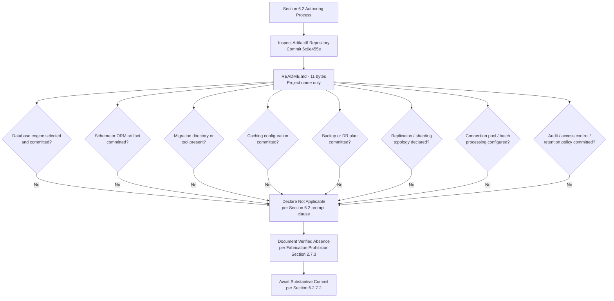

#### 6.2.6.4 Diagrams Explicitly Not Produced

The table below records, for traceability, the diagram classes requested by the Section 6.2 authoring prompt and the verified evidentiary basis on which each is excluded. This treatment is consistent with Sections 4.5.4, 5.6.4, and 6.1.5.4.

| Required Diagram | Excluded Because | Authoritative Cross-Reference |
|---|---|---|
| Database schema diagram (ERD) | No entities, attributes, or relationships defined | Section 3.6.2; Section 2.3.3 |
| Data flow diagram | No data flows, no transformation points, no persistence points | Section 5.2.3; Section 4.4.1 |
| Replication architecture diagram | No replication topology, no replica designation, no multi-region distribution | Section 3.6.3; Section 5.5.5 |

### 6.2.7 Document Status and Re-Issuance Trigger Conditions

#### 6.2.7.1 Current Document Status

This Database Design section accurately reflects the verified state of the Artifact6 repository as of the date of the sole "Initial commit" (Thursday, May 28, 2026, commit `6c6e455e3f59eb8208dcb9f11b1319b21e7cf3e5`). It establishes a baseline that, like Sections 1, 2, 3, 4, 5, and 6.1, will be revised once substantive database engine selection, schema definition, migration tooling, caching configuration, backup architecture, or replication topology artifacts are committed. The section is consistent with the document-status framework articulated in Section 1.4.1, which anticipates that the System Architecture and persistence-related content will be constrained by the absence of committed evidence until implementation artifacts are introduced.

#### 6.2.7.2 Re-Issuance Trigger Conditions

Consistent with the re-issuance framework established in Sections 2.7.2, 3.9, 4.6.2, 5.7.2, and 6.1.6.2, the following events should trigger a complete re-authoring of this Database Design section, replacing the verified-absence declaration and the per-element tables with substantive schema designs, data management procedures, compliance controls, and performance optimization policies.

| Trigger Event | Required Re-Authoring Activity |
|---|---|
| First database engine selection committed (Mongo connection string, PostgreSQL DSN, MySQL config, SQLite file, DynamoDB SDK) | Populate Section 6.2.2 (Schema Design) with engine selection rationale and downstream schema content |
| First schema artifact committed (SQL DDL, `prisma/schema.prisma`, ORM model classes, JSON Schema, Avro/Protobuf) | Populate Section 6.2.2.1 (Entity Relationships) and Section 6.2.2.2 (Data Models and Structures) |
| First index declaration committed (CREATE INDEX statements, ORM `@Index` decorators, MongoDB index specifications) | Populate Section 6.2.2.3 (Indexing Strategy) and Section 6.2.5.1 (Query Optimization Patterns) |
| First partitioning or sharding configuration committed | Populate Section 6.2.2.4 (Partitioning Approach) |
| First replication or read-replica configuration committed | Populate Section 6.2.2.5 (Replication Configuration) and Section 6.2.5.4 (Read/Write Splitting) |
| First backup, retention, or disaster-recovery plan committed | Populate Section 6.2.2.6 (Backup Architecture) and Section 6.2.4.2 (Backup and Fault Tolerance Policies) |
| First migration directory or tool committed (Alembic, Flyway, Liquibase, Prisma migrations, Knex migrations, Rails `db/migrate/`) | Populate Section 6.2.3.1 (Migration Procedures) and Section 6.2.3.2 (Versioning Strategy) |
| First archival or data-lifecycle automation committed | Populate Section 6.2.3.3 (Archival Policies) |
| First caching configuration committed (Redis, Memcached, in-process cache wiring) | Populate Section 6.2.3.5 (Caching Policies) and Section 6.2.5.2 (Caching Strategy) |
| First connection configuration / pool committed (HikariCP, PgBouncer, mongoose pool, SQLAlchemy engine config) | Populate Section 6.2.5.3 (Connection Pooling) |
| First batch processing framework or job scheduler committed (Airflow, Celery, Sidekiq, cron jobs) | Populate Section 6.2.5.5 (Batch Processing Approach) |
| First encryption-at-rest configuration or KMS reference committed | Populate Section 6.2.4.3 (Privacy Controls) |
| First database audit log, CDC stream, or immutable-log configuration committed | Populate Section 6.2.4.4 (Audit Mechanisms) |
| First database-level RBAC, IAM policy, row-level-security policy, or service-account credential configuration committed | Populate Section 6.2.4.5 (Access Controls) |
| First data-retention rule, legal-hold policy, or GDPR-erasure procedure committed | Populate Section 6.2.4.1 (Data Retention Rules) |

The recommended actions enumerated in Section 1.4.2 ("Populate substantive content," "Define stakeholders," "Establish technology baseline," "Re-issue this section") apply with equal force to this Database Design section.

#### 6.2.7.3 Assumptions and Constraints

| Assumption / Constraint | Statement |
|---|---|
| Authoring Constraint | This section was authored solely from verified repository evidence as of the date of the Initial commit (Thursday, May 28, 2026). |
| Versioning Assumption | This is Version 1.0 of Section 6.2, baselined against commit `6c6e455e3f59eb8208dcb9f11b1319b21e7cf3e5`. |
| Fabrication Prohibition | Per Section 2.7.3, no database engine, schema entity, data model, index, partition, replication topology, backup procedure, migration, versioning scheme, archival policy, caching configuration, retention rule, encryption policy, audit mechanism, access control, query optimization pattern, connection pool, read/write splitting rule, or batch processing approach has been inferred or imagined. |
| Default-Stack Treatment | MongoDB, recorded in Section 3.1.3 as a Default Technology Stack candidate, is preserved as a forward-looking candidate but is explicitly excluded as a basis for inventing schema, indexing, replication, backup, or any other database design content in this section, in accordance with the verified absence recorded in Section 3.6.2. |
| Diagrammatic Discipline | Only diagrams that depict verified-state relationships (Sections 6.2.6.2 and 6.2.6.3) are authored; the diagram classes enumerated in Section 6.2.6.4 (database schema/ERD, data flow, replication architecture) are explicitly omitted in compliance with Section 2.7.3. |
| Section Applicability | The non-applicability declaration in 6.2.1.1 is invoked under the explicit clause of the Section 6.2 authoring prompt that permits such a declaration when "direct database or persistent storage interactions are not clearly evident." |
| Future-State Assumption | Future versions of this section will be authored once the substantive commitments enumerated in Section 6.2.7.2 (and the related artifacts referenced in Sections 1.4.2, 2.7.2, 3.9, 4.6.2, 5.7.2, and 6.1.6.2) have been satisfied. |

### 6.2.8 References

#### 6.2.8.1 Repository Artifacts Examined

- `README.md` — Sole tracked file in the repository (11 bytes); contains only the single line `# Artifact6`. Establishes the pre-implementation, placeholder state on which the non-applicability declaration for Database Design rests.
- `/` (repository root) — Inspected at depth 0; confirmed to contain only `README.md` as its first-order child. No `migrations/`, `db/`, `schemas/`, `sql/`, `models/`, `entities/`, `prisma/`, `alembic/`, `flyway/`, `liquibase/`, or any other directory that would establish a database schema, persistence layer, migration toolchain, or caching configuration.

#### 6.2.8.2 Technical Specification Sections Referenced

- **Section 1.1.1** — Establishes the verified pre-implementation lifecycle stage and baseline commit details on which the non-applicability declaration is anchored.
- **Section 1.2.2** — Establishes the verified absence of components, modules, source directories, and architectural patterns relevant to a persistence layer.
- **Section 1.2.3** — Establishes the verified absence of measurable objectives, KPIs, SLOs, and SLAs against which database performance could be planned.
- **Section 1.3.4** — Provides the canonical verified-state diagram incorporated by reference in Section 6.2.6.1.
- **Section 1.4.1 / 1.4.2** — Provides the document-status framework and recommended actions that govern this section's posture.
- **Section 2.3.3** — Establishes the verified absence of declared data requirements, data entities, and data domains.
- **Section 2.7.2** — Provides the re-issuance trigger framework that Section 6.2.7.2 extends and specializes for Database Design.
- **Section 2.7.3** — Records the binding Fabrication Prohibition that underwrites every "None defined" / "None configured" / "None selected" finding in this section.
- **Section 3.1.3** — Identifies the Default Technology Stack candidates (including MongoDB) and explicitly excludes them as a basis for fabrication.
- **Section 3.5.1 / 3.5.3** — Establishes the verified absence of third-party services, including managed databases, identity providers, KMS, and data-residency declarations.
- **Section 3.6.1** — Primary authoritative source: establishes the verified absence of every database / storage dimension (primary engine, secondary database, caching, message broker, object storage, file-system strategy, backup plan).
- **Section 3.6.2** — Primary authoritative source: establishes the verified absence of every persistence artifact (SQL schema, migrations, ORM, connection configuration, caching configuration, object-storage SDK, search-engine configuration); explicitly excludes MongoDB as the current database.
- **Section 3.6.3** — Primary authoritative source: establishes the verified absence of every persistence strategy dimension (consistency model, sharding, replication, backup cadence, encryption-at-rest, retention).
- **Section 3.7** — Establishes the verified absence of containerization, orchestration, CI/CD, and infrastructure-as-code artifacts relevant to database deployment and migration execution.
- **Section 3.9** — Provides the re-issuance trigger pattern adopted in Section 6.2.7.2 for database commitments.
- **Section 4.2.2** — Establishes the verified absence of integration workflows, batch flows, and asynchronous processing.
- **Section 4.4.1** — Establishes the verified absence of state transitions, data persistence points, caching requirements, and transaction boundaries.
- **Section 4.5.4** — Provides the precedent for documenting diagrams explicitly not produced, replicated in Section 6.2.6.4.
- **Section 4.6.2** — Provides the re-issuance trigger framework that Section 6.2.7.2 extends.
- **Section 5.2.1** — Establishes the verified absence of an overall architecture style relevant to persistence patterns.
- **Section 5.2.3** — Establishes the verified absence of data flows, transformation points, primary database engine, caching layer, and message broker / event store.
- **Section 5.3.1** — Establishes the verified absence of component-level data persistence requirements.
- **Section 5.4.2** — Establishes the verified absence of data storage, caching, and security technical decisions and rationale.
- **Section 5.5.1** — Establishes the verified absence of monitoring, observability, logging, and tracing artifacts on which audit mechanisms would normally be built.
- **Section 5.5.3** — Establishes the verified absence of authentication and authorization framework on which database access controls would normally be built.
- **Section 5.5.4** — Establishes the verified absence of performance budgets, SLOs, SLAs, KPIs, and latency/throughput targets against which database performance could be optimized.
- **Section 5.5.5** — Primary authoritative source: establishes the verified absence of disaster recovery, backup cadence, RPO/RTO, encryption-at-rest, data-residency, and GDPR/data-retention policy.
- **Section 5.6.2 / 5.6.3 / 5.6.4** — Provides the diagrammatic precedents (verified-absence mapping, authoring decision flow, diagrams explicitly not produced) replicated in Section 6.2.6.
- **Section 5.7.2** — Provides the re-issuance trigger catalog that Section 6.2.7.2 extends and specializes for Database Design.
- **Section 6.1** — Direct structural precedent for Section 6; establishes the "Not Applicable" declaration pattern for top-level Section 6 subsections.
- **Section 6.1.4.3** — Establishes the verified absence of data redundancy, replication topology, multi-region distribution, and backup cadence directly cross-referenced in Section 6.2.4.2.
- **Section 6.1.5.1 / 6.1.5.2 / 6.1.5.3 / 6.1.5.4** — Direct diagrammatic precedent for Section 6.2.6, including the canonical verified-state reference, verified-absence mapping diagram pattern, authoring-decision-flow diagram pattern, and "Diagrams Explicitly Not Produced" table pattern.
- **Section 6.1.6.2** — Direct re-issuance trigger catalog precedent for Section 6.2.7.2.

## 6.3 Integration Architecture

**Integration Architecture is not applicable for this system.**

This determination is grounded in verified repository evidence as of the sole "Initial commit" (Thursday, May 28, 2026, commit `6c6e455e3f59eb8208dcb9f11b1319b21e7cf3e5`). The Artifact6 repository contains a single tracked file — `README.md` (11 bytes) — whose entire content is the single line `# Artifact6`. As established in Section 1.2.1, "no integration documentation, dependency declarations, API contracts, message-bus configurations, service registries, identity-provider configurations, or enterprise architecture artifacts are present. The project, as currently committed, has no defined relationships with any external system." As established in Section 3.5.1, "no third-party services are integrated with the Artifact6 system." As established in Section 4.2.2, no data flow between systems, no API interactions, no event processing flows, and no batch processing sequences are defined. Authoring integration architecture content on such a foundation would constitute fabrication and is therefore deliberately and disciplinarily withheld in compliance with the Fabrication Prohibition recorded in Section 2.7.3.

The Section 6.3 authoring prompt explicitly contemplates this case and instructs the author to declare non-applicability when "the system does not require integration with external systems or services." The subsections below document, with traceable evidentiary cross-references, the verified absence of every requested element under API Design, Message Processing, and External Systems; provide the diagrammatic treatment mandated for verified-absence sections; and define the precise commit events that will trigger re-authoring of this section. The structural pattern is directly inherited from Sections 6.1 (Core Services Architecture) and 6.2 (Database Design), both of which declared non-applicability with full evidentiary backing.

### 6.3.1 Applicability Determination

#### 6.3.1.1 Applicability Statement

Integration Architecture — encompassing API design (protocol specifications, authentication methods, authorization framework, rate limiting strategy, versioning approach, documentation standards), message processing (event processing patterns, message queue architecture, stream processing design, batch processing flows, error handling strategy), and external systems (third-party integration patterns, legacy system interfaces, API gateway configuration, external service contracts) — is **not applicable** for the Artifact6 system in its current verified state. There is no integration surface, in the engineering sense of the term, against which any of these integration architecture dimensions can be evaluated, designed, or documented.

#### 6.3.1.2 Rationale for Non-Applicability

The determination of non-applicability is supported by five categories of converging evidence drawn from prior sections of this Technical Specification. Each category is independently sufficient to compel the non-applicability declaration; together, they render the determination unambiguous.

| Evidentiary Category | Verified Finding | Authoritative Cross-Reference |
|---|---|---|
| No external system relationships | No integration documentation, dependency declarations, API contracts, message-bus configurations, service registries, or identity-provider configurations | Section 1.2.1 |
| No third-party services integrated | External APIs, identity providers, payment processors, messaging services, monitoring platforms, error tracking, analytics, cloud platforms, and CDNs all verified absent | Section 3.5.1; Section 3.5.2 |
| No integration workflows defined | Data flow between systems, API interactions, event processing flows, and batch processing sequences all verified absent | Section 4.2.2 |
| No external integration points | External integration points table cannot be populated; no system name, integration type, data exchange pattern, protocol/format, or SLA requirement enumerable | Section 5.2.4 |
| No legacy system context | No predecessor system, no migration path, no compatibility layer, no references to existing systems | Section 1.2.1 |

Because Artifact6 has not committed any external API client, any message broker configuration, any third-party SDK reference, any webhook handler, any authentication or authorization configuration, or any API gateway artifact, the very precondition for an Integration Architecture — the existence of one or more external systems or services with which the application must interoperate — is absent from the repository. The section prompt's anticipated non-applicability clause is therefore controlling.

The Default Technology Stack recorded in Section 3.1.3 lists AWS as the candidate cloud platform, Auth0 as the candidate identity provider, Flask as the candidate REST API framework, and Langchain as a candidate AI integration framework. However, as expressly noted in Section 3.5.2, no AWS SDK configuration, no Auth0 tenant configuration, no OAuth client secrets, no JWT signing keys, no Python manifest declaring Flask or Langchain, and no environment-variable templates referencing any of these services appear in the repository. Accordingly, none of these candidates can be recorded as constituting the current integration architecture and none can serve as a basis for inventing protocol selections, authentication schemes, rate limits, or third-party integration patterns in this section.

#### 6.3.1.3 Authoring Methodology

This section follows the verified-absence specification methodology established in Section 2.1, applied consistently across Sections 2.5, 3.1, 4.2, 4.4, 5.2, 5.3, 5.4, and 5.5, and directly inherited from Sections 6.1 and 6.2. The methodology consists of four disciplines:

1. **Element Enumeration.** Each integration architecture element requested by the prompt is enumerated in tabular form so that the reader can confirm complete coverage of the prompt's three major categories (API Design, Message Processing, External Systems) and their constituent elements.
2. **Verified-Status Marking.** Each element is marked "None defined," "None configured," "None integrated," "None committed," or "Not applicable" against committed evidence, never against speculation.
3. **Authoritative Cross-Referencing.** Each absence is traced to a prior, independently authored section of this Technical Specification that supplies the underlying evidence.
4. **Diagrammatic Restraint.** Diagrams are produced only where they depict the verified state. Integration flow diagrams, API architecture diagrams, and message flow diagrams that would require fabrication of services, endpoints, queues, or message routes are explicitly declined, mirroring the precedents in Sections 4.5.4, 5.6.4, 6.1.5.4, and 6.2.6.4.

### 6.3.2 API Design — Verified Absence

The API Design dimension requested by the section prompt encompasses six elements: protocol specifications, authentication methods, authorization framework, rate limiting strategy, versioning approach, and documentation standards. Each is verified absent and is treated below.

#### 6.3.2.1 Protocol Specifications

No protocol specifications are defined. As established in Section 6.1.2.2, no API protocol selection (REST, GraphQL, gRPC) has been made, no synchronous vs. asynchronous integration model has been documented, and no API contracts (OpenAPI, GraphQL schemas, `.proto` files) have been committed. Section 5.2.3 confirms the verified absence of integration patterns and protocols, and Section 5.2.4 confirms that no external integration points exist for which a protocol would need to be selected.

| Protocol Specification Element | Verified Status | Authoritative Cross-Reference |
|---|---|---|
| API protocol selection (REST, GraphQL, gRPC, SOAP) | None defined | Section 5.2.3; Section 6.1.2.2 |
| Synchronous vs. asynchronous integration model | None documented | Section 5.2.3; Section 6.1.2.2 |
| Transport selection (HTTP/1.1, HTTP/2, HTTP/3, TCP) | None defined | Section 6.1.2.2 |
| Serialization format (JSON, Protobuf, Avro, XML) | None defined | Section 3.6.2; Section 6.1.2.2 |

#### 6.3.2.2 Authentication Methods

No authentication methods are configured. As established in Section 5.5.3, no identity provider configuration is present, no authentication scheme (OAuth, OIDC, SAML, API key, mTLS) has been selected, and no session or token management strategy has been defined. Section 3.5.1 confirms that no authentication / identity providers are configured, and Section 3.5.2 confirms the verified absence of any authentication SDK config (Auth0 tenant config, OAuth client secrets, JWT signing keys).

| Authentication Method Element | Verified Status | Authoritative Cross-Reference |
|---|---|---|
| Identity provider configuration (Auth0, Okta, Cognito, Azure AD) | None configured | Section 3.5.1; Section 3.5.2 |
| Authentication scheme (OAuth 2.0, OIDC, SAML, API key, mTLS) | None defined | Section 5.5.3 |
| Token management strategy (JWT, opaque, refresh tokens) | None defined | Section 5.5.3 |
| Session management strategy | None defined | Section 5.5.3 |

#### 6.3.2.3 Authorization Framework

No authorization framework is defined. As established in Section 5.5.3, no authorization model (RBAC, ABAC, ACL, ReBAC) has been declared, and no authorization checkpoints have been defined. Because no application components or API endpoints exist (Section 5.2.2), there are no surfaces against which authorization policy could be enforced. The absence of any database-level access controls is independently corroborated by Section 6.2.4.5.

| Authorization Framework Element | Verified Status | Authoritative Cross-Reference |
|---|---|---|
| Authorization model (RBAC, ABAC, ACL, ReBAC) | None defined | Section 5.5.3 |
| Authorization checkpoints / policy enforcement points | None defined | Section 5.5.3; Section 5.2.2 |
| Role / permission catalog | None defined | Section 5.5.3 |
| Policy decision / policy enforcement separation | None defined | Section 5.5.3 |

#### 6.3.2.4 Rate Limiting Strategy

No rate limiting strategy is defined. As established in Section 3.5.3, no rate-limit / quota policy has been documented, and Section 5.5.2 transitively confirms the same absence through its reference to Section 3.5.3. There is no per-client quota model, no per-endpoint throttling policy, no burst-capacity allowance, and no rate-limit response policy (e.g., HTTP 429 with `Retry-After`).

| Rate Limiting Element | Verified Status | Authoritative Cross-Reference |
|---|---|---|
| Per-client rate-limit / quota policy | None defined | Section 3.5.3; Section 5.5.2 |
| Per-endpoint throttling policy | None defined | Section 3.5.3 |
| Burst-capacity allowance | None defined | Section 3.5.3 |
| Rate-limit response and `Retry-After` policy | None defined | Section 3.5.3; Section 5.5.2 |

#### 6.3.2.5 Versioning Approach

No API versioning approach is defined. Because no API contracts have been committed (Section 6.1.2.2) and no schema artifacts of any kind exist (Section 3.6.2), there are no API artifacts to be versioned. Consequently, no versioning convention (URI path versioning, header versioning, content negotiation, semantic versioning of contracts), no deprecation policy, no sunset header policy, and no backward / forward compatibility commitment can be authored.

| Versioning Approach Element | Verified Status | Authoritative Cross-Reference |
|---|---|---|
| Versioning convention (URI, header, content negotiation) | None defined | Section 6.1.2.2 |
| Semantic versioning of API contracts | None defined | Section 6.1.2.2 |
| Deprecation and sunset policy | None defined | Section 5.7.2 |
| Backward / forward compatibility commitment | None defined | Section 6.1.2.2 |

#### 6.3.2.6 Documentation Standards

No API documentation standards are defined. As established in Section 6.1.2.2, no OpenAPI/Swagger documents, GraphQL schemas, or `.proto` files have been committed. There is no specification format selection, no documentation portal configuration (e.g., Swagger UI, Redoc, GraphiQL, Stoplight), no SDK generation pipeline, and no API changelog policy. Section 5.7.2 establishes the broader documentation-baseline absence.

| Documentation Standards Element | Verified Status | Authoritative Cross-Reference |
|---|---|---|
| API specification format (OpenAPI, GraphQL SDL, `.proto`) | None committed | Section 6.1.2.2; Section 5.7.2 |
| Documentation portal (Swagger UI, Redoc, GraphiQL) | None configured | Section 5.7.2 |
| SDK / client code generation pipeline | None configured | Section 3.7 |
| API changelog and release-notes policy | None defined | Section 5.7.2 |

### 6.3.3 Message Processing — Verified Absence

The Message Processing dimension requested by the section prompt encompasses five elements: event processing patterns, message queue architecture, stream processing design, batch processing flows, and error handling strategy. Each is verified absent and is treated below.

#### 6.3.3.1 Event Processing Patterns

No event processing patterns are defined. As established in Section 4.2.2, no event processing flows exist in the repository, and Section 3.6.1 transitively confirms this absence by recording that no message broker or event store is configured. There is no event-driven architecture style adopted (Section 5.2.1), no domain event catalog, no event sourcing or CQRS pattern declaration, and no event-handler registration mechanism.

| Event Processing Element | Verified Status | Authoritative Cross-Reference |
|---|---|---|
| Event-driven architecture style | Not adopted | Section 5.2.1 |
| Domain event catalog | None defined | Section 4.2.2 |
| Event sourcing / CQRS pattern | None declared | Section 4.2.2; Section 6.2.2.2 |
| Event-handler registration / dispatching | None defined | Section 4.2.2; Section 3.6.1 |

#### 6.3.3.2 Message Queue Architecture

No message queue architecture is configured. As established in Section 3.6.1, the "Message broker / event store" status is recorded as "None configured." Section 5.2.3 corroborates this absence, and Section 6.1.2.2 reinforces that no asynchronous protocols (message queues, event streams) have been adopted. There are no broker selections (Kafka, RabbitMQ, AWS SQS/SNS, Azure Service Bus, Google Pub/Sub), no topic or queue declarations, no consumer group designations, and no dead-letter queue (DLQ) configurations.

| Message Queue Element | Verified Status | Authoritative Cross-Reference |
|---|---|---|
| Broker selection (Kafka, RabbitMQ, SQS, Service Bus, Pub/Sub) | None configured | Section 3.6.1; Section 5.2.3 |
| Topic / queue declarations | None present | Section 3.6.1 |
| Consumer group / subscription configuration | None defined | Section 3.6.1 |
| Dead-letter queue (DLQ) configuration | None defined | Section 3.6.1; Section 5.5.2 |

#### 6.3.3.3 Stream Processing Design

No stream processing design is defined. Because no message broker or event store is configured (Section 3.6.1) and no integration workflows exist (Section 4.2.2), there is no foundation for a stream processing platform. No stream-processing framework (Kafka Streams, Apache Flink, Apache Spark Streaming, AWS Kinesis Data Analytics) has been selected, no windowing strategy has been defined, no stateful operator topology has been committed, and no checkpointing or exactly-once delivery policy has been declared.

| Stream Processing Element | Verified Status | Authoritative Cross-Reference |
|---|---|---|
| Stream processing framework selection | None configured | Section 3.6.1; Section 4.2.2 |
| Windowing strategy (tumbling, sliding, session) | None defined | Section 4.2.2 |
| Stateful operator topology | None defined | Section 4.2.2 |
| Checkpointing / exactly-once delivery policy | None defined | Section 4.2.2; Section 5.5.2 |

#### 6.3.3.4 Batch Processing Flows

No batch processing flows are defined. As established in Section 4.2.2, "batch processing sequences: None defined," and Section 3.7.4 corroborates this absence by establishing the lack of CI/CD or scheduling artifacts (no `Jenkinsfile`, no `.github/workflows/`, no orchestration manifests). Section 6.2.5.5 further confirms that no batch framework / scheduler (Airflow, Luigi, Prefect, Dagster, cron) has been configured, and no queue-based worker (Celery, Sidekiq, BullMQ) has been committed.

| Batch Processing Element | Verified Status | Authoritative Cross-Reference |
|---|---|---|
| Batch framework / scheduler (Airflow, Luigi, Prefect, Dagster, cron) | None configured | Section 4.2.2; Section 6.2.5.5 |
| Queue-based worker (Celery, Sidekiq, BullMQ) | None configured | Section 6.1.3.4; Section 6.2.5.5 |
| Job orchestration / DAG definition | None present | Section 3.7; Section 4.2.2 |
| Batch window / SLA | None defined | Section 5.5.4; Section 6.2.5.5 |

#### 6.3.3.5 Error Handling Strategy

No integration error handling strategy is defined. As established in Section 5.5.2 (and corroborated by Section 3.5.3 and Section 6.1.2.6), no retry / back-off policy, no circuit-breaker / bulkhead policy, no fallback process, no error-notification flow, no recovery procedure, and no webhook signing / verification policy has been committed. Because no source files exist (Section 1.2.2), no error-handling middleware is present in any application layer.

| Error Handling Element | Verified Status | Authoritative Cross-Reference |
|---|---|---|
| Retry mechanism and back-off policy | None defined | Section 3.5.3; Section 5.5.2 |
| Circuit-breaker / bulkhead policy | None defined | Section 3.5.3; Section 5.5.2 |
| Fallback process / degraded path | None defined | Section 5.5.2; Section 6.1.2.6 |
| Error-notification flow | None defined | Section 5.5.2 |
| Recovery procedure (compensating action, manual replay) | None defined | Section 5.5.2 |
| Webhook signing / verification policy | None defined | Section 3.5.3; Section 6.1.2.2 |
| Error-handling middleware in source code | Not present (no source) | Section 1.2.2; Section 5.5.2 |

### 6.3.4 External Systems — Verified Absence

The External Systems dimension requested by the section prompt encompasses four elements: third-party integration patterns, legacy system interfaces, API gateway configuration, and external service contracts. Each is verified absent and is treated below.

#### 6.3.4.1 Third-Party Integration Patterns

No third-party integration patterns are defined. As established in Section 3.5.1, "no third-party services are integrated with the Artifact6 system." Every category of third-party service — external APIs/REST clients, authentication/identity providers, payment processors, messaging/notification services, monitoring/observability platforms, error-tracking services, analytics platforms, cloud platforms, and content delivery networks — is independently verified absent. Section 3.5.2 further verifies that the canonical configuration artifacts by which such integrations would be introduced (environment-variable templates, authentication SDK configs, cloud provider credentials, monitoring/APM agent configs, email/messaging SDK configs, payment SDK configs, object-storage SDK configs) are all absent.

| Third-Party Service Category | Verified Status | Authoritative Cross-Reference |
|---|---|---|
| External APIs / REST clients | None integrated | Section 3.5.1; Section 5.2.4 |
| Authentication / identity providers | None configured | Section 3.5.1; Section 5.5.3 |
| Payment processors | None configured | Section 3.5.1 |
| Messaging / notification services | None configured | Section 3.5.1; Section 3.6.1 |
| Monitoring / observability platforms | None configured | Section 3.5.1; Section 5.5.1 |
| Error-tracking services | None configured | Section 3.5.1; Section 5.5.1 |
| Analytics platforms | None configured | Section 3.5.1 |
| Cloud platform (compute, networking) | None configured | Section 3.5.1; Section 3.7 |
| Content delivery network (CDN) | None configured | Section 3.5.1; Section 5.2.4 |
| Environment-variable templates (`.env`, `.env.example`) | None present | Section 3.5.2 |
| Authentication SDK config (Auth0, OAuth, JWT) | None present | Section 3.5.2 |
| Cloud provider credentials / config | None present | Section 3.5.2 |
| Monitoring / APM agent config | None present | Section 3.5.2 |
| Email / messaging SDK config (SendGrid, Twilio, SES) | None present | Section 3.5.2 |
| Payment SDK config (Stripe) | None present | Section 3.5.2 |
| Object-storage SDK config (S3, Azure Blob, GCS) | None present | Section 3.5.2 |

#### 6.3.4.2 Legacy System Interfaces

No legacy system interfaces exist. As established in Section 1.2.1, "there is no evidence in the repository that Artifact6 is intended to replace, upgrade, or extend a predecessor system. No legacy code, deprecation notices, migration plans, compatibility layers, or references to existing systems are present." Consequently, no legacy adapter pattern, no anti-corruption layer, no strangler-fig migration plan, and no compatibility shim has been authored.

| Legacy Interface Element | Verified Status | Authoritative Cross-Reference |
|---|---|---|
| Predecessor system reference | None present | Section 1.2.1 |
| Legacy adapter / anti-corruption layer | None defined | Section 1.2.1; Section 5.2.2 |
| Strangler-fig migration plan | None defined | Section 1.2.1 |
| Compatibility shim / version translator | None defined | Section 1.2.1 |

#### 6.3.4.3 API Gateway Configuration

No API gateway configuration is committed. As established transitively through Section 3.5.1 and Section 3.7, no cloud platform, no networking infrastructure, and no gateway artifacts (Kong, AWS API Gateway, Apigee, Tyk, Azure API Management, GCP API Gateway, Envoy gateway) have been declared. There is no route / target catalog, no transformation policy, no authentication / authorization plugin chain, and no observability or logging integration at the gateway tier.

| API Gateway Element | Verified Status | Authoritative Cross-Reference |
|---|---|---|
| Gateway product selection (Kong, AWS API Gateway, Apigee, Tyk) | None configured | Section 3.5.1; Section 3.7 |
| Route / target / upstream catalog | None defined | Section 5.2.4; Section 6.1.2.4 |
| Transformation / mediation policies | None defined | Section 6.1.2.2 |
| Authentication / authorization plugin chain | None configured | Section 5.5.3 |
| Gateway-tier observability and logging | None configured | Section 5.5.1 |

#### 6.3.4.4 External Service Contracts

No external service contracts have been authored. As established in Section 1.2.1, "no integration documentation, dependency declarations, API contracts, message-bus configurations, service registries, identity-provider configurations, or enterprise architecture artifacts are present." Section 5.2.4 confirms that the External Integration Points table cannot be populated — no System Name, Integration Type, Data Exchange Pattern, Protocol/Format, or SLA Requirement can be enumerated. Section 3.5.3 confirms the absence of every integration requirement that would typically appear in such a contract (authentication scheme, rate limits, retry policy, circuit-breaker thresholds, idempotency tokens, webhook signing).

| External Service Contract Element | Verified Status | Authoritative Cross-Reference |
|---|---|---|
| External system catalog | None present | Section 1.2.1; Section 5.2.4 |
| Integration type / data exchange pattern | None defined | Section 5.2.4 |
| Protocol / data format declaration | None defined | Section 5.2.4; Section 6.1.2.2 |
| SLA / SLO requirement per dependency | None defined | Section 1.2.3; Section 5.2.4 |
| Idempotency token / replay safety policy | None defined | Section 3.5.3 |
| Data-residency / PII constraint per dependency | None defined | Section 3.5.3; Section 6.2.4.3 |

### 6.3.5 Required Diagrams

The Section 6.3 authoring prompt requires three diagram classes: integration flow diagrams, API architecture diagrams, and message flow diagrams. Per the verified-absence methodology and the Fabrication Prohibition recorded in Section 2.7.3, none of these diagrams can be honestly authored from committed evidence — each would require the invention of external systems, API endpoints, message routes, or sequence interactions that the repository does not contain. In place of fabricated content, this section provides (a) incorporation by reference of the canonical verified-state diagram in Section 1.3.4, (b) an original Mermaid diagram mapping each Section 6.3 sub-area to its verified-absence finding, (c) an authoring-decision-flow diagram, and (d) a traceability table for the diagram classes explicitly not produced. This treatment mirrors the precedents established in Sections 4.5, 5.6, 6.1.5, and 6.2.6.

#### 6.3.5.1 Canonical Verified-State Diagram — Incorporation by Reference

The Mermaid verified-state diagram authored in Section 1.3.4 serves as the canonical visual representation of the gap between the single established fact (the project name "Artifact6") and the broader specification elements that remain undefined, including all integration architecture elements requested by this section. That diagram is incorporated here by reference and remains the structural anchor for every "None defined," "None configured," "None integrated," or "None committed" finding tabulated in Sections 6.3.2, 6.3.3, and 6.3.4.

#### 6.3.5.2 Section 6.3 Verified-Absence Mapping Diagram

The supplementary diagram below maps each Section 6.3 sub-area (API Design, Message Processing, External Systems) and each constituent element to its verified-absence finding, to the binding Fabrication Prohibition (Section 2.7.3), and to the re-issuance trigger conditions defined in Section 6.3.6.2. It mirrors the structural pattern established in Sections 5.6.2, 4.5.2, 3.8, 6.1.5.2, and 6.2.6.2 and re-uses the same anchor node (the Artifact6 repository) so that readers may trace integration-architecture absences back to their evidentiary basis.

```mermaid
flowchart TD
    Repo[Artifact6 Repository<br/>1 commit, 1 file, 11 bytes]
    Readme[README.md<br/>Heading: # Artifact6]

    subgraph APIDesign[API Design - Section 6.3.2]
        AD1[Protocol Specifications<br/>None defined]
        AD2[Authentication Methods<br/>None configured]
        AD3[Authorization Framework<br/>None defined]
        AD4[Rate Limiting Strategy<br/>None defined]
        AD5[Versioning Approach<br/>None defined]
        AD6[Documentation Standards<br/>None committed]
    end

    subgraph MessageProcessing[Message Processing - Section 6.3.3]
        MP1[Event Processing Patterns<br/>None defined]
        MP2[Message Queue Architecture<br/>None configured]
        MP3[Stream Processing Design<br/>None configured]
        MP4[Batch Processing Flows<br/>None configured]
        MP5[Error Handling Strategy<br/>None defined]
    end

    subgraph ExternalSystems[External Systems - Section 6.3.4]
        ES1[Third-Party Integration Patterns<br/>None integrated]
        ES2[Legacy System Interfaces<br/>None present]
        ES3[API Gateway Configuration<br/>None configured]
        ES4[External Service Contracts<br/>None defined]
    end

    Fab[Fabrication Prohibition<br/>Section 2.7.3]
    Verified[Verified Absence<br/>Integration Architecture<br/>Not Applicable]
    Trigger[Re-Issuance Trigger<br/>Commit API / Broker / Gateway /<br/>Webhook / SDK Artifacts<br/>per Section 6.3.6.2]

    Repo --> Readme
    Repo --> AD1
    Repo --> AD2
    Repo --> AD3
    Repo --> AD4
    Repo --> AD5
    Repo --> AD6
    Repo --> MP1
    Repo --> MP2
    Repo --> MP3
    Repo --> MP4
    Repo --> MP5
    Repo --> ES1
    Repo --> ES2
    Repo --> ES3
    Repo --> ES4

    AD1 --> Verified
    AD2 --> Verified
    AD3 --> Verified
    AD4 --> Verified
    AD5 --> Verified
    AD6 --> Verified
    MP1 --> Verified
    MP2 --> Verified
    MP3 --> Verified
    MP4 --> Verified
    MP5 --> Verified
    ES1 --> Verified
    ES2 --> Verified
    ES3 --> Verified
    ES4 --> Verified

    Fab --> Verified
    Verified --> Trigger
```

#### 6.3.5.3 Authoring Decision Flow for Integration Architecture

The diagram below depicts the authoring-decision flow that governed each sub-area of this section. It mirrors the structural patterns established in Sections 2.1.3, 4.5.3, 5.6.3, 6.1.5.3, and 6.2.6.3 and makes explicit the evidence-presence determination that produced a verified-absence finding for every requested integration-architecture element. The flow demonstrates that the non-applicability declaration is not a stylistic choice but a deterministic outcome of the verified repository contents.

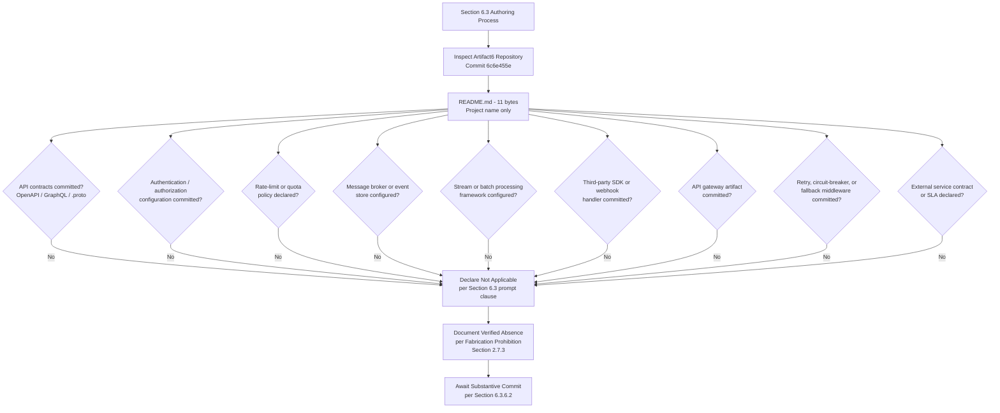

#### 6.3.5.4 Diagrams Explicitly Not Produced

The table below records, for traceability, the diagram classes requested by the Section 6.3 authoring prompt and the verified evidentiary basis on which each is excluded. This treatment is consistent with Sections 4.5.4, 5.6.4, 6.1.5.4, and 6.2.6.4. Sequence diagrams for "key flows" — which the prompt also identifies as part of the required diagrammatic deliverable — are excluded under the same basis, as no inter-system flows exist to be sequenced.

| Required Diagram | Excluded Because | Authoritative Cross-Reference |
|---|---|---|
| Integration flow diagrams | No external systems integrated; no APIs, events, or batch flows defined | Section 1.2.1; Section 3.5.1; Section 4.2.2 |
| API architecture diagrams | No API contracts, no protocol selection, no API gateway, no service decomposition | Section 5.2.4; Section 6.1.2.2 |
| Message flow diagrams | No message brokers, no event stores, no queues, no consumer groups | Section 3.6.1; Section 4.2.2 |
| Sequence diagrams for key flows | No actors, no components, no inter-system interactions definable | Section 4.2.1; Section 4.2.2 |

### 6.3.6 Document Status and Re-Issuance Trigger Conditions

#### 6.3.6.1 Current Document Status

This Integration Architecture section accurately reflects the verified state of the Artifact6 repository as of the date of the sole "Initial commit" (Thursday, May 28, 2026, commit `6c6e455e3f59eb8208dcb9f11b1319b21e7cf3e5`). It establishes a baseline that, like Sections 1, 2, 3, 4, 5, 6.1, and 6.2, will be revised once substantive API contract, authentication configuration, message broker, third-party SDK, API gateway, or webhook handling artifacts are committed. The section is consistent with the document-status framework articulated in Section 1.4.1, which anticipates that the System Architecture and integration-related content will be constrained by the absence of committed evidence until implementation artifacts are introduced.

#### 6.3.6.2 Re-Issuance Trigger Conditions

Consistent with the re-issuance framework established in Sections 2.7.2, 3.9, 4.6.2, 5.7.2, 6.1.6.2, and 6.2.7.2, the following events should trigger a complete re-authoring of this Integration Architecture section, replacing the verified-absence declaration and the per-element tables with substantive API designs, message processing topologies, and external systems contracts.

| Trigger Event | Required Re-Authoring Activity |
|---|---|
| First API contract committed (OpenAPI/Swagger, GraphQL schema, gRPC `.proto`) | Populate Section 6.3.2.1 (Protocol Specifications) and Section 6.3.2.6 (Documentation Standards) |
| First authentication configuration committed (Auth0 tenant, OAuth client, JWT signing key, OIDC metadata, SAML assertion handler) | Populate Section 6.3.2.2 (Authentication Methods) |
| First authorization framework or policy artifact committed (RBAC roles, ABAC policy, OPA Rego, Cedar policy) | Populate Section 6.3.2.3 (Authorization Framework) |
| First rate-limit or quota configuration committed (gateway-level throttle, application-level limiter, Redis-backed counter) | Populate Section 6.3.2.4 (Rate Limiting Strategy) |
| First API versioning convention committed (URI prefix, header policy, deprecation notice) | Populate Section 6.3.2.5 (Versioning Approach) |
| First message broker configuration committed (Kafka topic, RabbitMQ queue, AWS SQS/SNS, Azure Service Bus, GCP Pub/Sub) | Populate Section 6.3.3.2 (Message Queue Architecture) and Section 6.3.3.1 (Event Processing Patterns) |
| First stream processing artifact committed (Kafka Streams, Flink job, Spark Streaming, Kinesis Data Analytics) | Populate Section 6.3.3.3 (Stream Processing Design) |
| First batch processing framework or scheduler committed (Airflow DAG, Luigi pipeline, Prefect flow, Dagster job, cron, Celery worker) | Populate Section 6.3.3.4 (Batch Processing Flows) |
| First retry, circuit-breaker, fallback, or DLQ middleware committed | Populate Section 6.3.3.5 (Error Handling Strategy) |
| First third-party service integration committed (`.env.example`, SDK reference, webhook handler, OAuth client) | Populate Section 6.3.4.1 (Third-Party Integration Patterns) |
| First legacy system reference, adapter, or migration plan committed | Populate Section 6.3.4.2 (Legacy System Interfaces) |
| First API gateway artifact committed (Kong, AWS API Gateway, Apigee, Tyk, Envoy gateway configuration) | Populate Section 6.3.4.3 (API Gateway Configuration) |
| First webhook signing / verification policy or external service contract committed (HMAC verification, signed-URL policy, mTLS dependency contract) | Populate Section 6.3.4.4 (External Service Contracts) |

The recommended actions enumerated in Section 1.4.2 ("Populate substantive content," "Define stakeholders," "Establish technology baseline," "Re-issue this section") apply with equal force to this Integration Architecture section.

#### 6.3.6.3 Assumptions and Constraints

| Assumption / Constraint | Statement |
|---|---|
| Authoring Constraint | This section was authored solely from verified repository evidence as of the date of the Initial commit (Thursday, May 28, 2026). |
| Versioning Assumption | This is Version 1.0 of Section 6.3, baselined against commit `6c6e455e3f59eb8208dcb9f11b1319b21e7cf3e5`. |
| Fabrication Prohibition | Per Section 2.7.3, no protocol selection, authentication method, authorization model, rate-limit policy, versioning convention, documentation standard, event pattern, message broker, stream processor, batch flow, retry strategy, third-party integration, legacy adapter, API gateway configuration, or external service contract has been inferred or imagined. |
| Default-Stack Treatment | The Default Technology Stack recorded in Section 3.1.3 (including AWS as candidate cloud platform, Auth0 as candidate identity provider, Flask as candidate REST framework, and Langchain as candidate AI integration framework) is preserved as a forward-looking candidate set but is explicitly excluded as a basis for inventing protocols, authentication schemes, gateway configurations, or third-party integration patterns in this section, in accordance with the verified absences recorded in Sections 3.5.1 and 3.5.2. |
| Diagrammatic Discipline | Only diagrams that depict verified-state relationships (Sections 6.3.5.2 and 6.3.5.3) are authored; the diagram classes enumerated in Section 6.3.5.4 (integration flow, API architecture, message flow, sequence diagrams for key flows) are explicitly omitted in compliance with Section 2.7.3. |
| Section Applicability | The non-applicability declaration in 6.3.1.1 is invoked under the explicit clause of the Section 6.3 authoring prompt that permits such a declaration when "the system does not require integration with external systems or services." |
| Future-State Assumption | Future versions of this section will be authored once the substantive commitments enumerated in Section 6.3.6.2 (and the related artifacts referenced in Sections 1.4.2, 2.7.2, 3.9, 4.6.2, 5.7.2, 6.1.6.2, and 6.2.7.2) have been satisfied. |

### 6.3.7 References

#### 6.3.7.1 Repository Artifacts Examined

- `README.md` — Sole tracked file in the repository (11 bytes); contains only the single line `# Artifact6`. Establishes the pre-implementation, placeholder state on which the non-applicability declaration for Integration Architecture rests.
- `/` (repository root) — Inspected at depth 0; confirmed to contain only `README.md` as its first-order child. No `apis/`, `integrations/`, `messaging/`, `events/`, `webhooks/`, `gateway/`, `services/`, `clients/`, `sdk/`, `proto/`, `openapi/`, `swagger/`, `graphql/`, `.github/`, or any other directory that would establish an API contract, message broker configuration, third-party integration, webhook handler, or API gateway artifact.

#### 6.3.7.2 Technical Specification Sections Referenced

- **Section 1.1.1** — Establishes the verified pre-implementation lifecycle stage and baseline commit details on which the non-applicability declaration is anchored.
- **Section 1.2.1** — Primary authoritative source: establishes the verified absence of integration documentation, dependency declarations, API contracts, message-bus configurations, service registries, identity-provider configurations, enterprise architecture artifacts, and predecessor system references.
- **Section 1.2.2** — Establishes the verified absence of components, modules, source directories, and architectural patterns; no source code exists in which integration middleware could be implemented.
- **Section 1.2.3** — Establishes the verified absence of measurable objectives, KPIs, SLOs, and SLAs against which external service contracts could be specified.
- **Section 1.3.1** — Establishes the verified absence of in-scope essential integrations and key technical requirements.
- **Section 1.3.4** — Provides the canonical verified-state diagram incorporated by reference in Section 6.3.5.1.
- **Section 1.4.1 / 1.4.2** — Provides the document-status framework and recommended actions that govern this section's posture.
- **Section 2.7.2** — Provides the re-issuance trigger framework that Section 6.3.6.2 extends and specializes for Integration Architecture.
- **Section 2.7.3** — Records the binding Fabrication Prohibition that underwrites every verified-absence finding in this section.
- **Section 3.1.3** — Identifies the Default Technology Stack candidates (including AWS, Auth0, Flask, Langchain) relevant to integration architecture and explicitly excludes them as a basis for fabrication.
- **Section 3.5.1** — Primary authoritative source: establishes the verified absence of all third-party services (external APIs, identity providers, payment processors, messaging services, monitoring, error tracking, analytics, cloud platforms, CDNs).
- **Section 3.5.2** — Primary authoritative source: establishes the verified absence of all integration configuration artifacts (environment-variable templates, authentication SDK configs, cloud credentials, monitoring agent configs, email/messaging SDK configs, payment SDK configs, object-storage SDK configs).
- **Section 3.5.3** — Primary authoritative source: establishes the verified absence of all integration requirements (authentication scheme, rate-limit/quota policy, retry/back-off policy, circuit-breaker/bulkhead policy, webhook signing/verification policy, PII/data-residency constraints).
- **Section 3.6.1** — Establishes the verified absence of message broker / event store, caching layer, and object/blob storage relevant to message processing architecture.
- **Section 3.7** — Establishes the verified absence of containerization, orchestration, CI/CD pipelines, and infrastructure-as-code relevant to gateway and batch processing deployment.
- **Section 3.9** — Provides the re-issuance trigger pattern adopted in Section 6.3.6.2 for integration-related commitments.
- **Section 4.2.1** — Establishes the verified absence of core business processes, actors, and end-to-end user journeys relevant to sequence diagrams.
- **Section 4.2.2** — Primary authoritative source: establishes the verified absence of integration workflows (data flow between systems, API interactions, event processing flows, batch processing sequences, sequence diagrams between systems, external-system relationships).
- **Section 4.4.2** — Establishes the verified absence of error handling mechanisms (retry, fallback, notification, recovery) relevant to integration error handling strategy.
- **Section 4.5.4** — Provides the precedent for documenting diagrams explicitly not produced, replicated in Section 6.3.5.4.
- **Section 4.6.2** — Provides the re-issuance trigger framework that Section 6.3.6.2 extends.
- **Section 5.2.1** — Establishes the verified absence of an overall architecture style (including event-driven) relevant to integration patterns.
- **Section 5.2.3** — Establishes the verified absence of integration patterns and protocols, data transformation points, and message broker / event store.
- **Section 5.2.4** — Primary authoritative source: establishes the verified absence of external integration points; the External Integration Points table cannot be populated.
- **Section 5.5.1** — Establishes the verified absence of monitoring, observability, logging, and distributed tracing relevant to gateway and integration observability.
- **Section 5.5.2** — Establishes the verified absence of error-handling patterns (retry, circuit-breaker, fallback, notification, recovery, webhook signing).
- **Section 5.5.3** — Primary authoritative source: establishes the verified absence of authentication framework (identity provider, scheme, token/session management) and authorization framework (model, checkpoints).
- **Section 5.5.4** — Establishes the verified absence of performance budgets, SLOs, SLAs, and KPIs against which integration SLAs could be specified.
- **Section 5.6.2 / 5.6.3 / 5.6.4** — Provides the diagrammatic precedents (verified-absence mapping, authoring decision flow, diagrams explicitly not produced) replicated in Section 6.3.5.
- **Section 5.7.2** — Provides the re-issuance trigger catalog that Section 6.3.6.2 extends and specializes for Integration Architecture.
- **Section 6.1** — Direct structural precedent for Section 6; establishes the "Not Applicable" declaration pattern for top-level Section 6 subsections.
- **Section 6.1.2.2** — Establishes the verified absence of inter-service communication patterns (API protocol selection, synchronous vs. asynchronous integration, message broker, API contracts, webhook signing) directly cross-referenced throughout Section 6.3.
- **Section 6.1.2.4** — Establishes the verified absence of load balancing relevant to API gateway upstream configuration.
- **Section 6.1.2.6** — Establishes the verified absence of retry and fallback mechanisms relevant to integration error handling.
- **Section 6.1.3.4** — Establishes the verified absence of asynchronous / background processing relevant to message processing and batch flows.
- **Section 6.1.5.1 / 6.1.5.2 / 6.1.5.3 / 6.1.5.4** — Direct diagrammatic precedent for Section 6.3.5, including the canonical verified-state reference, verified-absence mapping diagram pattern, authoring-decision-flow diagram pattern, and "Diagrams Explicitly Not Produced" table pattern.
- **Section 6.1.6.2** — Direct re-issuance trigger catalog precedent for Section 6.3.6.2.
- **Section 6.2** — Direct structural precedent for Section 6; establishes the most recent "Not Applicable" declaration pattern with full evidentiary backing.
- **Section 6.2.2.2** — Establishes the verified absence of data models / structures relevant to event payload schemas.
- **Section 6.2.4.3** — Establishes the verified absence of data-residency / PII constraints relevant to external service contracts.
- **Section 6.2.4.5** — Establishes the verified absence of database-level access controls relevant to the authorization framework.
- **Section 6.2.5.5** — Establishes the verified absence of batch processing approach (framework, scheduler, queue-based worker, batch window/SLA) directly cross-referenced in Section 6.3.3.4.
- **Section 6.2.6.4** — Direct diagrammatic precedent for "Diagrams Explicitly Not Produced" table in Section 6.3.5.4.
- **Section 6.2.7.2** — Most recent direct re-issuance trigger catalog precedent for Section 6.3.6.2.

## 6.4 Security Architecture

**Detailed Security Architecture is not applicable for this system.**

This determination is grounded in verified repository evidence as of the sole "Initial commit" (Thursday, May 28, 2026, commit `6c6e455e3f59eb8208dcb9f11b1319b21e7cf3e5`). The Artifact6 repository contains a single tracked file — `README.md` (11 bytes) — whose entire content is the single line `# Artifact6`. As established in Section 5.5.3, no authentication or authorization framework is configured: no identity provider, no authentication scheme (OAuth, OIDC, SAML, API key, mTLS), no authorization model (RBAC, ABAC, ACL), no session or token management strategy, and no authorization checkpoints have been declared. As established in Section 3.5.1, no authentication/identity providers, no monitoring/observability platforms, no error-tracking services, and no cloud platforms are configured. As established in Section 3.5.2, no Auth0 tenant configuration, OAuth client secrets, JWT signing keys, cloud provider credentials, or environment-variable templates are present in the repository. As established in Section 3.5.3, no authentication scheme, rate-limit/quota policy, retry policy, circuit-breaker policy, webhook signing policy, or PII/data-residency constraints have been documented. Authoring security architecture content on such a foundation would constitute fabrication and is therefore deliberately and disciplinarily withheld in compliance with the Fabrication Prohibition recorded in Section 2.7.3.

The Section 6.4 authoring prompt explicitly contemplates this case and instructs the author to declare non-applicability when "the system does not require specific security considerations beyond standard practices." The subsections below document, with traceable evidentiary cross-references, the verified absence of every requested element under Authentication Framework, Authorization System, and Data Protection; provide the diagrammatic treatment mandated for verified-absence sections; and define the precise commit events that will trigger re-authoring of this section. The structural pattern is directly inherited from Sections 6.1 (Core Services Architecture), 6.2 (Database Design), and 6.3 (Integration Architecture), each of which declared non-applicability with full evidentiary backing.

### 6.4.1 Applicability Determination

#### 6.4.1.1 Applicability Statement

Security Architecture — encompassing an Authentication Framework (identity management, multi-factor authentication, session management, token handling, password policies), an Authorization System (role-based access control, permission management, resource authorization, policy enforcement points, audit logging), and a Data Protection regime (encryption standards, key management, data masking rules, secure communication, compliance controls) — is **not applicable** for the Artifact6 system in its current verified state. There is no system, in the engineering sense of the term, against which any of these security dimensions can be evaluated, designed, or documented. There are no users to authenticate, no resources to authorize access to, no data to protect, no communication channels to secure, and no compliance regime to enforce, because none of these elements have been committed to the repository.

#### 6.4.1.2 Rationale for Non-Applicability

The determination of non-applicability is supported by six categories of converging evidence drawn from prior sections of this Technical Specification. Each category is independently sufficient to compel the non-applicability declaration; together, they render the determination unambiguous.

| Evidentiary Category | Verified Finding | Authoritative Cross-Reference |
|---|---|---|
| No authentication or authorization framework | No IdP, no scheme, no model, no session/token strategy, no checkpoints | Section 5.5.3; Section 6.3.2.2; Section 6.3.2.3 |
| No third-party security services integrated | No identity provider, no monitoring, no error tracking, no KMS, no cloud IAM | Section 3.5.1; Section 3.5.2 |
| No integration security requirements | No authentication scheme, no rate-limit, no webhook signing, no PII/data-residency constraints | Section 3.5.3 |
| No data protection artifacts | No encryption-at-rest, no field-level encryption, no tokenization, no KMS integration | Section 3.6.3; Section 5.5.5; Section 6.2.4.3 |
| No compliance requirements declared | No regulatory checks, no data retention, no GDPR/erasure policy, no security/compliance requirements | Section 2.3.4; Section 4.3.2; Section 6.2.4.1 |
| No audit/observability foundation | No monitoring, no logging library, no distributed tracing, no error-tracking service | Section 5.5.1; Section 6.2.4.4 |

Because Artifact6 has not committed any identity-provider configuration, any authentication SDK, any authorization policy, any password-handling routine, any encryption configuration, any key-management binding, any audit log configuration, or any compliance attestation, the very precondition for a Security Architecture — the existence of a system with authenticatable identities, authorizable resources, and protectable data — is absent from the repository. The section prompt's anticipated non-applicability clause is therefore controlling.

The Default Technology Stack recorded in Section 3.1.3 lists Auth0 as the candidate identity provider, AWS as the candidate cloud platform (and therefore the candidate source of IAM, KMS, and Secrets Manager primitives), MongoDB as the candidate database (and therefore the candidate locus of database-level access controls), and Flask as the candidate web framework (and therefore the candidate host for authentication middleware such as Flask-Security or Flask-Login). However, as expressly noted in Section 3.5.2 and Section 3.1.3, no Auth0 tenant configuration, OAuth client secrets, JWT signing keys, AWS credentials, IAM policies, KMS key references, MongoDB connection strings, or Python manifest declaring Flask appear in the repository. Accordingly, none of these candidates can be recorded as constituting the current security architecture and none can serve as a basis for inventing authentication methods, key-management schemes, database access controls, or middleware configurations in this section.

#### 6.4.1.3 Authoring Methodology

This section follows the verified-absence specification methodology established in Section 2.1, applied consistently across Sections 2.5, 3.1, 4.2, 4.4, 5.2, 5.3, 5.4, and 5.5, and directly inherited from Sections 6.1, 6.2, and 6.3. The methodology consists of four disciplines:

1. **Element Enumeration.** Each security element requested by the prompt is enumerated in tabular form so that the reader can confirm complete coverage of the prompt's three major categories (Authentication Framework, Authorization System, Data Protection) and their fifteen constituent elements.
2. **Verified-Status Marking.** Each element is marked "None defined," "None configured," "None enrolled," "None committed," or "Not applicable" against committed evidence, never against speculation.
3. **Authoritative Cross-Referencing.** Each absence is traced to a prior, independently authored section of this Technical Specification that supplies the underlying evidence.
4. **Diagrammatic Restraint.** Diagrams are produced only where they depict the verified state. Authentication flow diagrams, authorization flow diagrams, and security zone diagrams that would require fabrication of identities, policies, trust boundaries, or network topologies are explicitly declined, mirroring the precedents in Sections 4.5.4, 5.6.4, 6.1.5.4, 6.2.6.4, and 6.3.5.4.

### 6.4.2 Authentication Framework — Verified Absence

The Authentication Framework dimension requested by the section prompt encompasses five elements: identity management, multi-factor authentication, session management, token handling, and password policies. Each is verified absent and is treated below.

#### 6.4.2.1 Identity Management

No identity management subsystem is configured. As established in Section 5.5.3, the "Identity provider / IdP configuration" status is recorded as "None configured," and Section 3.5.1 corroborates this by recording "Authentication / identity providers: None configured." Section 3.5.2 verifies that the canonical configuration artifacts by which identity management is typically introduced — Auth0 tenant configuration, OAuth client secrets, OIDC discovery documents, SAML metadata, and JWT signing keys — are all absent. There is no user registry, no directory service binding (LDAP, Active Directory, Azure AD), no federated identity broker (Auth0, Okta, AWS Cognito, Keycloak), no user-attribute schema, and no account-lifecycle policy (provisioning, deprovisioning, just-in-time access).

| Identity Management Element | Verified Status | Authoritative Cross-Reference |
|---|---|---|
| Identity provider configuration (Auth0, Okta, Cognito, Azure AD, Keycloak) | None configured | Section 3.5.1; Section 5.5.3 |
| Directory service binding (LDAP, AD, Azure AD) | None configured | Section 3.5.1; Section 3.5.2 |
| User registry / attribute schema | None defined | Section 5.5.3; Section 6.2.2.1 |
| Account lifecycle policy (provisioning, deprovisioning, JIT) | None defined | Section 5.5.3 |
| Federated identity / SSO broker | None configured | Section 3.5.1; Section 3.5.2 |

#### 6.4.2.2 Multi-Factor Authentication

No multi-factor authentication (MFA) mechanism is configured. Because no primary authentication scheme has been selected (Section 5.5.3) and no identity provider is in place (Section 3.5.1), the precondition for layering a second authentication factor is absent. There is no time-based one-time password (TOTP) secret configuration, no WebAuthn / FIDO2 credential binding, no SMS or email one-time-password (OTP) configuration, no push-notification authenticator integration, and no MFA enrollment or recovery procedure. Section 3.5.2 confirms that no email/messaging SDK configuration (SendGrid, Twilio, AWS SES) — which would typically support SMS or email OTP delivery — is present.

| MFA Element | Verified Status | Authoritative Cross-Reference |
|---|---|---|
| TOTP authenticator configuration (RFC 6238) | None configured | Section 5.5.3; Section 3.5.2 |
| WebAuthn / FIDO2 credential binding | None configured | Section 5.5.3; Section 3.5.2 |
| SMS / email OTP configuration | None configured | Section 3.5.1; Section 3.5.2 |
| Push-notification authenticator integration | None configured | Section 3.5.1 |
| MFA enrollment / recovery procedure | None defined | Section 5.5.3 |

#### 6.4.2.3 Session Management

No session management strategy is defined. As established in Section 5.5.3, the "Session / token management strategy" status is recorded as "None defined," and Section 6.3.2.2 independently corroborates this finding. There is no session store selection (in-memory, Redis, Memcached, database-backed), no session identifier scheme (opaque random token, signed cookie), no session lifetime policy (idle timeout, absolute timeout, sliding expiration), no session-invalidation procedure (logout, administrative revocation, password change), no concurrent-session policy, and no cross-site request forgery (CSRF) protection scheme. Section 6.2.3.5 confirms that no caching engine (Redis, Memcached) — which would typically host a distributed session store — has been configured.

| Session Management Element | Verified Status | Authoritative Cross-Reference |
|---|---|---|
| Session store selection (in-memory, Redis, Memcached, database) | None configured | Section 5.5.3; Section 6.2.3.5 |
| Session identifier scheme (opaque token, signed cookie) | None defined | Section 5.5.3; Section 6.3.2.2 |
| Session lifetime policy (idle, absolute, sliding) | None defined | Section 5.5.3 |
| Session-invalidation / logout procedure | None defined | Section 5.5.3 |
| CSRF / cookie security flags (`HttpOnly`, `Secure`, `SameSite`) | None defined | Section 5.5.3; Section 6.3.2.2 |

#### 6.4.2.4 Token Handling

No token handling strategy is defined. As established in Section 5.5.3, the "Session / token management strategy" status is recorded as "None defined," and Section 6.3.2.2 independently corroborates this finding by recording "Token management strategy (JWT, opaque, refresh tokens): None defined." There is no token format selection (JWT, JWE, PASETO, opaque), no signing key configuration (HS256 secret, RS256/ES256 key pair), no key rotation policy, no token-issuance lifetime policy, no refresh-token strategy (rotation, reuse-detection, family revocation), no token-binding mechanism (mTLS, DPoP), no token-introspection endpoint, and no token-revocation list. Section 3.5.2 confirms that no JWT signing keys, no OAuth client secrets, and no environment-variable templates referencing such artifacts appear in the repository.

| Token Handling Element | Verified Status | Authoritative Cross-Reference |
|---|---|---|
| Token format (JWT, JWE, PASETO, opaque) | None defined | Section 5.5.3; Section 6.3.2.2 |
| Signing key configuration (HS256, RS256, ES256) | None present | Section 3.5.2; Section 5.5.3 |
| Token lifetime and refresh policy | None defined | Section 5.5.3; Section 6.3.2.2 |
| Token revocation / introspection mechanism | None defined | Section 5.5.3 |
| Token binding (mTLS, DPoP) | None configured | Section 3.5.3; Section 5.5.3 |

#### 6.4.2.5 Password Policies

No password policies are defined. Because no user registry, no authentication scheme, and no identity provider are configured (Section 5.5.3; Section 3.5.1), the precondition for a password policy — a population of credentialed identities — does not exist. There is no password complexity rule (minimum length, character classes, entropy threshold), no password hashing algorithm selection (bcrypt, argon2id, scrypt, PBKDF2), no salt strategy, no password-history policy, no password-rotation policy, no compromised-password detection (HIBP integration), and no account-lockout policy. Section 3.4 confirms that no open-source dependency has been declared, so no password-handling library (e.g., `bcrypt`, `argon2-cffi`, `passlib`, `werkzeug.security`) is present in the repository.

| Password Policy Element | Verified Status | Authoritative Cross-Reference |
|---|---|---|
| Password complexity rules (length, character classes, entropy) | None defined | Section 5.5.3; Section 2.3.4 |
| Password hashing algorithm (bcrypt, argon2id, scrypt, PBKDF2) | None selected | Section 3.4; Section 5.5.3 |
| Password rotation / history policy | None defined | Section 5.5.3 |
| Compromised-password detection (HIBP integration) | None configured | Section 3.5.1; Section 5.5.3 |
| Account-lockout / throttling policy | None defined | Section 3.5.3; Section 5.5.3 |

### 6.4.3 Authorization System — Verified Absence

The Authorization System dimension requested by the section prompt encompasses five elements: role-based access control, permission management, resource authorization, policy enforcement points, and audit logging. Each is verified absent and is treated below.

#### 6.4.3.1 Role-Based Access Control

No role-based access control (RBAC) model is defined. As established in Section 5.5.3, the "Authorization model (RBAC, ABAC, ACL)" status is recorded as "None defined," and Section 6.3.2.3 independently corroborates this finding by recording "Authorization model (RBAC, ABAC, ACL, ReBAC): None defined." There is no role catalog (administrator, operator, user, guest, service account), no role-hierarchy specification (inheritance, role-explosion mitigation), no role-assignment mechanism (direct, group-mediated, attribute-derived), and no separation-of-duties (SoD) constraint set. Section 4.3.2 corroborates that no authorization checkpoints are defined anywhere in the repository.

| RBAC Element | Verified Status | Authoritative Cross-Reference |
|---|---|---|
| Role catalog | None defined | Section 5.5.3; Section 6.3.2.3 |
| Role hierarchy / inheritance | None defined | Section 5.5.3 |
| Role-assignment mechanism | None defined | Section 5.5.3; Section 4.3.2 |
| Separation-of-duties (SoD) constraints | None defined | Section 5.5.3 |

#### 6.4.3.2 Permission Management

No permission management subsystem is defined. As established in Section 6.3.2.3, "Role / permission catalog: None defined" and "Policy decision / policy enforcement separation: None defined." There is no permission taxonomy (resource × action × scope), no permission-granting workflow, no permission-revocation procedure, no permission-review/recertification cadence, and no privileged-access management (PAM) policy. Section 6.2.4.5 corroborates the absence of any database-level permission constructs (role/privilege model, row-level security, column-level access grants), and Section 4.3.2 confirms that no authorization checkpoints have been declared at the application layer.

| Permission Management Element | Verified Status | Authoritative Cross-Reference |
|---|---|---|
| Permission taxonomy (resource × action × scope) | None defined | Section 5.5.3; Section 6.3.2.3 |
| Permission-granting / revocation workflow | None defined | Section 5.5.3 |
| Permission-review / recertification cadence | None defined | Section 5.5.3 |
| Privileged-access management (PAM) policy | None defined | Section 5.5.3; Section 3.5.1 |

#### 6.4.3.3 Resource Authorization

No resource authorization scheme is defined. Because no resources of any kind have been declared in the repository — no API endpoints (Section 6.3.2.1), no database entities (Section 6.2.2.1), no UI views, no files, and no message-broker topics (Section 6.3.3.2) — there are no resources against which authorization could be specified. There is no resource-identifier convention (URI, ARN, GUID), no resource-ownership model, no relationship-based access control (ReBAC) graph, no attribute-based access control (ABAC) policy set, and no access control list (ACL) registry. Section 6.2.4.5 confirms the parallel absence of database-level resource authorization (row-level security, column-level access, network-level database ACL).

| Resource Authorization Element | Verified Status | Authoritative Cross-Reference |
|---|---|---|
| Resource catalog / identifier convention | None defined | Section 6.3.2.1; Section 6.2.2.1 |
| Resource-ownership model | None defined | Section 5.5.3 |
| ABAC / ReBAC / ACL policy set | None defined | Section 5.5.3; Section 6.3.2.3 |
| Database-level resource authorization (RLS, column grants) | None defined | Section 6.2.4.5 |

#### 6.4.3.4 Policy Enforcement Points

No policy enforcement points (PEPs) are defined. As established in Section 5.5.3, the "Authorization checkpoints" status is recorded as "None defined," and Section 6.3.2.3 corroborates this by recording "Authorization checkpoints / policy enforcement points: None defined" and "Policy decision / policy enforcement separation: None defined." Because no application components, no API endpoints, no API gateway, no service mesh, and no middleware framework exist (Section 5.2.2; Section 6.3.2.1; Section 6.3.4.3), there are no architectural surfaces at which a PEP could be positioned. There is no policy decision point (PDP) implementation (Open Policy Agent / OPA, Cedar, Casbin, AuthZed/SpiceDB), no policy-as-code repository, no policy-bundle distribution mechanism, and no decision-caching policy.

| Policy Enforcement Element | Verified Status | Authoritative Cross-Reference |
|---|---|---|
| Policy enforcement point (PEP) topology | None defined | Section 5.5.3; Section 6.3.2.3 |
| Policy decision point (PDP) implementation (OPA, Cedar, Casbin) | None configured | Section 6.3.2.3; Section 3.4 |
| Policy-as-code repository / bundle distribution | None present | Section 3.7; Section 6.3.2.3 |
| Gateway-tier authorization plugin chain | None configured | Section 6.3.4.3; Section 5.5.3 |
| Database-level enforcement (RLS, service-account scopes) | None defined | Section 6.2.4.5 |

#### 6.4.3.5 Audit Logging

No audit logging is configured. As established in Section 5.5.1, no monitoring/observability platform, no logging library, no distributed tracing strategy, and no error-tracking service is configured. Section 3.5.2 confirms that the canonical APM/audit artifacts (Sentry DSN configuration, Datadog/New Relic agent configuration) are absent. Section 6.2.4.4 independently corroborates the absence of all audit mechanisms at the database tier (audit log configuration, change data capture, audit-table/immutable-log strategy, audit retention). There is no security-event logger, no SIEM forwarder (Splunk, ELK, Sumo Logic, Datadog Security Monitoring), no audit-event taxonomy, no tamper-evident audit-log storage, and no audit-log retention policy.

| Audit Logging Element | Verified Status | Authoritative Cross-Reference |
|---|---|---|
| Security-event logger / SIEM forwarder | None configured | Section 5.5.1; Section 3.5.2 |
| Audit-event taxonomy (authentication, authorization, admin, data access) | None defined | Section 5.5.1; Section 6.2.4.4 |
| Tamper-evident / immutable audit-log storage | None configured | Section 6.2.4.4 |
| Audit-log retention and review policy | None defined | Section 6.2.4.4; Section 3.6.3 |

### 6.4.4 Data Protection — Verified Absence

The Data Protection dimension requested by the section prompt encompasses five elements: encryption standards, key management, data masking rules, secure communication, and compliance controls. Each is verified absent and is treated below.

#### 6.4.4.1 Encryption Standards

No encryption standards are defined. As established in Section 3.6.3, the "Encryption-at-rest configuration" status is recorded as "No," and Section 5.5.5 independently corroborates this finding by recording "Encryption-at-rest configuration: None defined." Section 6.2.4.3 confirms the parallel absence of every privacy-related encryption primitive: no encryption-at-rest configuration, no field-level encryption, no tokenization or pseudonymization configuration. There is no symmetric cipher selection (AES-128-GCM, AES-256-GCM, ChaCha20-Poly1305), no asymmetric cipher selection (RSA-2048/3072/4096, Ed25519, ECDSA P-256), no hashing algorithm catalog (SHA-256, SHA-3, BLAKE2/3), no encryption mode policy, and no Bring-Your-Own-Key (BYOK) or Hold-Your-Own-Key (HYOK) declaration.

| Encryption Standards Element | Verified Status | Authoritative Cross-Reference |
|---|---|---|
| Encryption-at-rest cipher / mode | None defined | Section 3.6.3; Section 5.5.5 |
| Encryption-in-transit cipher / TLS version policy | None defined | Section 6.3.2.1; Section 3.5.3 |
| Field-level / application-layer encryption | None defined | Section 6.2.4.3 |
| Hashing algorithm catalog (SHA-2/3, BLAKE) | None selected | Section 3.4; Section 5.5.3 |
| BYOK / HYOK declaration | None defined | Section 6.2.4.3 |

#### 6.4.4.2 Key Management

No key management subsystem is configured. As established in Section 6.2.4.3, "Key management service (KMS) integration: None configured," and Section 3.5.1 corroborates this by recording the absence of any cloud platform that would provide a managed KMS (AWS KMS, GCP KMS, Azure Key Vault). Section 3.5.2 confirms that no cloud provider credentials, no `~/.aws/credentials`, no `terraform.tfvars`, no `gcp-service-account.json`, and no `azure.json` artifacts appear in the repository, precluding any cloud-native key-management integration. There is no on-premises KMS (HashiCorp Vault, Thales CipherTrust), no key-rotation schedule, no key-versioning convention, no key-access policy, no key-destruction / cryptographic-erasure procedure, and no Hardware Security Module (HSM) binding.

| Key Management Element | Verified Status | Authoritative Cross-Reference |
|---|---|---|
| Cloud KMS integration (AWS KMS, GCP KMS, Azure Key Vault) | None configured | Section 3.5.1; Section 3.5.2; Section 6.2.4.3 |
| On-premises KMS / Vault binding (HashiCorp Vault, CipherTrust) | None configured | Section 3.5.1; Section 6.2.4.3 |
| Key rotation schedule and versioning | None defined | Section 6.2.4.3 |
| Key destruction / cryptographic erasure procedure | None defined | Section 6.2.4.3; Section 5.5.5 |
| Hardware Security Module (HSM) binding | None configured | Section 3.5.1; Section 6.2.4.3 |

#### 6.4.4.3 Data Masking Rules

No data masking rules are defined. As established in Section 6.2.4.3, the "Field-level encryption / tokenization," "Data classification taxonomy," and "Personally Identifiable Information (PII) inventory" statuses are all recorded as "None defined." Section 3.5.3 corroborates the absence of any PII / data-residency constraint, and Section 2.3.3 establishes the broader verified absence of declared data requirements. There is no data-classification taxonomy (Public, Internal, Confidential, Restricted), no PII / PHI / PCI inventory, no static-data masking rule set, no dynamic-data masking policy (per-role redaction), no tokenization vault, no format-preserving encryption (FPE) configuration, and no synthetic-data generation policy for non-production environments.

| Data Masking Element | Verified Status | Authoritative Cross-Reference |
|---|---|---|
| Data classification taxonomy (Public / Internal / Confidential / Restricted) | None defined | Section 6.2.4.3 |
| PII / PHI / PCI inventory | None defined | Section 6.2.4.3; Section 3.5.3 |
| Static / dynamic data masking policy | None defined | Section 6.2.4.3 |
| Tokenization vault / FPE configuration | None configured | Section 6.2.4.3 |
| Non-production data anonymization / synthetic data policy | None defined | Section 6.2.4.3; Section 3.6.3 |

#### 6.4.4.4 Secure Communication

No secure communication policy is defined. As established in Section 6.3.2.1, the "Transport selection (HTTP/1.1, HTTP/2, HTTP/3, TCP)" status is recorded as "None defined," and Section 6.3.4.3 confirms that no API gateway is configured at which TLS termination would typically occur. Section 3.5.1 confirms the absence of any cloud platform that would supply managed TLS certificates (AWS ACM, GCP Managed SSL, Azure App Service Managed Certificate). There is no TLS certificate, no TLS version policy (minimum TLS 1.2/1.3), no cipher-suite policy, no mutual TLS (mTLS) configuration, no certificate-pinning policy, no HSTS policy, no Content Security Policy (CSP), and no DNS-over-HTTPS / DNS-over-TLS configuration. Section 3.5.3 corroborates the absence of any webhook signing or verification policy that would secure inbound integrations.

| Secure Communication Element | Verified Status | Authoritative Cross-Reference |
|---|---|---|
| TLS certificate / TLS version policy | None present | Section 6.3.2.1; Section 6.3.4.3 |
| Cipher-suite / forward-secrecy policy | None defined | Section 6.3.2.1 |
| Mutual TLS (mTLS) configuration | None defined | Section 3.5.3; Section 5.5.3 |
| HSTS / CSP / security headers policy | None defined | Section 6.3.2.6; Section 5.5.1 |
| Webhook signing / verification (HMAC, signed URLs) | None defined | Section 3.5.3; Section 6.3.4.4 |

#### 6.4.4.5 Compliance Controls

No compliance controls are defined. As established in Section 2.3.4, the "Security Requirements" and "Compliance Requirements" statuses are both recorded as "None defined," and Section 4.3.2 corroborates this by recording "Regulatory compliance checks: None defined" and "Data-residency / PII constraints: None defined." Section 3.6.3 confirms that no data-retention / GDPR-erasure policy has been declared, and Section 5.5.5 confirms the same. Section 6.2.4.1 independently records the absence of every data-retention element (retention window by data class, legal-hold policy, right-to-be-forgotten procedure, automated retention enforcement). There is no compliance regime declaration (GDPR, CCPA/CPRA, HIPAA, PCI-DSS, SOC 2 Type II, ISO/IEC 27001, FedRAMP, NIST 800-53), no control-mapping artifact, no continuous-compliance scanning configuration, no third-party audit attestation, and no Data Processing Addendum (DPA) or Business Associate Agreement (BAA) template.

| Compliance Controls Element | Verified Status | Authoritative Cross-Reference |
|---|---|---|
| Regulatory regime declaration (GDPR, HIPAA, PCI-DSS, SOC 2, ISO 27001) | None defined | Section 2.3.4; Section 4.3.2 |
| Control-mapping artifact (NIST 800-53, CIS, ISO 27001 Annex A) | None present | Section 2.3.4; Section 4.3.2 |
| Data retention / right-to-erasure procedure | None defined | Section 3.6.3; Section 5.5.5; Section 6.2.4.1 |
| Data-residency / cross-border-transfer policy | None defined | Section 3.5.3; Section 5.5.5 |
| Continuous-compliance scanning configuration | None configured | Section 3.7; Section 5.5.1 |
| Third-party audit attestation / DPA / BAA | None present | Section 2.3.4 |

### 6.4.5 Standard Security Practices Statement

The Section 6.4 authoring prompt instructs the author, when declaring non-applicability, to "explain which standard security practices will be followed instead." For Artifact6 in its current verified state, no such explanation can be honestly produced from committed evidence. The selection of "standard practices" is itself a function of the technology stack, runtime environment, deployment platform, and hosting model adopted, and — as established in Section 3.1.3 — none of these foundational choices has been committed:

- **No language runtime** has been adopted, so language-ecosystem standard practices (e.g., Python's `cryptography` library defaults, Node.js's `crypto` module defaults, Go's `crypto/tls` defaults, Java's JCA providers) cannot be specified.
- **No web framework** has been adopted, so framework-default security practices (e.g., Flask-Security, Django's middleware defaults, Express `helmet` defaults, Spring Security defaults, ASP.NET Core's authentication scheme defaults) cannot be specified.
- **No deployment platform** has been adopted, so platform-default security practices (e.g., AWS shared-responsibility model controls, GCP's default-secure VPC, Azure's default Entra ID integration) cannot be specified.
- **No containerization or orchestration** has been adopted, so container-runtime security defaults (e.g., Docker rootless mode, Kubernetes Pod Security Admission, OpenShift Security Context Constraints) cannot be specified.
- **No CI/CD pipeline** has been adopted, so supply-chain security defaults (e.g., GitHub Actions OIDC federation, Dependabot, secret-scanning, SAST/DAST scanners) cannot be specified.

Per the binding Fabrication Prohibition recorded in Section 2.7.3, this section therefore declines to enumerate any "standard practice" that is not anchored in committed repository evidence. The candidate Default Technology Stack (Section 3.1.3) is preserved as a forward-looking reference but is explicitly excluded as a basis for asserting current security practices. Once a foundational technology stack is committed, the standard practices implicit to that stack will be enumerated under the trigger conditions defined in Section 6.4.7.2.

The matrix below summarizes the Security Architecture coverage requested by the prompt against the verified state of the repository. This matrix is the canonical security control summary for Section 6.4 and is provided in lieu of the substantive control catalog that a future-state revision will contain.

| Security Domain | Elements Requested | Verified Status | Primary Cross-Reference |
|---|---|---|---|
| Authentication Framework | 5 (identity mgmt, MFA, session, token, password) | All None defined / configured | Section 5.5.3; Section 6.3.2.2 |
| Authorization System | 5 (RBAC, permissions, resource auth, PEP, audit log) | All None defined / configured | Section 5.5.3; Section 6.3.2.3; Section 6.2.4.4 |
| Data Protection | 5 (encryption, KMS, masking, secure comms, compliance) | All None defined / configured | Section 6.2.4.3; Section 5.5.5; Section 2.3.4 |

### 6.4.6 Required Diagrams

The Section 6.4 authoring prompt requires three diagram classes: authentication flow diagrams, authorization flow diagrams, and security zone diagrams. Per the verified-absence methodology and the Fabrication Prohibition recorded in Section 2.7.3, none of these diagrams can be honestly authored from committed evidence — each would require the invention of identities, authentication scheme transitions, authorization decisions, trust boundaries, or network topologies that the repository does not contain. In place of fabricated content, this section provides (a) incorporation by reference of the canonical verified-state diagram in Section 1.3.4, (b) an original Mermaid diagram mapping each Section 6.4 sub-area to its verified-absence finding, (c) an authoring-decision-flow diagram, and (d) a traceability table for the diagram classes explicitly not produced. This treatment mirrors the precedents established in Sections 4.5, 5.6, 6.1.5, 6.2.6, and 6.3.5.

#### 6.4.6.1 Canonical Verified-State Diagram — Incorporation by Reference

The Mermaid verified-state diagram authored in Section 1.3.4 serves as the canonical visual representation of the gap between the single established fact (the project name "Artifact6") and the broader specification elements that remain undefined, including all security architecture elements requested by this section. That diagram is incorporated here by reference and remains the structural anchor for every "None defined," "None configured," or "None present" finding tabulated in Sections 6.4.2, 6.4.3, and 6.4.4.

#### 6.4.6.2 Section 6.4 Verified-Absence Mapping Diagram

The supplementary diagram below maps each Section 6.4 sub-area (Authentication Framework, Authorization System, Data Protection) and each constituent element to its verified-absence finding, to the binding Fabrication Prohibition (Section 2.7.3), and to the re-issuance trigger conditions defined in Section 6.4.7.2. It mirrors the structural pattern established in Sections 5.6.2, 4.5.2, 3.8, 6.1.5.2, 6.2.6.2, and 6.3.5.2 and re-uses the same anchor node (the Artifact6 repository) so that readers may trace security-architecture absences back to their evidentiary basis.

```mermaid
flowchart TD
    Repo[Artifact6 Repository<br/>1 commit, 1 file, 11 bytes]
    Readme[README.md<br/>Heading: # Artifact6]

    subgraph AuthenticationFramework[Authentication Framework - Section 6.4.2]
        AF1[Identity Management<br/>None configured]
        AF2[Multi-Factor Authentication<br/>None configured]
        AF3[Session Management<br/>None defined]
        AF4[Token Handling<br/>None defined]
        AF5[Password Policies<br/>None defined]
    end

    subgraph AuthorizationSystem[Authorization System - Section 6.4.3]
        AZ1[Role-Based Access Control<br/>None defined]
        AZ2[Permission Management<br/>None defined]
        AZ3[Resource Authorization<br/>None defined]
        AZ4[Policy Enforcement Points<br/>None defined]
        AZ5[Audit Logging<br/>None configured]
    end

    subgraph DataProtection[Data Protection - Section 6.4.4]
        DP1[Encryption Standards<br/>None defined]
        DP2[Key Management<br/>None configured]
        DP3[Data Masking Rules<br/>None defined]
        DP4[Secure Communication<br/>None present]
        DP5[Compliance Controls<br/>None defined]
    end

    Fab[Fabrication Prohibition<br/>Section 2.7.3]
    Verified[Verified Absence<br/>Security Architecture<br/>Not Applicable]
    Trigger[Re-Issuance Trigger<br/>Commit IdP / Authz / KMS /<br/>Encryption / Audit Artifacts<br/>per Section 6.4.7.2]

    Repo --> Readme
    Repo --> AF1
    Repo --> AF2
    Repo --> AF3
    Repo --> AF4
    Repo --> AF5
    Repo --> AZ1
    Repo --> AZ2
    Repo --> AZ3
    Repo --> AZ4
    Repo --> AZ5
    Repo --> DP1
    Repo --> DP2
    Repo --> DP3
    Repo --> DP4
    Repo --> DP5

    AF1 --> Verified
    AF2 --> Verified
    AF3 --> Verified
    AF4 --> Verified
    AF5 --> Verified
    AZ1 --> Verified
    AZ2 --> Verified
    AZ3 --> Verified
    AZ4 --> Verified
    AZ5 --> Verified
    DP1 --> Verified
    DP2 --> Verified
    DP3 --> Verified
    DP4 --> Verified
    DP5 --> Verified

    Fab --> Verified
    Verified --> Trigger
```

#### 6.4.6.3 Authoring Decision Flow for Security Architecture

The diagram below depicts the authoring-decision flow that governed each sub-area of this section. It mirrors the structural patterns established in Sections 2.1.3, 4.5.3, 5.6.3, 6.1.5.3, 6.2.6.3, and 6.3.5.3 and makes explicit the evidence-presence determination that produced a verified-absence finding for every requested security-architecture element. The flow demonstrates that the non-applicability declaration is not a stylistic choice but a deterministic outcome of the verified repository contents.

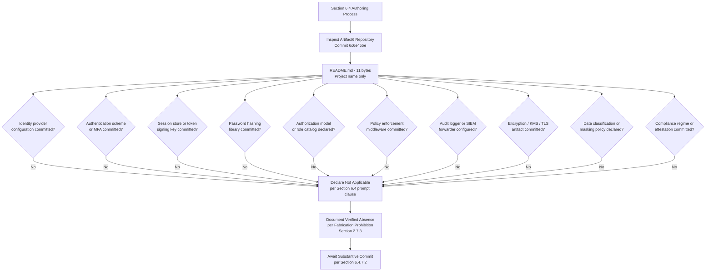

#### 6.4.6.4 Diagrams Explicitly Not Produced

The table below records, for traceability, the diagram classes requested by the Section 6.4 authoring prompt and the verified evidentiary basis on which each is excluded. This treatment is consistent with Sections 4.5.4, 5.6.4, 6.1.5.4, 6.2.6.4, and 6.3.5.4.

| Required Diagram | Excluded Because | Authoritative Cross-Reference |
|---|---|---|
| Authentication flow diagrams | No identity provider, no authentication scheme, no token/session strategy, no MFA | Section 5.5.3; Section 6.3.2.2 |
| Authorization flow diagrams | No authorization model, no policy enforcement points, no role/permission catalog, no PDP/PEP separation | Section 5.5.3; Section 6.3.2.3 |
| Security zone diagrams | No deployment platform, no network topology, no VPC/subnet, no trust boundaries, no DMZ definition | Section 3.5.1; Section 3.7 |

### 6.4.7 Document Status and Re-Issuance Trigger Conditions

#### 6.4.7.1 Current Document Status

This Security Architecture section accurately reflects the verified state of the Artifact6 repository as of the date of the sole "Initial commit" (Thursday, May 28, 2026, commit `6c6e455e3f59eb8208dcb9f11b1319b21e7cf3e5`). It establishes a baseline that, like Sections 1, 2, 3, 4, 5, 6.1, 6.2, and 6.3, will be revised once substantive identity-provider, authentication, authorization, encryption, key-management, audit-logging, or compliance artifacts are committed. The section is consistent with the document-status framework articulated in Section 1.4.1, which anticipates that the System Architecture and security-related content will be constrained by the absence of committed evidence until implementation artifacts are introduced. Section 2.7.1 explicitly enumerates "Security" among the categories whose content is expected to be constrained until implementation artifacts are committed.

#### 6.4.7.2 Re-Issuance Trigger Conditions

Consistent with the re-issuance framework established in Sections 2.7.2, 3.9, 4.6.2, 5.7.2, 6.1.6.2, 6.2.7.2, and 6.3.6.2, the following events should trigger a complete re-authoring of this Security Architecture section, replacing the verified-absence declaration and the per-element tables with substantive authentication frameworks, authorization systems, and data protection regimes.

| Trigger Event | Required Re-Authoring Activity |
|---|---|
| First identity provider configuration committed (Auth0 tenant, Okta config, AWS Cognito user pool, Azure AD app registration, Keycloak realm, OIDC discovery, SAML metadata) | Populate Section 6.4.2.1 (Identity Management) |
| First MFA configuration committed (TOTP secret config, WebAuthn/FIDO2 binding, SMS/email OTP via SendGrid/Twilio/SES, push authenticator) | Populate Section 6.4.2.2 (Multi-Factor Authentication) |
| First session store or token configuration committed (Redis session store, JWT signing key, refresh-token rotation policy, opaque-token issuer, cookie flags) | Populate Section 6.4.2.3 (Session Management) and Section 6.4.2.4 (Token Handling) |
| First password policy or password-hashing library committed (`bcrypt`, `argon2-cffi`, `passlib`, `werkzeug.security`, complexity rules, lockout policy) | Populate Section 6.4.2.5 (Password Policies) |
| First authorization framework committed (RBAC role definitions, ABAC policy, OPA Rego bundle, Cedar policy, Casbin model, AuthZed/SpiceDB schema) | Populate Section 6.4.3.1 (RBAC), Section 6.4.3.2 (Permission Management), and Section 6.4.3.3 (Resource Authorization) |
| First policy enforcement middleware committed (middleware decorator, gateway plugin chain, service-mesh authorization filter) | Populate Section 6.4.3.4 (Policy Enforcement Points) |
| First audit log configuration committed (structured audit logger, immutable audit table, syslog/SIEM forwarder, Datadog/Splunk integration) | Populate Section 6.4.3.5 (Audit Logging) |
| First encryption configuration committed (TLS certificate, AES key reference, application-layer encryption library, field-level encryption configuration) | Populate Section 6.4.4.1 (Encryption Standards) |
| First KMS or secrets manager binding committed (AWS KMS, GCP KMS, HashiCorp Vault, Azure Key Vault, HSM binding) | Populate Section 6.4.4.2 (Key Management) |
| First data masking, tokenization, or data-classification artifact committed | Populate Section 6.4.4.3 (Data Masking Rules) |
| First TLS, mTLS, HTTPS, webhook-signing, or security-header configuration committed | Populate Section 6.4.4.4 (Secure Communication) |
| First compliance attestation, GDPR policy, HIPAA control, PCI-DSS configuration, SOC 2 control, or ISO 27001 control-mapping artifact committed | Populate Section 6.4.4.5 (Compliance Controls) |
| First language runtime, framework, or platform manifest committed (`requirements.txt`, `package.json`, `go.mod`, `pom.xml`, Dockerfile, Kubernetes manifest) | Populate Section 6.4.5 (Standard Security Practices Statement) with stack-default practices |

The recommended actions enumerated in Section 1.4.2 ("Populate substantive content," "Define stakeholders," "Establish technology baseline," "Re-issue this section") apply with equal force to this Security Architecture section.

#### 6.4.7.3 Assumptions and Constraints

| Assumption / Constraint | Statement |
|---|---|
| Authoring Constraint | This section was authored solely from verified repository evidence as of the date of the Initial commit (Thursday, May 28, 2026). |
| Versioning Assumption | This is Version 1.0 of Section 6.4, baselined against commit `6c6e455e3f59eb8208dcb9f11b1319b21e7cf3e5`. |
| Fabrication Prohibition | Per Section 2.7.3, no identity provider, authentication scheme, MFA mechanism, session strategy, token format, password policy, authorization model, permission catalog, resource authorization rule, policy enforcement point, audit logger, encryption cipher, KMS binding, data masking rule, TLS configuration, webhook signing policy, or compliance control has been inferred or imagined. |
| Default-Stack Treatment | The Default Technology Stack recorded in Section 3.1.3 (including Auth0 as candidate identity provider, AWS as candidate cloud platform supplying IAM/KMS/Secrets Manager primitives, MongoDB as candidate database supplying access controls, and Flask as candidate web framework supplying authentication middleware) is preserved as a forward-looking candidate set but is explicitly excluded as a basis for inventing authentication methods, authorization frameworks, encryption schemes, key-management policies, or compliance controls in this section, in accordance with the verified absences recorded in Sections 3.5.1, 3.5.2, and 5.5.3. |
| Diagrammatic Discipline | Only diagrams that depict verified-state relationships (Sections 6.4.6.2 and 6.4.6.3) are authored; the diagram classes enumerated in Section 6.4.6.4 (authentication flow diagrams, authorization flow diagrams, security zone diagrams) are explicitly omitted in compliance with Section 2.7.3. |
| Section Applicability | The non-applicability declaration in 6.4.1.1 is invoked under the explicit clause of the Section 6.4 authoring prompt that permits such a declaration when "the system does not require specific security considerations beyond standard practices." Section 6.4.5 further establishes that no "standard practices" can be honestly asserted either, because no language runtime, framework, deployment platform, or hosting environment has been adopted to imply any specific practices. |
| Future-State Assumption | Future versions of this section will be authored once the substantive commitments enumerated in Section 6.4.7.2 (and the related artifacts referenced in Sections 1.4.2, 2.7.2, 3.9, 4.6.2, 5.7.2, 6.1.6.2, 6.2.7.2, and 6.3.6.2) have been satisfied. |

### 6.4.8 References

#### 6.4.8.1 Repository Artifacts Examined

- `README.md` — Sole tracked file in the repository (11 bytes); contains only the single line `# Artifact6`. Establishes the pre-implementation, placeholder state on which the non-applicability declaration for Security Architecture rests.
- `/` (repository root) — Inspected at depth 0; confirmed to contain only `README.md` as its first-order child. No `security/`, `auth/`, `authentication/`, `authz/`, `policies/`, `iam/`, `rbac/`, `secrets/`, `keys/`, `certs/`, `tls/`, `kms/`, `vault/`, `compliance/`, `audit/`, `logs/`, `.github/`, or any other directory that would establish an identity-provider configuration, authentication SDK, authorization policy, encryption key, certificate, audit log, or compliance attestation.

#### 6.4.8.2 Technical Specification Sections Referenced

- **Section 1.1.1** — Establishes the verified pre-implementation lifecycle stage and baseline commit details on which the non-applicability declaration is anchored.
- **Section 1.2.1** — Establishes the verified absence of identity-provider configurations and enterprise architecture artifacts.
- **Section 1.2.2** — Establishes the verified absence of source files in which authentication, authorization, or cryptographic middleware could be implemented.
- **Section 1.3.4** — Provides the canonical verified-state diagram incorporated by reference in Section 6.4.6.1.
- **Section 1.4.1 / 1.4.2** — Provides the document-status framework and recommended actions that govern this section's posture.
- **Section 2.3.3** — Establishes the verified absence of declared data requirements relevant to PII inventory and data classification.
- **Section 2.3.4** — Primary authoritative source: establishes the verified absence of Security Requirements and Compliance Requirements.
- **Section 2.7.1** — Explicitly enumerates Security among the categories whose content is expected to be constrained until implementation artifacts are committed.
- **Section 2.7.2** — Provides the re-issuance trigger framework that Section 6.4.7.2 extends and specializes for Security Architecture.
- **Section 2.7.3** — Records the binding Fabrication Prohibition that underwrites every verified-absence finding in this section.
- **Section 3.1.3** — Identifies the Default Technology Stack candidates (including Auth0, AWS, MongoDB, Flask) relevant to security architecture and explicitly excludes them as a basis for fabrication.
- **Section 3.4** — Establishes the verified absence of open-source dependencies, including password-hashing libraries, cryptographic libraries, and authorization SDKs.
- **Section 3.5.1** — Primary authoritative source: establishes the verified absence of authentication/identity providers, monitoring/observability platforms, error-tracking services, cloud platforms, and CDNs.
- **Section 3.5.2** — Primary authoritative source: establishes the verified absence of authentication SDK configurations (Auth0 tenant, OAuth client secrets, JWT signing keys), cloud provider credentials, monitoring/APM agent configurations, and messaging SDK configurations relevant to MFA delivery.
- **Section 3.5.3** — Primary authoritative source: establishes the verified absence of authentication scheme, rate-limit/quota policy, retry policy, circuit-breaker policy, webhook signing/verification policy, and PII/data-residency constraints.
- **Section 3.6.3** — Establishes the verified absence of encryption-at-rest configuration and data-retention/GDPR-erasure policy.
- **Section 3.7** — Establishes the verified absence of containerization, orchestration, CI/CD, and infrastructure-as-code relevant to security automation, secret injection, and continuous-compliance scanning.
- **Section 3.9** — Provides the re-issuance trigger pattern adopted in Section 6.4.7.2 for security-related commitments.
- **Section 4.3.2** — Establishes the verified absence of authorization checkpoints, regulatory compliance checks, and data-residency/PII constraints.
- **Section 4.5.4** — Provides the precedent for documenting diagrams explicitly not produced, replicated in Section 6.4.6.4.
- **Section 4.6.2** — Provides the re-issuance trigger framework that Section 6.4.7.2 extends.
- **Section 5.2.2** — Establishes the verified absence of application components against which policy enforcement points would be positioned.
- **Section 5.4.2** — Establishes the verified absence of security mechanism selection rationale and authentication scheme selection.
- **Section 5.5.1** — Establishes the verified absence of monitoring, observability, logging, distributed tracing, and error-tracking artifacts on which audit logging and security observability would be built.
- **Section 5.5.3** — Primary authoritative source: establishes the verified absence of identity-provider configuration, authentication scheme, authorization model, session/token management strategy, and authorization checkpoints.
- **Section 5.5.5** — Establishes the verified absence of disaster recovery, backup cadence, RPO/RTO, encryption-at-rest, data-residency, and GDPR/data-retention policy.
- **Section 5.6.2 / 5.6.3 / 5.6.4** — Provides the diagrammatic precedents (verified-absence mapping, authoring decision flow, diagrams explicitly not produced) replicated in Section 6.4.6.
- **Section 5.7.2** — Provides the re-issuance trigger catalog that Section 6.4.7.2 extends and specializes for Security Architecture, including authentication and authorization configuration triggers.
- **Section 6.1** — Direct structural precedent for Section 6; establishes the "Not Applicable" declaration pattern for top-level Section 6 subsections.
- **Section 6.1.5.1 / 6.1.5.2 / 6.1.5.3 / 6.1.5.4** — Direct diagrammatic precedent for Section 6.4.6.
- **Section 6.1.6.2** — Direct re-issuance trigger catalog precedent for Section 6.4.7.2.
- **Section 6.2** — Direct structural precedent for Section 6; establishes the "Not Applicable" declaration pattern with full evidentiary backing for a data-centric architectural domain.
- **Section 6.2.3.5** — Establishes the verified absence of caching engines that would typically host distributed session stores.
- **Section 6.2.4.1** — Establishes the verified absence of every data retention element relevant to compliance controls.
- **Section 6.2.4.3** — Primary authoritative source: establishes the verified absence of all privacy controls (encryption-at-rest, field-level encryption, tokenization, KMS integration, data classification taxonomy, PII inventory, data residency constraints).
- **Section 6.2.4.4** — Primary authoritative source: establishes the verified absence of all audit mechanisms (database audit log, change data capture, audit-table/immutable-log strategy, audit retention and review policy).
- **Section 6.2.4.5** — Establishes the verified absence of database-level access controls (role/privilege model, row-level security, column-level grants, service-account credential rotation, network-level database ACL).
- **Section 6.2.6.4** — Direct diagrammatic precedent for "Diagrams Explicitly Not Produced" table in Section 6.4.6.4.
- **Section 6.2.7.2** — Direct re-issuance trigger catalog precedent for Section 6.4.7.2.
- **Section 6.3** — Direct structural precedent for Section 6; establishes the most recent "Not Applicable" declaration pattern.
- **Section 6.3.2.1** — Establishes the verified absence of protocol specifications (including transport selection) relevant to secure communication.
- **Section 6.3.2.2** — Primary authoritative source: establishes the verified absence of authentication methods (identity provider configuration, authentication scheme, token management strategy, session management strategy).
- **Section 6.3.2.3** — Primary authoritative source: establishes the verified absence of authorization framework (authorization model, policy enforcement points, role/permission catalog, PDP/PEP separation).
- **Section 6.3.2.6** — Establishes the verified absence of documentation standards relevant to security headers and API security documentation.
- **Section 6.3.4.3** — Establishes the verified absence of API gateway configuration relevant to TLS termination and gateway-tier authentication/authorization plugins.
- **Section 6.3.4.4** — Establishes the verified absence of external service contracts relevant to webhook signing, mTLS dependency contracts, and signed-URL policies.
- **Section 6.3.5.4** — Most recent direct diagrammatic precedent for "Diagrams Explicitly Not Produced" table in Section 6.4.6.4.
- **Section 6.3.6.2** — Most recent direct re-issuance trigger catalog precedent for Section 6.4.7.2.

## 6.5 Monitoring and Observability

**Detailed Monitoring Architecture is not applicable for this system.**

This determination is grounded in verified repository evidence as of the sole "Initial commit" (Thursday, May 28, 2026, commit `6c6e455e3f59eb8208dcb9f11b1319b21e7cf3e5`). The Artifact6 repository contains a single tracked file — `README.md` (11 bytes) — whose entire content is the single line `# Artifact6`. As established in Section 5.5.1, "no monitoring, observability, logging, or distributed tracing approach is configured for Artifact6." As established in Section 3.5.1, "Monitoring / observability platforms: None configured" and "Error-tracking services: None configured." As established in Section 3.5.2, the canonical monitoring/APM/error-tracking configuration artifacts (`newrelic.yml`, `datadog.yaml`, Sentry DSN configuration, environment-variable templates) are each verified absent. As established in Section 5.5.4, no performance budgets, service-level objectives (SLOs), service-level agreements (SLAs), key performance indicators (KPIs), latency/throughput targets, or scalability considerations are defined — and thus no targets exist against which monitoring could be designed. Authoring monitoring and observability content on such a foundation would constitute fabrication and is therefore deliberately and disciplinarily withheld in compliance with the Fabrication Prohibition recorded in Section 2.7.3.

The Section 6.5 authoring prompt explicitly contemplates this case and instructs the author to declare non-applicability when "the system does not require specific monitoring beyond basic health checks" and, in such circumstances, to "explain which basic monitoring practices will be followed instead." The subsections below document, with traceable evidentiary cross-references, the verified absence of every requested element under Monitoring Infrastructure, Observability Patterns, and Incident Response; address the prompt's secondary instruction regarding basic monitoring practices (Section 6.5.5); provide the diagrammatic treatment mandated for verified-absence sections; and define the precise commit events that will trigger re-authoring of this section. The structural pattern is directly inherited from Sections 6.1 (Core Services Architecture), 6.2 (Database Design), 6.3 (Integration Architecture), and 6.4 (Security Architecture), each of which declared non-applicability with full evidentiary backing.

### 6.5.1 Applicability Determination

#### 6.5.1.1 Applicability Statement

Monitoring and Observability — encompassing a Monitoring Infrastructure (metrics collection, log aggregation, distributed tracing, alert management, dashboard design), Observability Patterns (health checks, performance metrics, business metrics, SLA monitoring, capacity tracking), and an Incident Response regime (alert routing, escalation procedures, runbooks, post-mortem processes, improvement tracking) — is **not applicable** for the Artifact6 system in its current verified state. There is no system, in the engineering sense of the term, against which any of these monitoring or observability dimensions can be evaluated, designed, or documented. There are no application processes to emit metrics or logs, no services to trace, no thresholds to alert on, no dashboards to render, no health probes to invoke, no SLAs to monitor, no capacity envelopes to track, and no on-call rotation against which to route or escalate alerts, because none of these elements have been committed to the repository.

#### 6.5.1.2 Rationale for Non-Applicability

The determination of non-applicability is supported by six categories of converging evidence drawn from prior sections of this Technical Specification. Each category is independently sufficient to compel the non-applicability declaration; together, they render the determination unambiguous.

| Evidentiary Category | Verified Finding | Authoritative Cross-Reference |
|---|---|---|
| No monitoring or observability platform | No monitoring/observability platform, no APM agent, no logging library, no distributed tracing strategy, no error-tracking service | Section 5.5.1; Section 3.5.1; Section 3.5.2 |
| No third-party observability integrations | No `newrelic.yml`, no `datadog.yaml`, no Sentry DSN configuration, no environment-variable templates referencing such artifacts | Section 3.5.2 |
| No performance, SLA, or KPI baselines | No performance budgets, no SLOs, no SLAs, no KPIs, no latency/throughput targets, no scalability considerations | Section 5.5.4; Section 1.2.3 |
| No error-handling or recovery foundation | No retry/back-off policy, no circuit-breaker policy, no fallback process, no error-notification flow, no recovery procedure | Section 5.5.2; Section 4.4.2 |
| No incident-response artifacts | No runbooks, no incident-response procedures, no post-mortem templates, no disaster-recovery plan, no RPO/RTO | Section 5.5.5; Section 6.1.4.2 |
| No system to observe | No components, no modules, no source files, no architecture style, no deployment platform, no containerization, no CI/CD | Section 1.2.2; Section 5.2.1; Section 5.2.2; Section 3.7 |

Because Artifact6 has not committed any metrics exporter, any logging library, any tracing instrumentation, any alert-manager configuration, any dashboard definition, any health-check endpoint, any SLO declaration, any capacity model, any runbook, any escalation policy, or any post-mortem template, the very precondition for a Monitoring and Observability architecture — the existence of a running system whose state, behavior, and health can be inspected and reasoned about — is absent from the repository. The section prompt's anticipated non-applicability clause is therefore controlling.

The Default Technology Stack recorded in Section 3.1.3 lists AWS as the candidate cloud platform (and therefore the candidate source of CloudWatch metrics/logs, AWS X-Ray distributed tracing, and SNS-based alert routing), Docker as the candidate container runtime (and therefore the candidate source of stdout/stderr capture), GitHub Actions as the candidate CI/CD platform (and therefore the candidate source of pipeline metrics and audit events), Python/Flask as the candidate language and web framework (and therefore the candidate source of `logging` module emissions and `werkzeug` access logs), and Langchain as a candidate AI integration framework (and therefore a candidate source of LLM observability hooks). However, as expressly noted in Section 3.5.1, Section 3.5.2, and Section 3.7, no AWS SDK configuration, no IAM/CloudWatch role binding, no Dockerfile, no Kubernetes manifest, no `.github/workflows/` directory, no Python manifest declaring Flask or Langchain, no `logging.conf`, no `structlog` configuration, and no environment-variable templates referencing any of these services appear in the repository. Accordingly, none of these candidates can be recorded as constituting the current monitoring or observability architecture and none can serve as a basis for inventing metrics pipelines, log streams, tracing topologies, alert routes, or dashboard layouts in this section.

#### 6.5.1.3 Authoring Methodology

This section follows the verified-absence specification methodology established in Section 2.1, applied consistently across Sections 2.5, 3.1, 4.2, 4.4, 5.2, 5.3, 5.4, and 5.5, and directly inherited from Sections 6.1, 6.2, 6.3, and 6.4. The methodology consists of four disciplines:

1. **Element Enumeration.** Each monitoring and observability element requested by the prompt is enumerated in tabular form so that the reader can confirm complete coverage of the prompt's three major categories (Monitoring Infrastructure, Observability Patterns, Incident Response) and their fifteen constituent elements.
2. **Verified-Status Marking.** Each element is marked "None configured," "None defined," "None committed," "None established," or "Not applicable" against committed evidence, never against speculation.
3. **Authoritative Cross-Referencing.** Each absence is traced to a prior, independently authored section of this Technical Specification that supplies the underlying evidence.
4. **Diagrammatic Restraint.** Diagrams are produced only where they depict the verified state. Monitoring architecture diagrams, alert flow diagrams, and dashboard layouts that would require fabrication of metrics pipelines, alert routes, dashboard panels, or service topologies are explicitly declined, mirroring the precedents in Sections 4.5.4, 5.6.4, 6.1.5.4, 6.2.6.4, 6.3.5.4, and 6.4.6.4.

### 6.5.2 Monitoring Infrastructure — Verified Absence

The Monitoring Infrastructure dimension requested by the section prompt encompasses five elements: metrics collection, log aggregation, distributed tracing, alert management, and dashboard design. Each is verified absent and is treated below.

#### 6.5.2.1 Metrics Collection

No metrics collection subsystem is configured. As established in Section 5.5.1, no monitoring/observability platform, no APM agent configuration, and no error-tracking service is configured. Section 3.5.2 verifies that the canonical metrics-collection configuration artifacts — `newrelic.yml`, `datadog.yaml`, Sentry DSN configuration, and any Prometheus scrape configuration — are all absent. There is no metrics-emitting library (`prometheus_client`, `micrometer`, `dropwizard.metrics`, `statsd`), no metrics exporter (Prometheus exporter, OpenTelemetry collector, Datadog agent), no metrics-aggregation backend (Prometheus server, Mimir, Thanos, Victoria Metrics, InfluxDB, Datadog, New Relic, CloudWatch Metrics), no metric naming convention, and no metric-cardinality policy committed to the repository.

| Metrics Collection Element | Verified Status | Authoritative Cross-Reference |
|---|---|---|
| Metrics-emission library (`prometheus_client`, `micrometer`, `statsd`) | None configured | Section 5.5.1; Section 3.5.2 |
| Metrics exporter / scrape configuration (Prometheus, OTel collector) | None present | Section 3.5.2; Section 5.5.1 |
| Metrics backend (Prometheus, Datadog, New Relic, CloudWatch Metrics) | None configured | Section 3.5.1; Section 3.5.2 |
| Metric naming convention / cardinality policy | None defined | Section 5.5.1; Section 5.5.4 |
| RED / USE / Golden Signals metric catalog | None defined | Section 5.5.1; Section 5.5.4 |

#### 6.5.2.2 Log Aggregation

No log aggregation subsystem is configured. As established in Section 5.5.1, the "Logging library / strategy" status is recorded as "None declared." Section 3.3.1 corroborates the absence of any logging framework declared as a dependency, and Section 4.4.2 confirms the verified absence of any error-notification flow. There is no application-level logger (`logging` for Python, `winston`/`pino` for Node.js, `log4j`/`logback`/`slf4j` for JVM, `zap`/`zerolog` for Go), no structured-logging convention (JSON envelope, key-value pairs, OpenTelemetry log model), no log shipper (Fluentd, Fluent Bit, Vector, Filebeat, Logstash), no log-aggregation backend (Elasticsearch/ELK, Loki, Splunk, Sumo Logic, CloudWatch Logs, Datadog Logs, Papertrail), and no log retention or sampling policy.

| Log Aggregation Element | Verified Status | Authoritative Cross-Reference |
|---|---|---|
| Application-level logger (`logging`, `winston`, `log4j`, `zap`) | None declared | Section 5.5.1; Section 3.3.1 |
| Structured-logging convention (JSON, OTel log model) | None defined | Section 5.5.1 |
| Log shipper / forwarder (Fluentd, Fluent Bit, Vector, Filebeat) | None configured | Section 5.5.1; Section 3.5.2 |
| Log aggregation backend (ELK, Loki, Splunk, CloudWatch Logs, Datadog Logs) | None configured | Section 3.5.1; Section 5.5.1 |
| Log retention / sampling / PII-redaction policy | None defined | Section 3.6.3; Section 5.5.1 |

#### 6.5.2.3 Distributed Tracing

No distributed tracing strategy is configured. As established in Section 5.5.1, the "Distributed tracing strategy" status is recorded as "None declared." Section 3.5.1 corroborates this finding through the absence of any monitoring/observability platform. There is no tracing instrumentation library (OpenTelemetry SDK, OpenTracing, OpenCensus, vendor-specific APM agents), no trace context propagation convention (W3C Trace Context, B3, Jaeger Uber Trace), no trace exporter (OTLP, Jaeger collector, Zipkin collector), no trace backend (Jaeger, Zipkin, AWS X-Ray, Tempo, Datadog APM, New Relic APM, Lightstep, Honeycomb), no span-naming convention, and no trace-sampling policy (head-based, tail-based, probabilistic, rate-limited) committed to the repository.

| Distributed Tracing Element | Verified Status | Authoritative Cross-Reference |
|---|---|---|
| Tracing instrumentation (OpenTelemetry SDK, OpenTracing, APM agent) | None configured | Section 5.5.1; Section 3.5.2 |
| Trace context propagation convention (W3C, B3, Jaeger) | None defined | Section 5.5.1 |
| Trace exporter / collector (OTLP, Jaeger, Zipkin) | None configured | Section 5.5.1; Section 3.5.2 |
| Trace backend (Jaeger, Zipkin, X-Ray, Tempo, Datadog APM) | None configured | Section 3.5.1; Section 5.5.1 |
| Span naming / sampling policy | None defined | Section 5.5.1 |

#### 6.5.2.4 Alert Management

No alert management subsystem is configured. As established in Section 5.5.1, no monitoring/observability platform and no error-tracking service is configured, and Section 5.5.2 records that no error-notification flow is documented. Section 4.4.2 independently corroborates the absence of any error-notification flow or recovery procedure. There is no alert-manager configuration (Prometheus AlertManager, Grafana Alerting, Datadog Monitor, New Relic Alert Policy, CloudWatch Alarms, PagerDuty Service, OpsGenie Policy, VictorOps Routing Key), no alert-rule definition (recording rules, alerting rules, evaluation intervals), no alert-grouping or deduplication policy, no alert-silencing/maintenance-window mechanism, and no alert-notification channel (email, SMS, Slack, Microsoft Teams, webhook).

| Alert Management Element | Verified Status | Authoritative Cross-Reference |
|---|---|---|
| Alert manager configuration (Prometheus AlertManager, Datadog Monitor) | None configured | Section 5.5.1; Section 5.5.2 |
| Alert rule definitions (alerting rules, evaluation intervals) | None defined | Section 5.5.1; Section 5.5.4 |
| Alert grouping / deduplication policy | None defined | Section 5.5.1; Section 5.5.2 |
| Alert silencing / maintenance-window mechanism | None defined | Section 5.5.1 |
| Notification channels (email, Slack, Teams, PagerDuty, OpsGenie webhook) | None configured | Section 3.5.1; Section 3.5.2 |

#### 6.5.2.5 Dashboard Design

No dashboard design exists. As established in Section 5.5.1, no monitoring/observability platform is configured, and Section 3.5.2 confirms that no APM/monitoring agent configuration is present. Without any metrics pipeline, log stream, or trace backend committed (Sections 6.5.2.1, 6.5.2.2, 6.5.2.3), there are no time-series, log queries, or trace queries to render on any dashboard. There is no dashboarding platform selection (Grafana, Datadog Dashboards, New Relic Dashboards, Kibana, CloudWatch Dashboards, Splunk Dashboards, Sumo Logic Dashboards), no dashboard-as-code repository (Grafana JSON, Datadog JSON, Terraform `grafana_dashboard` resource), no dashboard taxonomy (per-service, per-tier, per-tenant, executive, on-call), and no widget catalog.

| Dashboard Design Element | Verified Status | Authoritative Cross-Reference |
|---|---|---|
| Dashboarding platform (Grafana, Datadog, Kibana, CloudWatch, New Relic) | None configured | Section 3.5.1; Section 5.5.1 |
| Dashboard-as-code repository (Grafana JSON, Terraform resources) | None committed | Section 3.5.2; Section 3.7 |
| Dashboard taxonomy (per-service, per-tier, on-call, executive) | None defined | Section 5.5.1; Section 1.2.3 |
| Widget catalog (panel types, query templates) | None defined | Section 5.5.1 |
| Dashboard refresh / retention / sharing policy | None defined | Section 5.5.1 |

### 6.5.3 Observability Patterns — Verified Absence

The Observability Patterns dimension requested by the section prompt encompasses five elements: health checks, performance metrics, business metrics, SLA monitoring, and capacity tracking. Each is verified absent and is treated below.

#### 6.5.3.1 Health Checks

No health checks are defined. As established in Section 6.1.4.4, "health-check definitions: None committed." Section 5.5.1 corroborates this finding through the broader absence of any monitoring/observability foundation. There is no application-level health endpoint (`/health`, `/healthz`, `/livez`, `/readyz`, `/status`, `/ping`), no Kubernetes liveness or readiness probe configuration (no Kubernetes manifests exist per Section 3.7), no Docker `HEALTHCHECK` instruction (no Dockerfile exists per Section 3.7), no load-balancer health-check target (no compute platform exists per Section 3.7), no synthetic-monitoring configuration (no monitoring platform exists per Section 5.5.1), and no dependency health-aggregation framework (e.g., Spring Boot Actuator, ASP.NET HealthChecks, Hystrix dashboard).

| Health Check Element | Verified Status | Authoritative Cross-Reference |
|---|---|---|
| Application `/health` / `/healthz` / `/readyz` endpoint | None present | Section 6.1.4.4; Section 1.2.2 |
| Kubernetes liveness / readiness / startup probe | None configured | Section 3.7; Section 6.1.4.4 |
| Docker `HEALTHCHECK` instruction | None present | Section 3.7 |
| Load-balancer health check target | None configured | Section 6.1.2.4; Section 6.1.4.4 |
| Synthetic / external uptime monitor | None configured | Section 3.5.1; Section 5.5.1 |
| Dependency health aggregation framework | None configured | Section 1.2.2; Section 5.5.1 |

#### 6.5.3.2 Performance Metrics

No performance metrics are defined. As established in Section 5.5.4, no performance budgets, latency/throughput targets, or scalability considerations are defined. Section 1.2.3 corroborates this by establishing that no measurable objectives or KPIs are documented. There is no RED-method metric catalog (Rate, Errors, Duration), no USE-method metric catalog (Utilization, Saturation, Errors), no Golden Signals catalog (Latency, Traffic, Errors, Saturation), no percentile-latency targets (p50, p90, p95, p99, p99.9), no throughput target (requests per second, transactions per minute), no error-rate target (4xx, 5xx, application-specific), and no resource-utilization target (CPU, memory, disk, network).

| Performance Metric Element | Verified Status | Authoritative Cross-Reference |
|---|---|---|
| RED / USE / Golden Signals metric catalog | None defined | Section 5.5.1; Section 5.5.4 |
| Percentile-latency targets (p50, p90, p95, p99) | None defined | Section 5.5.4 |
| Throughput / request-rate targets | None defined | Section 5.5.4 |
| Error-rate target (4xx, 5xx, application-specific) | None defined | Section 5.5.4; Section 5.5.2 |
| Resource-utilization target (CPU, memory, disk, network) | None defined | Section 5.5.4; Section 6.1.3.3 |

#### 6.5.3.3 Business Metrics

No business metrics are defined. As established in Section 1.2.3, no measurable objectives, critical success factors, key performance indicators (KPIs), or service-level objectives (SLOs) / service-level agreements (SLAs) are declared in the repository. Section 2.3.3 corroborates the broader absence of declared data requirements that would underlie a business-metric taxonomy. There is no funnel-metric catalog (acquisition, activation, retention, revenue, referral), no domain-event analytics taxonomy, no product-analytics SDK integration (no analytics platform is configured per Section 3.5.1), no A/B-testing or experimentation framework, and no business-outcome KPI catalog.

| Business Metric Element | Verified Status | Authoritative Cross-Reference |
|---|---|---|
| Business KPI catalog (acquisition, activation, retention, revenue) | None defined | Section 1.2.3; Section 5.5.4 |
| Domain-event analytics taxonomy | None defined | Section 4.2.2; Section 6.3.3.1 |
| Product-analytics SDK (Mixpanel, Amplitude, Segment, Heap) | None configured | Section 3.5.1; Section 3.5.2 |
| A/B testing / experimentation framework | None configured | Section 3.5.1; Section 1.2.3 |
| Business-outcome / value-driver KPI catalog | None defined | Section 1.2.3 |

#### 6.5.3.4 SLA Monitoring

No SLA monitoring is defined. As established in Section 5.5.4, "Service-level agreements (SLAs): None defined," "Service-level objectives (SLOs): None defined," "Key performance indicators (KPIs): None defined," and "Latency / throughput targets: None defined." Section 1.2.3 corroborates this finding by establishing the absence of "Service-level objectives (SLOs) / agreements (SLAs)" among the success criteria. There is no SLI (Service-Level Indicator) catalog, no SLO target catalog, no error-budget policy, no error-budget burn-rate alert configuration, no SLA contract artifact (internal, customer-facing, dependency-level), and no SLA-reporting cadence.

The SLA Requirements matrix below — required by the Section 6.5 prompt's output format directive — is populated against verified-absence findings:

| SLA / SLO Requirement | Target | Verified Status | Authoritative Cross-Reference |
|---|---|---|---|
| Availability SLA (e.g., 99.9%, 99.95%, 99.99%) | None established | None defined | Section 5.5.4; Section 1.2.3 |
| Latency SLO (e.g., p99 < 200ms) | None established | None defined | Section 5.5.4 |
| Error-rate SLO (e.g., < 0.1% 5xx) | None established | None defined | Section 5.5.4; Section 5.5.2 |
| Throughput SLO (e.g., 1000 RPS sustained) | None established | None defined | Section 5.5.4 |
| Error-budget policy / burn-rate alerts | None established | None defined | Section 5.5.4 |
| Customer-facing SLA contract | None established | None defined | Section 1.2.3; Section 5.5.4 |
| Dependency SLA / SLO (per third-party service) | None established | None defined | Section 6.3.4.4 |

#### 6.5.3.5 Capacity Tracking

No capacity tracking is established. As established in Section 5.5.4, no performance budgets, latency/throughput targets, or scalability considerations are defined, and Section 6.1.3.5 corroborates this by recording that no capacity model has been established (no traffic forecasts, no concurrency models, no peak/sustained load expectations, no growth projections, no cost-to-capacity model). There is no traffic-projection model (3-month, 6-month, 12-month), no peak-vs-sustained load profile, no concurrency target, no resource-headroom policy (CPU < 70%, memory < 80%), no auto-scaling trigger configuration (no auto-scaling controller is configured per Section 6.1.3.2), and no cost-per-unit-throughput model.

| Capacity Tracking Element | Verified Status | Authoritative Cross-Reference |
|---|---|---|
| Traffic forecast / growth projection model | None established | Section 6.1.3.5; Section 5.5.4 |
| Peak-vs-sustained load profile | None defined | Section 5.5.4; Section 6.1.3.5 |
| Concurrency / throughput target | None defined | Section 5.5.4; Section 6.1.3.5 |
| Resource-headroom policy (CPU, memory, disk, network) | None defined | Section 6.1.3.3; Section 6.1.3.4 |
| Auto-scaling capacity trigger (HPA, ASG, KEDA) | None configured | Section 6.1.3.2 |
| Cost-to-capacity / unit-economics model | None established | Section 6.1.3.5; Section 1.2.3 |

### 6.5.4 Incident Response — Verified Absence

The Incident Response dimension requested by the section prompt encompasses five elements: alert routing, escalation procedures, runbooks, post-mortem processes, and improvement tracking. Each is verified absent and is treated below.

#### 6.5.4.1 Alert Routing

No alert routing is defined. As established in Section 5.5.1, no monitoring/observability platform and no error-tracking service is configured, and Section 5.5.2 records that no error-notification flow is documented. Section 4.4.2 independently corroborates the absence of any error-notification flow. There is no routing-rule configuration (label-matchers, severity-based fan-out, tenant-based routing, time-of-day routing), no on-call rotation catalog (PagerDuty schedules, OpsGenie schedules, VictorOps rotations), no notification channel mapping (severity → channel), no alert-fatigue mitigation policy (rate-limiting, snoozing, business-hours-only), and no chat-ops integration (Slack/Teams alert-summary bots).

| Alert Routing Element | Verified Status | Authoritative Cross-Reference |
|---|---|---|
| Routing rule configuration (label-matchers, severity fan-out) | None defined | Section 5.5.1; Section 5.5.2 |
| Notification-channel mapping (severity → channel) | None defined | Section 3.5.1; Section 5.5.1 |
| Chat-ops / paging integration (Slack, Teams, PagerDuty, OpsGenie) | None configured | Section 3.5.1; Section 3.5.2 |
| Alert-fatigue mitigation policy (rate-limiting, snoozing) | None defined | Section 5.5.1; Section 5.5.2 |

#### 6.5.4.2 Escalation Procedures

No escalation procedures are defined. As established in Section 5.5.1, no monitoring/observability platform is configured against which escalation policies could be authored, and Section 5.5.2 records that no error-notification flow or recovery procedure is documented. There is no escalation-policy artifact (PagerDuty Escalation Policy, OpsGenie Escalation, VictorOps Routing), no severity-classification taxonomy (SEV-1 / SEV-2 / SEV-3 / SEV-4), no incident-commander role definition, no scribe / communications-lead role definition, no acknowledge / resolve SLA, no auto-escalation timeout policy, and no executive-notification trigger (e.g., customer-impacting outage > 30 min).

| Escalation Procedure Element | Verified Status | Authoritative Cross-Reference |
|---|---|---|
| Escalation policy artifact (PagerDuty, OpsGenie, VictorOps) | None configured | Section 5.5.1; Section 3.5.1 |
| Severity-classification taxonomy (SEV-1 / SEV-2 / SEV-3 / SEV-4) | None defined | Section 5.5.1; Section 5.5.2 |
| Incident-command role catalog (IC, scribe, comms-lead) | None defined | Section 5.5.2; Section 6.1.4.2 |
| Acknowledge / resolve SLA per severity | None defined | Section 5.5.4 |
| Executive-notification trigger | None defined | Section 5.5.1; Section 1.2.3 |

#### 6.5.4.3 Runbooks

No runbooks are committed. As established in Section 6.1.4.2, "Runbooks / incident-response procedures: None committed," and Section 5.5.2 corroborates this finding through the broader absence of any recovery procedure or error-handling pattern. There is no runbook repository (markdown files in a `runbooks/` directory, Confluence/Notion/SharePoint runbook space, runbook-as-code framework), no per-alert runbook linkage, no triage-step taxonomy (acknowledge → assess → mitigate → resolve), no rollback procedure, no data-recovery procedure, and no communication-template catalog (status-page update template, customer-notification template).

| Runbook Element | Verified Status | Authoritative Cross-Reference |
|---|---|---|
| Runbook repository (`runbooks/` directory, Confluence/Notion space) | None committed | Section 6.1.4.2; Section 1.2.2 |
| Per-alert runbook linkage (`runbook_url` annotation) | None defined | Section 5.5.1; Section 5.5.2 |
| Triage / mitigation / resolution step taxonomy | None defined | Section 5.5.2 |
| Rollback / data-recovery procedure | None defined | Section 5.5.5; Section 5.5.2 |
| Communication template catalog (status page, customer notification) | None defined | Section 6.1.4.2 |

#### 6.5.4.4 Post-Mortem Processes

No post-mortem processes are defined. As established in Section 6.1.4.2, no incident-response procedures or post-mortem templates are committed. Section 5.5.2 corroborates this finding through the verified absence of any recovery procedure. There is no post-mortem template (timeline-based, 5-whys, fishbone/Ishikawa, contributory-factors), no blameless-postmortem policy declaration, no post-mortem repository (`postmortems/` directory, internal wiki space), no action-item tracking convention (Jira label, GitHub issue label, dedicated tracker), no post-mortem-review cadence, and no learning-distribution mechanism (engineering all-hands, monthly retro).

| Post-Mortem Process Element | Verified Status | Authoritative Cross-Reference |
|---|---|---|
| Post-mortem template (timeline, 5-whys, fishbone, contributory factors) | None defined | Section 6.1.4.2; Section 5.5.2 |
| Blameless-postmortem policy declaration | None defined | Section 6.1.4.2 |
| Post-mortem repository (`postmortems/`, internal wiki) | None committed | Section 6.1.4.2; Section 1.2.2 |
| Action-item tracking convention (Jira, GitHub issue label) | None defined | Section 6.1.4.2; Section 3.7 |
| Post-mortem-review cadence / distribution mechanism | None defined | Section 6.1.4.2 |

#### 6.5.4.5 Improvement Tracking

No improvement tracking is defined. As established in Section 5.5.4, no SLOs, no SLAs, no KPIs, and no performance budgets are defined — and thus no error-budget framework exists against which improvement could be measured. Section 1.2.3 corroborates this finding through the broader absence of measurable objectives and critical success factors. There is no error-budget policy (consumption tracking, freeze threshold, burn-rate response), no SRE retrospective cadence, no reliability-roadmap artifact, no MTBF/MTTR/MTTA tracking dashboard (no monitoring platform exists per Section 5.5.1), no operational-readiness review (ORR) checklist, and no chaos-engineering or game-day program.

| Improvement Tracking Element | Verified Status | Authoritative Cross-Reference |
|---|---|---|
| Error-budget policy (consumption, freeze threshold, burn rate) | None defined | Section 5.5.4 |
| MTBF / MTTR / MTTA tracking | None defined | Section 5.5.1; Section 5.5.4 |
| SRE retrospective / reliability roadmap cadence | None defined | Section 1.2.3; Section 5.5.4 |
| Operational-readiness review (ORR) checklist | None defined | Section 5.5.4; Section 6.1.4.2 |
| Chaos engineering / game-day program | None defined | Section 5.5.2; Section 6.1.4 |

### 6.5.5 Standard Monitoring Practices Statement

The Section 6.5 authoring prompt instructs the author, when declaring non-applicability, to "explain which basic monitoring practices will be followed instead." For Artifact6 in its current verified state, no such explanation can be honestly produced from committed evidence. The selection of "basic monitoring practices" is itself a function of the language runtime, web framework, deployment platform, container runtime, orchestration platform, and CI/CD platform adopted, and — as established in Section 3.1.3 and Section 1.2.2 — none of these foundational choices has been committed:

- **No language runtime** has been adopted, so language-ecosystem default monitoring practices (e.g., Python's `logging` module defaults and `werkzeug` access logs, Node.js's `console` and `process` event emissions, Go's `expvar`/`pprof` defaults, Java's JMX/JFR defaults, .NET's `EventSource`/`EventCounters` defaults) cannot be specified.
- **No web framework** has been adopted, so framework-default observability practices (e.g., Flask's request-hook logging, Express's `morgan` access logger, Django's `django.request` logger, Spring Boot Actuator endpoints, ASP.NET Core's `ILogger` defaults) cannot be specified.
- **No deployment platform** has been adopted, so platform-default observability practices (e.g., AWS CloudWatch's default metric publication for EC2/Lambda/RDS, GCP Cloud Monitoring's default GCE/GKE metric publication, Azure Monitor's default App Service metric publication) cannot be specified.
- **No containerization or orchestration** has been adopted, so container-runtime observability defaults (e.g., Docker's `stdout`/`stderr` capture and `docker stats`, Kubernetes' kubelet `cAdvisor` metrics, Kubernetes liveness/readiness probe defaults, container-runtime restart counts) cannot be specified.
- **No CI/CD pipeline** has been adopted, so pipeline-observability defaults (e.g., GitHub Actions workflow metrics, GitLab CI pipeline analytics, deployment-marker integrations) cannot be specified.

Per the binding Fabrication Prohibition recorded in Section 2.7.3, this section therefore declines to enumerate any "basic monitoring practice" that is not anchored in committed repository evidence. The candidate Default Technology Stack (Section 3.1.3) is preserved as a forward-looking reference but is explicitly excluded as a basis for asserting current monitoring practices. Once a foundational technology stack is committed, the standard monitoring practices implicit to that stack will be enumerated under the trigger conditions defined in Section 6.5.7.2. This treatment directly inherits the structural pattern established in Section 6.4.5 for the parallel "standard security practices" sub-clause.

The matrix below summarizes the Monitoring and Observability coverage requested by the prompt against the verified state of the repository. This matrix is the canonical monitoring summary for Section 6.5 and is provided in lieu of the substantive monitoring control catalog that a future-state revision will contain.

| Observability Domain | Elements Requested | Verified Status | Primary Cross-Reference |
|---|---|---|---|
| Monitoring Infrastructure | 5 (metrics, logs, traces, alerts, dashboards) | All None configured / defined / committed | Section 5.5.1; Section 3.5.1; Section 3.5.2 |
| Observability Patterns | 5 (health checks, perf metrics, biz metrics, SLA, capacity) | All None defined / established | Section 5.5.4; Section 1.2.3; Section 6.1.4.4 |
| Incident Response | 5 (routing, escalation, runbooks, post-mortems, improvement) | All None defined / committed | Section 5.5.1; Section 5.5.2; Section 6.1.4.2 |

#### 6.5.5.1 Alert Threshold Matrix

The Section 6.5 authoring prompt mandates inclusion of an alert threshold matrix as part of its output format requirements. Because no metrics emission is configured (Section 6.5.2.1), no alert manager is configured (Section 6.5.2.4), and no performance targets are defined (Section 5.5.4), no substantive thresholds can be populated. The matrix is provided below in its verified-absence form, anchored to the canonical observability domains that a future-state revision will populate.

| Alert Class | Threshold (Warning / Critical) | Verified Status | Authoritative Cross-Reference |
|---|---|---|---|
| Availability / uptime alert | None defined | None defined | Section 5.5.4; Section 6.5.3.4 |
| Error-rate alert (4xx, 5xx, app-specific) | None defined | None defined | Section 5.5.2; Section 5.5.4 |
| Latency alert (p95, p99) | None defined | None defined | Section 5.5.4; Section 6.5.3.2 |
| Saturation alert (CPU, memory, disk, network) | None defined | None defined | Section 6.1.3.3; Section 6.1.3.4 |
| Queue / backpressure alert (depth, age, DLQ rate) | None defined | None defined | Section 6.3.3.2; Section 6.3.3.5 |
| Dependency / synthetic uptime alert | None defined | None defined | Section 6.3.4.4; Section 6.5.3.1 |
| Capacity / forecast-breach alert | None defined | None defined | Section 6.1.3.5; Section 6.5.3.5 |
| Security / audit-event alert | None defined | None defined | Section 6.4.3.5; Section 5.5.1 |
| Cost / unit-economics alert | None defined | None defined | Section 6.1.3.5; Section 1.2.3 |

### 6.5.6 Required Diagrams

The Section 6.5 authoring prompt requires three diagram classes: monitoring architecture, alert flow diagrams, and dashboard layouts. Per the verified-absence methodology and the Fabrication Prohibition recorded in Section 2.7.3, none of these diagrams can be honestly authored from committed evidence — each would require the invention of metrics pipelines, alert routes, dashboard panels, or system components that the repository does not contain. In place of fabricated content, this section provides (a) incorporation by reference of the canonical verified-state diagram in Section 1.3.4, (b) an original Mermaid diagram mapping each Section 6.5 sub-area to its verified-absence finding, (c) an authoring-decision-flow diagram, and (d) a traceability table for the diagram classes explicitly not produced. This treatment mirrors the precedents established in Sections 4.5, 5.6, 6.1.5, 6.2.6, 6.3.5, and 6.4.6.

#### 6.5.6.1 Canonical Verified-State Diagram — Incorporation by Reference

The Mermaid verified-state diagram authored in Section 1.3.4 serves as the canonical visual representation of the gap between the single established fact (the project name "Artifact6") and the broader specification elements that remain undefined, including all monitoring and observability elements requested by this section. That diagram is incorporated here by reference and remains the structural anchor for every "None configured," "None defined," "None committed," or "None established" finding tabulated in Sections 6.5.2, 6.5.3, and 6.5.4.

#### 6.5.6.2 Section 6.5 Verified-Absence Mapping Diagram

The supplementary diagram below maps each Section 6.5 sub-area (Monitoring Infrastructure, Observability Patterns, Incident Response) and each constituent element to its verified-absence finding, to the binding Fabrication Prohibition (Section 2.7.3), and to the re-issuance trigger conditions defined in Section 6.5.7.2. It mirrors the structural pattern established in Sections 5.6.2, 4.5.2, 3.8, 6.1.5.2, 6.2.6.2, 6.3.5.2, and 6.4.6.2 and re-uses the same anchor node (the Artifact6 repository) so that readers may trace monitoring and observability absences back to their evidentiary basis.

```mermaid
flowchart TD
    Repo[Artifact6 Repository<br/>1 commit, 1 file, 11 bytes]
    Readme[README.md<br/>Heading: # Artifact6]

    subgraph MonitoringInfra[Monitoring Infrastructure - Section 6.5.2]
        MI1[Metrics Collection<br/>None configured]
        MI2[Log Aggregation<br/>None configured]
        MI3[Distributed Tracing<br/>None configured]
        MI4[Alert Management<br/>None configured]
        MI5[Dashboard Design<br/>None configured]
    end

    subgraph ObservabilityPatterns[Observability Patterns - Section 6.5.3]
        OP1[Health Checks<br/>None present]
        OP2[Performance Metrics<br/>None defined]
        OP3[Business Metrics<br/>None defined]
        OP4[SLA Monitoring<br/>None defined]
        OP5[Capacity Tracking<br/>None established]
    end

    subgraph IncidentResponse[Incident Response - Section 6.5.4]
        IR1[Alert Routing<br/>None defined]
        IR2[Escalation Procedures<br/>None defined]
        IR3[Runbooks<br/>None committed]
        IR4[Post-Mortem Processes<br/>None defined]
        IR5[Improvement Tracking<br/>None defined]
    end

    Fab[Fabrication Prohibition<br/>Section 2.7.3]
    Verified[Verified Absence<br/>Monitoring Architecture<br/>Not Applicable]
    Trigger[Re-Issuance Trigger<br/>Commit Metrics / Logs / Traces /<br/>Alerts / Dashboards / Runbooks<br/>per Section 6.5.7.2]

    Repo --> Readme
    Repo --> MI1
    Repo --> MI2
    Repo --> MI3
    Repo --> MI4
    Repo --> MI5
    Repo --> OP1
    Repo --> OP2
    Repo --> OP3
    Repo --> OP4
    Repo --> OP5
    Repo --> IR1
    Repo --> IR2
    Repo --> IR3
    Repo --> IR4
    Repo --> IR5

    MI1 --> Verified
    MI2 --> Verified
    MI3 --> Verified
    MI4 --> Verified
    MI5 --> Verified
    OP1 --> Verified
    OP2 --> Verified
    OP3 --> Verified
    OP4 --> Verified
    OP5 --> Verified
    IR1 --> Verified
    IR2 --> Verified
    IR3 --> Verified
    IR4 --> Verified
    IR5 --> Verified

    Fab --> Verified
    Verified --> Trigger
```

#### 6.5.6.3 Authoring Decision Flow for Monitoring and Observability

The diagram below depicts the authoring-decision flow that governed each sub-area of this section. It mirrors the structural patterns established in Sections 2.1.3, 4.5.3, 5.6.3, 6.1.5.3, 6.2.6.3, 6.3.5.3, and 6.4.6.3 and makes explicit the evidence-presence determination that produced a verified-absence finding for every requested monitoring and observability element. The flow demonstrates that the non-applicability declaration is not a stylistic choice but a deterministic outcome of the verified repository contents.

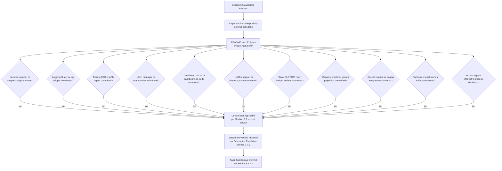

#### 6.5.6.4 Diagrams Explicitly Not Produced

The table below records, for traceability, the diagram classes requested by the Section 6.5 authoring prompt and the verified evidentiary basis on which each is excluded. This treatment is consistent with Sections 4.5.4, 5.6.4, 6.1.5.4, 6.2.6.4, 6.3.5.4, and 6.4.6.4.

| Required Diagram | Excluded Because | Authoritative Cross-Reference |
|---|---|---|
| Monitoring architecture diagram | No system, no components, no monitoring platforms, no metrics/log/trace pipelines | Section 5.5.1; Section 3.5.1; Section 1.2.2 |
| Alert flow diagram | No alert manager, no notification channels, no error-tracking, no on-call rotation, no escalation policy | Section 5.5.1; Section 5.5.2; Section 4.4.2 |
| Dashboard layout | No dashboarding platform, no metrics emission, no KPIs/SLAs against which to render panels | Section 5.5.1; Section 5.5.4; Section 1.2.3 |

### 6.5.7 Document Status and Re-Issuance Trigger Conditions

#### 6.5.7.1 Current Document Status

This Monitoring and Observability section accurately reflects the verified state of the Artifact6 repository as of the date of the sole "Initial commit" (Thursday, May 28, 2026, commit `6c6e455e3f59eb8208dcb9f11b1319b21e7cf3e5`). It establishes a baseline that, like Sections 1, 2, 3, 4, 5, 6.1, 6.2, 6.3, and 6.4, will be revised once substantive metrics, logging, tracing, alerting, dashboard, health-check, SLA/SLO, runbook, on-call, or post-mortem artifacts are committed. The section is consistent with the document-status framework articulated in Section 1.4.1, which anticipates that the System Architecture and observability-related content will be constrained by the absence of committed evidence until implementation artifacts are introduced.

#### 6.5.7.2 Re-Issuance Trigger Conditions

Consistent with the re-issuance framework established in Sections 2.7.2, 3.9, 4.6.2, 5.7.2, 6.1.6.2, 6.2.7.2, 6.3.6.2, and 6.4.7.2, the following events should trigger a complete re-authoring of this Monitoring and Observability section, replacing the verified-absence declaration and the per-element tables with substantive monitoring infrastructure, observability patterns, and incident-response procedures.

| Trigger Event | Required Re-Authoring Activity |
|---|---|
| First metrics emission or exporter configuration committed (Prometheus client library, OpenTelemetry SDK, StatsD client, `prometheus_client`, `micrometer`, scrape config) | Populate Section 6.5.2.1 (Metrics Collection) |
| First structured-logging library or log-shipper configuration committed (`logging` config, `structlog`, `winston`, `pino`, Fluent Bit, Vector, Filebeat) | Populate Section 6.5.2.2 (Log Aggregation) |
| First tracing instrumentation or APM agent committed (OpenTelemetry SDK, Jaeger client, Zipkin client, AWS X-Ray SDK, Datadog APM agent, New Relic APM agent) | Populate Section 6.5.2.3 (Distributed Tracing) |
| First alert manager or alert-rule configuration committed (Prometheus AlertManager, Grafana Alerting, Datadog Monitor, CloudWatch Alarm, PagerDuty Service definition) | Populate Section 6.5.2.4 (Alert Management) and Section 6.5.4.1 (Alert Routing) |
| First dashboard artifact committed (Grafana JSON dashboard, Datadog JSON dashboard, CloudWatch Dashboard, Kibana visualization, Terraform `grafana_dashboard` resource) | Populate Section 6.5.2.5 (Dashboard Design) |
| First health-check endpoint, liveness/readiness probe, or `HEALTHCHECK` directive committed | Populate Section 6.5.3.1 (Health Checks) |
| First SLA / SLO / SLI / performance budget / KPI artifact committed | Populate Section 6.5.3.2 (Performance Metrics), Section 6.5.3.4 (SLA Monitoring), and Section 6.5.5.1 (Alert Threshold Matrix) |
| First business-metric SDK or analytics-platform binding committed (Mixpanel, Amplitude, Segment, Heap, PostHog, Google Analytics) | Populate Section 6.5.3.3 (Business Metrics) |
| First capacity-planning artifact committed (traffic forecast, growth projection, concurrency model, resource-headroom policy) | Populate Section 6.5.3.5 (Capacity Tracking) |
| First on-call schedule, escalation policy, or paging integration committed (PagerDuty schedule, OpsGenie policy, VictorOps rotation, Slack alerting bot) | Populate Section 6.5.4.1 (Alert Routing) and Section 6.5.4.2 (Escalation Procedures) |
| First runbook, incident-response playbook, or `runbooks/` directory committed | Populate Section 6.5.4.3 (Runbooks) |
| First post-mortem template, `postmortems/` directory, or blameless-postmortem policy committed | Populate Section 6.5.4.4 (Post-Mortem Processes) |
| First error-budget policy, SRE retrospective cadence, MTBF/MTTR/MTTA tracking artifact, or chaos-engineering program committed | Populate Section 6.5.4.5 (Improvement Tracking) |
| First language runtime, framework, deployment platform, container runtime, or CI/CD manifest committed (e.g., `requirements.txt`, `package.json`, `go.mod`, `pom.xml`, `Dockerfile`, Kubernetes manifest, `.github/workflows/`) | Populate Section 6.5.5 (Standard Monitoring Practices Statement) with stack-default practices |

The recommended actions enumerated in Section 1.4.2 ("Populate substantive content," "Define stakeholders," "Establish technology baseline," "Re-issue this section") apply with equal force to this Monitoring and Observability section.

#### 6.5.7.3 Assumptions and Constraints

| Assumption / Constraint | Statement |
|---|---|
| Authoring Constraint | This section was authored solely from verified repository evidence as of the date of the Initial commit (Thursday, May 28, 2026). |
| Versioning Assumption | This is Version 1.0 of Section 6.5, baselined against commit `6c6e455e3f59eb8208dcb9f11b1319b21e7cf3e5`. |
| Fabrication Prohibition | Per Section 2.7.3, no metric, log, trace, alert rule, alert threshold, alert route, dashboard, health probe, performance metric, business metric, SLA, SLO, SLI, KPI, capacity model, on-call rotation, escalation policy, runbook, post-mortem template, error-budget policy, or improvement-tracking artifact has been inferred or imagined. |
| Default-Stack Treatment | The Default Technology Stack recorded in Section 3.1.3 (including AWS as candidate cloud platform supplying CloudWatch metrics/logs and X-Ray tracing primitives, Docker as candidate container runtime supplying stdout/stderr capture, GitHub Actions as candidate CI/CD platform supplying pipeline-observability primitives, and Python/Flask as candidate language/framework supplying `logging` and `werkzeug` access-log defaults) is preserved as a forward-looking candidate set but is explicitly excluded as a basis for inventing metrics pipelines, log streams, trace topologies, alert routes, dashboards, or incident-response procedures in this section, in accordance with the verified absences recorded in Sections 3.5.1, 3.5.2, 5.5.1, and 5.5.4. |
| Diagrammatic Discipline | Only diagrams that depict verified-state relationships (Sections 6.5.6.2 and 6.5.6.3) are authored; the diagram classes enumerated in Section 6.5.6.4 (monitoring architecture, alert flow, dashboard layout) are explicitly omitted in compliance with Section 2.7.3. |
| Section Applicability | The non-applicability declaration in 6.5.1.1 is invoked under the explicit clause of the Section 6.5 authoring prompt that permits such a declaration when "the system does not require specific monitoring beyond basic health checks." Section 6.5.5 further establishes that no "basic monitoring practices" can be honestly asserted either, because no language runtime, framework, deployment platform, container runtime, or CI/CD platform has been adopted to imply any specific defaults. |
| Future-State Assumption | Future versions of this section will be authored once the substantive commitments enumerated in Section 6.5.7.2 (and the related artifacts referenced in Sections 1.4.2, 2.7.2, 3.9, 4.6.2, 5.7.2, 6.1.6.2, 6.2.7.2, 6.3.6.2, and 6.4.7.2) have been satisfied. |

### 6.5.8 References

#### 6.5.8.1 Repository Artifacts Examined

- `README.md` — Sole tracked file in the repository (11 bytes); contains only the single line `# Artifact6`. Establishes the pre-implementation, placeholder state on which the non-applicability declaration for Monitoring and Observability rests.
- `/` (repository root) — Inspected at depth 0; confirmed to contain only `README.md` as its first-order child. No `monitoring/`, `observability/`, `metrics/`, `logs/`, `logging/`, `tracing/`, `alerts/`, `dashboards/`, `runbooks/`, `postmortems/`, `oncall/`, `slo/`, `sla/`, `capacity/`, `health/`, `.github/`, `infra/`, or any other directory that would establish a metrics pipeline, log aggregation, distributed tracing, alert manager, dashboard catalog, health probe, on-call rotation, runbook, post-mortem template, or incident-response process.

#### 6.5.8.2 Technical Specification Sections Referenced

- **Section 1.1.1** — Establishes the verified pre-implementation lifecycle stage and baseline commit details on which the non-applicability declaration is anchored.
- **Section 1.2.1** — Establishes the verified absence of integration with external systems and enterprise architecture artifacts relevant to monitoring agent deployment.
- **Section 1.2.2** — Establishes the verified absence of source files in which logging, tracing, or metrics instrumentation could be implemented.
- **Section 1.2.3** — Primary authoritative source: establishes the verified absence of measurable objectives, critical success factors, key performance indicators (KPIs), and service-level objectives (SLOs) / service-level agreements (SLAs) against which monitoring would be designed.
- **Section 1.3.4** — Provides the canonical verified-state diagram incorporated by reference in Section 6.5.6.1.
- **Section 1.4.1 / 1.4.2** — Provides the document-status framework and recommended actions that govern this section's posture.
- **Section 2.3.3** — Establishes the verified absence of declared data requirements relevant to business-metric taxonomies and PII-redaction policies in logs.
- **Section 2.7.1** — Anticipates that subsequent sections, including Security and Deployment, will be constrained by the absence of committed evidence until implementation artifacts are introduced.
- **Section 2.7.2** — Provides the re-issuance trigger framework that Section 6.5.7.2 extends and specializes for Monitoring and Observability.
- **Section 2.7.3** — Records the binding Fabrication Prohibition that underwrites every verified-absence finding in this section.
- **Section 3.1.3** — Identifies the Default Technology Stack candidates (including AWS, Docker, GitHub Actions, Python, Flask, Langchain) relevant to monitoring architecture and explicitly excludes them as a basis for fabrication.
- **Section 3.3.1** — Establishes the verified absence of frameworks and libraries (including logging libraries) declared in the repository.
- **Section 3.5.1** — Primary authoritative source: establishes the verified absence of monitoring/observability platforms, error-tracking services, analytics platforms, cloud platforms, and notification/messaging services relevant to monitoring infrastructure.
- **Section 3.5.2** — Primary authoritative source: establishes the verified absence of canonical monitoring configuration artifacts (`newrelic.yml`, `datadog.yaml`, Sentry DSN configuration, email/messaging SDK configs for alert routing, environment-variable templates).
- **Section 3.6.1** — Establishes the verified absence of message brokers and event stores relevant to event-based metrics and alerts.
- **Section 3.6.3** — Establishes the verified absence of data-retention policy relevant to log retention and audit-log retention.
- **Section 3.7** — Establishes the verified absence of containerization (no Dockerfile), orchestration (no Kubernetes manifests), CI/CD (no `.github/workflows/`), and infrastructure-as-code relevant to monitoring agent deployment, sidecar injection, probe configuration, and pipeline observability.
- **Section 3.9** — Provides the re-issuance trigger pattern adopted in Section 6.5.7.2 for monitoring-related commitments.
- **Section 4.2.2** — Establishes the verified absence of event processing flows and integration workflows relevant to event-driven metrics and alerts.
- **Section 4.4.2** — Primary authoritative source: establishes the verified absence of retry mechanisms, fallback processes, error-notification flows, and recovery procedures relevant to alert routing and incident response.
- **Section 4.5.4** — Provides the precedent for documenting diagrams explicitly not produced, replicated in Section 6.5.6.4.
- **Section 4.6.2** — Provides the re-issuance trigger framework that Section 6.5.7.2 extends.
- **Section 5.2.1** — Establishes the verified absence of an overall architecture style relevant to observability topology selection.
- **Section 5.2.2** — Establishes the verified absence of components against which per-service observability could be designed.
- **Section 5.2.4** — Establishes the verified absence of external integration points relevant to synthetic monitoring and dependency observability.
- **Section 5.5.1** — Primary authoritative source: establishes the verified absence of monitoring/observability platform, APM agent configuration, logging library/strategy, distributed tracing strategy, and error-tracking service.
- **Section 5.5.2** — Primary authoritative source: establishes the verified absence of retry/back-off policy, circuit-breaker/bulkhead policy, fallback process, error-notification flow, and recovery procedure relevant to alert generation and incident response.
- **Section 5.5.4** — Primary authoritative source: establishes the verified absence of performance budgets, SLOs, SLAs, KPIs, latency/throughput targets, and scalability considerations against which monitoring thresholds, dashboards, and SLA tracking would be designed.
- **Section 5.5.5** — Establishes the verified absence of disaster-recovery plan, backup cadence, RPO/RTO, and data-residency declarations relevant to incident response and operational readiness.
- **Section 5.6.2 / 5.6.3 / 5.6.4** — Provides the diagrammatic precedents (verified-absence mapping, authoring decision flow, diagrams explicitly not produced) replicated in Section 6.5.6.
- **Section 5.7.2** — Provides the re-issuance trigger catalog that Section 6.5.7.2 extends and specializes for Monitoring and Observability.
- **Section 6.1** — Direct structural precedent for Section 6; establishes the "Not Applicable" declaration pattern for top-level Section 6 subsections.
- **Section 6.1.2.4** — Establishes the verified absence of load balancing relevant to load-balancer health-check target configuration.
- **Section 6.1.3.2** — Establishes the verified absence of auto-scaling triggers relevant to capacity tracking and metric-based scaling alerts.
- **Section 6.1.3.3** — Establishes the verified absence of resource allocation strategy relevant to saturation alerts and resource-headroom policy.
- **Section 6.1.3.4** — Establishes the verified absence of performance optimization techniques relevant to performance-metric instrumentation.
- **Section 6.1.3.5** — Primary authoritative source: establishes the verified absence of capacity planning guidelines including traffic forecasts, concurrency models, growth projections, and cost-to-capacity model.
- **Section 6.1.4.2** — Primary authoritative source: establishes the verified absence of runbooks and incident-response procedures.
- **Section 6.1.4.4** — Primary authoritative source: establishes the verified absence of health-check definitions, including Kubernetes probes and load-balancer health-check targets.
- **Section 6.1.5.1 / 6.1.5.2 / 6.1.5.3 / 6.1.5.4** — Direct diagrammatic precedent for Section 6.5.6, including the canonical verified-state reference, verified-absence mapping diagram pattern, authoring-decision-flow diagram pattern, and "Diagrams Explicitly Not Produced" table pattern.
- **Section 6.1.6.2** — Direct re-issuance trigger catalog precedent for Section 6.5.7.2.
- **Section 6.2** — Direct structural precedent for Section 6; establishes the "Not Applicable" declaration pattern with full evidentiary backing.
- **Section 6.2.7.2** — Direct re-issuance trigger catalog precedent for Section 6.5.7.2.
- **Section 6.3** — Direct structural precedent for Section 6; establishes the "Not Applicable" declaration pattern for an integration-centric architectural domain.
- **Section 6.3.3.1** — Establishes the verified absence of event processing patterns relevant to event-driven metrics and business event analytics.
- **Section 6.3.3.2** — Establishes the verified absence of message queue architecture relevant to queue-depth alerts and DLQ monitoring.
- **Section 6.3.3.5** — Establishes the verified absence of integration error handling strategy relevant to error-notification flows and DLQ rate alerts.
- **Section 6.3.4.4** — Establishes the verified absence of external service contracts relevant to dependency SLA/SLO monitoring and synthetic-monitoring of external dependencies.
- **Section 6.3.5.4** — Direct diagrammatic precedent for "Diagrams Explicitly Not Produced" table in Section 6.5.6.4.
- **Section 6.3.6.2** — Direct re-issuance trigger catalog precedent for Section 6.5.7.2.
- **Section 6.4** — Direct structural precedent for Section 6; establishes the "Not Applicable" declaration pattern with full evidentiary backing for a cross-cutting concern domain.
- **Section 6.4.3.5** — Establishes the verified absence of audit logging (security-event logger, SIEM forwarder, audit-event taxonomy, tamper-evident storage) relevant to security/audit-event alerting in the alert threshold matrix.
- **Section 6.4.5** — Direct structural precedent for Section 6.5.5 (Standard Monitoring Practices Statement); establishes the methodology for handling the parallel "standard practices" sub-clause in the authoring prompt when no foundational stack has been adopted.
- **Section 6.4.6.4** — Most recent direct diagrammatic precedent for "Diagrams Explicitly Not Produced" table in Section 6.5.6.4.
- **Section 6.4.7.2** — Most recent direct re-issuance trigger catalog precedent for Section 6.5.7.2.

## 6.6 Testing Strategy

**Detailed Testing Strategy is not applicable for this system.**

This determination is grounded in verified repository evidence as of the sole "Initial commit" (Thursday, May 28, 2026, commit `6c6e455e3f59eb8208dcb9f11b1319b21e7cf3e5`). The Artifact6 repository contains a single tracked file — `README.md` (11 bytes) — whose entire content is the single line `# Artifact6`. As established in Section 3.3.1, the "Testing framework" status is recorded as "None adopted." As established in Section 3.3.2, each of the canonical testing-configuration artifacts (`jest.config.js`, `vitest.config.ts`, `pytest.ini`, `phpunit.xml`) is verified absent from the working tree. As established in Section 3.4, no declared direct dependencies and no declared development or test dependencies appear in the repository, and no lockfiles of any ecosystem are present. As established in Section 3.2, no programming languages are in use by the Artifact6 system, and no source files of any language extension exist — there is, accordingly, no code to test. As established in Section 3.7, no development tooling, build system, containerization, CI/CD pipeline, or pre-commit hook framework has been configured, and every CI/CD platform (GitHub Actions, GitLab CI, CircleCI, Jenkins, Azure Pipelines, Travis CI, Buildkite, Drone CI) is verified absent. Authoring testing strategy content on such a foundation would constitute fabrication and is therefore deliberately and disciplinarily withheld in compliance with the Fabrication Prohibition recorded in Section 2.7.3.

The Section 6.6 authoring prompt explicitly contemplates this case and instructs the author, when "the system is a simple library, tool, or does not require comprehensive testing," to "clearly state 'Detailed Testing Strategy is not applicable for this system' and explain why, then document only the basic unit testing approach that will be used." The subsections below document, with traceable evidentiary cross-references, the verified absence of every requested element under Testing Approach (Unit Testing, Integration Testing, End-to-End Testing), Test Automation, and Quality Metrics; address the prompt's secondary instruction regarding "basic unit testing approach" (Section 6.6.5); provide the diagrammatic treatment mandated for verified-absence sections; and define the precise commit events that will trigger re-authoring of this section. The structural pattern is directly inherited from Sections 6.1 (Core Services Architecture), 6.2 (Database Design), 6.3 (Integration Architecture), 6.4 (Security Architecture), and 6.5 (Monitoring and Observability), each of which declared non-applicability with full evidentiary backing.

### 6.6.1 Applicability Determination

#### 6.6.1.1 Applicability Statement

Testing Strategy — encompassing a Testing Approach (unit testing, integration testing, end-to-end testing), a Test Automation regime (CI/CD integration, automated test triggers, parallel test execution, test reporting, failed test handling, flaky test management), and a Quality Metrics framework (code coverage targets, test success rate requirements, performance test thresholds, quality gates, documentation requirements) — is **not applicable** for the Artifact6 system in its current verified state. There is no system, in the engineering sense of the term, against which any of these testing dimensions can be evaluated, designed, or documented. There are no source files to exercise via unit tests, no services to exercise via integration tests, no user interfaces to exercise via end-to-end tests, no pipelines to integrate with, no thresholds to enforce, and no quality gates to evaluate, because none of these elements have been committed to the repository.

#### 6.6.1.2 Rationale for Non-Applicability

The determination of non-applicability is supported by seven categories of converging evidence drawn from prior sections of this Technical Specification. Each category is independently sufficient to compel the non-applicability declaration; together, they render the determination unambiguous.

| Evidentiary Category | Verified Finding | Authoritative Cross-Reference |
|---|---|---|
| No testing framework adopted | "Testing framework: None adopted" | Section 3.3.1 |
| No testing configuration artifacts present | `jest.config.js`, `vitest.config.ts`, `pytest.ini`, `phpunit.xml` all absent | Section 3.3.2 |
| No declared dev/test dependencies | No direct dependencies and no lockfiles of any ecosystem | Section 3.4 |
| No source code to test | No programming languages adopted; no source files of any extension | Section 3.2; Section 1.2.2 |
| No CI/CD or build automation | No build system, no containerization, no CI/CD pipelines, no pre-commit hooks | Section 3.7 |
| No performance, SLA, or quality baselines | No performance budgets, no SLOs, no SLAs, no KPIs, no coverage targets | Section 5.5.4; Section 1.2.3 |
| No system to exercise | No components, no modules, no architecture style, no integration points, no UI | Section 5.2.1; Section 5.2.2; Section 1.2.2 |

Because Artifact6 has not committed any test framework manifest, any test runner configuration, any test file, any mock library declaration, any coverage tool configuration, any CI/CD workflow, any test environment specification, any quality gate artifact, or any performance benchmark, the very precondition for a Testing Strategy — the existence of testable code, an executable runtime, and a measurable behavior contract — is absent from the repository. The section prompt's anticipated non-applicability clause is therefore controlling.

The Default Technology Stack recorded in Section 3.1.3 lists Python/Flask as candidate backend technologies (and therefore the candidate locus for `pytest`, `unittest`, `Flask-Testing`, and `coverage.py`), React with TypeScript as a candidate frontend stack (and therefore the candidate locus for Jest, Vitest, React Testing Library, and `nyc`/`istanbul`), React Native with TypeScript as a candidate mobile stack (and therefore the candidate locus for Detox and React Native Testing Library), Swift/Kotlin/Objective-C as candidate native mobile languages (and therefore the candidate loci for XCTest and JUnit/Espresso), ElectronJS as a candidate desktop runtime (and therefore the candidate locus for Spectron/Playwright), MongoDB as a candidate database (and therefore the candidate target for `mongodb-memory-server` integration testing), Auth0 as a candidate identity provider (and therefore the candidate target for authentication-flow mocking), GitHub Actions as the candidate CI/CD platform (and therefore the candidate host for automated test execution), and Docker as the candidate container runtime (and therefore the candidate target for Testcontainers integration). However, as expressly noted in Sections 3.3.1, 3.3.2, 3.4, 3.7, and 5.5.4, none of these candidates has been committed to the repository, and no manifest, configuration file, or workflow definition references any of them. Accordingly, none of these candidates can be recorded as constituting the current testing strategy and none can serve as a basis for inventing test frameworks, test organizations, coverage thresholds, CI workflows, or quality gates in this section.

#### 6.6.1.3 Authoring Methodology

This section follows the verified-absence specification methodology established in Section 2.1, applied consistently across Sections 2.5, 3.1, 4.2, 4.4, 5.2, 5.3, 5.4, and 5.5, and directly inherited from Sections 6.1, 6.2, 6.3, 6.4, and 6.5. The methodology consists of four disciplines:

1. **Element Enumeration.** Each testing element requested by the prompt is enumerated in tabular form so that the reader can confirm complete coverage of the prompt's three major categories (Testing Approach, Test Automation, Quality Metrics) and their constituent elements.
2. **Verified-Status Marking.** Each element is marked "None adopted," "None configured," "None defined," "None committed," or "Not applicable" against committed evidence, never against speculation.
3. **Authoritative Cross-Referencing.** Each absence is traced to a prior, independently authored section of this Technical Specification that supplies the underlying evidence.
4. **Diagrammatic Restraint.** Diagrams are produced only where they depict the verified state. Test execution flow diagrams, test environment architecture diagrams, and test data flow diagrams that would require fabrication of test runners, test stages, environment topologies, fixture pipelines, or test data lineages are explicitly declined, mirroring the precedents in Sections 4.5.4, 5.6.4, 6.1.5.4, 6.2.6.4, 6.3.5.4, 6.4.6.4, and 6.5.6.4.

### 6.6.2 Testing Approach — Verified Absence

The Testing Approach dimension requested by the section prompt encompasses three major sub-dimensions (Unit Testing, Integration Testing, End-to-End Testing) and their constituent elements. Each is verified absent and is treated below.

#### 6.6.2.1 Unit Testing

No unit testing framework, test organization structure, mocking strategy, code coverage tooling, test naming convention, or test data management strategy is configured. As established in Section 3.3.1, the "Testing framework" status is explicitly recorded as "None adopted," and Section 3.3.2 verifies that the canonical unit-testing configuration artifacts (`jest.config.js`, `vitest.config.ts`, `pytest.ini`, `phpunit.xml`) are each absent from the working tree. Section 3.4 corroborates this by establishing that no direct or development dependencies have been declared in any ecosystem, so no testing library (`pytest`, `unittest`, `jest`, `vitest`, `mocha`, `chai`, `JUnit`, `TestNG`, `NUnit`, `xUnit`, `RSpec`, `Minitest`, `go test`) is present in the repository. Because no programming languages are in use (Section 3.2), no source files exist to be exercised by any unit test.

| Unit Testing Element | Verified Status | Authoritative Cross-Reference |
|---|---|---|
| Testing framework (`pytest`, `jest`, `vitest`, `JUnit`, `xUnit`, `RSpec`, `go test`) | None adopted | Section 3.3.1; Section 3.3.2 |
| Test runner configuration (`pytest.ini`, `jest.config.js`, `vitest.config.ts`, `phpunit.xml`) | None present | Section 3.3.2 |
| Test organization structure (`tests/`, `__tests__/`, `spec/`, `*_test.go`, sibling `*.test.ts`) | None present | Section 1.5.2; Section 3.2 |
| Mocking strategy / mock library (`unittest.mock`, `jest.mock`, `sinon`, `mockito`, `WireMock`) | None defined | Section 3.4; Section 3.3.1 |
| Code coverage tooling (`coverage.py`, `nyc`/`istanbul`, `jacoco`, `gcov`, Cobertura) | None configured | Section 3.4; Section 3.7 |
| Test naming convention (Given-When-Then, `should_*`, `test_*`, Arrange-Act-Assert) | None defined | Section 1.2.2; Section 3.3.1 |
| Test data management (fixtures, factories, builders, parameterized data) | None defined | Section 2.3.3; Section 3.6.1 |

#### 6.6.2.2 Integration Testing

No integration testing approach, API testing strategy, database integration testing framework, external service mocking, or test environment management strategy is configured. As established in Section 5.2.2, no application components have been declared, and Section 6.3 establishes the verified absence of any integration architecture. Section 6.3.2.1 confirms that no API endpoints have been defined, so no API testing surface exists. Section 6.2.1 confirms that no database engine has been selected, so no database integration testing target exists. Section 3.5.1 confirms that no third-party services or cloud platforms have been configured, so no external service mocks are required. Section 3.7 confirms that no test environment has been provisioned through containerization, orchestration, or infrastructure-as-code.

| Integration Testing Element | Verified Status | Authoritative Cross-Reference |
|---|---|---|
| Service integration test approach (in-process, contract test, service stub) | None defined | Section 5.2.2; Section 6.1.2 |
| API testing strategy (Postman, REST Assured, supertest, Pact, Schemathesis) | None defined | Section 6.3.2.1; Section 6.3.2.6 |
| Database integration testing (Testcontainers, embedded DB, transaction rollback) | None defined | Section 6.2.1; Section 3.6.2 |
| External service mocking (WireMock, MSW, nock, VCR, Mountebank) | None configured | Section 3.5.1; Section 6.3.4.1 |
| Test environment management (Docker Compose, ephemeral env, namespace per build) | None defined | Section 3.7; Section 3.5.1 |
| Contract / consumer-driven contract testing (Pact, Spring Cloud Contract) | None configured | Section 6.3.2.1; Section 6.3.4.4 |

#### 6.6.2.3 End-to-End Testing

No end-to-end test scenarios, UI automation framework, test data setup/teardown procedure, performance testing tool, or cross-browser testing strategy is configured. As established in Section 4.2.1, no end-to-end user journeys or system workflows have been declared, and Section 2.2 corroborates this by establishing the absence of any feature catalog from which E2E scenarios could be derived. Section 3.3.1 confirms that no UI automation framework has been adopted, and Section 3.3.2 confirms that no canonical UI test configuration is present. Section 5.5.4 establishes the verified absence of performance budgets, latency targets, and throughput targets — so no performance test thresholds exist to enforce. Section 3.5.1 confirms that no cross-browser testing service (BrowserStack, Sauce Labs, LambdaTest) is configured.

| End-to-End Testing Element | Verified Status | Authoritative Cross-Reference |
|---|---|---|
| E2E test scenarios / user journeys | None defined | Section 4.2.1; Section 2.2 |
| UI automation framework (Cypress, Playwright, Selenium, Puppeteer, Detox) | None configured | Section 3.3.1; Section 3.3.2 |
| Test data setup / teardown (fixtures, seed scripts, database reset) | None defined | Section 6.2.3.1; Section 2.3.3 |
| Performance testing tool (k6, JMeter, Gatling, Locust, Artillery, wrk) | None configured | Section 5.5.4; Section 6.1.3.4 |
| Cross-browser testing (BrowserStack, Sauce Labs, LambdaTest, local matrix) | None configured | Section 3.5.1 |
| Mobile / device-cloud testing (Firebase Test Lab, AWS Device Farm) | None configured | Section 3.5.1; Section 3.3.1 |
| Accessibility testing (axe-core, Pa11y, Lighthouse a11y) | None configured | Section 3.3.1; Section 2.2 |
| Visual regression testing (Percy, Chromatic, Applitools) | None configured | Section 3.5.1; Section 3.3.1 |

The Test Strategy Matrix below — required by the Section 6.6 prompt's output format directive — is populated against verified-absence findings:

| Test Tier | Required Tooling | Verified Status | Primary Cross-Reference |
|---|---|---|---|
| Unit | Framework + runner + mock library + coverage tool | All None adopted | Section 3.3.1; Section 3.4 |
| Integration | Test harness + DB / service double + environment manager | All None configured | Section 6.2.1; Section 6.3 |
| End-to-End | UI automation + scenario catalog + data seed/teardown | All None defined | Section 4.2.1; Section 3.3.1 |
| Performance | Load generator + threshold definitions + result store | All None configured | Section 5.5.4; Section 3.7 |

### 6.6.3 Test Automation — Verified Absence

The Test Automation dimension requested by the section prompt encompasses six elements: CI/CD integration, automated test triggers, parallel test execution, test reporting requirements, failed test handling, and flaky test management. Each is verified absent and is treated below.

#### 6.6.3.1 CI/CD Integration

No CI/CD test integration is configured. As established in Section 3.7, no CI/CD pipelines are configured, and every canonical CI/CD platform (GitHub Actions, GitLab CI, CircleCI, Jenkins, Azure Pipelines, Travis CI, Buildkite, Drone CI) is verified absent. Because there is no `.github/workflows/` directory, no `.gitlab-ci.yml`, no `Jenkinsfile`, no `azure-pipelines.yml`, no `.circleci/config.yml`, no `.travis.yml`, and no `.buildkite/pipeline.yml` (Section 3.7.4), there is no pipeline definition into which a test stage could be inserted, no job definition that could invoke a test runner, and no artifact upload step that could publish test results.

| CI/CD Integration Element | Verified Status | Authoritative Cross-Reference |
|---|---|---|
| CI/CD platform configuration (GitHub Actions, GitLab CI, Jenkins, Azure DevOps) | None configured | Section 3.7.4 |
| Test job / stage definition in pipeline | None present | Section 3.7.4; Section 3.7 |
| Test artifact publishing (JUnit XML, coverage reports, screenshots) | None configured | Section 3.7; Section 5.5.1 |
| Build status badges / pipeline visibility | None configured | Section 3.7.4 |

#### 6.6.3.2 Automated Test Triggers

No automated test triggers are defined. As established in Section 3.7.4, no CI/CD platform is configured against which trigger semantics could be declared, and no pre-commit hook framework (`pre-commit`, Husky, lefthook) is present (Section 3.7). There is no on-push trigger, no pull-request / merge-request trigger, no scheduled (cron) trigger, no manual-dispatch trigger, no tag-based release trigger, no branch-protection-required check, and no path-filter trigger committed to the repository.

| Automated Trigger Element | Verified Status | Authoritative Cross-Reference |
|---|---|---|
| On-push trigger (per-branch policy) | None defined | Section 3.7.4 |
| Pull-request / merge-request trigger | None defined | Section 3.7.4 |
| Scheduled / cron trigger (nightly, weekly) | None defined | Section 3.7.4 |
| Manual / workflow-dispatch trigger | None defined | Section 3.7.4 |
| Pre-commit / pre-push hook (`pre-commit`, Husky, lefthook) | None configured | Section 3.7 |
| Tag / release trigger | None defined | Section 3.7.4 |

#### 6.6.3.3 Parallel Test Execution

No parallel test execution strategy is defined. As established in Section 3.7, no build system or test runner is configured against which parallelism could be tuned, and Section 3.7.4 confirms that no CI/CD platform exists at which compute fan-out (matrix builds, shards, parallel jobs) could be defined. There is no shard-count policy, no per-shard timeout, no test-isolation strategy (process, container, namespace), no parallel-safe fixture convention, no flaky-test quarantine for parallel runs, and no runner-pool capacity model.

| Parallel Execution Element | Verified Status | Authoritative Cross-Reference |
|---|---|---|
| Test sharding / matrix configuration | None defined | Section 3.7.4; Section 3.7 |
| Per-runner timeout policy | None defined | Section 3.7.4 |
| Test isolation strategy (process, container, namespace) | None defined | Section 3.7; Section 5.5.2 |
| Parallel-safe fixture / shared-resource convention | None defined | Section 6.2.3.1 |
| Runner pool / capacity model | None established | Section 6.1.3.5; Section 3.7 |

#### 6.6.3.4 Test Reporting

No test reporting tooling is configured. As established in Section 5.5.1, no monitoring or observability platform is configured against which test result telemetry could be emitted, and Section 3.5.1 confirms that no error-tracking service, analytics platform, or notification service is configured. There is no JUnit-format XML report convention, no test-result database (TestRail, Zephyr, qTest, Allure server), no test dashboard, no per-PR result summary bot, no historical trend visualization, and no notification channel (Slack, Teams, email) for test results.

| Test Reporting Element | Verified Status | Authoritative Cross-Reference |
|---|---|---|
| Test result format / artifact (JUnit XML, TAP, Allure JSON, NUnit XML) | None defined | Section 3.7; Section 5.5.1 |
| Test-result aggregator / dashboard (Allure, ReportPortal, TestRail) | None configured | Section 3.5.1; Section 5.5.1 |
| Per-PR / per-commit result summary | None defined | Section 3.7.4 |
| Historical trend tracking (pass rate, duration, flakiness over time) | None defined | Section 5.5.1; Section 5.5.4 |
| Notification channel for test results (Slack, Teams, email, webhook) | None configured | Section 3.5.1; Section 3.5.2 |

#### 6.6.3.5 Failed Test Handling

No failed test handling procedure is defined. As established in Section 5.5.2, no retry/back-off policy, no fallback process, no error-notification flow, and no recovery procedure is documented for any system event — and the same verified absence extends to test-failure events. Section 4.4.2 corroborates this finding through the broader absence of any error-notification flow. There is no automatic retry-on-failure policy, no fail-fast vs. fail-late convention, no test-blocking-merge policy, no automatic bug-tracker integration (Jira, Linear, GitHub Issues), no auto-assignment policy (CODEOWNERS, blame-based routing), and no escalation policy for repeatedly failing tests.

| Failed Test Handling Element | Verified Status | Authoritative Cross-Reference |
|---|---|---|
| Automatic retry-on-failure policy (retry count, back-off) | None defined | Section 5.5.2; Section 4.4.2 |
| Fail-fast vs. fail-late execution policy | None defined | Section 5.5.2 |
| Test-failure-blocks-merge policy (required status check) | None defined | Section 3.7.4 |
| Automatic bug-tracker integration on failure (Jira, GitHub Issues, Linear) | None configured | Section 3.5.1; Section 3.7 |
| Auto-assignment / routing of failures (CODEOWNERS, blame-based) | None defined | Section 3.7; Section 1.2.2 |
| Escalation policy for repeated failures | None defined | Section 5.5.2 |

#### 6.6.3.6 Flaky Test Management

No flaky test management strategy is defined. As established in Section 5.5.2, no observability infrastructure is configured against which flake rates could be measured. There is no flake-detection convention (rerun-on-failure with delta analysis, statistical-flakiness scoring), no flaky-test quarantine mechanism (skip annotation, separate runner pool), no flake-budget policy (allowed flakes per release, freeze threshold), no flake-tracking dashboard, no root-cause taxonomy (timing, environmental, ordering, external dependency), and no remediation SLA.

| Flaky Test Management Element | Verified Status | Authoritative Cross-Reference |
|---|---|---|
| Flake detection (rerun-on-failure, statistical scoring) | None defined | Section 5.5.2; Section 5.5.1 |
| Flaky-test quarantine mechanism (skip annotation, isolated runner) | None defined | Section 5.5.2 |
| Flake-budget / freeze-threshold policy | None defined | Section 5.5.4 |
| Flake-tracking dashboard or tooling | None configured | Section 5.5.1; Section 5.5.4 |
| Root-cause taxonomy (timing, env, ordering, external dep) | None defined | Section 5.5.2 |
| Remediation SLA per flaky-test ticket | None defined | Section 5.5.4 |

### 6.6.4 Quality Metrics — Verified Absence

The Quality Metrics dimension requested by the section prompt encompasses five elements: code coverage targets, test success rate requirements, performance test thresholds, quality gates, and documentation requirements. Each is verified absent and is treated below.

#### 6.6.4.1 Code Coverage Targets

No code coverage targets are defined. As established in Section 1.2.3, no measurable objectives, critical success factors, key performance indicators (KPIs), or service-level objectives (SLOs) have been declared. Section 5.5.4 corroborates this finding through the absence of all performance budgets and quality baselines. Because no coverage tool is configured (Section 6.6.2.1) and no source code exists to be measured (Section 3.2), no statement-coverage target, no branch-coverage target, no condition-coverage target, no decision-coverage target, no MC/DC target, no mutation-score target, no per-module coverage policy, and no coverage-trend-must-not-regress policy can be declared.

| Code Coverage Element | Verified Status | Authoritative Cross-Reference |
|---|---|---|
| Statement / line coverage target | None defined | Section 1.2.3; Section 5.5.4 |
| Branch coverage target | None defined | Section 1.2.3; Section 5.5.4 |
| Condition / decision / MC/DC coverage target | None defined | Section 5.5.4 |
| Mutation testing score (PIT, Stryker, mutmut) | None defined | Section 5.5.4 |
| Per-module / per-package coverage policy | None defined | Section 1.2.3 |
| Coverage regression policy (delta threshold per PR) | None defined | Section 5.5.4; Section 3.7.4 |

#### 6.6.4.2 Test Success Rate Requirements

No test success rate requirements are defined. As established in Section 5.5.4, "Service-level agreements (SLAs): None defined" and "Key performance indicators (KPIs): None defined." Section 1.2.3 corroborates this finding through the absence of measurable objectives. There is no minimum pass-rate threshold (e.g., 100% required, 99.5% acceptable), no acceptable-flake-rate threshold, no per-test-tier success target (unit vs. integration vs. E2E), no rolling-window success-rate KPI, no green-build SLO, and no red-build escalation cadence.

| Test Success Rate Element | Verified Status | Authoritative Cross-Reference |
|---|---|---|
| Minimum pass-rate threshold per pipeline run | None defined | Section 5.5.4; Section 1.2.3 |
| Acceptable flake rate threshold | None defined | Section 5.5.4 |
| Per-tier success target (unit / integration / E2E) | None defined | Section 1.2.3 |
| Rolling-window success-rate KPI (7-day, 30-day) | None defined | Section 5.5.4 |
| Green-build SLO and red-build escalation cadence | None defined | Section 5.5.4 |

#### 6.6.4.3 Performance Test Thresholds

No performance test thresholds are defined. As established in Section 5.5.4, no performance budgets, latency/throughput targets, or scalability considerations are defined. Section 6.1.3.4 corroborates this finding through the absence of any performance optimization techniques. Because no performance testing tool is configured (Section 6.6.2.3) and no production-load profile has been declared (Section 6.1.3.5), no latency-percentile thresholds (p50, p90, p95, p99), no throughput thresholds (RPS, TPS), no resource-saturation thresholds (CPU, memory, disk, network), no soak-test endurance thresholds, no stress-test breaking-point thresholds, and no spike-test recovery thresholds can be declared.

| Performance Threshold Element | Verified Status | Authoritative Cross-Reference |
|---|---|---|
| Latency percentile threshold (p50, p90, p95, p99) | None defined | Section 5.5.4; Section 6.1.3.4 |
| Throughput threshold (RPS, TPS, concurrent users) | None defined | Section 5.5.4 |
| Resource-saturation threshold (CPU, memory, disk, network) | None defined | Section 6.1.3.3; Section 6.1.3.4 |
| Soak / endurance test duration and tolerance | None defined | Section 5.5.4 |
| Stress test breaking-point threshold | None defined | Section 5.5.4 |
| Spike test recovery threshold | None defined | Section 5.5.4 |

#### 6.6.4.4 Quality Gates

No quality gates are defined. As established in Section 3.7, no build system, CI/CD platform, or development tooling is configured against which gate evaluation could be defined. Section 5.5.4 corroborates this finding through the absence of all SLOs, SLAs, and KPIs that would inform gate criteria. There is no coverage-floor gate, no test-pass-rate gate, no security-scan gate (SonarQube, Snyk, Trivy, Dependabot, CodeQL, Checkmarx, Fortify), no static-analysis gate (ESLint, Pylint, golangci-lint, RuboCop), no license-compliance gate (FOSSA, Black Duck, Snyk License), no SBOM-generation gate, no branch-protection rule, and no merge-blocking required-check policy committed to the repository.

| Quality Gate Element | Verified Status | Authoritative Cross-Reference |
|---|---|---|
| Coverage floor gate (e.g., 80% line, 75% branch) | None defined | Section 3.7; Section 5.5.4 |
| Test pass-rate gate (e.g., 100% required) | None defined | Section 3.7.4; Section 5.5.4 |
| Security scan gate (SAST, SCA, container scan, secrets) | None configured | Section 3.7; Section 5.5.1 |
| Static analysis gate (lint, type-check, complexity threshold) | None configured | Section 3.7 |
| License compliance gate (FOSSA, Snyk License, Black Duck) | None configured | Section 3.4; Section 3.7 |
| SBOM generation gate (Syft, CycloneDX, SPDX) | None configured | Section 3.4; Section 3.7 |
| Branch protection / required-check policy | None defined | Section 3.7.4 |

#### 6.6.4.5 Documentation Requirements

No test documentation requirements are defined. As established in Section 1.2.2, no source files of any extension exist — and thus no docstring, README test section, or inline test commentary is present. Section 5.7.2 establishes the broader re-issuance trigger framework for documentation; no test plan template, test strategy document, test case repository, traceability matrix (requirement → test), test report template, or operational testing-runbook has been committed.

| Test Documentation Element | Verified Status | Authoritative Cross-Reference |
|---|---|---|
| Test plan / test strategy document | None present | Section 5.7.2; Section 1.2.2 |
| Test case repository / catalog | None present | Section 1.2.2; Section 3.7 |
| Requirement → test traceability matrix | None defined | Section 2.6; Section 5.7.2 |
| Test report / release-readiness template | None defined | Section 5.7.2 |
| Testing runbook / on-failure playbook | None present | Section 6.1.4.2; Section 6.5.4.3 |
| README / `CONTRIBUTING.md` testing instructions | None present | Section 1.5.2 |

### 6.6.5 Standard Testing Practices Statement

The Section 6.6 authoring prompt instructs the author, when declaring non-applicability, to "document only the basic unit testing approach that will be used." For Artifact6 in its current verified state, no such basic unit testing approach can be honestly produced from committed evidence. The selection of a "basic unit testing approach" is itself a function of the language runtime, web framework, package manager, build tool, and CI/CD platform adopted, and — as established in Section 3.1.3, Section 3.2, and Section 1.2.2 — none of these foundational choices has been committed:

- **No language runtime** has been adopted, so language-ecosystem default unit testing frameworks (e.g., Python's `unittest` standard library and de facto `pytest`, Node.js's `node:test` and de facto `jest`/`vitest`, Go's `testing` package, Java's `JUnit`, Ruby's `Minitest`, .NET's `xUnit`/`NUnit`, Rust's `cargo test`) cannot be specified as the basic approach.
- **No web framework** has been adopted, so framework-default test helpers (e.g., Flask's `test_client()`, Django's `TestCase`, Express's `supertest`, Spring Boot's `@SpringBootTest`, ASP.NET Core's `WebApplicationFactory`) cannot be specified.
- **No package manager** has been adopted, so canonical test-invocation commands (`pytest`, `npm test`, `yarn test`, `pnpm test`, `go test ./...`, `mvn test`, `gradle test`, `cargo test`, `bundle exec rspec`) cannot be specified.
- **No build tool** has been adopted, so build-integrated test execution (Maven `test` phase, Gradle `check` task, Make `test` target, Bazel `test` rule) cannot be specified.
- **No CI/CD pipeline** has been adopted, so pipeline-default test-stage conventions (GitHub Actions `actions/setup-*` patterns, GitLab CI `test` job, CircleCI `test` workflow) cannot be specified.

Per the binding Fabrication Prohibition recorded in Section 2.7.3, this section therefore declines to enumerate any "basic unit testing approach" that is not anchored in committed repository evidence. The candidate Default Technology Stack (Section 3.1.3) is preserved as a forward-looking reference but is explicitly excluded as a basis for asserting current testing practices. Once a foundational technology stack is committed, the basic unit testing practices implicit to that stack — including the canonical framework, the canonical test directory layout, the canonical assertion style, the canonical mocking idiom, and the canonical coverage tool — will be enumerated under the trigger conditions defined in Section 6.6.7.2. This treatment directly inherits the structural pattern established in Section 6.4.5 (Standard Security Practices Statement) and Section 6.5.5 (Standard Monitoring Practices Statement) for the parallel "standard practices" sub-clauses in their respective authoring prompts.

The matrix below summarizes the Testing Strategy coverage requested by the prompt against the verified state of the repository. This matrix is the canonical testing summary for Section 6.6 and is provided in lieu of the substantive test catalog that a future-state revision will contain.

| Testing Domain | Elements Requested | Verified Status | Primary Cross-Reference |
|---|---|---|---|
| Testing Approach | 19 (across unit, integration, E2E) | All None adopted / configured / defined | Section 3.3.1; Section 3.3.2; Section 3.4 |
| Test Automation | 27 (across CI/CD, triggers, parallelism, reporting, failure handling, flakes) | All None configured / defined | Section 3.7; Section 3.7.4; Section 5.5.1; Section 5.5.2 |
| Quality Metrics | 28 (across coverage, success rate, perf thresholds, gates, documentation) | All None defined / configured | Section 1.2.3; Section 5.5.4; Section 3.7 |

#### 6.6.5.1 Security Testing Coverage

The Section 6.6 prompt's notes mandate inclusion of security testing requirements. Because no security architecture has been defined (Section 6.4) — including no identity provider, no authentication scheme, no authorization model, no encryption configuration, no key management, no audit logging, and no compliance regime — no security test surface exists against which security tests could be authored. The security testing matrix below is provided in verified-absence form, mirroring the alert threshold matrix pattern established in Section 6.5.5.1.

| Security Test Class | Tooling Candidate | Verified Status | Authoritative Cross-Reference |
|---|---|---|---|
| Static application security testing (SAST) | Semgrep, CodeQL, Snyk Code, SonarQube | None configured | Section 3.7; Section 6.4.4.5 |
| Software composition analysis (SCA) | Snyk, Dependabot, Renovate, OWASP Dependency-Check | None configured | Section 3.4; Section 3.7 |
| Dynamic application security testing (DAST) | OWASP ZAP, Burp Suite, Nikto | None configured | Section 3.7; Section 6.4 |
| Secrets scanning | git-secrets, TruffleHog, Gitleaks, GitHub secret scanning | None configured | Section 3.7; Section 6.4.4.2 |
| Container image scanning | Trivy, Grype, Snyk Container, Clair | None configured | Section 3.7; Section 6.4 |
| Infrastructure-as-code scanning | tfsec, Checkov, KICS, Terrascan | None configured | Section 3.7 |
| Authentication / authorization test suite | Custom integration tests, OWASP ASVS | None defined | Section 6.4.2; Section 6.4.3 |
| Penetration test cadence | Annual third-party engagement | None defined | Section 6.4; Section 2.3.4 |

#### 6.6.5.2 Test Environment and Resource Requirements

The Section 6.6 prompt's notes mandate documentation of test environment needs and resource requirements for test execution. As established in Section 3.7, no deployment platform, no containerization (no Dockerfile, no docker-compose configuration), no orchestration platform (no Kubernetes manifests, no Helm chart, no Kustomize overlay), and no infrastructure-as-code (no Terraform, no CloudFormation, no Pulumi, no CDK) is configured. Consequently, no test environment can be provisioned, no environment topology can be specified, and no resource envelope can be established.

| Test Environment Element | Verified Status | Authoritative Cross-Reference |
|---|---|---|
| Local developer test environment specification | None defined | Section 3.7 |
| CI test environment specification (runner OS, runtime version, resource class) | None defined | Section 3.7.4 |
| Ephemeral preview environment per PR | None configured | Section 3.7.4; Section 3.7 |
| Shared integration / staging environment | None configured | Section 3.7; Section 3.5.1 |
| Performance test environment (load generator, target capacity, network) | None configured | Section 5.5.4; Section 6.1.3.5 |
| Test data warehouse / golden dataset repository | None present | Section 3.6.1; Section 2.3.3 |
| Per-execution CPU / memory / disk budget | None defined | Section 6.1.3.3; Section 5.5.4 |
| Test secret / credential vault | None configured | Section 6.4.4.2; Section 3.5.2 |

### 6.6.6 Required Diagrams

The Section 6.6 authoring prompt requires three diagram classes: test execution flow, test environment architecture, and test data flow diagrams. Per the verified-absence methodology and the Fabrication Prohibition recorded in Section 2.7.3, none of these diagrams can be honestly authored from committed evidence — each would require the invention of test runners, pipeline stages, environment topologies, fixture pipelines, or test data lineages that the repository does not contain. In place of fabricated content, this section provides (a) incorporation by reference of the canonical verified-state diagram in Section 1.3.4, (b) an original Mermaid diagram mapping each Section 6.6 sub-area to its verified-absence finding, (c) an authoring-decision-flow diagram, and (d) a traceability table for the diagram classes explicitly not produced. This treatment mirrors the precedents established in Sections 4.5, 5.6, 6.1.5, 6.2.6, 6.3.5, 6.4.6, and 6.5.6.

#### 6.6.6.1 Canonical Verified-State Diagram — Incorporation by Reference

The Mermaid verified-state diagram authored in Section 1.3.4 serves as the canonical visual representation of the gap between the single established fact (the project name "Artifact6") and the broader specification elements that remain undefined, including all testing strategy elements requested by this section. That diagram is incorporated here by reference and remains the structural anchor for every "None adopted," "None configured," "None defined," "None committed," or "None present" finding tabulated in Sections 6.6.2, 6.6.3, and 6.6.4.

#### 6.6.6.2 Section 6.6 Verified-Absence Mapping Diagram

The supplementary diagram below maps each Section 6.6 sub-area (Testing Approach, Test Automation, Quality Metrics) and each constituent element to its verified-absence finding, to the binding Fabrication Prohibition (Section 2.7.3), and to the re-issuance trigger conditions defined in Section 6.6.7.2. It mirrors the structural pattern established in Sections 5.6.2, 4.5.2, 3.8, 6.1.5.2, 6.2.6.2, 6.3.5.2, 6.4.6.2, and 6.5.6.2 and re-uses the same anchor node (the Artifact6 repository) so that readers may trace testing strategy absences back to their evidentiary basis.

```mermaid
flowchart TD
    Repo[Artifact6 Repository<br/>1 commit, 1 file, 11 bytes]
    Readme[README.md<br/>Heading: # Artifact6]

    subgraph TestingApproach[Testing Approach - Section 6.6.2]
        TA1[Unit Testing<br/>None adopted]
        TA2[Integration Testing<br/>None defined]
        TA3[End-to-End Testing<br/>None configured]
    end

    subgraph TestAutomation[Test Automation - Section 6.6.3]
        AU1[CI/CD Integration<br/>None configured]
        AU2[Automated Triggers<br/>None defined]
        AU3[Parallel Execution<br/>None defined]
        AU4[Test Reporting<br/>None configured]
        AU5[Failed Test Handling<br/>None defined]
        AU6[Flaky Test Management<br/>None defined]
    end

    subgraph QualityMetrics[Quality Metrics - Section 6.6.4]
        QM1[Code Coverage Targets<br/>None defined]
        QM2[Test Success Rate<br/>None defined]
        QM3[Performance Thresholds<br/>None defined]
        QM4[Quality Gates<br/>None defined]
        QM5[Documentation Requirements<br/>None defined]
    end

    Fab[Fabrication Prohibition<br/>Section 2.7.3]
    Verified[Verified Absence<br/>Testing Strategy<br/>Not Applicable]
    Trigger[Re-Issuance Trigger<br/>Commit Test Framework / CI Workflow /<br/>Coverage Tool / Quality Gate Artifacts<br/>per Section 6.6.7.2]

    Repo --> Readme
    Repo --> TA1
    Repo --> TA2
    Repo --> TA3
    Repo --> AU1
    Repo --> AU2
    Repo --> AU3
    Repo --> AU4
    Repo --> AU5
    Repo --> AU6
    Repo --> QM1
    Repo --> QM2
    Repo --> QM3
    Repo --> QM4
    Repo --> QM5

    TA1 --> Verified
    TA2 --> Verified
    TA3 --> Verified
    AU1 --> Verified
    AU2 --> Verified
    AU3 --> Verified
    AU4 --> Verified
    AU5 --> Verified
    AU6 --> Verified
    QM1 --> Verified
    QM2 --> Verified
    QM3 --> Verified
    QM4 --> Verified
    QM5 --> Verified

    Fab --> Verified
    Verified --> Trigger
```

#### 6.6.6.3 Authoring Decision Flow for Testing Strategy

The diagram below depicts the authoring-decision flow that governed each sub-area of this section. It mirrors the structural patterns established in Sections 2.1.3, 4.5.3, 5.6.3, 6.1.5.3, 6.2.6.3, 6.3.5.3, 6.4.6.3, and 6.5.6.3 and makes explicit the evidence-presence determination that produced a verified-absence finding for every requested testing element. The flow demonstrates that the non-applicability declaration is not a stylistic choice but a deterministic outcome of the verified repository contents.

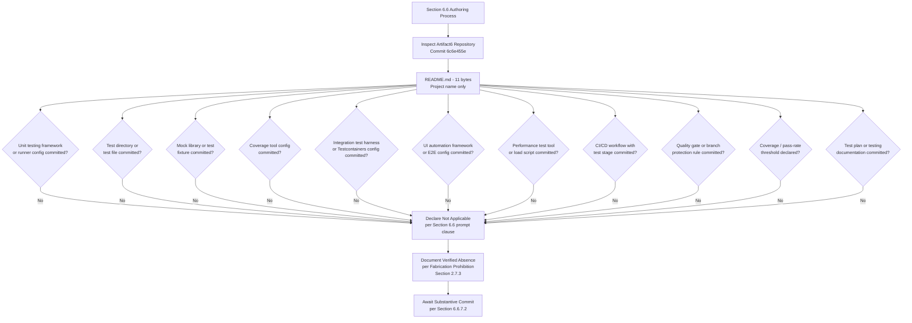

#### 6.6.6.4 Diagrams Explicitly Not Produced

The table below records, for traceability, the diagram classes requested by the Section 6.6 authoring prompt and the verified evidentiary basis on which each is excluded. This treatment is consistent with Sections 4.5.4, 5.6.4, 6.1.5.4, 6.2.6.4, 6.3.5.4, 6.4.6.4, and 6.5.6.4.

| Required Diagram | Excluded Because | Authoritative Cross-Reference |
|---|---|---|
| Test execution flow | No CI/CD pipeline, no test runner, no test stages, no job-graph definition | Section 3.7.4; Section 3.3.1 |
| Test environment architecture | No deployment platform, no containerization, no orchestration, no environment configuration | Section 3.7; Section 3.5.1 |
| Test data flow diagram | No database engine, no data flows, no fixture pipeline, no persistence boundaries | Section 6.2.1; Section 4.4.1 |

### 6.6.7 Document Status and Re-Issuance Trigger Conditions

#### 6.6.7.1 Current Document Status

This Testing Strategy section accurately reflects the verified state of the Artifact6 repository as of the date of the sole "Initial commit" (Thursday, May 28, 2026, commit `6c6e455e3f59eb8208dcb9f11b1319b21e7cf3e5`). It establishes a baseline that, like Sections 1, 2, 3, 4, 5, 6.1, 6.2, 6.3, 6.4, and 6.5, will be revised once substantive test framework, test directory, mock library, coverage tool, CI/CD workflow, test environment, quality gate, or test documentation artifacts are committed. The section is consistent with the document-status framework articulated in Section 1.4.1, which anticipates that the System Architecture and testing-related content will be constrained by the absence of committed evidence until implementation artifacts are introduced.

#### 6.6.7.2 Re-Issuance Trigger Conditions

Consistent with the re-issuance framework established in Sections 2.7.2, 3.9, 4.6.2, 5.7.2, 6.1.6.2, 6.2.7.2, 6.3.6.2, 6.4.7.2, and 6.5.7.2, the following events should trigger a complete re-authoring of this Testing Strategy section, replacing the verified-absence declaration and the per-element tables with substantive testing approaches, test automation procedures, and quality metric definitions.

| Trigger Event | Required Re-Authoring Activity |
|---|---|
| First unit testing framework config committed (`pytest.ini`, `pyproject.toml` `[tool.pytest]`, `jest.config.js`, `vitest.config.ts`, `phpunit.xml`, `pom.xml` Surefire plugin, `build.gradle` `test` task) | Populate Section 6.6.2.1 (Unit Testing) |
| First test directory committed (`tests/`, `test/`, `__tests__/`, `spec/`, `e2e/`, `*_test.go` files) | Populate Section 6.6.2.1 (test organization structure) |
| First mock library declared in dependencies (`unittest.mock`, `pytest-mock`, `jest.mock`, `sinon`, `mockito`, `WireMock`, `nock`, `MSW`) | Populate Section 6.6.2.1 (mocking strategy) |
| First code coverage tool committed (`.coveragerc`, `pyproject.toml` `[tool.coverage]`, `nyc.config.js`, `jest --coverage`, `jacoco.xml`, `cobertura.xml`) | Populate Section 6.6.4.1 (Code Coverage Targets) |
| First integration test artifact committed (Testcontainers dependency, `docker-compose.test.yml`, ephemeral DB fixture, contract test) | Populate Section 6.6.2.2 (Integration Testing) |
| First E2E framework committed (Cypress config, Playwright config, Selenium config, Detox config, Puppeteer harness) | Populate Section 6.6.2.3 (End-to-End Testing) |
| First performance test artifact committed (k6 script, JMeter `.jmx`, Gatling Scala simulation, Locust file, Artillery YAML) | Populate Section 6.6.2.3 (performance testing) and Section 6.6.4.3 (Performance Test Thresholds) |
| First CI/CD workflow with test stage committed (`.github/workflows/test.yml`, `.gitlab-ci.yml` `test` job, `Jenkinsfile` `test` stage, CircleCI `test` workflow) | Populate Section 6.6.3.1 (CI/CD Integration) and Section 6.6.3.2 (Automated Test Triggers) |
| First parallel execution / matrix configuration committed (GitHub Actions `strategy.matrix`, GitLab `parallel:` keyword, pytest-xdist, jest sharding) | Populate Section 6.6.3.3 (Parallel Test Execution) |
| First test reporting artifact committed (JUnit XML upload, Allure config, ReportPortal config, Slack/Teams webhook for test results) | Populate Section 6.6.3.4 (Test Reporting) |
| First failed-test handling artifact committed (retry policy, auto-issue creation, CODEOWNERS routing) | Populate Section 6.6.3.5 (Failed Test Handling) |
| First flaky-test management artifact committed (rerun configuration, quarantine annotation, flake-tracker integration) | Populate Section 6.6.3.6 (Flaky Test Management) |
| First quality gate artifact committed (SonarQube config, Codecov config, branch-protection rule, required status check, license-compliance gate) | Populate Section 6.6.4.4 (Quality Gates) |
| First coverage / pass-rate / KPI threshold committed | Populate Section 6.6.4.1 (Code Coverage Targets) and Section 6.6.4.2 (Test Success Rate Requirements) |
| First security testing tool committed (SAST, SCA, DAST, secrets scanning, container scan, IaC scan, dependency-vulnerability scan) | Populate Section 6.6.5.1 (Security Testing Coverage) |
| First test environment specification committed (`docker-compose.yml`, Kubernetes manifest, Terraform module, ephemeral preview env definition) | Populate Section 6.6.5.2 (Test Environment and Resource Requirements) |
| First test documentation committed (test plan, test strategy doc, traceability matrix, testing section in `CONTRIBUTING.md` or `README.md`) | Populate Section 6.6.4.5 (Documentation Requirements) |
| First language runtime, framework, package manager, or build tool manifest committed | Populate Section 6.6.5 (Standard Testing Practices Statement) with stack-default practices |

The recommended actions enumerated in Section 1.4.2 ("Populate substantive content," "Define stakeholders," "Establish technology baseline," "Re-issue this section") apply with equal force to this Testing Strategy section.

#### 6.6.7.3 Assumptions and Constraints

| Assumption / Constraint | Statement |
|---|---|
| Authoring Constraint | This section was authored solely from verified repository evidence as of the date of the Initial commit (Thursday, May 28, 2026). |
| Versioning Assumption | This is Version 1.0 of Section 6.6, baselined against commit `6c6e455e3f59eb8208dcb9f11b1319b21e7cf3e5`. |
| Fabrication Prohibition | Per Section 2.7.3, no testing framework, test runner, test directory, mock library, fixture strategy, coverage tool, coverage threshold, naming convention, integration test approach, API test strategy, E2E framework, performance test tool, cross-browser strategy, CI/CD test integration, test trigger, parallelism strategy, test report format, failure-handling policy, flaky-test policy, quality gate, security test, test environment specification, or test documentation has been inferred or imagined. |
| Default-Stack Treatment | The Default Technology Stack recorded in Section 3.1.3 (including Python/Flask as candidate backend supplying `pytest`/`unittest`/`Flask-Testing` primitives, React/TypeScript as candidate frontend supplying Jest/Vitest/RTL primitives, React Native as candidate mobile supplying Detox/RNTL primitives, MongoDB as candidate database supplying `mongodb-memory-server` integration, Auth0 as candidate identity provider supplying authentication-flow mocking surface, GitHub Actions as candidate CI/CD supplying matrix/sharding primitives, and Docker as candidate container runtime supplying Testcontainers integration) is preserved as a forward-looking candidate set but is explicitly excluded as a basis for inventing test frameworks, test layouts, mocking idioms, coverage targets, CI workflows, or quality gates in this section, in accordance with the verified absences recorded in Sections 3.3.1, 3.3.2, 3.4, 3.7, and 5.5.4. |
| Diagrammatic Discipline | Only diagrams that depict verified-state relationships (Sections 6.6.6.2 and 6.6.6.3) are authored; the diagram classes enumerated in Section 6.6.6.4 (test execution flow, test environment architecture, test data flow) are explicitly omitted in compliance with Section 2.7.3. |
| Section Applicability | The non-applicability declaration in 6.6.1.1 is invoked under the explicit clause of the Section 6.6 authoring prompt that permits such a declaration when "the system is a simple library, tool, or does not require comprehensive testing." Section 6.6.5 further establishes that no "basic unit testing approach" can be honestly asserted either, because no language runtime, framework, package manager, build tool, or CI/CD platform has been adopted to imply any specific defaults. |
| Security Testing Treatment | The security testing requirements mandated by the Section 6.6 prompt notes (Section 6.6.5.1) are documented in verified-absence form, anchored to the parallel Security Architecture verified-absence findings in Section 6.4. |
| Resource Requirement Treatment | The resource and environment requirements mandated by the Section 6.6 prompt notes (Section 6.6.5.2) are documented in verified-absence form, anchored to the parallel infrastructure verified-absence findings in Section 3.7 and Section 6.1.3. |
| Future-State Assumption | Future versions of this section will be authored once the substantive commitments enumerated in Section 6.6.7.2 (and the related artifacts referenced in Sections 1.4.2, 2.7.2, 3.9, 4.6.2, 5.7.2, 6.1.6.2, 6.2.7.2, 6.3.6.2, 6.4.7.2, and 6.5.7.2) have been satisfied. |

### 6.6.8 References

#### 6.6.8.1 Repository Artifacts Examined

- `README.md` — Sole tracked file in the repository (11 bytes); contains only the single line `# Artifact6`. Establishes the pre-implementation, placeholder state on which the non-applicability declaration for Testing Strategy rests.
- `/` (repository root) — Inspected at depth 0; confirmed to contain only `README.md` as its first-order child. No `tests/`, `test/`, `__tests__/`, `spec/`, `e2e/`, `integration/`, `unit/`, `fixtures/`, `mocks/`, `stubs/`, `qa/`, `coverage/`, `reports/`, `.github/`, `.gitlab/`, `.circleci/`, `.buildkite/`, `cypress/`, `playwright/`, `selenium/`, or any other directory that would establish a test framework, test runner configuration, test organization structure, mock library, coverage tool, CI/CD workflow, test environment, or test documentation artifact.

#### 6.6.8.2 Technical Specification Sections Referenced

- **Section 1.1.1** — Establishes the verified pre-implementation lifecycle stage and baseline commit details on which the non-applicability declaration is anchored.
- **Section 1.2.2** — Establishes the verified absence of source files in which test logic could be exercised; provides the manifest enumeration table proving no ecosystem has been detected.
- **Section 1.2.3** — Primary authoritative source: establishes the verified absence of measurable objectives, critical success factors, key performance indicators (KPIs), and service-level objectives (SLOs) against which coverage and pass-rate targets would be calibrated.
- **Section 1.3.4** — Provides the canonical verified-state diagram incorporated by reference in Section 6.6.6.1.
- **Section 1.4.1 / 1.4.2** — Provides the document-status framework and recommended actions that govern this section's posture.
- **Section 1.5.2** — Establishes the verified absence of tracked subdirectories that would house test code, fixtures, or testing documentation.
- **Section 2.2** — Establishes the verified absence of a feature catalog from which E2E scenarios could be derived.
- **Section 2.3.3** — Establishes the verified absence of declared data requirements relevant to test data management and fixture taxonomies.
- **Section 2.3.4** — Establishes the verified absence of security and compliance requirements relevant to security testing scope definition.
- **Section 2.6** — Provides the traceability-matrix framework relevant to requirement-to-test traceability documentation.
- **Section 2.7.1** — Anticipates that subsequent sections will be constrained by the absence of committed evidence until implementation artifacts are introduced.
- **Section 2.7.2** — Provides the re-issuance trigger framework that Section 6.6.7.2 extends and specializes for Testing Strategy.
- **Section 2.7.3** — Records the binding Fabrication Prohibition that underwrites every verified-absence finding in this section.
- **Section 3.1.3** — Identifies the Default Technology Stack candidates (including Python/Flask, React/TypeScript, React Native, MongoDB, Auth0, GitHub Actions, Docker) relevant to testing strategy and explicitly excludes them as a basis for fabrication.
- **Section 3.2** — Establishes the verified absence of programming languages and source files of any extension, thereby establishing the absence of any code to test.
- **Section 3.3.1** — Primary authoritative source: explicitly records "Testing framework: None adopted" and "Logging / observability library: None adopted."
- **Section 3.3.2** — Primary authoritative source: explicitly records the verified absence of canonical testing configuration artifacts (`jest.config.js`, `vitest.config.ts`, `pytest.ini`, `phpunit.xml`).
- **Section 3.4** — Primary authoritative source: establishes the verified absence of declared direct dependencies, declared development/test dependencies, and lockfiles of any ecosystem.
- **Section 3.5.1** — Establishes the verified absence of third-party services (analytics, error tracking, monitoring) relevant to test result reporting and external service mocking.
- **Section 3.5.2** — Establishes the verified absence of third-party SDK configurations relevant to alert routing and test failure notifications.
- **Section 3.6.1** — Establishes the verified absence of message brokers and event stores relevant to event-driven integration testing.
- **Section 3.6.2** — Establishes the verified absence of database engines relevant to database integration testing.
- **Section 3.6.3** — Establishes the verified absence of data-retention policies relevant to test data lifecycle management.
- **Section 3.7** — Primary authoritative source: establishes the verified absence of development tooling, build systems, containerization, orchestration, CI/CD pipelines, pre-commit hooks, and infrastructure-as-code relevant to test execution and environment provisioning.
- **Section 3.7.4** — Primary authoritative source: establishes the verified absence of every canonical CI/CD platform (GitHub Actions, GitLab CI, CircleCI, Jenkins, Azure Pipelines, Travis CI, Buildkite, Drone CI).
- **Section 3.9** — Provides the re-issuance trigger pattern adopted in Section 6.6.7.2 for testing-related commitments.
- **Section 4.2.1** — Establishes the verified absence of system workflows and user journeys against which E2E scenarios would be authored.
- **Section 4.4.1** — Establishes the verified absence of state management strategy relevant to test data flow and fixture lifecycle.
- **Section 4.4.2** — Establishes the verified absence of retry mechanisms, fallback processes, error-notification flows, and recovery procedures relevant to failed test handling and flaky test management.
- **Section 4.5.4** — Provides the precedent for documenting diagrams explicitly not produced, replicated in Section 6.6.6.4.
- **Section 4.6.2** — Provides the re-issuance trigger framework that Section 6.6.7.2 extends.
- **Section 5.2.1** — Establishes the verified absence of an overall architecture style relevant to test architecture topology.
- **Section 5.2.2** — Establishes the verified absence of components against which integration tests would be authored.
- **Section 5.5.1** — Establishes the verified absence of monitoring/observability infrastructure relevant to test result aggregation, flake-tracking dashboards, and historical trend reporting.
- **Section 5.5.2** — Primary authoritative source: establishes the verified absence of retry/back-off, circuit-breaker, fallback, error-notification, and recovery patterns relevant to failed test handling and flaky test management.
- **Section 5.5.4** — Primary authoritative source: establishes the verified absence of performance budgets, SLOs, SLAs, KPIs, latency/throughput targets, and scalability considerations against which coverage targets, pass-rate thresholds, performance test thresholds, and quality gates would be calibrated.
- **Section 5.6.2 / 5.6.3 / 5.6.4** — Provides the diagrammatic precedents (verified-absence mapping, authoring decision flow, diagrams explicitly not produced) replicated in Section 6.6.6.
- **Section 5.7.2** — Provides the re-issuance trigger catalog that Section 6.6.7.2 extends and specializes for Testing Strategy.
- **Section 6.1** — Direct structural precedent for Section 6; establishes the "Not Applicable" declaration pattern for top-level Section 6 subsections.
- **Section 6.1.2** — Establishes the verified absence of service components and load-balancing topology relevant to service integration testing.
- **Section 6.1.3.3** — Establishes the verified absence of resource allocation strategy relevant to per-execution CPU/memory/disk budgets for test runners.
- **Section 6.1.3.4** — Establishes the verified absence of performance optimization techniques relevant to performance test instrumentation and threshold definition.
- **Section 6.1.3.5** — Establishes the verified absence of capacity planning relevant to load profile definition for performance testing.
- **Section 6.1.4.2** — Establishes the verified absence of runbooks and incident-response procedures relevant to testing runbooks and on-failure playbooks.
- **Section 6.1.5.1 / 6.1.5.2 / 6.1.5.3 / 6.1.5.4** — Direct diagrammatic precedent for Section 6.6.6, including the canonical verified-state reference, verified-absence mapping diagram pattern, authoring-decision-flow diagram pattern, and "Diagrams Explicitly Not Produced" table pattern.
- **Section 6.1.6.2** — Direct re-issuance trigger catalog precedent for Section 6.6.7.2.
- **Section 6.2** — Direct structural precedent for Section 6; establishes the "Not Applicable" declaration pattern with full evidentiary backing for a data-centric architectural domain.
- **Section 6.2.1** — Establishes the verified absence of a database engine relevant to database integration testing.
- **Section 6.2.3.1** — Establishes the verified absence of data model elements relevant to test data setup/teardown and fixture taxonomy.
- **Section 6.2.7.2** — Direct re-issuance trigger catalog precedent for Section 6.6.7.2.
- **Section 6.3** — Direct structural precedent for Section 6; establishes the "Not Applicable" declaration pattern for an integration-centric architectural domain.
- **Section 6.3.2.1** — Establishes the verified absence of API endpoints relevant to API testing strategy and contract testing.
- **Section 6.3.2.6** — Establishes the verified absence of API documentation standards relevant to API contract testing.
- **Section 6.3.3.1** — Establishes the verified absence of event processing patterns relevant to event-driven integration testing.
- **Section 6.3.4.1** — Establishes the verified absence of third-party integration patterns relevant to external service mocking.
- **Section 6.3.4.4** — Establishes the verified absence of external service contracts relevant to consumer-driven contract testing.
- **Section 6.4** — Direct structural precedent for Section 6; establishes the "Not Applicable" declaration pattern for a cross-cutting concern domain.
- **Section 6.4.2** — Establishes the verified absence of authentication framework relevant to authentication test surface.
- **Section 6.4.3** — Establishes the verified absence of authorization system relevant to authorization test surface.
- **Section 6.4.4.2** — Establishes the verified absence of key management relevant to secrets-scanning scope and test secret vault.
- **Section 6.4.4.5** — Establishes the verified absence of compliance controls relevant to compliance testing scope.
- **Section 6.4.5** — Direct structural precedent for Section 6.6.5 (Standard Testing Practices Statement); establishes the methodology for handling the parallel "standard practices" sub-clause in the authoring prompt when no foundational stack has been adopted.
- **Section 6.4.6.4** — Direct diagrammatic precedent for "Diagrams Explicitly Not Produced" table in Section 6.6.6.4.
- **Section 6.4.7.2** — Direct re-issuance trigger catalog precedent for Section 6.6.7.2.
- **Section 6.5** — Most recent direct structural precedent for Section 6; establishes the "Not Applicable" declaration pattern with full evidentiary backing for an operational concern domain.
- **Section 6.5.4.3** — Direct precedent for the runbook/testing-runbook verified-absence treatment.
- **Section 6.5.5** — Most recent direct structural precedent for Section 6.6.5 (Standard Testing Practices Statement); establishes the methodology for handling the "basic practices" sub-clause.
- **Section 6.5.5.1** — Direct precedent for embedded matrices within the Standard Practices Statement (Alert Threshold Matrix), replicated in Section 6.6.5.1 (Security Testing Coverage) and Section 6.6.5.2 (Test Environment and Resource Requirements).
- **Section 6.5.6.4** — Most recent direct diagrammatic precedent for "Diagrams Explicitly Not Produced" table in Section 6.6.6.4.
- **Section 6.5.7.2** — Most recent direct re-issuance trigger catalog precedent for Section 6.6.7.2.

# 7. User Interface Design

**No user interface required.**

This section is authored per the section prompt's explicit conditional directive: *"If the project doesn't define a user interface (UI), leave the section empty with the note 'No user interface required'."* The condition is definitively met by the Artifact6 repository, which contains no UI technology selection, no UI source artifacts, no UI configuration manifests, and no UI surface area of any kind. The supporting evidence and cross-references are documented in the subsections that follow.

## 7.1 Verified Absence of User Interface Surface Area

### 7.1.1 Statement of UI Status

The Artifact6 repository does not declare, define, or implement a user interface in any form — web, native desktop, mobile, embedded, terminal, or otherwise. This finding is the direct consequence of the repository's pre-implementation, placeholder state, which has been authoritatively established in Section 1.1.1 (Project Overview) and reaffirmed by every downstream section of this Technical Specification. As recorded in Section 1.1.1, the repository contains exactly one tracked file (`README.md`, 11 bytes), whose entire body consists of the single Markdown heading `# Artifact6` — a content surface that establishes the project name and nothing further.

| User Interface Dimension | Verified Status in Repository |
|---|---|
| UI surface declared (web, mobile, desktop, terminal) | None declared |
| UI technology adopted | None adopted |
| UI source files committed | None present |
| UI configuration manifests committed | None present |
| UI design assets committed | None present |
| UI specification documents committed | None present |

### 7.1.2 Repository Evidence

The entire committed surface area of the repository has been traversed to verify the absence of UI-relevant artifacts. The repository's maximum directory depth is one (root → `README.md`), and no subdirectories of any kind are present. Consequently, no UI-relevant folder (`src/`, `app/`, `components/`, `pages/`, `views/`, `screens/`, `ui/`, `frontend/`, `client/`, `assets/`, `public/`, `static/`, or equivalent) exists at any depth.

| Filesystem Element Searched | Outcome |
|---|---|
| Root folder (path: `""`) | Contains exactly one child: `README.md` |
| Source folders (`src/`, `app/`, `frontend/`, `client/`) | Not present |
| Component / view folders (`components/`, `pages/`, `views/`, `screens/`) | Not present |
| Asset folders (`assets/`, `public/`, `static/`, `img/`) | Not present |
| Style folders (`styles/`, `css/`, `scss/`) | Not present |
| Subdirectories of any name | None present |

### 7.1.3 Per-Element Verification Matrix

The section prompt enumerates eight specific elements that a User Interface Design section would normally document. Each element has been individually evaluated against committed repository evidence, and each is verifiably absent.

| Requested UI Documentation Element | Verified Repository Evidence | Outcome |
|---|---|---|
| Core UI technologies involved | No frontend framework adopted; no programming language selected | None to document |
| UI use cases | No features declared; no user workflows defined | None to document |
| UI / backend interaction boundaries | No components defined; no APIs declared; no integrations configured | None to document |
| UI schemas | No schemas of any kind committed; no source files present | None to document |
| Screens required | No screen, view, component, page, or template files present | None to document |
| User interactions | No interaction code, event handlers, or UI logic present | None to document |
| Visual design considerations | No styling files, design tokens, theme configurations, or design assets present | None to document |
| Actual UI screens referenced from repository | Repository contains only `README.md` (11 bytes); no UI screens of any kind exist | No screens to reference |

## 7.2 Cross-References Establishing UI Absence

The verified-absence conclusion of this section is not an isolated finding; it is the logical consequence of verified absences documented across multiple upstream sections of this Technical Specification. The cross-references below trace each precondition that would otherwise be required to support a User Interface Design narrative.

### 7.2.1 Programming Language Layer

A user interface — whether browser-rendered, natively compiled, or terminal-based — requires source code in at least one programming language. As established in Section 3.2.1, no programming languages are in use by the Artifact6 system, and no source files of any UI-relevant extension are committed.

| UI Category | UI-Relevant Language Extensions | Source Files Present per Section 3.2.1 |
|---|---|---|
| Web (browser) | `.js`, `.ts`, `.jsx`, `.tsx`, `.html`, `.css`, `.scss` | None present |
| iOS native | `.swift`, `.m`, `.mm` | None present |
| Android native | `.kt`, `.java` | None present |
| Cross-platform mobile | `.dart` (Flutter), `.js`/`.tsx` (React Native) | None present |
| Desktop native | `.cs` (WPF/WinUI), `.swift` (Cocoa), `.cpp` (Qt) | None present |
| Terminal / TUI | Any language source files | None present |

### 7.2.2 Framework and Library Layer

A user interface is conventionally constructed atop a frontend or mobile framework. As established in Section 3.3.1, no frontend framework, mobile framework, or cross-platform framework has been adopted. As enumerated in Section 3.3.2, none of the canonical configuration files for the most widely adopted UI frameworks is present in the repository working tree.

| Framework Category (per Section 3.3.2) | Canonical Configuration File(s) | Present |
|---|---|---|
| Web bundler / build tool | `vite.config.ts`, `webpack.config.js`, `rollup.config.js`, `esbuild.config.js`, `parcel.json` | No |
| React meta-framework | `next.config.js`, `remix.config.js`, `gatsby-config.js` | No |
| Angular | `angular.json`, `nx.json` | No |
| Vue meta-framework | `nuxt.config.ts`, `vite.config.ts` | No |
| Mobile / cross-platform | `metro.config.js` (React Native), `pubspec.yaml` (Flutter), `Podfile` (iOS) | No |
| Styling | `tailwind.config.js`, `postcss.config.js` | No |

### 7.2.3 Architecture and Component Layer

A user interface participates in a broader system architecture by communicating with backend components, services, or data stores. As established in Section 5.2.2, no system components have been defined; the repository contains no canonical source directories, no module structure, no service decomposition, no shared library partitioning, and no architectural delineations of any kind. As established in Section 5.2.4, no external integration points are defined. Accordingly, no UI/backend interaction boundary can be drawn from committed evidence.

| Architectural Precondition for UI Design | Status per Section 5.2 |
|---|---|
| Overall architecture style | No style adopted (Section 5.2.1) |
| Core components inventory | No components defined (Section 5.2.2) |
| Primary data flows | None definable (Section 5.2.3) |
| External integration points (APIs, identity providers, notification services) | None defined (Section 5.2.4) |

### 7.2.4 Feature and Requirement Layer

A user interface implements user-facing features and supports specific use cases. As established in Section 2.2.1 (Feature Inventory Status), the Artifact6 repository contains no features to enumerate. As established in Section 1.3.1 (Core Features and Functionalities, referenced from Section 2.2.1), no must-have capabilities, user workflows, integrations, or key technical requirements have been committed. In the absence of features and use cases, no UI use case, screen, or interaction can be honestly documented.

| Feature / Requirement Layer Element | Status per Section 2.2 |
|---|---|
| Feature identifiers (F-XXX) | None defined |
| Feature names and descriptions | None defined |
| User benefit articulations | None defined |
| User workflow definitions | None defined |

## 7.3 Verified-State Diagram

The diagram below depicts the chain of verified absences that collectively preclude the authoring of any substantive User Interface Design content. Each upstream verified absence is annotated with its authoritative cross-reference within this Technical Specification.

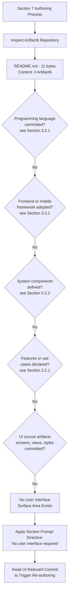

## 7.4 Authoring Methodology Compliance

### 7.4.1 Section Prompt Directive

The section prompt for Section 7 contains an explicit conditional clause governing the empty-state outcome: *"If the project doesn't define a user interface (UI), leave the section empty with the note 'No user interface required'."* The verified state of the repository as documented in Sections 7.1 through 7.3 above satisfies the antecedent of this conditional. The directive's consequent has therefore been applied: the section is anchored by the declarative statement "No user interface required," accompanied by the evidentiary support necessary for downstream readers (engineers, auditors, future authors) to trace the determination back to specific verified absences.

### 7.4.2 Evidence-Based Methodology

This section adheres to the evidence-based authoring methodology established in Section 2.1.2 and applied consistently throughout the Technical Specification: every statement must be supported by a verified artifact in the committed repository, and no requirement, technology selection, or architectural element may be introduced through inference, assumption, or fabrication. Where the repository contains no evidence for a requested element, verified absence is reported rather than speculative content synthesized.

| Methodological Principle (from Section 2.1.2) | Application in Section 7 |
|---|---|
| Every statement supported by verified artifact | UI absence supported by README-only repository state |
| No requirement introduced through inference | No UI technology, screen, or interaction inferred |
| No fabrication of speculative content | No fictitious framework, screen, or interaction documented |
| Verified absence reported where evidence is absent | Empty-state determination per section prompt directive |

### 7.4.3 Prohibition on Fabrication

Consistent with the fabrication prohibition recorded in Section 2.7.3 ("No features, requirements, or relationships have been inferred or imagined, in compliance with the section prompt"), Section 7 does not introduce hypothetical UI technologies (e.g., "the application will use React"), speculative screens (e.g., "login screen," "dashboard"), or imagined interaction patterns. Any such content would constitute fabrication and would contravene both the section prompt's explicit conditional directive and the broader Technical Specification's documented methodology.

## 7.5 Document Status and Re-Issuance Trigger Conditions

### 7.5.1 Current Document Status

This User Interface Design section accurately reflects the verified state of the Artifact6 repository as of the date of the sole "Initial commit" (Thursday, May 28, 2026, hash `6c6e455e3f59eb8208dcb9f11b1319b21e7cf3e5`). It establishes a baseline empty-state determination that, like Sections 1, 2, 3, and 5, may be revised once substantive content is committed. The section is consistent with the document-status framework articulated in Section 2.7.1, which anticipates that sections of this Technical Specification will be constrained by the absence of committed evidence until implementation artifacts are introduced.

### 7.5.2 Re-Issuance Trigger Events

The following events should trigger a complete re-authoring of this User Interface Design section, replacing the empty-state determination with substantive UI documentation.

| Trigger Event | Required Re-authoring Activity |
|---|---|
| First UI source file committed (any extension in `.html`, `.css`, `.scss`, `.jsx`, `.tsx`, `.vue`, `.svelte`, `.swift`, `.kt`, `.dart`, or equivalent) | Author Core UI Technologies, identify language(s) and runtime(s) in use |
| First frontend or mobile framework configuration committed (e.g., `package.json` with React/Vue/Angular dependencies, `pubspec.yaml`, `Podfile`, `metro.config.js`) | Author Framework Stack subsection; cross-reference Section 3.3 |
| First screen, view, page, or component file committed | Author Screens Required subsection; reference actual files in the repository |
| First design asset, style sheet, or design token file committed (e.g., `tailwind.config.js`, `*.scss`, design-token JSON, Figma export) | Author Visual Design Considerations subsection |
| First API client, schema definition, or contract file committed (e.g., OpenAPI spec, GraphQL schema, gRPC `.proto`) | Author UI / Backend Interaction Boundaries subsection |
| First user-facing requirement or user-story file committed | Author UI Use Cases subsection; cross-reference Section 2.3 |
| First event-handler, controller, or interaction-logic source file committed | Author User Interactions subsection |

### 7.5.3 Assumptions and Constraints

| Assumption / Constraint | Statement |
|---|---|
| Authoring Constraint | This section was authored solely from verified repository evidence as of the date of the Initial commit. |
| Versioning Assumption | This is Version 1.0 of Section 7, baselined against commit `6c6e455e3f59eb8208dcb9f11b1319b21e7cf3e5`. |
| Fabrication Prohibition | No UI technologies, screens, schemas, or interactions have been inferred or imagined, in compliance with the section prompt and the methodology of Section 2.1.2. |
| Directive Compliance | The section's empty-state outcome is mandated by the section prompt's explicit conditional clause, not an authorial choice. |
| Future-State Assumption | Future versions will be authored once UI-relevant content is committed; no schedule for that commitment is currently established. |

## 7.6 References

### 7.6.1 Files Examined

- `README.md` — The repository's sole tracked file (11 bytes); content consists entirely of the Markdown heading `# Artifact6`. Examined to confirm the absence of any UI declaration, framework reference, design narrative, or screen description.

### 7.6.2 Folders Explored

- `""` (repository root, depth 0) — Confirmed to contain only `README.md` as a direct child. No subdirectories of any kind exist; no UI-relevant folders (`src/`, `app/`, `components/`, `pages/`, `views/`, `screens/`, `ui/`, `frontend/`, `client/`, `assets/`, `public/`, `static/`, `styles/`) are present at any depth.

### 7.6.3 Technical Specification Sections Cross-Referenced

- **Section 1.1 (Executive Summary)** — Confirmed pre-implementation, placeholder state; 1 commit, 1 tracked file (`README.md`, 11 bytes).
- **Section 1.2 (System Overview)** — Confirmed no technology stack, no system components, no integration landscape, no functional capabilities.
- **Section 1.3 (Scope)** — Confirmed no core features, no user workflows, no implementation boundaries declared.
- **Section 2.1 (Statement of Repository State Relative to Product Requirements)** — Confirmed verified-absence specification methodology and the prohibition on fabrication.
- **Section 2.2 (Feature Catalog)** — Confirmed no features, descriptions, or dependencies declared; no candidate use cases from which UI use cases could be derived.
- **Section 2.7 (Document Status and Re-issuance Trigger)** — Established the pattern of empty-state baselining and trigger-driven re-authoring adopted in Section 7.5.
- **Section 3.2 (Programming Languages)** — Confirmed no programming languages selected; no source files of any UI-relevant extension exist.
- **Section 3.3 (Frameworks & Libraries)** — Confirmed no frontend framework, no mobile framework, and no UI-relevant configuration files (Vite, Webpack, Next, Angular, Nuxt, Tailwind, PostCSS, Metro, Flutter, etc.) present.
- **Section 5.2 (High-Level Architecture)** — Confirmed no architecture style, no components, no data flows, and no external integration points; consequently no UI/backend interaction boundary can be documented.
- **Section 5.3 (Component Details)** — Confirmed no component inventory; no interaction, state-transition, or sequence diagrams can be authored against UI elements that do not exist.

# 8. Infrastructure

**Detailed Infrastructure Architecture is not applicable for this system.**

This determination is grounded in verified repository evidence as of the sole "Initial commit" (Thursday, May 28, 2026, commit `6c6e455e3f59eb8208dcb9f11b1319b21e7cf3e5`). The Artifact6 repository contains a single tracked file — `README.md` (11 bytes) — whose entire content is the single line `# Artifact6`. As established in Section 3.7.1, "no development or deployment tooling is established in the Artifact6 repository." As established in Section 1.2.2, the manifest enumeration confirms no containerization (`Dockerfile`, `docker-compose.yml`), no orchestration (Kubernetes manifests, Helm charts), and no CI/CD configuration (`.github/workflows/`, `Jenkinsfile`, `.gitlab-ci.yml`) artifacts of any kind. As established in Section 3.7.3, no build script, task runner, container definition, or orchestration manifest is committed. As established in Section 3.7.4, no CI/CD configuration is committed and no `.github/` folder exists at any depth in the repository. As established in Section 5.5.5, no disaster recovery plan, backup cadence, retention policy, recovery point objective (RPO), recovery time objective (RTO), encryption-at-rest configuration, or data-residency declaration is committed. As established in Section 5.5.1, no monitoring, observability, logging, or distributed tracing approach is configured against which infrastructure monitoring could be designed. Authoring infrastructure architecture content on such a foundation would constitute fabrication and is therefore deliberately and disciplinarily withheld in compliance with the Fabrication Prohibition recorded in Section 2.7.3.

The Section 8 authoring prompt explicitly contemplates this case and instructs the author to declare non-applicability when "the system is a standalone application or library that does not require deployment infrastructure." The Artifact6 repository is, more precisely, **not yet a standalone application or library either** — it is a pre-implementation placeholder for which neither deployment infrastructure nor minimal build and distribution requirements have been committed. The subsections below document, with traceable evidentiary cross-references, the verified absence of every requested element under Deployment Environment, Cloud Services, Containerization, Orchestration, CI/CD Pipeline, and Infrastructure Monitoring; address the prompt's secondary instruction regarding minimal build and distribution requirements (Section 8.8); provide the diagrammatic treatment mandated for verified-absence sections; and define the precise commit events that will trigger re-authoring of this section. The structural pattern is directly inherited from Sections 6.1 (Core Services Architecture), 6.2 (Database Design), 6.3 (Integration Architecture), 6.4 (Security Architecture), and 6.5 (Monitoring and Observability), each of which declared non-applicability with full evidentiary backing.

## 8.1 Applicability Determination

### 8.1.1 Applicability Statement

Infrastructure Architecture — encompassing a Deployment Environment (environment type, geographic distribution, resource requirements, compliance requirements, infrastructure-as-code approach, configuration management, environment promotion strategy, backup and disaster recovery plans), Cloud Services (provider selection, core services, high availability, cost optimization, security and compliance), Containerization (platform selection, base image strategy, image versioning, build optimization, security scanning), Orchestration (platform selection, cluster architecture, service deployment strategy, auto-scaling configuration, resource allocation policies), a CI/CD Pipeline (build pipeline with source triggers, dependency management, artifact generation, quality gates; deployment pipeline with deployment strategy, environment promotion, rollback procedures, post-deployment validation, release management), and Infrastructure Monitoring (resource monitoring, performance metrics, cost monitoring, security monitoring, compliance auditing) — is **not applicable** for the Artifact6 system in its current verified state. There is no deployable system, in the engineering sense of the term, against which any of these infrastructure dimensions can be evaluated, designed, or documented. There are no compute units to host, no network topology to design, no images to build, no containers to orchestrate, no pipelines to run, no environments to promote between, no clusters to scale, no costs to forecast, no probes to invoke, and no compliance controls to audit, because none of these elements have been committed to the repository.

### 8.1.2 Rationale for Non-Applicability

The determination of non-applicability is supported by seven categories of converging evidence drawn from prior sections of this Technical Specification. Each category is independently sufficient to compel the non-applicability declaration; together, they render the determination unambiguous.

| Evidentiary Category | Verified Finding | Authoritative Cross-Reference |
|---|---|---|
| No development or deployment tooling | No editor config, no linter/formatter, no build system, no containerization, no orchestration, no IaC, no CI/CD, no release tooling | Section 3.7.1; Section 3.7.2; Section 3.7.3; Section 3.7.4 |
| No cloud or third-party infrastructure services | No cloud platform, no CDN, no identity provider, no monitoring/observability platform, no error-tracking service | Section 3.5.1; Section 3.5.2 |
| No deployable workload | No source files, no architecture style, no components, no services, no containerization, no orchestration manifests | Section 1.2.2; Section 5.2.1; Section 5.2.2; Section 6.1.2.1 |
| No scaling, capacity, or performance foundation | No horizontal/vertical scaling, no auto-scaling, no resource allocation, no capacity planning, no SLOs/SLAs/KPIs | Section 6.1.3.1; Section 6.1.3.2; Section 6.1.3.3; Section 6.1.3.5; Section 5.5.4 |
| No disaster recovery or data protection foundation | No backup/DR plan, no RPO/RTO, no encryption-at-rest, no data-residency policy, no GDPR/retention policy | Section 5.5.5; Section 3.6.3; Section 6.1.4.2 |
| No compliance or security infrastructure | No regulatory regime declaration, no audit log infrastructure, no continuous-compliance scanning, no security monitoring | Section 2.3.4; Section 4.3.2; Section 6.4.3.5; Section 6.4.4.5 |
| No infrastructure to monitor | No monitoring/observability platform, no logging library, no health probes, no alert manager, no dashboards | Section 5.5.1; Section 6.5.2; Section 6.5.3.1 |

Because Artifact6 has not committed any container definition, any orchestration manifest, any infrastructure-as-code descriptor, any CI/CD workflow, any cloud provider credential, any environment-variable template, any deployment platform binding, any auto-scaling policy, any backup plan, any monitoring configuration, or any compliance attestation, the very precondition for an Infrastructure Architecture — the existence of a deployable system with a defined runtime environment — is absent from the repository. The section prompt's anticipated non-applicability clause is therefore controlling.

The Default Technology Stack recorded in Section 3.1.3 lists AWS as the candidate cloud platform (and therefore the candidate source of EC2/ECS/EKS/Lambda compute, RDS/DynamoDB persistence, S3 object storage, VPC networking, CloudFront CDN, CloudWatch monitoring, IAM/KMS/Secrets Manager security primitives, and Route 53 DNS), Docker as the candidate containerization technology (and therefore the candidate source of `Dockerfile`, multi-stage build, `.dockerignore`, and image-registry conventions), Terraform as the candidate Infrastructure-as-Code tool (and therefore the candidate source of `*.tf`, provider configurations, and module structure), and GitHub Actions as the candidate CI/CD platform (and therefore the candidate source of `.github/workflows/`, job matrices, and OIDC-federated deployment). However, as expressly noted in Section 3.7.3, Section 3.7.4, and Section 3.1.3, no AWS SDK configuration, no IAM artifacts, no environment templates referencing AWS regions or services, no `Dockerfile`, no `docker-compose.yml`, no `.dockerignore`, no `*.tf` or `*.tfvars`, no `terraform.lock.hcl`, no `cdk.json`, no Pulumi or CloudFormation artifacts, no `.github/workflows/*.yml`, no `.gitlab-ci.yml`, no `Jenkinsfile`, no `azure-pipelines.yml`, no `.circleci/config.yml`, no `.travis.yml`, no `.buildkite/pipeline.yml`, and no `.drone.yml` appear in the repository. Accordingly, none of these candidates can be recorded as constituting the current infrastructure architecture and none can serve as a basis for inventing deployment environments, cloud topologies, container layouts, orchestration patterns, pipeline stages, or monitoring stacks in this section.

### 8.1.3 Authoring Methodology

This section follows the verified-absence specification methodology established in Section 2.1, applied consistently across Sections 2.5, 3.1, 4.2, 4.4, 5.2, 5.3, 5.4, and 5.5, and directly inherited from Sections 6.1, 6.2, 6.3, 6.4, 6.5, and 7. The methodology consists of four disciplines:

1. **Element Enumeration.** Each infrastructure element requested by the prompt is enumerated in tabular form so that the reader can confirm complete coverage of the prompt's six major categories (Deployment Environment, Cloud Services, Containerization, Orchestration, CI/CD Pipeline, Infrastructure Monitoring) and their constituent elements.
2. **Verified-Status Marking.** Each element is marked "None configured," "None defined," "None committed," "None established," or "Not applicable" against committed evidence, never against speculation.
3. **Authoritative Cross-Referencing.** Each absence is traced to a prior, independently authored section of this Technical Specification that supplies the underlying evidence.
4. **Diagrammatic Restraint.** Diagrams are produced only where they depict the verified state. Infrastructure architecture diagrams, deployment workflow diagrams, environment promotion flows, and network architecture diagrams that would require fabrication of compute topologies, region distributions, container layouts, orchestration patterns, pipeline stages, or network architectures are explicitly declined, mirroring the precedents in Sections 4.5.4, 5.6.4, 6.1.5.4, 6.2.6.4, 6.3.5.4, 6.4.6.4, and 6.5.6.4.

## 8.2 Deployment Environment — Verified Absence

The Deployment Environment dimension requested by the section prompt encompasses two top-level sub-dimensions (Target Environment Assessment and Environment Management) and eight constituent elements: environment type, geographic distribution, resource requirements, compliance requirements, infrastructure-as-code approach, configuration management strategy, environment promotion strategy, and backup/disaster recovery plans. Each is verified absent and is treated below.

### 8.2.1 Target Environment Assessment

#### 8.2.1.1 Environment Type

No environment type has been selected. As established in Section 3.5.1, no cloud platform is configured, and Section 3.7 records the parallel absence of containerization, orchestration, infrastructure-as-code, and CI/CD. There is no on-premises footprint declared, no single-cloud declaration (AWS, GCP, Azure, Oracle Cloud, IBM Cloud), no hybrid-cloud topology (on-prem ↔ cloud connectivity), no multi-cloud strategy (active-active across providers, cloud-agnostic abstraction layer), and no edge or fog-computing distribution. Without a foundational environment-type selection, no further deployment-environment dimension can be authored from committed evidence.

| Environment Type Element | Verified Status | Authoritative Cross-Reference |
|---|---|---|
| On-premises footprint declaration | None defined | Section 3.5.1; Section 3.7 |
| Single-cloud platform binding (AWS, GCP, Azure) | None configured | Section 3.5.1; Section 3.5.2 |
| Hybrid-cloud topology (on-prem ↔ cloud) | None defined | Section 3.5.1; Section 3.7 |
| Multi-cloud strategy (active-active across providers) | None defined | Section 3.5.1 |
| Edge / fog computing distribution | None defined | Section 3.5.1 |

#### 8.2.1.2 Geographic Distribution Requirements

No geographic distribution requirements are declared. As established in Section 1.3.1, no "Geographic or market coverage" is documented in the In-Scope Elements table. Section 3.5.3 corroborates the absence of any PII/data-residency constraint, and Section 5.5.5 confirms that no data-residency constraints have been declared. There is no region selection (AWS regions, GCP regions, Azure regions), no availability-zone strategy (multi-AZ vs. single-AZ), no edge-location strategy (CloudFront PoPs, Akamai edges, Fastly POPs), no latency-budget-driven topology, and no sovereign-cloud/jurisdictional residency declaration (EU-only, US-Gov, China region).

| Geographic Distribution Element | Verified Status | Authoritative Cross-Reference |
|---|---|---|
| Region selection (AWS / GCP / Azure regions) | None defined | Section 1.3.1; Section 3.5.1 |
| Availability-zone strategy (multi-AZ, single-AZ) | None defined | Section 6.1.4.4; Section 5.5.5 |
| Edge-location strategy (CDN PoPs, edge functions) | None defined | Section 3.5.1; Section 5.2.4 |
| Sovereign-cloud / jurisdictional residency | None declared | Section 3.5.3; Section 5.5.5 |
| Latency-budget-driven topology | None defined | Section 5.5.4 |

#### 8.2.1.3 Resource Requirements

No resource requirements have been quantified. As established in Section 6.1.3.3, no compute resource requests/limits, no node selection or affinity strategy, no quality-of-service classification, and no instance-type/sizing strategy is defined. Section 6.1.3.5 corroborates this by recording that no traffic forecast/load model, concurrency/throughput target, growth projection, or cost-to-capacity model has been established. Section 5.5.4 confirms the parallel absence of performance budgets, SLOs, SLAs, KPIs, latency/throughput targets, and scalability considerations. There is no compute sizing (vCPU count, instance class), no memory sizing (RAM allocation, swap policy), no storage sizing (block storage volumes, object storage capacity, ephemeral disk), no network sizing (bandwidth, packet rate, connection concurrency), and no GPU/accelerator requirement. Resource-sizing guidelines cannot be authored in this section because no workload definition exists against which sizes could be parameterized; per the binding Fabrication Prohibition recorded in Section 2.7.3, no speculative sizing tables are produced.

| Resource Requirements Element | Verified Status | Authoritative Cross-Reference |
|---|---|---|
| Compute sizing (vCPU, instance class) | None defined | Section 6.1.3.3; Section 6.1.3.5 |
| Memory sizing (RAM, swap policy) | None defined | Section 6.1.3.3; Section 5.5.4 |
| Storage sizing (block, object, ephemeral) | None defined | Section 6.1.3.3; Section 3.6.1 |
| Network sizing (bandwidth, connections) | None defined | Section 6.1.3.3; Section 5.5.4 |
| GPU / accelerator requirement | None defined | Section 6.1.3.3 |

#### 8.2.1.4 Compliance and Regulatory Requirements

No compliance or regulatory requirements have been declared. As established in Section 2.3.4, the "Security Requirements" and "Compliance Requirements" statuses are both recorded as "None defined," and Section 4.3.2 corroborates this by recording "Regulatory compliance checks: None defined" and "Data-residency / PII constraints: None defined." Section 6.4.4.5 independently records the absence of every compliance control element (regulatory regime declaration, control-mapping artifact, data retention/right-to-erasure procedure, data-residency policy, continuous-compliance scanning, third-party audit attestation). There is no regulatory regime binding (GDPR, CCPA/CPRA, HIPAA, PCI-DSS, SOC 2 Type II, ISO/IEC 27001, FedRAMP High/Moderate, NIST 800-53, NIST 800-171, CMMC, HITRUST), no compliance attestation, and no infrastructure control mapping.

| Compliance / Regulatory Element | Verified Status | Authoritative Cross-Reference |
|---|---|---|
| Regulatory regime declaration (GDPR, HIPAA, PCI-DSS, SOC 2) | None defined | Section 2.3.4; Section 4.3.2; Section 6.4.4.5 |
| Control-mapping artifact (NIST 800-53, CIS Benchmarks) | None present | Section 6.4.4.5; Section 5.5.1 |
| Data-residency / cross-border-transfer policy | None defined | Section 3.5.3; Section 5.5.5 |
| Continuous-compliance scanning configuration | None configured | Section 3.7; Section 6.4.4.5 |
| Third-party audit attestation (SOC 2, ISO 27001) | None present | Section 2.3.4; Section 6.4.4.5 |

### 8.2.2 Environment Management

#### 8.2.2.1 Infrastructure as Code Approach

No infrastructure-as-code (IaC) approach is configured. As established in Section 3.7.4, the canonical IaC artifacts — Terraform (`*.tf`, `*.tfvars`, `terraform.lock.hcl`), Pulumi (`Pulumi.yaml`, `Pulumi.*.yaml`), AWS CloudFormation (`template.yaml`, `cloudformation.json`), AWS CDK (`cdk.json`), Ansible (`playbook.yml`, `inventory.ini`, `ansible/`), and Serverless Framework (`serverless.yml`) — are all verified absent. Section 3.7.4 explicitly notes that the Default Technology Stack named Terraform as the candidate IaC tool and AWS as the candidate cloud platform, and that neither can be recorded as adopted given the verified absence of any IaC or cloud-configuration artifact. There is no IaC tool selection, no module/composition pattern, no state-management strategy (local state, S3+DynamoDB backend, Terraform Cloud, Pulumi Service), no IaC testing framework (Terratest, Pulumi unit tests, Checkov, tflint), and no IaC linting/policy-as-code framework (Open Policy Agent, Sentinel, Conftest).

| IaC Approach Element | Verified Status | Authoritative Cross-Reference |
|---|---|---|
| IaC tool selection (Terraform, Pulumi, CDK, CloudFormation) | None configured | Section 3.7.4 |
| Module / composition pattern | None defined | Section 3.7.4 |
| State-management strategy (remote backend, locking) | None defined | Section 3.7.4 |
| IaC testing framework (Terratest, Checkov, tflint) | None configured | Section 3.7.4; Section 6.6 |
| Policy-as-code framework (OPA, Sentinel, Conftest) | None configured | Section 6.4.3.4; Section 3.7.4 |

#### 8.2.2.2 Configuration Management Strategy

No configuration management strategy is defined. As established in Section 3.5.2, no environment-variable templates (`.env`, `.env.example`), no cloud provider credentials (`~/.aws/credentials`, `terraform.tfvars`, `gcp-service-account.json`, `azure.json`), no object-storage SDK config (S3, Azure Blob, GCS), and no monitoring/APM agent config (`newrelic.yml`, `datadog.yaml`, Sentry DSN) appear in the repository. There is no configuration source-of-truth (environment variables, AWS Systems Manager Parameter Store, AWS Secrets Manager, HashiCorp Vault, Azure App Configuration, GCP Secret Manager), no configuration distribution mechanism (mounted volumes, init containers, sidecar injection, runtime fetch), no configuration validation framework, no per-environment overlay convention (`config/dev.yml`, `config/staging.yml`, `config/prod.yml`), and no secret rotation policy.

| Configuration Management Element | Verified Status | Authoritative Cross-Reference |
|---|---|---|
| Configuration source-of-truth (env vars, Parameter Store, Vault) | None configured | Section 3.5.2 |
| Secret management binding (Secrets Manager, Vault, Key Vault) | None configured | Section 3.5.2; Section 6.4.4.2 |
| Per-environment overlay convention (dev / staging / prod files) | None defined | Section 3.5.2; Section 3.7 |
| Configuration validation framework | None configured | Section 3.5.2; Section 6.6 |
| Secret rotation policy | None defined | Section 6.4.4.2; Section 3.5.2 |

#### 8.2.2.3 Environment Promotion Strategy

No environment promotion strategy is defined. As established in Section 3.7.4, no CI/CD configuration is committed for any of the canonical platforms (GitHub Actions, GitLab CI, CircleCI, Jenkins, Azure Pipelines, Travis CI, Buildkite, Drone CI). Without a pipeline through which artifacts could flow, no promotion model can be authored. There is no environment topology (dev/test/staging/preprod/prod), no promotion gating model (manual approval, automated quality gates, deploy windows), no environment-parity policy (12-factor parity, ephemeral-environment-per-PR), no canary or shadow-environment strategy, and no environment-promotion artifact (release-train calendar, change-advisory-board template).

| Environment Promotion Element | Verified Status | Authoritative Cross-Reference |
|---|---|---|
| Environment topology (dev / staging / prod) | None defined | Section 3.7; Section 3.7.4 |
| Promotion gating model (manual approval, quality gates) | None defined | Section 3.7.4; Section 6.6 |
| Environment-parity policy | None defined | Section 3.7; Section 3.5.2 |
| Ephemeral environment per pull request | None configured | Section 3.7.4; Section 6.6 |
| Change-advisory-board / release-train artifact | None present | Section 3.7.4 |

#### 8.2.2.4 Backup and Disaster Recovery Plans

No backup or disaster recovery plan is defined. As established in Section 5.5.5, every disaster recovery element is recorded as "None defined": backup/disaster-recovery plan, backup cadence/retention policy, Recovery Point Objective (RPO), Recovery Time Objective (RTO), encryption-at-rest configuration, data-residency constraints, and GDPR/data-retention policy. Section 6.1.4.2 independently corroborates the parallel absence of backup/DR plan, RPO, RTO, and runbooks/incident-response procedures. Section 3.6.3 confirms that no backup cadence, encryption-at-rest configuration, or GDPR-erasure policy is committed. There is no backup automation (AWS Backup, Azure Backup, Velero, Restic, Bacula), no cross-region replication, no disaster-recovery topology (pilot-light, warm-standby, hot-standby, active-active), no DR runbook, no DR test cadence (annual game day, quarterly tabletop), and no Business Continuity Plan (BCP).

| Backup / DR Element | Verified Status | Authoritative Cross-Reference |
|---|---|---|
| Backup automation (AWS Backup, Velero, Restic) | None configured | Section 5.5.5; Section 3.6.3 |
| Backup cadence / retention policy | None defined | Section 5.5.5; Section 3.6.3 |
| Recovery Point Objective (RPO) | None defined | Section 5.5.5; Section 6.1.4.2 |
| Recovery Time Objective (RTO) | None defined | Section 5.5.5; Section 6.1.4.2 |
| DR topology (pilot-light, warm-standby, active-active) | None configured | Section 5.5.5; Section 6.1.4.4 |
| DR runbook / DR test cadence | None defined | Section 6.1.4.2; Section 6.5.4.3 |

## 8.3 Cloud Services — Verified Absence

The Cloud Services dimension requested by the section prompt encompasses five elements: cloud provider selection and justification, core services required with versions, high availability design, cost optimization strategy, and security and compliance considerations. The Section 8 prompt's conditional clause ("If the system does not use cloud services, clearly state why and skip this section") is satisfied by the verified-absence findings below. Cloud Services subsection content is treated below per the Element Enumeration discipline.

### 8.3.1 Cloud Provider Selection and Justification

No cloud provider has been selected. As established in Section 3.5.1, no cloud platforms are configured, and Section 3.5.2 confirms that no cloud provider credentials (`~/.aws/credentials`, `terraform.tfvars`, `gcp-service-account.json`, `azure.json`) appear in the repository. There is no provider selection (AWS, GCP, Azure, Oracle Cloud Infrastructure, IBM Cloud, Alibaba Cloud, DigitalOcean, Linode, Hetzner), no provider-justification rationale, no organizational accounts/billing structure (AWS Organizations, GCP Folders/Projects, Azure Management Groups), no service-level evaluation matrix, and no exit-strategy/vendor-lock-in mitigation declaration.

| Cloud Provider Selection Element | Verified Status | Authoritative Cross-Reference |
|---|---|---|
| Provider selection (AWS, GCP, Azure, OCI, IBM Cloud) | None configured | Section 3.5.1; Section 3.5.2 |
| Provider justification rationale | None documented | Section 5.4.2; Section 3.1.3 |
| Organizational accounts / billing structure | None defined | Section 3.5.1 |
| Service-level evaluation matrix | None documented | Section 3.5.1 |
| Exit strategy / lock-in mitigation declaration | None documented | Section 3.5.1 |

### 8.3.2 Core Services and Versions

No core cloud services have been bound. Because no cloud provider is selected (Section 8.3.1), no compute service binding (EC2, ECS, EKS, Lambda, App Runner; GCE, GKE, Cloud Run, Cloud Functions; Azure VMs, AKS, App Service, Functions), no persistence service binding (RDS, DynamoDB, Aurora, ElastiCache; Cloud SQL, Spanner, Firestore, Memorystore; Azure SQL, Cosmos DB, Cache for Redis), no networking service binding (VPC, ALB/NLB, Route 53, CloudFront; VPC, Cloud LB, Cloud DNS, Cloud CDN; VNet, Front Door, Traffic Manager), no messaging service binding (SQS, SNS, EventBridge, Kinesis; Pub/Sub, Eventarc; Service Bus, Event Grid, Event Hubs), and no storage service binding (S3, EFS, FSx; Cloud Storage, Filestore; Blob, Files, NetApp Files) can be enumerated. There are no service versions to pin and no API version pinning policy.

| Cloud Service Category | Candidate Services | Verified Status |
|---|---|---|
| Compute (containers, VMs, FaaS) | EC2/ECS/EKS/Lambda, GCE/GKE/Cloud Run, Azure VMs/AKS/Functions | None bound |
| Persistence (RDBMS, NoSQL, cache) | RDS/DynamoDB, Cloud SQL/Spanner/Firestore, Azure SQL/Cosmos DB | None bound |
| Networking (VPC, LB, DNS, CDN) | VPC/ALB/Route 53/CloudFront, VPC/Cloud LB/Cloud DNS, VNet/Front Door | None bound |
| Messaging (queue, pub/sub, streams) | SQS/SNS/Kinesis, Pub/Sub/Eventarc, Service Bus/Event Hubs | None bound |
| Storage (object, file, block) | S3/EFS/EBS, Cloud Storage/Filestore, Blob/Files/Managed Disks | None bound |

### 8.3.3 High Availability Design

No high availability (HA) design exists. As established in Section 6.1.4.4, no failover topology (active-active, active-passive, warm-standby) is configured, no health-check definitions are committed, no DNS/traffic-shifting rules are configured, and no multi-AZ or multi-region distribution is configured. Section 6.1.4.1 corroborates the parallel absence of redundant service replicas, timeout/deadline propagation, circuit breakers, bulkheads, and idempotency safeguards. Section 6.5.3.4 confirms that no SLA target (e.g., 99.9%, 99.95%, 99.99% availability) has been established. There is no multi-AZ deployment, no multi-region deployment, no global-load-balancer configuration (AWS Global Accelerator, GCP Global Load Balancer, Azure Front Door), no DNS-failover policy (Route 53 health-check routing, Cloud DNS failover, Traffic Manager priority routing), and no zone-aware persistence configuration.

| High Availability Element | Verified Status | Authoritative Cross-Reference |
|---|---|---|
| Multi-AZ deployment | None configured | Section 6.1.4.4; Section 5.5.5 |
| Multi-region deployment | None configured | Section 6.1.4.4; Section 5.5.5 |
| Global load balancer (Global Accelerator, Front Door) | None configured | Section 6.1.2.4; Section 3.5.1 |
| DNS failover policy | None configured | Section 3.5.1; Section 6.1.4.4 |
| Availability SLA target | None defined | Section 5.5.4; Section 6.5.3.4 |

### 8.3.4 Cost Optimization Strategy

No cost optimization strategy is documented. As established in Section 1.2.3, no measurable objectives, critical success factors, key performance indicators (KPIs), or service-level objectives/agreements have been declared, and Section 6.1.3.5 corroborates this by recording that no cost-to-capacity / unit-economics model has been established. Without a workload, an environment, or an SLO target, no cost model can be parameterized; per the binding Fabrication Prohibition recorded in Section 2.7.3, **no cost estimates are produced in this section** and no speculative cost tables are authored. There is no Reserved Instance / Savings Plan / Committed Use Discount strategy, no Spot/Preemptible instance strategy, no rightsizing automation (AWS Compute Optimizer, GCP Recommender, Azure Advisor), no FinOps practice declaration (showback, chargeback, unit-economics tracking), and no cloud-cost-management tooling (CloudHealth, Cloudability, Apptio, Vantage, Kubecost, OpenCost) bound.

| Cost Optimization Element | Verified Status | Authoritative Cross-Reference |
|---|---|---|
| Reserved / Savings Plan / Committed-Use commitment | None documented | Section 1.2.3; Section 3.5.1 |
| Spot / Preemptible instance strategy | None documented | Section 6.1.3.1; Section 3.5.1 |
| Rightsizing automation (Compute Optimizer, Advisor) | None configured | Section 3.5.1; Section 6.1.3.4 |
| FinOps / showback / chargeback practice | None declared | Section 1.2.3; Section 6.1.3.5 |
| Cloud-cost-management tool (CloudHealth, Kubecost, OpenCost) | None bound | Section 3.5.1 |

### 8.3.5 Security and Compliance Considerations

No security or compliance considerations are documented at the cloud-services tier. As established in Section 6.4.4.5, no regulatory regime declaration (GDPR, CCPA/CPRA, HIPAA, PCI-DSS, SOC 2 Type II, ISO/IEC 27001, FedRAMP, NIST 800-53), no control-mapping artifact, no continuous-compliance scanning configuration, and no third-party audit attestation has been declared. Section 6.4.4.2 corroborates the absence of any cloud KMS integration (AWS KMS, GCP KMS, Azure Key Vault), and Section 6.4.4.4 confirms the absence of any TLS certificate, mTLS configuration, HSTS/CSP policy, or webhook signing/verification policy. There is no cloud-native security service binding (AWS GuardDuty/Inspector/Security Hub/Macie, GCP Security Command Center, Azure Defender), no cloud-native IAM model (AWS IAM roles/policies/SCPs, GCP IAM bindings, Azure RBAC), and no Cloud Security Posture Management (CSPM) tool bound.

| Cloud Security Element | Verified Status | Authoritative Cross-Reference |
|---|---|---|
| Cloud-native IAM model (AWS IAM, GCP IAM, Azure RBAC) | None configured | Section 6.4.3.1; Section 3.5.2 |
| KMS / Key Vault integration | None configured | Section 6.4.4.2; Section 3.5.2 |
| Cloud-native threat detection (GuardDuty, Defender, SCC) | None configured | Section 6.4.3.5; Section 3.5.1 |
| Cloud Security Posture Management (CSPM) tool | None bound | Section 6.4.4.5; Section 3.5.1 |
| Compliance attestation (SOC 2, ISO 27001, FedRAMP) | None present | Section 2.3.4; Section 6.4.4.5 |

## 8.4 Containerization — Verified Absence

The Containerization dimension requested by the section prompt encompasses five elements: container platform selection, base image strategy, image versioning approach, build optimization techniques, and security scanning requirements. The Section 8 prompt's conditional clause ("If the system does not use containers, clearly state why and skip this section") is satisfied by the verified-absence findings below. As established in Section 3.7.3, no container definition (`Dockerfile`, `Containerfile`), no compose orchestration (`docker-compose.yml`), and no build optimization artifact (`.dockerignore`, multi-stage `Dockerfile` patterns) is committed. Section 3.7.3 explicitly notes that the Default Technology Stack named Docker as the candidate containerization technology but that Docker cannot be recorded as the current solution because no `Dockerfile`, `docker-compose.yml`, or `.dockerignore` exists.

### 8.4.1 Container Platform Selection

No container platform has been selected. There is no Docker installation/version declaration, no Podman/Buildah/Skopeo declaration, no containerd/cri-o runtime declaration, no rootless-container policy, no Open Container Initiative (OCI) image specification declaration, no container registry binding (Docker Hub, Amazon ECR, GCP Artifact Registry, Azure Container Registry, GitHub Container Registry, Quay, Harbor, JFrog Artifactory), and no image-signing/attestation mechanism (Sigstore/Cosign, Notation, Docker Content Trust).

| Container Platform Element | Verified Status | Authoritative Cross-Reference |
|---|---|---|
| Container runtime (Docker, Podman, containerd) | None selected | Section 3.7.3 |
| Container registry binding (ECR, GCR, ACR, GHCR, Quay) | None configured | Section 3.7.3; Section 3.5.1 |
| Image-signing / attestation (Cosign, Notation, DCT) | None configured | Section 6.4.4.4; Section 3.7.3 |
| Rootless / OCI specification policy | None declared | Section 3.7.3 |

### 8.4.2 Base Image Strategy

No base image strategy is defined. Because no `Dockerfile` is committed (Section 3.7.3) and no language runtime is adopted (Section 3.1.3), there is no base-image selection (Alpine, Debian, Ubuntu, Distroless, Chainguard, Wolfi, Red Hat UBI, Amazon Linux), no minimal-image policy, no language-specific base-image policy (e.g., `python:3.12-slim`, `node:20-alpine`, `golang:1.22-alpine`, `eclipse-temurin:21-jre-alpine`), no base-image version pinning convention (semver, digest pinning, SHA256 immutability), no base-image curation/inheritance hierarchy (`internal/base-python`, `internal/base-node`), and no base-image refresh/rebuild cadence.

| Base Image Strategy Element | Verified Status | Authoritative Cross-Reference |
|---|---|---|
| Base image selection (Alpine, Distroless, UBI, Chainguard) | None defined | Section 3.7.3; Section 3.1.3 |
| Language-runtime base image (python-slim, node-alpine) | None defined | Section 3.2; Section 3.7.3 |
| Version pinning convention (semver, digest immutability) | None defined | Section 3.7.3 |
| Base-image curation / inheritance hierarchy | None defined | Section 3.7.3 |
| Base-image refresh / rebuild cadence | None defined | Section 3.7.3 |

### 8.4.3 Image Versioning Approach

No image versioning approach is defined. Because no images exist to version (no `Dockerfile`, no registry binding), no semantic versioning convention (`major.minor.patch`), no immutable-tag policy (no `latest` mutation), no Git-derived tag scheme (`v1.0.0`, `<commit-sha>`, `<branch>-<sha>`), no CI build-number suffix scheme, and no image-promotion-by-retag convention exists. There is no signed-image release artifact, no Software Bill of Materials (SBOM) generation policy (CycloneDX, SPDX, Syft), and no provenance attestation (SLSA L1/L2/L3, in-toto).

| Image Versioning Element | Verified Status | Authoritative Cross-Reference |
|---|---|---|
| Tag convention (semver, commit-sha, branch-sha) | None defined | Section 3.7.3; Section 3.7.4 |
| Immutable-tag policy (no `latest` mutation) | None defined | Section 3.7.3 |
| Image-promotion-by-retag convention | None defined | Section 3.7.3; Section 3.7.4 |
| SBOM generation policy (CycloneDX, SPDX, Syft) | None configured | Section 3.4; Section 6.6 |
| SLSA / in-toto provenance attestation | None configured | Section 3.7.4; Section 6.4.4.4 |

### 8.4.4 Build Optimization Techniques

No build optimization techniques are configured. As established in Section 3.7.3, no `.dockerignore` and no multi-stage `Dockerfile` patterns are committed. There is no layer-caching strategy (ordered `COPY` for dependency-then-source, BuildKit cache mounts, registry cache, GitHub Actions cache), no BuildKit feature usage (cache mounts, secret mounts, SSH mounts), no multi-platform build configuration (`buildx`, `docker manifest`), no parallel-build strategy, and no image-size budget (e.g., < 100 MB final image, < 200 MB compressed). There is no build-reproducibility framework (`SOURCE_DATE_EPOCH`, deterministic timestamps, fixed UID/GID), and no supply-chain hardening framework (Trivy in-line scanning, image attestation, signed builds via Sigstore).

| Build Optimization Element | Verified Status | Authoritative Cross-Reference |
|---|---|---|
| `.dockerignore` and multi-stage build patterns | None present | Section 3.7.3 |
| Layer-caching strategy (BuildKit cache, registry cache) | None configured | Section 3.7.3; Section 3.7.4 |
| Multi-platform build (`buildx`, `docker manifest`) | None configured | Section 3.7.3 |
| Image-size budget | None defined | Section 3.7.3; Section 5.5.4 |
| Build-reproducibility framework (`SOURCE_DATE_EPOCH`) | None configured | Section 3.7.3 |

### 8.4.5 Security Scanning Requirements

No security scanning requirements are configured. As established in Section 6.4.4.5, no continuous-compliance scanning configuration is committed. Section 6.4.3.5 corroborates the parallel absence of any security-event logger, SIEM forwarder, audit-event taxonomy, or tamper-evident audit-log storage. There is no image-vulnerability scanner (Trivy, Grype, Snyk Container, Clair, Anchore, Aqua, Twistlock/Prisma Cloud), no static-analysis security testing (SAST) for container manifests (Hadolint, Dockle, Conftest with Rego policies), no software-composition-analysis (SCA) scanner for image dependencies, no secret-scanning policy (gitleaks, trufflehog, GitHub secret scanning) at build time, and no admission-control policy enforcing scan-clean images (OPA Gatekeeper, Kyverno, Cosign verification policy).

| Security Scanning Element | Verified Status | Authoritative Cross-Reference |
|---|---|---|
| Image vulnerability scanner (Trivy, Grype, Snyk Container) | None configured | Section 6.4.4.5; Section 3.7.4 |
| Container manifest linter (Hadolint, Dockle, Conftest) | None configured | Section 3.7.3; Section 6.6 |
| SCA scanner for image dependencies | None configured | Section 3.4; Section 6.4.4.5 |
| Secret scanning at build time | None configured | Section 6.4.4.2; Section 3.7.4 |
| Admission control for scan-clean images | None configured | Section 6.4.3.4; Section 3.7.3 |

## 8.5 Orchestration — Verified Absence

The Orchestration dimension requested by the section prompt encompasses five elements: orchestration platform selection, cluster architecture, service deployment strategy, auto-scaling configuration, and resource allocation policies. The Section 8 prompt's conditional clause ("If the system does not require orchestration, clearly state why and skip this section") is satisfied by the verified-absence findings below. As established in Section 3.7.3, no Kubernetes manifests (`*.yaml` under `k8s/`, `manifests/`, `deploy/`), no Helm chart (`Chart.yaml`, `values.yaml`, `templates/`), and no Kustomize (`kustomization.yaml`) artifact is committed.

### 8.5.1 Orchestration Platform Selection

No orchestration platform has been selected. There is no Kubernetes distribution selection (vanilla, EKS, GKE, AKS, OpenShift, Rancher RKE2, k3s, k0s, Tanzu), no Nomad declaration, no Docker Swarm declaration, no AWS ECS/Fargate declaration, no GCP Cloud Run declaration, no Azure Container Apps declaration, and no service-mesh selection (Istio, Linkerd, Consul Connect, AWS App Mesh, OSM). There is no API server version, no control-plane topology, no node-pool architecture, and no networking-plugin (CNI) selection.

| Orchestration Platform Element | Verified Status | Authoritative Cross-Reference |
|---|---|---|
| Kubernetes distribution (EKS, GKE, AKS, OpenShift, k3s) | None selected | Section 3.7.3 |
| Non-Kubernetes orchestrator (Nomad, ECS, Cloud Run) | None selected | Section 3.7.3; Section 3.5.1 |
| Service mesh (Istio, Linkerd, Consul, App Mesh) | None configured | Section 6.1.2.3; Section 3.5.1 |
| Container Network Interface (CNI) plugin | None selected | Section 3.7.3 |
| API server / orchestrator version | None pinned | Section 3.7.3 |

### 8.5.2 Cluster Architecture

No cluster architecture is defined. Because no orchestration platform is selected (Section 8.5.1), no control-plane topology (managed control plane vs. self-managed, multi-master configuration, etcd cluster sizing), no worker-node-pool architecture (general-purpose pool, GPU pool, spot pool, burstable pool), no node-sizing strategy (instance types, ARM vs. x86, dedicated tenancy), no namespace partitioning (per-team, per-environment, per-tenant), no networking topology (cluster CIDR, service CIDR, ingress class, load-balancer integration), and no multi-cluster topology (cluster federation, fleet management, multi-region cluster pairs) can be specified.

| Cluster Architecture Element | Verified Status | Authoritative Cross-Reference |
|---|---|---|
| Control-plane topology (managed vs. self-managed) | None defined | Section 3.7.3 |
| Worker node-pool architecture | None defined | Section 6.1.3.3; Section 3.7.3 |
| Namespace partitioning convention | None defined | Section 3.7.3; Section 6.4.3.3 |
| Networking topology (cluster CIDR, ingress class) | None defined | Section 3.7.3; Section 6.3.4.3 |
| Multi-cluster topology (federation, fleet) | None defined | Section 5.5.5; Section 6.1.4.4 |

### 8.5.3 Service Deployment Strategy

No service deployment strategy is defined. As established in Section 6.1.4.4, no failover topology, no health-check definitions, no DNS/traffic-shifting rules, and no multi-AZ/multi-region distribution is configured. Section 6.5.3.1 confirms that no Kubernetes liveness or readiness probe configuration is committed and no application-level health endpoint exists. There is no Deployment/StatefulSet/DaemonSet/Job topology, no rolling-update strategy (`maxSurge`, `maxUnavailable`), no blue-green deployment configuration, no canary deployment configuration (Argo Rollouts, Flagger, Spinnaker), no shadow / dark-launch strategy, and no GitOps deployment framework (Argo CD, Flux CD, Jenkins X).

| Service Deployment Element | Verified Status | Authoritative Cross-Reference |
|---|---|---|
| Workload topology (Deployment, StatefulSet, DaemonSet) | None defined | Section 3.7.3; Section 6.1.2.1 |
| Rolling-update strategy (`maxSurge`, `maxUnavailable`) | None defined | Section 6.1.4.4; Section 3.7.3 |
| Blue-green / canary deployment (Argo Rollouts, Flagger) | None configured | Section 6.1.4.4; Section 3.7.3 |
| GitOps framework (Argo CD, Flux CD) | None configured | Section 3.7.3; Section 3.7.4 |
| Liveness / readiness probe configuration | None configured | Section 6.5.3.1; Section 6.1.4.4 |

### 8.5.4 Auto-Scaling Configuration

No auto-scaling configuration is committed. As established in Section 6.1.3.2, no auto-scaling controller/policy, no metric-based scaling triggers (CPU, memory, request rate, queue depth), no predictive/scheduled scaling rules, and no min/max instance bounds are defined. Section 6.5.3.5 corroborates the parallel absence of capacity tracking elements (traffic forecast/growth projection, peak-vs-sustained load profile, concurrency/throughput target, resource-headroom policy, cost-to-capacity model). There is no Kubernetes Horizontal Pod Autoscaler (HPA), no Vertical Pod Autoscaler (VPA), no Cluster Autoscaler / Karpenter binding, no KEDA event-driven autoscaler, no AWS Auto Scaling Group policy, no GCP Managed Instance Group autoscaler, and no Azure VM Scale Set rule.

| Auto-Scaling Element | Verified Status | Authoritative Cross-Reference |
|---|---|---|
| Horizontal Pod Autoscaler (HPA) configuration | None configured | Section 6.1.3.2; Section 6.5.3.5 |
| Vertical Pod Autoscaler (VPA) configuration | None configured | Section 6.1.3.2 |
| Cluster Autoscaler / Karpenter / KEDA | None configured | Section 6.1.3.2; Section 3.7.3 |
| Cloud-native ASG (AWS ASG, GCP MIG, Azure VMSS) | None configured | Section 3.5.1; Section 6.1.3.2 |
| Min / max instance bounds | None defined | Section 6.1.3.2; Section 6.5.3.5 |

### 8.5.5 Resource Allocation Policies

No resource allocation policies are defined. As established in Section 6.1.3.3, no compute resource requests/limits, no node selection/affinity strategy, no quality-of-service classification, and no instance-type/sizing strategy is defined. Section 6.5.3.2 corroborates the parallel absence of resource-utilization targets (CPU, memory, disk, network). There is no resource-request/limit policy (per-container CPU, per-container memory), no Pod QoS class declaration (Guaranteed / Burstable / BestEffort), no LimitRange / ResourceQuota policy per namespace, no PodDisruptionBudget (PDB) policy, no priority-class / preemption policy, and no node-affinity / taint-toleration / topology-spread-constraint policy.

| Resource Allocation Element | Verified Status | Authoritative Cross-Reference |
|---|---|---|
| Resource requests / limits per container | None defined | Section 6.1.3.3; Section 6.5.3.2 |
| Pod QoS class (Guaranteed, Burstable, BestEffort) | None defined | Section 6.1.3.3 |
| LimitRange / ResourceQuota policy | None defined | Section 6.1.3.3 |
| PodDisruptionBudget (PDB) policy | None defined | Section 6.1.4.4 |
| Node affinity / taints / topology spread | None defined | Section 6.1.3.3; Section 3.7.3 |

## 8.6 CI/CD Pipeline — Verified Absence

The CI/CD Pipeline dimension requested by the section prompt encompasses two top-level sub-dimensions (Build Pipeline and Deployment Pipeline) and ten constituent elements. As established in Section 3.7.4, no CI/CD configuration is committed for any of the canonical platforms — GitHub Actions (`.github/workflows/*.yml`), GitLab CI (`.gitlab-ci.yml`), CircleCI (`.circleci/config.yml`), Jenkins (`Jenkinsfile`), Azure Pipelines (`azure-pipelines.yml`), Travis CI (`.travis.yml`), Buildkite (`.buildkite/pipeline.yml`), or Drone CI (`.drone.yml`). Section 3.7.4 explicitly notes that the Default Technology Stack named GitHub Actions as the candidate CI/CD platform and that the absence of any `.github/` folder precludes recording GitHub Actions as the current CI/CD platform.

### 8.6.1 Build Pipeline

#### 8.6.1.1 Source Control Triggers

No source-control triggers are configured. As established in Section 3.7.4, no CI/CD configuration exists in which triggers could be declared. There is no push-event trigger (per branch, per tag), no pull-request trigger, no scheduled (cron) trigger, no manual workflow-dispatch trigger, no webhook-driven trigger from external systems, no path-filter trigger (changes under specific subdirectories), and no monorepo-aware trigger graph.

| Source Control Trigger Element | Verified Status | Authoritative Cross-Reference |
|---|---|---|
| Push / PR / tag triggers | None configured | Section 3.7.4 |
| Scheduled (cron) trigger | None configured | Section 3.7.4 |
| Manual workflow-dispatch trigger | None configured | Section 3.7.4 |
| Webhook-driven external trigger | None configured | Section 3.5.3; Section 3.7.4 |
| Path-filter / monorepo-aware trigger | None configured | Section 3.7.4 |

#### 8.6.1.2 Build Environment Requirements

No build environment requirements are defined. As established in Section 3.1.3, no language runtime, framework, or platform manifest has been committed, so no language-version pinning (Python version, Node.js version, Go version, JDK version), no runner OS pinning (Ubuntu 22.04, Alpine, Windows Server, macOS), no runner-class selection (self-hosted, cloud-hosted, ephemeral, persistent), no container-based build runner image, and no system-package prerequisite (apt, apk, brew) can be specified.

| Build Environment Element | Verified Status | Authoritative Cross-Reference |
|---|---|---|
| Language runtime version pinning | None defined | Section 3.1.3; Section 3.2 |
| Runner OS pinning (Ubuntu, Alpine, Windows) | None defined | Section 3.7.4 |
| Runner class (self-hosted, cloud-hosted, ephemeral) | None defined | Section 3.7.4 |
| Container-based build runner image | None defined | Section 3.7.3; Section 3.7.4 |
| System-package prerequisites | None defined | Section 3.7.4 |

#### 8.6.1.3 Dependency Management

No dependency management is configured. As established in Section 1.2.2, no manifest files of any recognized ecosystem (`package.json`, `requirements.txt`, `pyproject.toml`, `setup.py`, `pom.xml`, `build.gradle`, `Cargo.toml`, `go.mod`, `Gemfile`, `composer.json`, `*.csproj`) are present. Section 3.4 corroborates the broader verified absence of any open-source dependency declaration. There is no lockfile (`package-lock.json`, `yarn.lock`, `pnpm-lock.yaml`, `poetry.lock`, `Pipfile.lock`, `go.sum`, `Cargo.lock`, `Gemfile.lock`), no private-registry binding (Artifactory, Nexus, GitHub Packages, AWS CodeArtifact), no dependency-pinning / floating-version policy, no dependency-update automation (Dependabot, Renovate, Snyk), and no Software Composition Analysis (SCA) scanner integrated into the build (Snyk, Sonatype, FOSSA, Mend/WhiteSource).

| Dependency Management Element | Verified Status | Authoritative Cross-Reference |
|---|---|---|
| Manifest / lockfile (package.json, requirements.txt, go.mod) | None committed | Section 1.2.2; Section 3.4 |
| Private-registry binding (Artifactory, CodeArtifact) | None configured | Section 3.5.1; Section 3.7.4 |
| Dependency-update automation (Dependabot, Renovate) | None configured | Section 3.4; Section 3.7.4 |
| Software Composition Analysis (Snyk, Sonatype, FOSSA) | None configured | Section 3.4; Section 6.4.4.5 |
| Vulnerability database / advisory feed | None subscribed | Section 6.4.4.5 |

#### 8.6.1.4 Artifact Generation and Storage

No artifact generation or storage strategy is defined. Because no build system is configured (Section 3.7.3) and no CI/CD platform is configured (Section 3.7.4), no artifact format (language-native package, container image, OS package, Lambda zip, OCI artifact), no artifact-repository binding (GitHub Releases, GitLab Package Registry, AWS CodeArtifact, JFrog Artifactory, Sonatype Nexus, Azure Artifacts, npm registry, PyPI, Maven Central), no artifact-retention policy, no artifact-signing convention (PGP, Sigstore, Notation), and no artifact-promotion convention (snapshot → release, candidate → stable) can be specified.

| Artifact Element | Verified Status | Authoritative Cross-Reference |
|---|---|---|
| Artifact format (package, image, OS-pkg, Lambda zip) | None defined | Section 3.7.3; Section 3.7.4 |
| Artifact repository (Artifactory, Nexus, GHCR, ECR) | None configured | Section 3.5.1; Section 3.7.3 |
| Artifact retention policy | None defined | Section 3.7.4 |
| Artifact signing (PGP, Sigstore, Notation) | None configured | Section 6.4.4.4; Section 3.7.4 |
| Artifact-promotion convention (snapshot → release) | None defined | Section 3.7.4 |

#### 8.6.1.5 Quality Gates

No quality gates are configured. As established in Section 3.7.2, no editor configuration, linter configuration, formatter configuration, type-checker configuration, or pre-commit hook configuration is committed. Section 6.6 establishes that no test framework, no testing strategy, no coverage policy, and no quality-gate definition exists. There is no static-analysis gate (SonarQube, CodeClimate, Snyk Code, Semgrep), no Software Composition Analysis (SCA) gate (license-policy enforcement), no SAST/DAST gate (Snyk Code, Checkmarx, Veracode, ZAP, Burp), no test-coverage threshold gate, no build-time policy gate (Open Policy Agent / Conftest, Sentinel), no infrastructure-policy gate (Checkov, tfsec, Terrascan), no container-image-scan gate (Trivy, Grype), and no SBOM-attestation gate.

| Quality Gate Element | Verified Status | Authoritative Cross-Reference |
|---|---|---|
| Linting / formatting gate (ESLint, Ruff, Black, Prettier) | None configured | Section 3.7.2 |
| Type-checking gate (TypeScript, mypy, pyright) | None configured | Section 3.7.2 |
| SAST gate (Semgrep, CodeQL, Checkmarx, Snyk Code) | None configured | Section 6.4.4.5; Section 3.7.4 |
| Test coverage threshold gate | None configured | Section 6.6; Section 3.7.4 |
| Container image / IaC policy gate (Trivy, Checkov) | None configured | Section 6.4.4.5; Section 3.7.4 |

### 8.6.2 Deployment Pipeline

#### 8.6.2.1 Deployment Strategy

No deployment strategy is defined. As established in Section 6.1.4.4, no failover topology (active-active, active-passive, warm-standby), no DNS/traffic-shifting rules, and no multi-AZ/multi-region distribution is configured. There is no rolling deployment strategy, no blue-green deployment strategy, no canary deployment strategy (percentage-based ramp, metric-based promotion, automated rollback on SLO breach), no feature-flag-gated deployment strategy (LaunchDarkly, Unleash, Split, Flagsmith, OpenFeature), no shadow / dark-launch strategy, no immutable-infrastructure deployment strategy, and no in-place vs. recreate decision policy.

| Deployment Strategy Element | Verified Status | Authoritative Cross-Reference |
|---|---|---|
| Rolling deployment policy | None defined | Section 6.1.4.4; Section 3.7.4 |
| Blue-green deployment configuration | None configured | Section 6.1.4.4; Section 3.7.4 |
| Canary deployment (Argo Rollouts, Flagger, Spinnaker) | None configured | Section 6.1.4.4; Section 6.5.4.5 |
| Feature-flag framework (LaunchDarkly, Unleash, Split) | None configured | Section 6.1.4.5; Section 3.5.1 |
| Shadow / dark-launch strategy | None defined | Section 6.1.4.5; Section 3.7.4 |

#### 8.6.2.2 Environment Promotion Workflow

No environment promotion workflow is defined. As established in Section 8.2.2.3, no environment topology (dev/staging/prod), no promotion gating model (manual approval, automated quality gates, deploy windows), and no environment-parity policy is defined. There is no promotion graph (dev → integration → staging → preprod → prod), no per-environment approval matrix (engineering, QA, security, product, executive), no automated promotion rule based on health-signal stability windows, no deploy-window / freeze-window policy (no deploys on weekends, no Friday afternoon deploys), and no compliance gate per environment (SOX change advisory, ISO change management).

| Environment Promotion Element | Verified Status | Authoritative Cross-Reference |
|---|---|---|
| Promotion graph (dev → staging → prod) | None defined | Section 8.2.2.3; Section 3.7.4 |
| Per-environment approval matrix | None defined | Section 3.7.4 |
| Deploy-window / freeze-window policy | None defined | Section 3.7.4 |
| Health-signal-based automated promotion | None configured | Section 6.5.3.4; Section 5.5.4 |
| Compliance-gate per environment | None defined | Section 2.3.4; Section 6.4.4.5 |

#### 8.6.2.3 Rollback Procedures

No rollback procedures are defined. As established in Section 6.5.4.3, no runbook repository, no per-alert runbook linkage, no triage/mitigation/resolution step taxonomy, no rollback procedure, and no data-recovery procedure is committed. Section 5.5.2 corroborates the broader absence of any retry / back-off policy, circuit-breaker / bulkhead policy, fallback process, error-notification flow, or recovery procedure. There is no automated rollback trigger (SLO breach, error-rate threshold, health-check failure), no manual-rollback runbook, no database-schema rollback strategy (forward-only migrations vs. reversible migrations), no immutable-artifact retention horizon for rollback (e.g., last N successful images), and no progressive-rollback / partial-rollback policy.

| Rollback Procedure Element | Verified Status | Authoritative Cross-Reference |
|---|---|---|
| Automated rollback trigger (SLO breach, error rate) | None configured | Section 6.5.4.3; Section 5.5.2 |
| Manual rollback runbook | None committed | Section 6.5.4.3; Section 6.1.4.2 |
| Database-schema rollback strategy | None defined | Section 6.2; Section 5.5.2 |
| Immutable-artifact retention for rollback | None defined | Section 3.7.4 |
| Progressive / partial rollback policy | None defined | Section 6.1.4.5; Section 5.5.2 |

#### 8.6.2.4 Post-Deployment Validation

No post-deployment validation is defined. As established in Section 6.5.3.1, no application-level health endpoint, no Kubernetes liveness/readiness probe, no Docker `HEALTHCHECK` instruction, no load-balancer health-check target, and no synthetic-monitoring configuration is committed. Section 6.6 confirms that no test framework, integration test suite, or end-to-end test suite is committed. There is no smoke-test catalog, no synthetic-transaction monitor (CloudWatch Synthetics, Datadog Synthetics, New Relic Synthetics, Pingdom, Checkly), no canary-analysis automation (Argo Rollouts metric analysis, Flagger metric checks), no deploy-marker integration with monitoring (Datadog Deploy Tracking, New Relic Deployment Markers), and no Service Level Objective (SLO) burn-rate verification after deploy.

| Post-Deployment Validation Element | Verified Status | Authoritative Cross-Reference |
|---|---|---|
| Smoke-test catalog | None defined | Section 6.6; Section 6.5.3.1 |
| Synthetic-transaction monitor | None configured | Section 6.5.3.1; Section 3.5.1 |
| Canary-analysis automation | None configured | Section 6.5.2.4; Section 6.1.4.4 |
| Deploy-marker integration (Datadog, New Relic) | None configured | Section 5.5.1; Section 6.5.2.1 |
| SLO burn-rate verification post-deploy | None configured | Section 6.5.3.4; Section 5.5.4 |

#### 8.6.2.5 Release Management Process

No release management process is defined. As established in Section 3.7.1, no release / versioning tooling is configured. There is no SemVer release-numbering convention, no release-train cadence (weekly, biweekly, monthly), no release-notes generation tool (release-drafter, semantic-release, Conventional Commits), no changelog convention (Keep a Changelog, gitchangelog), no release-approval workflow, no release-branch model (Git Flow, GitHub Flow, Trunk-Based Development), no hotfix-branch policy, and no end-of-life / version-deprecation policy.

| Release Management Element | Verified Status | Authoritative Cross-Reference |
|---|---|---|
| Release-numbering convention (SemVer, CalVer) | None defined | Section 3.7.1; Section 3.7.4 |
| Release-train cadence (weekly, biweekly, monthly) | None defined | Section 3.7.1; Section 3.7.4 |
| Changelog / release-notes generation tool | None configured | Section 3.7.1 |
| Release-branch model (Git Flow, Trunk-Based) | None declared | Section 3.7.1 |
| Hotfix-branch / end-of-life policy | None defined | Section 3.7.1 |

## 8.7 Infrastructure Monitoring — Verified Absence

The Infrastructure Monitoring dimension requested by the section prompt encompasses five elements: resource monitoring approach, performance metrics collection, cost monitoring and optimization, security monitoring, and compliance auditing. Each is verified absent and is treated below. This subsection directly inherits the verified-absence findings established in Section 6.5 (Monitoring and Observability) and adds the infrastructure-tier dimensions enumerated by the Section 8 prompt.

### 8.7.1 Resource Monitoring Approach

No resource monitoring approach is configured. As established in Section 5.5.1, no monitoring/observability platform, no APM agent configuration, no logging library/strategy, no distributed tracing strategy, and no error-tracking service is configured. Section 6.5.2.1 corroborates the parallel absence of any metrics emission library, metrics exporter, metrics backend, metric naming convention, and RED/USE/Golden Signals metric catalog. There is no infrastructure-tier metrics source (node_exporter, cAdvisor, Telegraf, AWS CloudWatch Agent, Azure Monitor Agent, GCP Ops Agent), no host-level metric backend (Prometheus, Mimir, Thanos, Victoria Metrics, CloudWatch Metrics, GCP Monitoring, Azure Monitor), no Kubernetes-tier metrics aggregation (kube-state-metrics, metrics-server), and no resource-utilization dashboard (Grafana Node Exporter dashboard, CloudWatch Container Insights, GKE Workload Dashboard).

| Resource Monitoring Element | Verified Status | Authoritative Cross-Reference |
|---|---|---|
| Host/node-level metrics agent (node_exporter, CloudWatch Agent) | None configured | Section 5.5.1; Section 6.5.2.1 |
| Container-tier metrics (cAdvisor, kube-state-metrics) | None configured | Section 6.5.2.1; Section 3.7.3 |
| Metrics backend (Prometheus, CloudWatch, GCP Monitoring) | None configured | Section 3.5.1; Section 6.5.2.1 |
| Resource-utilization dashboard | None configured | Section 6.5.2.5 |
| Capacity-headroom monitoring | None configured | Section 6.5.3.5; Section 6.1.3.5 |

### 8.7.2 Performance Metrics Collection

No performance metrics collection is configured. As established in Section 5.5.4, no performance budgets, no SLOs, no SLAs, no KPIs, no latency/throughput targets, and no scalability considerations are defined — and thus no targets exist against which performance metric collection could be designed. Section 6.5.3.2 corroborates the parallel absence of RED/USE/Golden Signals catalog, percentile-latency targets (p50, p90, p95, p99), throughput/request-rate targets, error-rate targets, and resource-utilization targets. There is no application-performance-monitoring (APM) agent (Datadog APM, New Relic APM, AWS X-Ray, Dynatrace, AppDynamics), no real-user-monitoring (RUM) integration, no synthetic-monitoring schedule, and no performance baseline / regression-detection framework.

| Performance Metrics Element | Verified Status | Authoritative Cross-Reference |
|---|---|---|
| APM agent (Datadog, New Relic, X-Ray, Dynatrace) | None configured | Section 5.5.1; Section 3.5.2 |
| Real-user-monitoring (RUM) integration | None configured | Section 5.5.1; Section 3.5.1 |
| Synthetic-monitoring schedule | None configured | Section 6.5.3.1; Section 3.5.1 |
| Performance-baseline / regression-detection framework | None configured | Section 5.5.4; Section 6.5.3.2 |
| SLI / SLO catalog | None defined | Section 6.5.3.4; Section 5.5.4 |

### 8.7.3 Cost Monitoring and Optimization

No cost monitoring or optimization framework is configured. As established in Section 8.3.4, no cost optimization strategy is documented; no Reserved Instance / Savings Plan / Committed Use Discount strategy, no rightsizing automation, no FinOps practice declaration, and no cloud-cost-management tooling is bound. Section 1.2.3 corroborates the broader absence of measurable objectives, KPIs, or critical success factors against which cost optimization could be evaluated. There is no native cloud-billing dashboard binding (AWS Cost Explorer, AWS Budgets, GCP Billing Reports, Azure Cost Management), no third-party cost-management platform (CloudHealth, Cloudability, Apptio, Vantage), no Kubernetes-cost-allocation tool (Kubecost, OpenCost), no cost-allocation tagging convention, and no budget-alert / anomaly-detection configuration. **No cost estimates are provided in this section in compliance with the Fabrication Prohibition recorded in Section 2.7.3**, because no workload, environment, region, instance type, or capacity model exists against which cost figures could be honestly derived.

| Cost Monitoring Element | Verified Status | Authoritative Cross-Reference |
|---|---|---|
| Native cloud-billing dashboard (Cost Explorer, GCP Billing) | None configured | Section 8.3.4; Section 3.5.1 |
| Third-party cost-management platform (CloudHealth, Vantage) | None configured | Section 8.3.4; Section 3.5.1 |
| Kubernetes cost allocation (Kubecost, OpenCost) | None configured | Section 8.3.4; Section 3.7.3 |
| Cost-allocation tagging convention | None defined | Section 8.3.4 |
| Budget-alert / anomaly-detection configuration | None configured | Section 6.5.5.1; Section 8.3.4 |

### 8.7.4 Security Monitoring

No security monitoring is configured. As established in Section 6.4.3.5, no security-event logger, no SIEM forwarder (Splunk, ELK, Sumo Logic, Datadog Security Monitoring), no audit-event taxonomy, and no tamper-evident audit-log storage is configured. Section 6.4.4.5 corroborates the parallel absence of continuous-compliance scanning configuration, and Section 3.5.1 confirms that no cloud-native threat detection (AWS GuardDuty/Inspector/Security Hub/Macie, GCP Security Command Center, Azure Defender) is bound. There is no Cloud Security Posture Management (CSPM) tool (Wiz, Orca, Prisma Cloud, Lacework, AWS Security Hub), no Cloud Workload Protection Platform (CWPP) binding, no runtime-security agent (Falco, Sysdig Secure, Aqua Runtime, Twistlock), no Web Application Firewall (WAF) binding (AWS WAF, Cloudflare WAF, Azure WAF, GCP Cloud Armor), no DDoS protection (AWS Shield, Cloudflare, Azure DDoS Protection), and no Intrusion Detection System (IDS) / Intrusion Prevention System (IPS).

| Security Monitoring Element | Verified Status | Authoritative Cross-Reference |
|---|---|---|
| SIEM / security-event logger (Splunk, ELK, Sumo Logic) | None configured | Section 6.4.3.5; Section 5.5.1 |
| Cloud-native threat detection (GuardDuty, Defender, SCC) | None configured | Section 8.3.5; Section 3.5.1 |
| Cloud Security Posture Management (CSPM) | None configured | Section 8.3.5; Section 6.4.4.5 |
| Runtime-security agent (Falco, Sysdig, Aqua) | None configured | Section 6.4.3.5; Section 3.7.3 |
| WAF / DDoS protection (AWS WAF, Cloudflare, Shield) | None configured | Section 6.4.4.4; Section 3.5.1 |

### 8.7.5 Compliance Auditing

No compliance auditing is configured. As established in Section 6.4.4.5, no regulatory regime declaration, no control-mapping artifact, no continuous-compliance scanning configuration, and no third-party audit attestation has been declared. Section 2.3.4 corroborates this by recording the absence of any Security Requirements or Compliance Requirements, and Section 4.3.2 confirms the parallel absence of regulatory compliance checks. There is no continuous-compliance scanner (AWS Config, AWS Audit Manager, GCP Security Command Center Premium, Azure Policy, Wiz, Drata, Vanta, Secureframe), no Cloud Custodian / policy-as-code framework binding, no audit-log retention / WORM-storage policy, no compliance-evidence-collection automation, and no annual external-audit-readiness program (SOC 2 Type II, ISO 27001, PCI-DSS QSA assessment).

| Compliance Auditing Element | Verified Status | Authoritative Cross-Reference |
|---|---|---|
| Continuous-compliance scanner (AWS Config, Azure Policy) | None configured | Section 6.4.4.5; Section 3.5.1 |
| Compliance automation platform (Drata, Vanta, Secureframe) | None bound | Section 6.4.4.5; Section 2.3.4 |
| Policy-as-code framework (Cloud Custodian, OPA, Sentinel) | None configured | Section 6.4.3.4; Section 8.2.2.1 |
| Audit-log retention / WORM-storage policy | None defined | Section 6.4.3.5; Section 3.6.3 |
| External-audit-readiness program | None established | Section 2.3.4; Section 6.4.4.5 |

## 8.8 Minimal Build and Distribution Requirements — Verified Absence

The Section 8 authoring prompt's introductory clause permits the author, when declaring infrastructure non-applicability, to "document only the minimal build and distribution requirements." For Artifact6 in its current verified state, no minimal build or distribution requirements can be honestly produced from committed evidence either. As established in Section 3.7.3, no generic task runner (`Makefile`, `justfile`, `Taskfile.yml`, `tox.ini`), no Node.js task entries (`scripts` block in `package.json`), and no Python build / packaging artifacts (`setup.py`, `setup.cfg`, `pyproject.toml` with build-system table) are committed. Section 3.7.1 records the verified status of every adjacent dimension as "None configured." Section 1.2.2 confirms that no manifest files of any recognized ecosystem (`package.json`, `requirements.txt`, `pyproject.toml`, `pom.xml`, `Cargo.toml`, `go.mod`, `Gemfile`, `composer.json`, `*.csproj`) are committed. Consequently, the minimal build and distribution requirements that the prompt anticipates as an alternative to full infrastructure documentation are themselves verified absent.

| Minimal Build / Distribution Element | Verified Status | Authoritative Cross-Reference |
|---|---|---|
| Generic task runner (`Makefile`, `Taskfile.yml`, `justfile`) | None present | Section 3.7.3 |
| Language-ecosystem manifest (`package.json`, `pyproject.toml`, `go.mod`, `pom.xml`, `Cargo.toml`) | None present | Section 1.2.2; Section 3.7.3 |
| Build-system table (e.g., `pyproject.toml` `[build-system]`) | None present | Section 3.7.3 |
| Distribution-format declaration (wheel, sdist, jar, npm package, OCI image) | None defined | Section 3.7.3; Section 8.6.1.4 |
| Distribution channel (PyPI, npm, Maven Central, GHCR, ECR) | None defined | Section 8.6.1.4; Section 3.5.1 |

## 8.9 Standard Infrastructure Practices Statement

The Section 8 authoring prompt's secondary clause permits the author, when declaring non-applicability, to document infrastructure on a reduced basis. For Artifact6 in its current verified state, no such reduced-basis content can be honestly produced from committed evidence. The selection of "standard infrastructure practices" is itself a function of the language runtime, web framework, deployment platform, container runtime, orchestration platform, and CI/CD platform adopted, and — as established in Section 3.1.3 and Section 1.2.2 — none of these foundational choices has been committed:

- **No language runtime** has been adopted, so language-ecosystem default build/distribution practices (e.g., Python's `wheel` and `sdist` packaging via `build`, Node.js's `npm publish`/`npm pack` flow, Go's `go build`/`go install` flow, Java's `mvn package`/`gradle build` jar/war flow, .NET's `dotnet pack` NuGet flow) cannot be specified.
- **No web framework** has been adopted, so framework-default deployment practices (e.g., Flask's `gunicorn`/`uWSGI` wrappers, Express's `pm2`/`forever` process management, Django's `wsgi.py`/`asgi.py` entry points, Spring Boot's executable-jar deployment, ASP.NET Core's `dotnet publish` flow) cannot be specified.
- **No deployment platform** has been adopted, so platform-default infrastructure practices (e.g., AWS shared-responsibility model controls, GCP's default-secure VPC, Azure's default Entra ID integration, Heroku's buildpack ecosystem, Vercel's zero-config serverless deployment) cannot be specified.
- **No containerization or orchestration** has been adopted, so container-runtime default practices (e.g., Docker rootless mode, Kubernetes Pod Security Admission, OpenShift Security Context Constraints, ECS task definition defaults) cannot be specified.
- **No CI/CD pipeline** has been adopted, so pipeline-default practices (e.g., GitHub Actions OIDC federation, GitLab CI's auto DevOps, Jenkins shared libraries, CircleCI orbs) cannot be specified.

Per the binding Fabrication Prohibition recorded in Section 2.7.3, this section therefore declines to enumerate any "standard infrastructure practice" that is not anchored in committed repository evidence. The candidate Default Technology Stack (Section 3.1.3) is preserved as a forward-looking reference but is explicitly excluded as a basis for asserting current infrastructure practices. Once a foundational technology stack is committed, the standard infrastructure practices implicit to that stack will be enumerated under the trigger conditions defined in Section 8.11.2. This treatment directly inherits the structural pattern established in Sections 6.4.5 and 6.5.5 for the parallel "standard practices" sub-clauses in those sections.

The matrix below summarizes the Infrastructure coverage requested by the prompt against the verified state of the repository. This matrix is the canonical infrastructure summary for Section 8 and is provided in lieu of the substantive infrastructure architecture catalog that a future-state revision will contain.

| Infrastructure Domain | Elements Requested | Verified Status | Primary Cross-Reference |
|---|---|---|---|
| Deployment Environment | 8 (env type, geo, resources, compliance, IaC, config mgmt, promotion, DR) | All None defined / configured | Section 3.7; Section 5.5.5; Section 6.1.3.3 |
| Cloud Services | 5 (provider, services, HA, cost, security) | All None bound / configured | Section 3.5.1; Section 3.5.2; Section 8.3 |
| Containerization | 5 (platform, base image, versioning, build opt, scanning) | All None present / configured | Section 3.7.3 |
| Orchestration | 5 (platform, cluster, deployment, autoscale, resources) | All None defined / configured | Section 3.7.3; Section 6.1.3 |
| CI/CD Pipeline | 10 (triggers, env, deps, artifacts, gates, strategy, promotion, rollback, validation, release) | All None defined / configured | Section 3.7.4; Section 3.7.1 |
| Infrastructure Monitoring | 5 (resources, perf, cost, security, compliance) | All None configured / defined | Section 5.5.1; Section 6.5; Section 6.4.4.5 |

## 8.10 Required Diagrams

The Section 8 authoring prompt requires four diagram classes: infrastructure architecture diagram, deployment workflow diagram, environment promotion flow, and network architecture (if applicable). Per the verified-absence methodology and the Fabrication Prohibition recorded in Section 2.7.3, none of these diagrams can be honestly authored from committed evidence — each would require the invention of compute topologies, deployment stages, environment graphs, or network architectures that the repository does not contain. In place of fabricated content, this section provides (a) incorporation by reference of the canonical verified-state diagram in Section 1.3.4, (b) an original Mermaid diagram mapping each Section 8 sub-area to its verified-absence finding, (c) an authoring-decision-flow diagram, and (d) a traceability table for the diagram classes explicitly not produced. This treatment mirrors the precedents established in Sections 4.5, 5.6, 6.1.5, 6.2.6, 6.3.5, 6.4.6, and 6.5.6.

### 8.10.1 Canonical Verified-State Diagram — Incorporation by Reference

The Mermaid verified-state diagram authored in Section 1.3.4 serves as the canonical visual representation of the gap between the single established fact (the project name "Artifact6") and the broader specification elements that remain undefined, including all infrastructure elements requested by this section. That diagram is incorporated here by reference and remains the structural anchor for every "None configured," "None defined," "None present," "None established," "None bound," or "None committed" finding tabulated in Sections 8.2 through 8.8.

### 8.10.2 Section 8 Verified-Absence Mapping Diagram

The supplementary diagram below maps each Section 8 sub-area (Deployment Environment, Cloud Services, Containerization, Orchestration, CI/CD Pipeline, Infrastructure Monitoring) and each constituent element to its verified-absence finding, to the binding Fabrication Prohibition (Section 2.7.3), and to the re-issuance trigger conditions defined in Section 8.11.2. It mirrors the structural pattern established in Sections 5.6.2, 4.5.2, 3.8, 6.1.5.2, 6.2.6.2, 6.3.5.2, 6.4.6.2, and 6.5.6.2 and re-uses the same anchor node (the Artifact6 repository) so that readers may trace infrastructure absences back to their evidentiary basis.

```mermaid
flowchart TD
    Repo[Artifact6 Repository<br/>1 commit, 1 file, 11 bytes]
    Readme[README.md<br/>Heading: # Artifact6]

    subgraph DeploymentEnv[Deployment Environment - Section 8.2]
        DE1[Environment Type<br/>None defined]
        DE2[Geographic Distribution<br/>None defined]
        DE3[Resource Requirements<br/>None defined]
        DE4[Compliance Requirements<br/>None defined]
        DE5[IaC Approach<br/>None configured]
        DE6[Configuration Management<br/>None configured]
        DE7[Promotion Strategy<br/>None defined]
        DE8[Backup / DR<br/>None defined]
    end

    subgraph CloudServices[Cloud Services - Section 8.3]
        CS1[Cloud Provider<br/>None configured]
        CS2[Core Services<br/>None bound]
        CS3[High Availability<br/>None configured]
        CS4[Cost Optimization<br/>None documented]
        CS5[Security and Compliance<br/>None configured]
    end

    subgraph Containerization[Containerization - Section 8.4]
        CN1[Container Platform<br/>None selected]
        CN2[Base Image Strategy<br/>None defined]
        CN3[Image Versioning<br/>None defined]
        CN4[Build Optimization<br/>None configured]
        CN5[Security Scanning<br/>None configured]
    end

    subgraph Orchestration[Orchestration - Section 8.5]
        OR1[Orchestration Platform<br/>None selected]
        OR2[Cluster Architecture<br/>None defined]
        OR3[Service Deployment Strategy<br/>None defined]
        OR4[Auto-Scaling Configuration<br/>None configured]
        OR5[Resource Allocation<br/>None defined]
    end

    subgraph CICD[CI/CD Pipeline - Section 8.6]
        CD1[Source Control Triggers<br/>None configured]
        CD2[Build Environment<br/>None defined]
        CD3[Dependency Management<br/>None configured]
        CD4[Artifact Generation<br/>None defined]
        CD5[Quality Gates<br/>None configured]
        CD6[Deployment Strategy<br/>None defined]
        CD7[Environment Promotion<br/>None defined]
        CD8[Rollback Procedures<br/>None defined]
        CD9[Post-Deployment Validation<br/>None configured]
        CD10[Release Management<br/>None defined]
    end

    subgraph Monitoring[Infrastructure Monitoring - Section 8.7]
        IM1[Resource Monitoring<br/>None configured]
        IM2[Performance Metrics<br/>None configured]
        IM3[Cost Monitoring<br/>None configured]
        IM4[Security Monitoring<br/>None configured]
        IM5[Compliance Auditing<br/>None configured]
    end

    Fab[Fabrication Prohibition<br/>Section 2.7.3]
    Verified[Verified Absence<br/>Infrastructure Architecture<br/>Not Applicable]
    Trigger[Re-Issuance Trigger<br/>Commit IaC / Container / K8s /<br/>CI-CD / Cloud / Monitoring Artifacts<br/>per Section 8.11.2]

    Repo --> Readme
    Repo --> DE1
    Repo --> DE2
    Repo --> DE3
    Repo --> DE4
    Repo --> DE5
    Repo --> DE6
    Repo --> DE7
    Repo --> DE8
    Repo --> CS1
    Repo --> CS2
    Repo --> CS3
    Repo --> CS4
    Repo --> CS5
    Repo --> CN1
    Repo --> CN2
    Repo --> CN3
    Repo --> CN4
    Repo --> CN5
    Repo --> OR1
    Repo --> OR2
    Repo --> OR3
    Repo --> OR4
    Repo --> OR5
    Repo --> CD1
    Repo --> CD2
    Repo --> CD3
    Repo --> CD4
    Repo --> CD5
    Repo --> CD6
    Repo --> CD7
    Repo --> CD8
    Repo --> CD9
    Repo --> CD10
    Repo --> IM1
    Repo --> IM2
    Repo --> IM3
    Repo --> IM4
    Repo --> IM5

    DE1 --> Verified
    DE2 --> Verified
    DE3 --> Verified
    DE4 --> Verified
    DE5 --> Verified
    DE6 --> Verified
    DE7 --> Verified
    DE8 --> Verified
    CS1 --> Verified
    CS2 --> Verified
    CS3 --> Verified
    CS4 --> Verified
    CS5 --> Verified
    CN1 --> Verified
    CN2 --> Verified
    CN3 --> Verified
    CN4 --> Verified
    CN5 --> Verified
    OR1 --> Verified
    OR2 --> Verified
    OR3 --> Verified
    OR4 --> Verified
    OR5 --> Verified
    CD1 --> Verified
    CD2 --> Verified
    CD3 --> Verified
    CD4 --> Verified
    CD5 --> Verified
    CD6 --> Verified
    CD7 --> Verified
    CD8 --> Verified
    CD9 --> Verified
    CD10 --> Verified
    IM1 --> Verified
    IM2 --> Verified
    IM3 --> Verified
    IM4 --> Verified
    IM5 --> Verified

    Fab --> Verified
    Verified --> Trigger
```

### 8.10.3 Authoring Decision Flow for Infrastructure

The diagram below depicts the authoring-decision flow that governed each sub-area of this section. It mirrors the structural patterns established in Sections 2.1.3, 4.5.3, 5.6.3, 6.1.5.3, 6.2.6.3, 6.3.5.3, 6.4.6.3, and 6.5.6.3 and makes explicit the evidence-presence determination that produced a verified-absence finding for every requested infrastructure element. The flow demonstrates that the non-applicability declaration is not a stylistic choice but a deterministic outcome of the verified repository contents.

```mermaid
flowchart TD
    Start[Section 8 Authoring Process]
    Inspect[Inspect Artifact6 Repository<br/>Commit 6c6e455e]
    ReadmeOnly[README.md - 11 bytes<br/>Project name only]

    Q1{Cloud provider credentials<br/>or SDK config committed?}
    Q2{IaC artifact committed<br/>Terraform / Pulumi / CDK / CFN?}
    Q3{Environment-variable template<br/>or config-management artifact?}
    Q4{Backup / DR plan / RPO / RTO<br/>declared?}
    Q5{Dockerfile or Containerfile<br/>committed?}
    Q6{Kubernetes manifest /<br/>Helm chart / Kustomize?}
    Q7{Auto-scaling policy or<br/>resource request/limit?}
    Q8{CI/CD workflow file<br/>committed?}
    Q9{Quality gates / SAST / SCA /<br/>image scanner configured?}
    Q10{Deployment strategy or<br/>rollback runbook committed?}
    Q11{Monitoring / metrics / logs /<br/>tracing artifact committed?}
    Q12{Cost / security / compliance<br/>monitoring configured?}
    Q13{Minimal build artifact<br/>Makefile / manifest committed?}

    NotApp[Declare Not Applicable<br/>per Section 8 prompt clause]
    Verified[Document Verified Absence<br/>per Fabrication Prohibition<br/>Section 2.7.3]
    Trigger[Await Substantive Commit<br/>per Section 8.11.2]

    Start --> Inspect
    Inspect --> ReadmeOnly
    ReadmeOnly --> Q1
    ReadmeOnly --> Q2
    ReadmeOnly --> Q3
    ReadmeOnly --> Q4
    ReadmeOnly --> Q5
    ReadmeOnly --> Q6
    ReadmeOnly --> Q7
    ReadmeOnly --> Q8
    ReadmeOnly --> Q9
    ReadmeOnly --> Q10
    ReadmeOnly --> Q11
    ReadmeOnly --> Q12
    ReadmeOnly --> Q13

    Q1 -->|No| NotApp
    Q2 -->|No| NotApp
    Q3 -->|No| NotApp
    Q4 -->|No| NotApp
    Q5 -->|No| NotApp
    Q6 -->|No| NotApp
    Q7 -->|No| NotApp
    Q8 -->|No| NotApp
    Q9 -->|No| NotApp
    Q10 -->|No| NotApp
    Q11 -->|No| NotApp
    Q12 -->|No| NotApp
    Q13 -->|No| NotApp

    NotApp --> Verified
    Verified --> Trigger
```

### 8.10.4 Diagrams Explicitly Not Produced

The table below records, for traceability, the diagram classes requested by the Section 8 authoring prompt and the verified evidentiary basis on which each is excluded. This treatment is consistent with Sections 4.5.4, 5.6.4, 6.1.5.4, 6.2.6.4, 6.3.5.4, 6.4.6.4, and 6.5.6.4.

| Required Diagram | Excluded Because | Authoritative Cross-Reference |
|---|---|---|
| Infrastructure architecture diagram | No deployment platform, no compute units, no containers, no networking, no storage, no IaC artifacts | Section 3.5.1; Section 3.7; Section 8.3 |
| Deployment workflow diagram | No CI/CD platform, no build/deploy pipeline, no environment topology, no promotion/rollback procedures | Section 3.7.4; Section 8.6 |
| Environment promotion flow | No environment topology (dev/staging/prod), no promotion gating model, no deploy windows | Section 8.2.2.3; Section 8.6.2.2 |
| Network architecture diagram | No VPC/subnet, no ingress/egress topology, no load balancer, no DNS, no CDN, no security zones | Section 3.5.1; Section 6.4.4.4; Section 6.1.2.4 |

## 8.11 Document Status and Re-Issuance Trigger Conditions

### 8.11.1 Current Document Status

This Infrastructure section accurately reflects the verified state of the Artifact6 repository as of the date of the sole "Initial commit" (Thursday, May 28, 2026, commit `6c6e455e3f59eb8208dcb9f11b1319b21e7cf3e5`). It establishes a baseline that, like Sections 1, 2, 3, 4, 5, 6.1, 6.2, 6.3, 6.4, 6.5, and 7, will be revised once substantive deployment environment, cloud, containerization, orchestration, CI/CD, monitoring, backup/disaster-recovery, or compliance artifacts are committed. The section is consistent with the document-status framework articulated in Section 1.4.1, which anticipates that the Deployment-related content will be constrained by the absence of committed evidence until implementation artifacts are introduced. Section 2.7.1 explicitly enumerates "Deployment" among the categories whose content is expected to be constrained until implementation artifacts are committed.

### 8.11.2 Re-Issuance Trigger Conditions

Consistent with the re-issuance framework established in Sections 2.7.2, 3.9, 4.6.2, 5.7.2, 6.1.6.2, 6.2.7.2, 6.3.6.2, 6.4.7.2, and 6.5.7.2, the following events should trigger a complete re-authoring of this Infrastructure section, replacing the verified-absence declaration and the per-element tables with substantive deployment environment, cloud services, containerization, orchestration, CI/CD, and infrastructure monitoring content.

| Trigger Event | Required Re-Authoring Activity |
|---|---|
| First cloud-provider configuration or credentials committed (AWS IAM artifacts, GCP service-account JSON, Azure service-principal JSON, environment-variable templates referencing cloud regions/services) | Populate Section 8.3 (Cloud Services), Section 8.2.1.1 (Environment Type), and Section 8.2.1.2 (Geographic Distribution) |
| First Infrastructure-as-Code artifact committed (`*.tf`, `*.tfvars`, `Pulumi.yaml`, `template.yaml`, `cdk.json`, `playbook.yml`, `serverless.yml`) | Populate Section 8.2.2.1 (Infrastructure as Code Approach) |
| First environment-variable template or secret-management artifact committed (`.env`, `.env.example`, Vault config, Parameter Store reference, Secrets Manager reference) | Populate Section 8.2.2.2 (Configuration Management Strategy) |
| First containerization artifact committed (`Dockerfile`, `Containerfile`, `docker-compose.yml`, `.dockerignore`) | Populate Section 8.4 (Containerization) and Section 8.2.1.3 (Resource Requirements) |
| First container-registry binding committed (ECR, GCR/Artifact Registry, ACR, GHCR, Quay, Harbor configuration) | Populate Section 8.4.1 (Container Platform Selection) and Section 8.4.3 (Image Versioning Approach) |
| First orchestration manifest committed (Kubernetes YAML, Helm `Chart.yaml`/`values.yaml`/`templates/`, `kustomization.yaml`) | Populate Section 8.5 (Orchestration) |
| First auto-scaling policy committed (HPA, VPA, Cluster Autoscaler, Karpenter, KEDA, AWS ASG, GCP MIG autoscaler, Azure VMSS rule) | Populate Section 8.5.4 (Auto-Scaling Configuration) and Section 8.2.1.3 (Resource Requirements) |
| First CI/CD workflow committed (`.github/workflows/*.yml`, `.gitlab-ci.yml`, `Jenkinsfile`, `azure-pipelines.yml`, `.circleci/config.yml`, `.travis.yml`, `.buildkite/pipeline.yml`, `.drone.yml`) | Populate Section 8.6.1 (Build Pipeline) and Section 8.6.2 (Deployment Pipeline) |
| First quality-gate configuration committed (linter config, SAST/DAST tool config, SCA scanner config, container-image scanner config, IaC policy gate) | Populate Section 8.6.1.5 (Quality Gates) |
| First deployment strategy artifact committed (Argo Rollouts, Flagger, Spinnaker pipeline, feature-flag SDK binding, GitOps Argo CD/Flux CD app) | Populate Section 8.6.2.1 (Deployment Strategy) |
| First backup/disaster-recovery plan committed (AWS Backup config, Velero config, Restic schedule, cross-region replication policy, RPO/RTO declaration) | Populate Section 8.2.2.4 (Backup and Disaster Recovery Plans) |
| First infrastructure-monitoring binding committed (Prometheus config, CloudWatch alarms IaC, Datadog/New Relic agent config, Grafana dashboard, OpenTelemetry collector) | Populate Section 8.7 (Infrastructure Monitoring) |
| First cost-monitoring or FinOps artifact committed (AWS Budget IaC, Kubecost/OpenCost binding, cost-allocation tagging policy, third-party FinOps platform binding) | Populate Section 8.7.3 (Cost Monitoring and Optimization) |
| First security-monitoring binding committed (GuardDuty IaC, SIEM forwarder, runtime-security agent, WAF rule, DDoS protection policy) | Populate Section 8.7.4 (Security Monitoring) |
| First compliance-auditing artifact committed (AWS Config rule, Azure Policy, compliance scanner binding, audit-log WORM-storage config, external-audit-readiness program) | Populate Section 8.7.5 (Compliance Auditing) and Section 8.2.1.4 (Compliance and Regulatory Requirements) |
| First minimal build / distribution artifact committed (`Makefile`, `Taskfile.yml`, `justfile`, language-ecosystem manifest with build scripts, distribution-channel declaration) | Populate Section 8.8 (Minimal Build and Distribution Requirements) |
| First language runtime, framework, deployment platform, container runtime, or CI/CD manifest committed (`requirements.txt`, `package.json`, `go.mod`, `pom.xml`, `Dockerfile`, Kubernetes manifest, `.github/workflows/`) | Populate Section 8.9 (Standard Infrastructure Practices Statement) with stack-default practices |

The recommended actions enumerated in Section 1.4.2 ("Populate substantive content," "Define stakeholders," "Establish technology baseline," "Re-issue this section") apply with equal force to this Infrastructure section.

### 8.11.3 Assumptions and Constraints

| Assumption / Constraint | Statement |
|---|---|
| Authoring Constraint | This section was authored solely from verified repository evidence as of the date of the Initial commit (Thursday, May 28, 2026). |
| Versioning Assumption | This is Version 1.0 of Section 8, baselined against commit `6c6e455e3f59eb8208dcb9f11b1319b21e7cf3e5`. |
| Fabrication Prohibition | Per Section 2.7.3, no deployment environment, cloud provider, region, availability zone, resource sizing, compliance regime, IaC tool, configuration management strategy, environment topology, backup plan, RPO/RTO target, container runtime, base image, image tagging convention, build optimization technique, security scanning tool, orchestration platform, cluster topology, deployment strategy, auto-scaling rule, resource allocation policy, CI/CD trigger, build runner, dependency manifest, artifact format, quality gate, rollback procedure, post-deployment validation, release management process, resource monitoring agent, performance metric, cost figure, security monitoring tool, or compliance auditing artifact has been inferred or imagined. |
| Cost Estimate Prohibition | No infrastructure cost estimates are produced in this section. Section 1.2.3 confirms that no measurable objectives, critical success factors, KPIs, or SLOs/SLAs are defined; Section 6.1.3.5 confirms that no traffic forecast, concurrency model, growth projection, or cost-to-capacity model is established; and Section 8.3.4 confirms that no cost optimization strategy is documented. Producing speculative cost figures would constitute fabrication under Section 2.7.3. |
| Resource Sizing Prohibition | No resource sizing guidelines are produced in this section. Section 6.1.3.3 confirms that no compute resource requests/limits, node selection/affinity strategy, quality-of-service classification, or instance-type/sizing strategy is defined; Section 5.5.4 confirms that no performance budgets, latency/throughput targets, or scalability considerations are defined. Producing speculative sizing guidelines would constitute fabrication under Section 2.7.3. |
| Default-Stack Treatment | The Default Technology Stack recorded in Section 3.1.3 (including AWS as candidate cloud platform, Docker as candidate containerization technology, Terraform as candidate Infrastructure-as-Code tool, and GitHub Actions as candidate CI/CD platform) is preserved as a forward-looking candidate set but is explicitly excluded as a basis for inventing deployment environments, cloud topologies, container layouts, orchestration patterns, pipeline stages, or monitoring stacks in this section, in accordance with the verified absences recorded in Sections 3.5.1, 3.5.2, 3.7.3, 3.7.4, 5.5.1, 5.5.5, and 6.1.3. |
| Diagrammatic Discipline | Only diagrams that depict verified-state relationships (Sections 8.10.2 and 8.10.3) are authored; the diagram classes enumerated in Section 8.10.4 (infrastructure architecture diagram, deployment workflow diagram, environment promotion flow, network architecture diagram) are explicitly omitted in compliance with Section 2.7.3. |
| Section Applicability | The non-applicability declaration is invoked under the explicit clause of the Section 8 authoring prompt that permits such a declaration when "the system is a standalone application or library that does not require deployment infrastructure." Section 8.8 further establishes that no "minimal build and distribution requirements" can be honestly asserted either, because no language runtime, framework, deployment platform, container runtime, or CI/CD platform has been adopted to imply any specific defaults. |
| External Dependencies | No external infrastructure dependencies are documented in this section. As established in Section 3.4 and Section 3.5.1, no open-source dependencies and no third-party services (cloud, CDN, monitoring, identity, messaging, error-tracking) have been declared in the repository. |
| Future-State Assumption | Future versions of this section will be authored once the substantive commitments enumerated in Section 8.11.2 (and the related artifacts referenced in Sections 1.4.2, 2.7.2, 3.9, 4.6.2, 5.7.2, 6.1.6.2, 6.2.7.2, 6.3.6.2, 6.4.7.2, and 6.5.7.2) have been satisfied. |

## 8.12 References

### 8.12.1 Repository Artifacts Examined

- `README.md` — Sole tracked file in the repository (11 bytes); contains only the single line `# Artifact6`. Establishes the pre-implementation, placeholder state on which the non-applicability declaration for Infrastructure rests.
- `/` (repository root) — Inspected at depth 0; confirmed to contain only `README.md` as its first-order child. No `infra/`, `infrastructure/`, `terraform/`, `pulumi/`, `cdk/`, `cloudformation/`, `ansible/`, `serverless/`, `k8s/`, `kubernetes/`, `manifests/`, `deploy/`, `helm/`, `charts/`, `kustomize/`, `docker/`, `containers/`, `.github/`, `.gitlab/`, `.circleci/`, `.buildkite/`, `.drone/`, `ci/`, `cicd/`, `pipelines/`, `scripts/`, `bin/`, `config/`, `environments/`, `secrets/`, `monitoring/`, `observability/`, `metrics/`, `logs/`, `runbooks/`, `policies/`, `compliance/`, or any other directory that would establish a deployment environment, cloud service binding, containerization artifact, orchestration manifest, CI/CD pipeline, infrastructure monitoring tool, or compliance attestation. No `Dockerfile`, `Containerfile`, `docker-compose.yml`, `.dockerignore`, `Makefile`, `Taskfile.yml`, `justfile`, `tox.ini`, `package.json`, `requirements.txt`, `pyproject.toml`, `setup.py`, `setup.cfg`, `Cargo.toml`, `go.mod`, `pom.xml`, `build.gradle`, `Gemfile`, `composer.json`, `*.csproj`, `*.tf`, `*.tfvars`, `Pulumi.yaml`, `cdk.json`, `template.yaml`, `serverless.yml`, `playbook.yml`, `.gitlab-ci.yml`, `Jenkinsfile`, `azure-pipelines.yml`, `.travis.yml`, `.drone.yml`, `.env`, `.env.example`, `newrelic.yml`, `datadog.yaml`, `prometheus.yml`, `grafana.ini`, `Chart.yaml`, `values.yaml`, or `kustomization.yaml` is present in the repository at any depth.

### 8.12.2 Technical Specification Sections Referenced

- **Section 1.1.1** — Establishes the verified pre-implementation lifecycle stage and baseline commit details on which the non-applicability declaration is anchored.
- **Section 1.2.1** — Establishes the verified absence of integration with external systems and enterprise architecture artifacts relevant to infrastructure connectivity.
- **Section 1.2.2** — Primary authoritative source: establishes the manifest enumeration confirming the verified absence of containerization (`Dockerfile`, `docker-compose.yml`), orchestration (Kubernetes manifests, Helm charts), and CI/CD (`.github/workflows/`, `Jenkinsfile`, `.gitlab-ci.yml`) artifacts.
- **Section 1.2.3** — Establishes the verified absence of measurable objectives, critical success factors, KPIs, and SLOs/SLAs against which infrastructure sizing, capacity, and cost could be parameterized.
- **Section 1.3.1** — Establishes the verified absence of in-scope elements including "Geographic or market coverage."
- **Section 1.3.4** — Provides the canonical verified-state diagram incorporated by reference in Section 8.10.1.
- **Section 1.4.1 / 1.4.2** — Provides the document-status framework and recommended actions ("Establish technology baseline — Commit a manifest file declaring the chosen language, runtime, and initial dependencies") that govern this section's posture.
- **Section 2.3.4** — Primary authoritative source: establishes the verified absence of Security Requirements and Compliance Requirements relevant to compliance/regulatory infrastructure controls.
- **Section 2.5** — Establishes the verified absence of technical constraints, performance requirements, scalability considerations, security implications, and maintenance requirements relevant to infrastructure sizing and topology.
- **Section 2.7.1** — Explicitly enumerates "Deployment" among the categories whose content is expected to be constrained until implementation artifacts are committed.
- **Section 2.7.2** — Provides the re-issuance trigger framework that Section 8.11.2 extends and specializes for Infrastructure.
- **Section 2.7.3** — Records the binding Fabrication Prohibition that underwrites every verified-absence finding in this section and the explicit prohibition on inventing cost estimates, resource sizing guidelines, or external dependencies.
- **Section 3.1.3** — Primary authoritative source: identifies the Default Technology Stack candidates (including AWS, Docker, Terraform, GitHub Actions) relevant to infrastructure architecture and explicitly excludes them as a basis for fabrication.
- **Section 3.2** — Establishes the verified absence of programming languages relevant to build-runner version pinning.
- **Section 3.4** — Establishes the verified absence of open-source dependencies relevant to dependency-management infrastructure, SCA scanners, and supply-chain security.
- **Section 3.5.1** — Primary authoritative source: establishes the verified absence of cloud platforms, CDNs, monitoring/observability platforms, error-tracking services, and identity providers relevant to cloud services architecture.
- **Section 3.5.2** — Primary authoritative source: establishes the verified absence of environment-variable templates (`.env`, `.env.example`), cloud provider credentials, object-storage SDK configurations, and monitoring/APM agent configurations.
- **Section 3.5.3** — Establishes the verified absence of authentication scheme, rate-limit/quota policy, retry policy, circuit-breaker policy, webhook signing policy, and PII/data-residency constraints relevant to deployment-environment compliance.
- **Section 3.6.1** — Establishes the verified absence of database engines and message brokers relevant to persistent infrastructure and HA design.
- **Section 3.6.3** — Establishes the verified absence of backup cadence, encryption-at-rest configuration, and GDPR/data-retention policy.
- **Section 3.7** — Primary authoritative source: comprehensively enumerates the verified absence of all development and deployment tooling.
- **Section 3.7.1** — Primary authoritative source: establishes the verified status of every infrastructure dimension as "None configured" — development tooling, build system, containerization, orchestration, IaC, CI/CD, release tooling.
- **Section 3.7.2** — Establishes the verified absence of development tooling artifacts (editor config, linters, formatters, type-checkers, pre-commit hooks, CODEOWNERS).
- **Section 3.7.3** — Primary authoritative source: establishes the verified absence of build system, containerization (`Dockerfile`, `docker-compose.yml`, `.dockerignore`), and orchestration manifest artifacts (Kubernetes YAMLs, Helm, Kustomize).
- **Section 3.7.4** — Primary authoritative source: establishes the verified absence of CI/CD configuration for every canonical platform (GitHub Actions, GitLab CI, CircleCI, Jenkins, Azure Pipelines, Travis CI, Buildkite, Drone CI) and IaC artifacts (Terraform, Pulumi, CloudFormation, CDK, Ansible, Serverless Framework).
- **Section 3.8** — Provides the verified-state diagram pattern for Section 3 inherited in Section 8.10.
- **Section 3.9** — Provides the re-issuance trigger pattern adopted in Section 8.11.2.
- **Section 4.3.2** — Establishes the verified absence of authorization checkpoints, regulatory compliance checks, and data-residency/PII constraints relevant to infrastructure compliance controls.
- **Section 4.5.4** — Provides the precedent for documenting diagrams explicitly not produced, replicated in Section 8.10.4.
- **Section 4.6.2** — Provides the re-issuance trigger framework that Section 8.11.2 extends.
- **Section 5.2.1 / 5.2.2 / 5.2.4** — Establish the verified absence of architecture style, components, and external integration points relevant to deployable workload definition.
- **Section 5.4.2** — Establishes the verified absence of technology decision rationale relevant to cloud provider selection justification.
- **Section 5.5.1** — Primary authoritative source: establishes the verified absence of monitoring, observability, logging, distributed tracing, and error-tracking artifacts relevant to infrastructure monitoring.
- **Section 5.5.2** — Establishes the verified absence of retry/back-off policy, circuit-breaker/bulkhead policy, fallback process, error-notification flow, and recovery procedure relevant to rollback and post-deployment validation.
- **Section 5.5.3** — Establishes the verified absence of authentication and authorization framework relevant to cloud-native IAM and security infrastructure.
- **Section 5.5.4** — Primary authoritative source: establishes the verified absence of performance budgets, SLOs, SLAs, KPIs, latency/throughput targets, and scalability considerations against which infrastructure sizing, capacity, and cost could be parameterized.
- **Section 5.5.5** — Primary authoritative source: establishes the verified absence of disaster-recovery plan, backup cadence, RPO, RTO, encryption-at-rest, data-residency, and GDPR/data-retention policy.
- **Section 5.6.2 / 5.6.3 / 5.6.4** — Provides the diagrammatic precedents (verified-absence mapping, authoring decision flow, diagrams explicitly not produced) replicated in Section 8.10.
- **Section 5.7.2** — Provides the re-issuance trigger catalog that Section 8.11.2 extends and specializes for Infrastructure.
- **Section 6.1** — Direct structural precedent for the "Not Applicable" declaration pattern.
- **Section 6.1.2.1** — Establishes the verified absence of service boundaries relevant to orchestration workload topology.
- **Section 6.1.2.3** — Establishes the verified absence of service discovery relevant to service-mesh orchestration.
- **Section 6.1.2.4** — Establishes the verified absence of load balancing relevant to cloud-native LB configuration and network architecture.
- **Section 6.1.3.1 / 6.1.3.2 / 6.1.3.3 / 6.1.3.4 / 6.1.3.5** — Primary authoritative source: establishes the verified absence of horizontal/vertical scaling, auto-scaling triggers, resource allocation strategy, performance optimization, and capacity planning relevant to orchestration auto-scaling and resource policies.
- **Section 6.1.4.1 / 6.1.4.2 / 6.1.4.3 / 6.1.4.4 / 6.1.4.5** — Primary authoritative source: establishes the verified absence of fault tolerance, disaster recovery, data redundancy, failover configuration, and service degradation policy relevant to HA design and DR planning.
- **Section 6.1.5.1 / 6.1.5.2 / 6.1.5.3 / 6.1.5.4** — Direct diagrammatic precedent for Section 8.10.
- **Section 6.1.6.2** — Direct re-issuance trigger catalog precedent for Section 8.11.2.
- **Section 6.2** — Direct structural precedent for the "Not Applicable" declaration pattern.
- **Section 6.2.7.2** — Direct re-issuance trigger catalog precedent for Section 8.11.2.
- **Section 6.3** — Direct structural precedent for the "Not Applicable" declaration pattern.
- **Section 6.3.4.3** — Establishes the verified absence of API gateway configuration relevant to TLS termination and ingress topology.
- **Section 6.3.6.2** — Direct re-issuance trigger catalog precedent for Section 8.11.2.
- **Section 6.4** — Direct structural precedent for the "Not Applicable" declaration pattern.
- **Section 6.4.3.4** — Establishes the verified absence of policy enforcement points relevant to admission control and policy-as-code infrastructure.
- **Section 6.4.3.5** — Primary authoritative source for security monitoring infrastructure: establishes the verified absence of security-event logger, SIEM forwarder, audit-event taxonomy, and tamper-evident audit-log storage.
- **Section 6.4.4.2** — Establishes the verified absence of cloud KMS integration, HSM binding, and key rotation policy relevant to cloud security infrastructure.
- **Section 6.4.4.4** — Establishes the verified absence of TLS configuration, mTLS, HSTS/CSP, and webhook signing relevant to secure-communication infrastructure.
- **Section 6.4.4.5** — Primary authoritative source for compliance auditing: establishes the verified absence of regulatory regime declaration, control-mapping artifact, continuous-compliance scanning configuration, and third-party audit attestation.
- **Section 6.4.5** — Direct structural precedent for Section 8.9 (Standard Infrastructure Practices Statement); establishes the methodology for handling the "standard practices" sub-clause when no foundational stack has been adopted.
- **Section 6.4.6.4** — Direct diagrammatic precedent for "Diagrams Explicitly Not Produced" table in Section 8.10.4.
- **Section 6.4.7.2** — Direct re-issuance trigger catalog precedent for Section 8.11.2.
- **Section 6.5** — Direct structural precedent for the "Not Applicable" declaration pattern; most directly analogous Section 6 subsection given its focus on operational/observability concerns.
- **Section 6.5.2.1 / 6.5.2.2 / 6.5.2.3 / 6.5.2.4 / 6.5.2.5** — Establishes the verified absence of metrics collection, log aggregation, distributed tracing, alert management, and dashboard design relevant to infrastructure monitoring.
- **Section 6.5.3.1** — Establishes the verified absence of health checks relevant to liveness/readiness probes and post-deployment validation.
- **Section 6.5.3.2 / 6.5.3.4** — Establishes the verified absence of performance metrics, SLOs, SLIs, and SLA monitoring relevant to performance metrics collection.
- **Section 6.5.3.5** — Establishes the verified absence of capacity tracking relevant to auto-scaling capacity triggers.
- **Section 6.5.4.3** — Establishes the verified absence of runbooks and rollback procedures.
- **Section 6.5.5** — Direct structural precedent for Section 8.9 (Standard Infrastructure Practices Statement).
- **Section 6.5.6.4** — Direct diagrammatic precedent for "Diagrams Explicitly Not Produced" table in Section 8.10.4.
- **Section 6.5.7.2** — Most recent direct re-issuance trigger catalog precedent for Section 8.11.2.
- **Section 6.6** — Establishes the verified absence of test framework, integration test suite, and end-to-end test suite relevant to CI/CD quality gates and post-deployment validation.
- **Section 7** — Direct structural precedent for verified-absence section authoring; establishes the empty-state determination pattern.

# 9. Appendices

## 9.1 REPOSITORY STATE AND AUTHORING METHODOLOGY

This Appendices section is authored against the verified state of the Artifact6 repository as of the sole "Initial commit" on Thursday, May 28, 2026 (commit hash `6c6e455e3f59eb8208dcb9f11b1319b21e7cf3e5`). The working tree contains exactly one tracked file (`README.md`, 11 bytes, whose entire content is the heading `# Artifact6`) and no subdirectories of any kind. Consistent with the verified-absence specification methodology applied to Sections 1, 2, 3, 4, 5, 6.1, 6.2, 6.3, 6.4, 6.5, 6.6, 7, and 8, this section synthesizes — without inferring or imagining — the glossary, acronym, and supplementary-information artifacts referenced by the preceding sections.

The authoring of this section is governed by four binding constraints carried forward from earlier sections:

| Governing Constraint | Authoritative Source |
|---|---|
| Fabrication Prohibition (no inferred or imagined content) | Section 2.7.3 |
| Verified-Absence Methodology (Element Enumeration, Verified-Status Marking, Authoritative Cross-Referencing, Diagrammatic Restraint) | Sections 5.1.1, 6.1.1, 7.4, 8.1 |
| Default-Stack Treatment (Section 3.1.3 candidate set is preserved as forward-looking reference only) | Sections 3.1.3, 5.4.1, 8.11.3 |
| Diagrammatic Discipline (only verified-state diagrams produced) | Sections 5.6, 6.1.7, 8.10 |

### 9.1.1 Scope of This Section

This Appendices section consolidates supplementary information referenced — but not centralized — by the preceding sections of this Technical Specification. It does not introduce any new technical claim, technology adoption, design decision, or specification element. Every entry catalogued in Sections 9.2, 9.3, and 9.4 is positively anchored to one or more prior sections in which the underlying term, concept, or artifact already appears.

### 9.1.2 Relationship to Preceding Sections

| Preceding Section | Contribution to This Appendices Section |
|---|---|
| Sections 1 through 8 | Source of every term, acronym, and concept catalogued in Sections 9.3 and 9.4 |
| Section 2.7.3 (Fabrication Prohibition) | Binding constraint that excludes any speculative entry from this section |
| Sections 1.4, 2.7, 3.9, 4.6, 5.7, 6.1.6, 6.2.7, 6.3.6, 6.4.7, 6.5.7, 6.6.7, 7.5, 8.11 | Document-status and re-issuance-trigger framework adopted in Section 9.6 |

---

## 9.2 ADDITIONAL TECHNICAL INFORMATION

### 9.2.1 Default Technology Stack — Candidate Set (Forward-Looking Reference Only)

The following candidate technology set was recorded in Section 3.1.3 and is reproduced here for cross-section convenience. Per Sections 3.1.3, 5.4.1, 6.1.6.3, and 8.11.3, this set is **explicitly not adopted** by the repository in its present state and is preserved exclusively as a forward-looking candidate for future re-authoring cycles. No artifact in the working tree binds the repository to any of these technologies.

| Stack Layer | Candidate Technology | Adoption Status (Verified) |
|---|---|---|
| Core Infrastructure (cloud) | AWS | Not adopted (Section 3.5.1) |
| Core Infrastructure (containerization) | Docker | Not adopted (Section 3.7.3) |
| Core Infrastructure (IaC) | Terraform | Not adopted (Section 3.7.4) |
| Core Infrastructure (CI/CD) | GitHub Actions | Not adopted (Section 3.7.4) |
| Backend (language) | Python | Not adopted (Section 3.2.1) |
| Backend (framework) | Flask | Not adopted (Section 3.3.1) |
| Backend (identity provider) | Auth0 | Not adopted (Section 3.5.1) |
| Backend (database) | MongoDB | Not adopted (Section 3.6.2) |
| Backend (AI/LLM orchestration) | Langchain | Not adopted (Section 3.4) |
| Frontend (web) | React with TypeScript | Not adopted (Section 3.2.1) |
| Frontend (styling) | TailwindCSS | Not adopted (Section 3.3.1) |
| Frontend (cross-platform mobile) | React-Native with TypeScript | Not adopted (Section 3.2.1) |
| Native Mobile (iOS) | Swift, Objective-C | Not adopted (Section 3.2.1) |
| Native Mobile (Android) | Kotlin | Not adopted (Section 3.2.1) |
| Native Desktop | ElectronJS | Not adopted (Section 3.2.1) |

### 9.2.2 Specification Authoring Methodology — Four-Discipline Reference

The methodology applied uniformly across this Technical Specification consists of four disciplines, each repeatedly invoked but never previously consolidated in one table. The summary below is provided for reader convenience.

| Discipline | Definition (as Applied) | Representative Application |
|---|---|---|
| Element Enumeration | Tabular cataloging of every element requested by the section prompt | Sections 2.2, 3.5.2, 6.4.4.5, 8.6 |
| Verified-Status Marking | Marking of elements as "None defined," "None configured," "None present," "None selected," "None declared," "None committed," or "Not present" | Sections 3.6.1, 5.5.1, 6.1.3, 8.2 |
| Authoritative Cross-Referencing | Tracing each absence claim to its prior evidentiary basis | Sections 4.2, 5.2, 6.3, 8.6 |
| Diagrammatic Restraint | Production only of verified-state and authoring-decision-flow diagrams | Sections 1.3.4, 4.5, 5.6, 8.10 |

### 9.2.3 Repository Baseline Properties — Consolidated Reference

The following properties of the repository's "Initial commit" baseline are referenced across multiple sections (1.1.1, 1.4.1, 2.7.1, 3.1.1, 4.1, 5.1, 6.1.6.1, 6.2.7.1, 6.3.7.1, 6.4.7.1, 6.5.7.1, 6.6.7.1, 7.5.1, 8.11.1) and are consolidated here.

| Baseline Property | Value |
|---|---|
| Project Identifier | `Artifact6` |
| Primary Branch | `main` |
| Total Commits | 1 (Initial commit) |
| Baseline Commit Hash | `6c6e455e3f59eb8208dcb9f11b1319b21e7cf3e5` |
| Initial Commit Date | Thursday, May 28, 2026 |
| Commit Author | `Blitzy-Test-01 <blitzytest01@gmail.com>` |
| Tracked Files | 1 (`README.md`, 11 bytes) |
| Working-Tree Subdirectories | 0 |
| Sole File Content | `# Artifact6` |
| Working-Tree Path | `/tmp/blitzy/Artifact6/main_0d6e40/` |

### 9.2.4 Manifest Enumeration — Complete Negative Inventory

Across Sections 1.2.2, 3.4, 3.6.2, 3.7.2, 3.7.3, 3.7.4, 8.2.2.1, 8.4, and 8.6.1.3, every recognized ecosystem manifest, configuration file, and CI/CD artifact was enumerated and verified absent. The following consolidated table is provided for reader convenience and is not a new finding; each entry is anchored to the section in which the absence was first established.

| Artifact Category | Canonical Filenames | Authoritative Cross-Reference |
|---|---|---|
| Node.js manifests | `package.json`, `package-lock.json`, `yarn.lock`, `pnpm-lock.yaml` | Sections 1.2.2, 3.4 |
| Python manifests | `requirements.txt`, `pyproject.toml`, `setup.py`, `Pipfile`, `Pipfile.lock`, `poetry.lock` | Sections 1.2.2, 3.4 |
| JVM manifests | `pom.xml`, `build.gradle`, `build.gradle.kts`, `settings.gradle` | Sections 1.2.2, 3.4 |
| Rust manifests | `Cargo.toml`, `Cargo.lock` | Sections 1.2.2, 3.4 |
| Go manifests | `go.mod`, `go.sum` | Sections 1.2.2, 3.4 |
| Ruby manifests | `Gemfile`, `Gemfile.lock` | Sections 1.2.2, 3.4 |
| PHP manifests | `composer.json`, `composer.lock` | Sections 1.2.2, 3.4 |
| .NET manifests | `*.csproj`, `*.sln`, `packages.config` | Sections 1.2.2, 3.4 |
| Containerization | `Dockerfile`, `Containerfile`, `docker-compose.yml`, `.dockerignore` | Sections 3.7.3, 8.4 |
| Kubernetes | manifests under `k8s/`, `manifests/`, `deploy/` | Section 3.7.3 |
| Helm / Kustomize | `Chart.yaml`, `values.yaml`, `templates/`, `kustomization.yaml` | Section 3.7.3 |
| Terraform | `*.tf`, `*.tfvars`, `terraform.lock.hcl` | Sections 3.7.4, 8.2.2.1 |
| Pulumi | `Pulumi.yaml`, `Pulumi.*.yaml` | Sections 3.7.4, 8.2.2.1 |
| AWS CloudFormation / CDK | `template.yaml`, `cloudformation.json`, `cdk.json` | Sections 3.7.4, 8.2.2.1 |
| Ansible / Serverless | `playbook.yml`, `inventory.ini`, `ansible/`, `serverless.yml` | Sections 3.7.4, 8.2.2.1 |
| GitHub Actions | `.github/workflows/*.yml` | Sections 1.5.2, 3.7.4, 8.6 |
| GitLab CI | `.gitlab-ci.yml` | Sections 3.7.4, 8.6 |
| CircleCI | `.circleci/config.yml` | Sections 3.7.4, 8.6 |
| Jenkins | `Jenkinsfile` | Sections 3.7.4, 8.6 |
| Azure Pipelines | `azure-pipelines.yml` | Sections 3.7.4, 8.6 |
| Travis CI / Buildkite / Drone CI | `.travis.yml`, `.buildkite/pipeline.yml`, `.drone.yml` | Sections 3.7.4, 8.6 |
| Editor / linter / formatter configs | `.editorconfig`, `.eslintrc*`, `.flake8`, `ruff.toml`, `.prettierrc`, `tsconfig.json`, `mypy.ini` | Section 3.7.2 |
| Pre-commit / code-owner artifacts | `.pre-commit-config.yaml`, `.husky/`, `lefthook.yml`, `CODEOWNERS` | Section 3.7.2 |
| Secret-management artifacts | `.env`, `.env.example`, Vault config, Parameter Store / Secrets Manager references | Sections 3.5.2, 8.2.2.2 |
| `.blitzyignore` files | `.blitzyignore` at any depth | Section 1 investigation; no occurrences anywhere on filesystem |
| `.github/` directory | `.github/` at any depth | Section 1.5.2 |

### 9.2.5 Per-Section Applicability Summary

The following table consolidates each major section's applicability declaration for ease of cross-reference within this Appendices section. Each entry is anchored to the controlling subsection.

| Section | Applicability Declaration | Anchor |
|---|---|---|
| 1 — Introduction | Authored against verified state | Section 1.4 |
| 2 — Product Requirements | Authored as verified-absent (no features, no requirements) | Section 2.7 |
| 3 — Technology Stack | Authored as verified-absent (no languages, frameworks, services, storage, tooling) | Section 3.9 |
| 4 — Process Flowcharts | Authored as verified-absent (no flows, no states, no errors) | Section 4.6 |
| 5 — System Architecture | Authored as verified-absent (no components, no decisions, no concerns) | Section 5.7 |
| 6.1 — Core Services Architecture | Declared Not Applicable | Section 6.1 |
| 6.2 — Database Design | Declared Not Applicable | Section 6.2 |
| 6.3 — Integration Architecture | Declared Not Applicable | Section 6.3 |
| 6.4 — Security Architecture | Declared Not Applicable | Section 6.4 |
| 6.5 — Monitoring and Observability | Declared Not Applicable | Section 6.5 |
| 6.6 — Testing Strategy | Declared Not Applicable | Section 6.6 |
| 7 — User Interface Design | Treated as empty per conditional directive | Sections 7.1, 7.4 |
| 8 — Infrastructure | Declared Not Applicable | Sections 8.1, 8.9 |
| 9 — Appendices | Verified-state synthesis of preceding sections | This section |

---

## 9.3 GLOSSARY

The following glossary entries collect the methodology terms, repository-lifecycle terms, and forward-looking technology terms used within this Technical Specification. Each entry is anchored to the section(s) in which the term is invoked. Entries are deliberately limited to terms that actually appear in the preceding sections; no speculative terminology is introduced.

### 9.3.1 Specification Methodology Terms

| Term | Definition (as Applied in This Document) | Authoritative Anchor |
|---|---|---|
| Artifact6 | The project identifier established by the sole heading in `README.md`; the only positively established fact about the repository | Sections 1.1.1, 1.3.3 |
| Authoritative Cross-Reference | The discipline of tracing every absence claim back to the prior section that first established it | Sections 5.1.1, 8.2 |
| Authoring Constraint | The binding rule that each section is authored solely from verified repository evidence as of the Initial commit | Sections 2.7.3, 8.11.3 |
| Baseline Commit | The sole "Initial commit" (`6c6e455e3f59eb8208dcb9f11b1319b21e7cf3e5`) against which Version 1.0 of every section is baselined | Section 2.7.3 |
| Canonical Verified-State Diagram | The Mermaid flowchart authored in Section 1.3.4 that depicts the relationship between the single established fact and the broader undefined specification elements | Section 1.3.4 |
| Default Technology Stack | The forward-looking candidate set enumerated in Section 3.1.3 (AWS, Docker, Terraform, GitHub Actions, Python, Flask, Auth0, MongoDB, Langchain, React, TypeScript, TailwindCSS, React-Native, Swift, Kotlin, Objective-C, ElectronJS), explicitly **not** adopted as the current solution | Section 3.1.3 |
| Default-Stack Treatment | The constraint that the Default Technology Stack is preserved as a forward-looking reference and is explicitly excluded as a basis for inventing current selections | Sections 3.1.3, 8.11.3 |
| Diagrammatic Discipline / Diagrammatic Restraint | The policy of producing only verified-state and authoring-decision-flow diagrams; speculative architecture, sequence, state, and decision-tree diagrams are explicitly omitted | Sections 5.6, 8.11.3 |
| Element Enumeration | The tabular cataloging of every element requested by the section prompt, regardless of evidentiary support | Sections 2.2, 6.4.4.5 |
| Empty Surface Area | The treatment applied to Section 7 (User Interface Design), in which the section is treated as empty per its conditional directive because no UI artifacts exist | Section 7.1 |
| Evidentiary Basis | The repository artifact(s) and prior section(s) that justify a "None defined" or "None configured" finding | Sections 2.5.3, 4.2 |
| Fabrication Prohibition | The binding constraint, codified in Section 2.7.3, prohibiting any inferred or imagined feature, requirement, component, technology selection, decision, or relationship | Section 2.7.3 (binding for all sections) |
| Future-State Assumption | The assumption that future versions of each section will be authored once substantive content is committed; no schedule is currently established | Sections 2.7.3, 8.11.3 |
| Implicit Scope Boundary | The defensible boundary statement that "the project consists, today, of the name Artifact6 and nothing else," used in lieu of fabricated scope declarations | Section 1.3.3 |
| Manifest Enumeration | The tabular catalog of recognized ecosystem manifest filenames, marked present or absent in the working tree | Sections 1.2.2, 9.2.4 |
| Non-Applicability Declaration | The formal declaration applied to Sections 6.1–6.6 and Section 8, in which a section is recorded as Not Applicable under the explicit conditional clause of its authoring prompt | Sections 6.1, 8.1 |
| Pre-Implementation Placeholder State | The canonical description of the Artifact6 repository's current condition: a single 11-byte `README.md` with the project name and no further content | Sections 1.1.1, 5.1.1 |
| Re-Authoring Activity | The activity required upon the occurrence of a Re-Issuance Trigger Event, consisting of replacing verified-absence content with substantive content | Sections 2.7.2, 3.9, 5.7, 8.11.2 |
| Re-Issuance Trigger Condition | An event (typically the commit of a specific artifact) whose occurrence requires the re-authoring of a section | Sections 2.7.2, 3.9, 4.6.2, 5.7, 6.1.6.2, 6.2.7.2, 6.3.6.2, 6.4.7.2, 6.5.7.2, 6.6.7.2, 8.11.2 |
| Section Applicability | The determination, per the conditional clause of each section's authoring prompt, of whether the section is authored substantively, authored as verified-absent, declared Not Applicable, or treated as empty | Sections 6.1, 7.1, 8.1 |
| Substantive Commit | A commit that introduces source code, manifest, configuration, design document, requirements artifact, or other content beyond `README.md` and that thereby triggers re-authoring of one or more sections | Sections 2.7.2, 3.9, 5.7.2 |
| Verified Absence | A finding that an element requested by the section prompt is not present in the repository, established by negative inspection and traced to its evidentiary basis | Sections 3.6.1, 4.2, 5.5, 8.2 |
| Verified-Absence Specification | The canonical authoring methodology of this Technical Specification, characterized by the four disciplines of Element Enumeration, Verified-Status Marking, Authoritative Cross-Referencing, and Diagrammatic Restraint | Sections 5.1, 6.1.1, 8.1 |
| Verified-State Diagram | A Mermaid diagram that depicts only relationships supported by committed evidence; the canonical instance is in Section 1.3.4 | Sections 1.3.4, 3.8, 4.5.2, 5.6.2, 8.10 |
| Verified-Status Marking | The convention of marking each enumerated element with one of the standard absence labels: "None defined," "None configured," "None present," "None selected," "None declared," "None committed," "None subscribed," "None producible," "Not present," or "Not declared" | Sections 3.5.2, 3.6.1, 5.2 |
| Working Tree | The on-disk directory hierarchy of the cloned repository at `/tmp/blitzy/Artifact6/main_0d6e40/`, containing exactly `README.md` and the `.git/` metadata directory | Section 1.1.1 |

### 9.3.2 Verified-Absent Architectural and Operational Concept Terms

These terms appear within this Technical Specification's verified-absence enumerations and are defined here in their conventional industry meaning so that readers may interpret the absence claims without external reference. Each entry is anchored to the section in which the term appears.

| Term | Conventional Definition | Section(s) Where Verified Absent |
|---|---|---|
| ABAC (Attribute-Based Access Control) | Authorization model in which decisions are evaluated against attributes of subject, resource, action, and environment | Sections 5.5.3, 6.3.2.3 |
| ACL (Access Control List) | Per-resource list of subjects and their permitted actions | Sections 5.5.3, 6.3.2.3 |
| Active-Active / Active-Passive | Multi-region failover topologies in which either both regions serve traffic, or one serves while the other stands by | Sections 6.1.4.4, 8.6.2.1 |
| ADR (Architecture Decision Record) | A document recording an architectural decision, its context, the alternatives considered, and the consequences | Sections 3.2.3, 5.1.1, 5.4.3 |
| APM (Application Performance Monitoring) | Tooling that measures application-level latency, throughput, error rates, and dependencies | Sections 3.5.2, 5.5.1 |
| Blue-Green Deployment | A deployment strategy in which two identical environments alternate as live and idle, enabling near-instant cutover and rollback | Section 8.6.2.1 |
| Canary Deployment | A progressive deployment strategy that exposes a new release to a small fraction of traffic before full rollout | Sections 6.1.4.4, 8.6.2.1 |
| CDC (Change Data Capture) | A pattern in which data changes are captured at the source and propagated to downstream consumers | Sections 6.2.4.4, 6.3.6.2 |
| CDN (Content Delivery Network) | A geographically distributed network of edge servers that cache and serve content close to users | Section 3.5.1 |
| Circuit Breaker | A resiliency pattern that stops calls to a failing dependency once an error threshold is exceeded | Sections 3.5.3, 5.5.2 |
| Compliance Regime | A regulatory or contractual framework (e.g., GDPR, HIPAA, PCI-DSS, SOC 2, ISO/IEC 27001, FedRAMP, NIST 800-53) imposing controls on systems and data | Sections 6.4.4.5, 8.2.1.4 |
| CQRS (Command Query Responsibility Segregation) | A pattern that separates write-side commands from read-side queries onto distinct models | Section 6.3.3.1 |
| Dead Letter Queue (DLQ) | A holding queue for messages that cannot be processed by the primary consumer | Sections 6.3.3.2, 6.3.3.5 |
| Distributed Tracing | The practice of correlating spans of work across services into end-to-end traces | Section 5.5.1 |
| Edge / Fog Computing | A topology in which compute is distributed to network edges close to end users or devices | Section 8.2.1.1 |
| Failover Topology | The arrangement of redundant deployment targets and the rules governing how traffic shifts between them on failure | Section 6.1.4.4 |
| Feature Flag | A runtime switch that enables or disables a feature without redeployment (canonical platforms: LaunchDarkly, Unleash, Split, Flagsmith, OpenFeature) | Sections 6.1.4.5, 8.6.2.1 |
| GitOps | A deployment paradigm in which Git is the source of truth for declarative infrastructure and applications (canonical tools: Argo CD, Flux CD) | Section 8.11.2 |
| IaC (Infrastructure as Code) | The practice of declaring infrastructure in machine-readable definition files (canonical tools: Terraform, Pulumi, CloudFormation, CDK, Ansible, Serverless Framework) | Sections 3.7.4, 8.2.2.1 |
| Integration Workflow | An end-to-end flow of data or events between systems, including API interactions, event-processing flows, and batch sequences | Section 4.2.2 |
| Multi-AZ / Multi-Region | Deployment patterns spanning multiple Availability Zones or geographic regions for resilience | Sections 6.1.4.4, 8.2.1.2 |
| ORM (Object-Relational Mapping) | A library that maps application objects to relational database rows | Section 3.6.2 |
| Pre-Commit Hook | A Git hook that runs validation (linting, formatting, type-checking, secret-scanning) before a commit is created | Section 3.7.2 |
| RBAC (Role-Based Access Control) | Authorization model in which permissions are granted to roles and users acquire permissions via role membership | Sections 5.5.3, 6.3.2.3 |
| ReBAC (Relationship-Based Access Control) | Authorization model in which permissions are derived from relationships between subjects and resources | Sections 6.3.2.3, 6.4.3.3 |
| Rolling Deployment | A deployment strategy that replaces instances incrementally to avoid downtime | Section 8.6.2.1 |
| Service Mesh | A dedicated infrastructure layer for managing service-to-service communication (canonical implementations: Istio, Linkerd, Consul Connect) | Section 6.3.4.4 |
| Shadow / Dark Launch | A deployment strategy in which a new release receives mirrored traffic without affecting user-visible behavior | Section 8.6.2.1 |
| SLO Burn-Rate | The rate at which an error budget is being consumed against a Service Level Objective | Sections 6.5.3.4, 8.6.2.4 |
| Stateless Service | A service whose request handling does not depend on local instance state, enabling horizontal scaling | Section 6.1.3 |
| Synthetic Monitoring | The practice of probing endpoints from external locations on a schedule to verify reachability and performance | Sections 6.5.3.1, 8.6.2.4 |
| Vault (HashiCorp) | A secret-management platform for storing, accessing, and rotating credentials and keys | Sections 3.5.2, 8.2.2.2 |
| Webhook | An HTTP callback delivered from one system to another in response to an event | Sections 3.5.3, 4.4.2 |

---

## 9.4 ACRONYMS

The following acronym tables expand every acronym used in this Technical Specification. Each entry is anchored to the section(s) in which the acronym appears. No acronym is introduced that does not already appear in the preceding sections.

### 9.4.1 Performance, Reliability, and Quality Acronyms

| Acronym | Expansion | Section(s) of Use |
|---|---|---|
| KPI | Key Performance Indicator | Sections 1.2.3, 2.5.3, 5.5.4, 8.11.3 |
| MTBF | Mean Time Between Failures | Section 6.5.4.5 |
| MTTA | Mean Time To Acknowledge | Section 6.5.4.5 |
| MTTR | Mean Time To Recovery | Section 6.5.4.5 |
| ORR | Operational Readiness Review | Section 6.5.4.5 |
| RED Method | Rate, Errors, Duration (golden signals for request-driven services) | Section 6.5.3.2 |
| SLA | Service-Level Agreement | Sections 1.2.3, 2.5.3, 5.5.4 |
| SLI | Service-Level Indicator | Section 6.5.3.4 |
| SLO | Service-Level Objective | Sections 1.2.3, 2.5.3, 5.5.4, 6.5.3.4, 8.6.2.4 |
| SRE | Site Reliability Engineering | Section 6.5.4.5 |
| USE Method | Utilization, Saturation, Errors (golden signals for resource-driven systems) | Section 6.5.3.2 |

### 9.4.2 Architecture and Design Acronyms

| Acronym | Expansion | Section(s) of Use |
|---|---|---|
| ADR | Architecture Decision Record | Sections 3.2.3, 5.1.1, 5.4.3 |
| API | Application Programming Interface | Sections 1.2.1, 2.4, 3.5.1, 5.3, 6.3 |
| CDC | Change Data Capture | Sections 6.2.4.4, 6.3.6.2 |
| CDN | Content Delivery Network | Section 3.5.1 |
| CQRS | Command Query Responsibility Segregation | Section 6.3.3.1 |
| DAG | Directed Acyclic Graph | Sections 4.6.2, 6.2.5.5 |
| DLQ | Dead Letter Queue | Sections 6.3.3.2, 6.3.3.5 |
| DSL | Domain Specific Language | Implied in Section 6.3 |
| FaaS | Function as a Service | Section 6.1.3.1 |
| SDK | Software Development Kit | Sections 3.5.2, 3.6.2 |

### 9.4.3 Infrastructure, Cloud, and Deployment Acronyms

| Acronym | Expansion | Section(s) of Use |
|---|---|---|
| ACR | Azure Container Registry | Section 8.4.1 |
| ARN | AWS Resource Name | Section 6.4.3.3 |
| ASG | Auto Scaling Group | Sections 6.1.3.2, 6.1.6.2 |
| AZ | Availability Zone | Section 8.2.1.2 |
| BCP | Business Continuity Plan | Section 8.2.2.4 |
| CDK | (AWS) Cloud Development Kit | Sections 3.7.4, 8.2.2.1 |
| CI/CD | Continuous Integration / Continuous Deployment | Sections 1.2.2, 3.7.4, 8.6 |
| DNS | Domain Name System | Section 6.1.2.3 |
| DR | Disaster Recovery | Sections 5.5.5, 6.1.4.2, 8.2.2.4 |
| ECR | Elastic Container Registry (AWS) | Section 8.4.1 |
| GCR | Google Container Registry / Artifact Registry | Section 8.4.1 |
| GHCR | GitHub Container Registry | Section 8.4.1 |
| HPA | Horizontal Pod Autoscaler (Kubernetes) | Sections 6.1.3.2, 8.11.2 |
| IaC | Infrastructure as Code | Sections 3.7.4, 8.2.2.1, 8.11.2 |
| KEDA | Kubernetes Event-Driven Autoscaling | Section 8.11.2 |
| MIG | Managed Instance Group (GCP) | Section 8.11.2 |
| OCI | Open Container Initiative | Section 8.4.1 |
| PoP | Point of Presence (CDN edge location) | Section 8.2.1.2 |
| RPO | Recovery Point Objective | Sections 5.5.5, 6.1.4.2, 8.2.2.4 |
| RTO | Recovery Time Objective | Sections 5.5.5, 6.1.4.2, 8.2.2.4 |
| VMSS | Virtual Machine Scale Set (Azure) | Section 8.11.2 |
| VPA | Vertical Pod Autoscaler (Kubernetes) | Section 8.11.2 |
| VPC | Virtual Private Cloud | Section 6.4.4.5 |
| WORM | Write Once Read Many (immutable storage) | Section 8.11.2 |

### 9.4.4 Security, Compliance, and Governance Acronyms

| Acronym | Expansion | Section(s) of Use |
|---|---|---|
| BAA | Business Associate Agreement | Section 6.4.4.5 |
| CCPA / CPRA | California Consumer Privacy Act / California Privacy Rights Act | Section 8.2.1.4 |
| CIS | Center for Internet Security (Benchmarks) | Section 8.2.1.4 |
| CMMC | Cybersecurity Maturity Model Certification | Section 8.2.1.4 |
| CSP | Content Security Policy | Section 6.4.4.4 |
| CSRF | Cross-Site Request Forgery | Section 6.4.2.3 |
| DDoS | Distributed Denial of Service | Section 8.11.2 |
| DPA | Data Processing Addendum | Section 6.4.4.5 |
| FedRAMP | Federal Risk and Authorization Management Program | Sections 6.4.4.5, 8.2.1.4 |
| FinOps | Financial Operations (cloud cost management discipline) | Section 8.11.2 |
| GDPR | General Data Protection Regulation | Sections 3.6.3, 5.5.5, 6.4.4.5 |
| HIBP | Have I Been Pwned (compromised-credential database) | Section 6.4.2.5 |
| HIPAA | Health Insurance Portability and Accountability Act | Sections 6.4.4.5, 8.2.1.4 |
| HITRUST | Health Information Trust Alliance | Section 8.2.1.4 |
| HMAC | Hash-based Message Authentication Code | Sections 6.3.6.2, 6.4.4.4 |
| HSM | Hardware Security Module | Section 6.4.4.2 |
| HSTS | HTTP Strict Transport Security | Section 6.4.4.4 |
| ISO/IEC 27001 | Information Security Management System standard | Sections 6.4.4.5, 8.2.1.4 |
| KMS | Key Management Service | Sections 6.2.4.3, 6.4.4.2 |
| NIST 800-53 | National Institute of Standards and Technology security controls catalog (Special Publication 800-53) | Sections 6.4.4.5, 8.2.1.4 |
| NIST 800-171 | NIST security requirements for protecting Controlled Unclassified Information | Section 8.2.1.4 |
| PAM | Privileged Access Management | Section 6.4.3.2 |
| PCI-DSS | Payment Card Industry Data Security Standard | Sections 6.4.4.5, 8.2.1.4 |
| PHI | Protected Health Information | Section 6.4.4.3 |
| PII | Personally Identifiable Information | Sections 3.5.3, 6.2.4.3, 6.4.4.3 |
| SBOM | Software Bill of Materials | Sections 6.6.4.4, 8.4.3 |
| SIEM | Security Information and Event Management | Sections 6.4.3.5, 6.5.8.2 |
| SLSA | Supply-chain Levels for Software Artifacts | Section 8.4.3 |
| SOC 2 | Service Organization Control 2 | Sections 6.4.4.5, 8.2.1.4 |
| SOX | Sarbanes-Oxley Act | Section 8.6.2.2 |
| SoD | Separation of Duties | Section 6.4.3.1 |
| WAF | Web Application Firewall | Section 8.11.2 |

### 9.4.5 Authentication, Authorization, and Identity Acronyms

| Acronym | Expansion | Section(s) of Use |
|---|---|---|
| ABAC | Attribute-Based Access Control | Sections 5.5.3, 6.3.2.3 |
| ACL | Access Control List | Sections 5.5.3, 6.3.2.3 |
| BYOK | Bring Your Own Key | Section 6.4.4.1 |
| DPoP | Demonstrating Proof of Possession | Section 6.4.2.4 |
| FIDO2 | Fast IDentity Online 2 (WebAuthn-based authenticator standard) | Section 6.4.2.2 |
| HYOK | Hold Your Own Key | Section 6.4.4.1 |
| IdP | Identity Provider | Sections 5.5.3, 6.4.2.1 |
| JWE | JSON Web Encryption | Section 6.4.2.4 |
| JWT | JSON Web Token | Sections 3.5.2, 6.4.2.4 |
| MFA | Multi-Factor Authentication | Section 6.4.2.2 |
| mTLS | Mutual Transport Layer Security | Sections 5.5.3, 6.3.4.4, 6.4.4.4 |
| OAuth | Open Authorization | Sections 3.5.3, 5.5.3 |
| OIDC | OpenID Connect | Section 5.5.3 |
| OPA | Open Policy Agent | Sections 6.3.6.2, 6.4.3.4, 8.2.2.1 |
| OTP | One-Time Password | Section 6.4.2.2 |
| PASETO | Platform-Agnostic Security Tokens | Section 6.4.2.4 |
| PDP | Policy Decision Point | Section 6.4.3.4 |
| PEP | Policy Enforcement Point | Section 6.4.3.4 |
| RBAC | Role-Based Access Control | Sections 5.5.3, 6.3.2.3, 6.4.3.1 |
| ReBAC | Relationship-Based Access Control | Sections 6.3.2.3, 6.4.3.3 |
| SAML | Security Assertion Markup Language | Section 5.5.3 |
| SSO | Single Sign-On | Section 6.4.2.1 |
| TOTP | Time-based One-Time Password | Section 6.4.2.2 |
| WebAuthn | Web Authentication (W3C standard) | Section 6.4.2.2 |

### 9.4.6 Cryptographic and Data Protection Acronyms

| Acronym | Expansion | Section(s) of Use |
|---|---|---|
| AES | Advanced Encryption Standard | Section 6.4.4.1 |
| BLAKE2 / BLAKE3 | Cryptographic hash function families | Section 6.4.4.1 |
| ECDSA | Elliptic Curve Digital Signature Algorithm | Section 6.4.4.1 |
| FPE | Format-Preserving Encryption | Section 6.4.4.3 |
| PGP | Pretty Good Privacy | Section 8.6.1.4 |
| PITR | Point-In-Time Recovery | Section 6.2.2.6 |
| RSA | Rivest–Shamir–Adleman (public-key cryptosystem) | Section 6.4.4.1 |
| SHA-256 / SHA-3 | Secure Hash Algorithm variants | Section 6.4.4.1 |
| TLS | Transport Layer Security | Section 6.4.4.4 |

### 9.4.7 Testing, Quality, and Observability Acronyms

| Acronym | Expansion | Section(s) of Use |
|---|---|---|
| DAST | Dynamic Application Security Testing | Sections 6.6.5.1, 8.6.1.5 |
| FOSSA | Open-source license-compliance and SCA platform | Section 8.6.1.3 |
| MC/DC | Modified Condition / Decision Coverage | Section 6.6.4.1 |
| OTLP | OpenTelemetry Protocol | Section 6.5.2.3 |
| QA | Quality Assurance | Section 8.6.2.2 |
| SAST | Static Application Security Testing | Sections 6.6.5.1, 8.6.1.5 |
| SCA | Software Composition Analysis | Sections 6.6.5.1, 8.4.5, 8.6.1.3 |
| SPDX | Software Package Data Exchange (SBOM format) | Section 8.4.3 |
| ZAP | (OWASP) Zed Attack Proxy | Section 8.6.1.5 |

### 9.4.8 Communication Protocol and Web Acronyms

| Acronym | Expansion | Section(s) of Use |
|---|---|---|
| GraphQL | Graph Query Language | Sections 5.4.1, 6.3.2.1 |
| gRPC | gRPC Remote Procedure Calls | Sections 5.4.1, 6.3.2.1 |
| HTTP/1.1 | Hypertext Transfer Protocol version 1.1 | Section 6.3.2.1 |
| HTTP/2 | Hypertext Transfer Protocol version 2 | Section 6.3.2.1 |
| HTTP/3 | Hypertext Transfer Protocol version 3 | Section 6.3.2.1 |
| REST | Representational State Transfer | Sections 5.4.1, 6.3.2.1 |

### 9.4.9 Data Management Acronyms

| Acronym | Expansion | Section(s) of Use |
|---|---|---|
| DDL | Data Definition Language | Section 6.2.2.2 |
| ELT | Extract, Load, Transform | Section 6.2.5.5 |
| ETL | Extract, Transform, Load | Section 6.2.5.5 |
| GCS | Google Cloud Storage | Section 8.2.2.2 |
| ORM | Object-Relational Mapping | Section 3.6.2 |
| S3 | (Amazon) Simple Storage Service | Sections 3.6.2, 8.2.2.1 |

### 9.4.10 Project Management and Lifecycle Acronyms

| Acronym | Expansion | Section(s) of Use |
|---|---|---|
| CalVer | Calendar Versioning | Section 8.6.2.5 |
| LTS | Long-Term Support | Section 3.3.3 |
| PR | Pull Request | Sections 3.7.4, 8.6.1.1 |
| SemVer | Semantic Versioning | Section 8.6.2.5 |
| UI | User Interface | Section 7 |

---

## 9.5 REQUIRED DIAGRAMS

The authoring prompt for this Appendices section does not enumerate diagram classes; however, consistent with the Diagrammatic Discipline established in Sections 5.6, 6.1.7, 6.2.8, 6.3.7, 6.4.8, 6.5.10, 6.6.7, 7.3, and 8.10, the following verified-state diagrams are produced to anchor the section's contents to the canonical evidentiary baseline.

### 9.5.1 Canonical Verified-State Diagram — Incorporation by Reference

The Mermaid verified-state diagram authored in Section 1.3.4 serves as the canonical visual representation of the gap between the single established fact (the project name) and the broader specification elements that remain undefined, including all glossary and acronym subjects catalogued in this Appendices section. That diagram is incorporated here by reference and remains the structural anchor for every entry in Sections 9.3 and 9.4.

### 9.5.2 Section 9 Verified-Absence Mapping Diagram

The diagram below maps each Appendices subsection to its evidentiary basis and to the Re-Issuance Trigger Conditions defined in Section 9.6.2. It mirrors the structural pattern established in Sections 3.8, 4.5.2, 5.6.2, 6.1.7, 6.2.8, 6.3.7, 6.4.8, 6.5.10, 6.6.7, 7.3, and 8.10, and re-uses the same anchor node (the Artifact6 repository) so that readers may trace appendix entries back to their evidentiary basis.

```mermaid
flowchart TD
    Repo[Artifact6 Repository<br/>1 commit, 1 file, 11 bytes]
    Readme[README.md<br/>Heading: # Artifact6]

    Addl[Section 9.2<br/>Additional Technical Information<br/>Synthesized from Sections 1-8]
    Glos[Section 9.3<br/>Glossary<br/>Anchored to methodology terms<br/>used in Sections 1-8]
    Acr[Section 9.4<br/>Acronyms<br/>Expanded from acronyms<br/>used in Sections 1-8]
    Diag[Section 9.5<br/>Required Diagrams<br/>Verified-state only]
    Stat[Section 9.6<br/>Document Status,<br/>Re-Issuance Triggers,<br/>Assumptions / Constraints]
    Ref[Section 9.7<br/>References<br/>Repository Artifacts and<br/>Cross-Referenced Sections]

    Fab[Fabrication Prohibition<br/>Section 2.7.3]
    Verified[Verified-State Synthesis<br/>No fabricated content]
    Trigger[Re-Issuance Trigger<br/>Substantive Commit<br/>per Section 9.6.2]

    Repo --> Readme
    Repo --> Addl
    Repo --> Glos
    Repo --> Acr
    Repo --> Diag
    Repo --> Stat
    Repo --> Ref

    Addl --> Verified
    Glos --> Verified
    Acr --> Verified
    Diag --> Verified
    Stat --> Verified
    Ref --> Verified

    Fab --> Verified
    Verified --> Trigger
```

### 9.5.3 Authoring Decision Flow for Appendices

The diagram below depicts the authoring-decision flow that governs the Appendices section. It mirrors the patterns established in Sections 2.1.3, 4.5.3, 5.6.3, 6.1.7, 6.2.8, 6.3.7, 6.4.8, 6.5.10, 6.6.7, 7.3, and 8.10 and makes explicit the evidence-presence determination that produces each entry in Sections 9.3 and 9.4.

```mermaid
flowchart TD
    Start[Section 9 Authoring Process]
    Inspect[Inspect Sections 1-8 and Artifact6 Repository]
    Source[Verified Evidence:<br/>README.md - 11 bytes<br/>and Sections 1-8 prose]

    Q1{Term / acronym<br/>used in Sections 1-8?}
    Q2{Term / acronym<br/>anchored to a prior section?}
    Q3{Term / acronym<br/>introduces new content?}

    Include[Include Entry in Glossary / Acronyms<br/>with anchor to source section]
    Exclude[Exclude Entry<br/>per Fabrication Prohibition<br/>Section 2.7.3]
    Trigger[Await Substantive Commit<br/>per Section 9.6.2]

    Start --> Inspect
    Inspect --> Source
    Source --> Q1
    Q1 -->|No| Exclude
    Q1 -->|Yes| Q2
    Q2 -->|No| Exclude
    Q2 -->|Yes| Q3
    Q3 -->|Yes, introduces new content| Exclude
    Q3 -->|No, consolidates prior content| Include
    Include --> Trigger
    Exclude --> Trigger
```

### 9.5.4 Diagrams Explicitly Not Produced

Consistent with Sections 5.6.4, 6.1.7, 6.2.8, 6.3.7, 6.4.8, 6.5.10, 6.6.7, and 8.10.4, no architectural, sequence, state-transition, decision-tree, deployment, network, or error-handling diagrams are produced in this section. Each such diagram class is excluded under the Fabrication Prohibition (Section 2.7.3) because the underlying elements they would depict (components, flows, decisions, deployments, networks, errors) are themselves verified absent.

---

## 9.6 DOCUMENT STATUS AND RE-ISSUANCE TRIGGER CONDITIONS

### 9.6.1 Current Document Status

This Appendices section accurately reflects the verified state of the Artifact6 repository as of the date of the sole "Initial commit" (Thursday, May 28, 2026, commit `6c6e455e3f59eb8208dcb9f11b1319b21e7cf3e5`). It establishes a baseline that, like Sections 1, 2, 3, 4, 5, 6.1, 6.2, 6.3, 6.4, 6.5, 6.6, 7, and 8, will be revised once substantive content is committed that introduces new terminology, new acronyms, or new technical concepts not already catalogued in those preceding sections. The section is consistent with the document-status framework articulated in Section 1.4.1, which anticipates that every section of this Technical Specification — including supplementary materials such as glossaries and acronym indices — will be constrained by the absence of committed evidence until implementation artifacts are introduced.

### 9.6.2 Re-Issuance Trigger Conditions

Consistent with the re-issuance framework established in Sections 2.7.2, 3.9, 4.6.2, 5.7.2, 6.1.6.2, 6.2.7.2, 6.3.6.2, 6.4.7.2, 6.5.7.2, 6.6.7.2, and 8.11.2, the following events should trigger a complete re-authoring of this Appendices section, replacing the present consolidation with substantive supplementary content.

| Trigger Event | Required Re-Authoring Activity |
|---|---|
| First feature commit (source code, design doc, or specification artifact) introducing new domain terminology | Add domain-term entries to Section 9.3 (Glossary) anchored to the new feature catalog in Section 2.2 |
| First requirements document or user-story file committed introducing new acronyms | Add acronym entries to Section 9.4 anchored to the new functional requirements in Section 2.3 |
| First technology baseline committed (manifest, framework, runtime) introducing technology-specific terms | Replace forward-looking entries in Section 9.2.1 with actual-adoption entries and add corresponding glossary / acronym entries anchored to Sections 3.2, 3.3, 3.4 |
| First architectural decision record (ADR) committed introducing decision-specific terminology | Add ADR-related entries to Section 9.3 anchored to the new Section 5.4.3 ADR table |
| First security or compliance artifact committed introducing regulatory or cryptographic terms | Promote the corresponding entries in Sections 9.4.4 and 9.4.6 from forward-looking to anchored-to-Section-6.4 entries |
| First observability, error-handling, or disaster-recovery artifact committed introducing operational terms | Promote the corresponding entries in Sections 9.4.1, 9.4.3, and 9.4.7 from forward-looking to anchored-to-Sections-5.5 and 6.5 entries |
| First infrastructure, CI/CD, or deployment artifact committed introducing infrastructure terms | Promote the corresponding entries in Sections 9.4.3 from forward-looking to anchored-to-Section-8 entries |
| First introduction of a new acronym in any subsequent section not previously catalogued | Add the new acronym to the appropriate Section 9.4.x table and re-baseline Section 9.6.3 |
| Removal or renaming of any term or acronym in any section (e.g., methodology revision) | Update the corresponding entry in Section 9.3 or Section 9.4 and re-issue affected anchors |

The recommended actions enumerated in Section 1.4.2 ("Populate substantive content," "Define stakeholders," "Establish technology baseline," "Re-issue this section") apply with equal force to this Appendices section.

### 9.6.3 Assumptions and Constraints

The following assumptions and constraints mirror those established in Sections 2.7.3, 3.9.2, 4.6.3, 5.7.3, 6.1.6.3, 6.2.7.3, 6.3.6.3, 6.4.7.3, 6.5.7.3, 6.6.7.3, 7.5, and 8.11.3.

| Assumption / Constraint | Statement |
|---|---|
| Authoring Constraint | This section was authored solely from the verified content of preceding Sections 1 through 8 and from verified repository evidence as of the Initial commit (Thursday, May 28, 2026). |
| Versioning Assumption | This is Version 1.0 of Section 9, baselined against commit `6c6e455e3f59eb8208dcb9f11b1319b21e7cf3e5`. |
| Fabrication Prohibition | Per Section 2.7.3, no glossary term, acronym, definition, methodology concept, technology assumption, or cross-reference has been inferred or imagined. Every entry in Sections 9.3 and 9.4 is anchored to one or more prior sections in which it appears. |
| Closure Constraint | This Appendices section is intentionally closed against the universe of terms and acronyms that appear in Sections 1 through 8. Terms and acronyms that do not appear in those sections are not catalogued here, in compliance with the Fabrication Prohibition. |
| Default-Stack Treatment | The Default Technology Stack candidate set reproduced in Section 9.2.1 is preserved as a forward-looking reference and is explicitly **not** treated as evidence of current adoption. Its inclusion in this Appendices section is a consolidation of the cross-references already present in Sections 3.1.3, 3.2, 3.3, 3.4, 3.5, 3.6, 3.7, 5.4.1, and 8.11.3, and does not imply adoption. |
| Diagrammatic Discipline | Only diagrams that depict verified-state relationships (Sections 9.5.1, 9.5.2, and 9.5.3) are authored; speculative diagram classes are explicitly omitted under Section 9.5.4. |
| Section Applicability | This Appendices section is authored substantively as a consolidation index, not declared Not Applicable, because every term and acronym catalogued is positively anchored to one or more preceding sections of this Technical Specification. |
| External Dependencies | The conventional industry definitions provided in Section 9.3.2 are common-knowledge baselines (analogous to the Default Technology Stack treatment) and do not constitute committed adoption. As established in Sections 3.4 and 3.5.1, no external open-source dependencies and no third-party services are bound to the Artifact6 repository. |
| Future-State Assumption | Future versions of this Appendices section will be authored once the substantive commitments enumerated in Section 9.6.2 (and the related artifact-commit triggers enumerated in Sections 1.4.2, 2.7.2, 3.9, 4.6.2, 5.7.2, 6.1.6.2, 6.2.7.2, 6.3.6.2, 6.4.7.2, 6.5.7.2, 6.6.7.2, and 8.11.2) have been satisfied. |

---

## 9.7 REFERENCES

Consistent with the references-format pattern established in Sections 1.5, 2.8, 3.10, 4.7, 5.8, 6.1.6.4, 6.2.7.4, 6.3.6.4, 6.4.7.4, 6.5.7.4, 6.6.7.4, 7.6, and 8.12, this section enumerates the repository artifacts examined and the prior sections of this Technical Specification cross-referenced in support of Section 9.

### 9.7.1 Repository Artifacts Examined

| Artifact | Type | Observation |
|---|---|---|
| `README.md` | File (root of working tree) | 11 bytes; entire content is the heading `# Artifact6`; provides the sole positively established fact (project identifier) referenced in Section 9.2.3 |
| `.git/` | Directory (working-tree metadata) | Contains the sole "Initial commit" (`6c6e455e3f59eb8208dcb9f11b1319b21e7cf3e5`) authored by `Blitzy-Test-01 <blitzytest01@gmail.com>` on Thursday, May 28, 2026, referenced in Section 9.2.3 |
| Working-tree root | Directory listing | Contains exactly `README.md` plus `.git/`; no subdirectories of any kind; the verified-absence baseline against which Sections 9.2.4 and 9.2.5 are anchored |
| `.blitzyignore` (searched) | File (any depth) | Not present anywhere on filesystem; verified by Section 1 investigation and consolidated in Section 9.2.4 |
| `.github/` (searched) | Directory (any depth) | Not present at any depth; verified in Section 1.5.2 and consolidated in Section 9.2.4 |

### 9.7.2 Technical Specification Sections Cross-Referenced

| Cross-Referenced Section | Contribution to This Appendices Section |
|---|---|
| Section 1.1 (Executive Summary) | Baseline-property anchors used in Section 9.2.3 |
| Section 1.2 (System Overview) | Manifest-enumeration negative inventory anchors used in Section 9.2.4 |
| Section 1.3 (Scope) | Canonical verified-state diagram (Section 1.3.4) incorporated by reference in Section 9.5.1 |
| Section 1.4 (Document Status and Recommendations) | Document-status framework used in Section 9.6.1 |
| Section 1.5 (References) | References-format pattern adopted in Section 9.7 |
| Section 2.2 (Feature Catalog) | "No features" anchor for Section 9.6.2 trigger conditions |
| Section 2.3 (Functional Requirements) | "No requirements" anchor for Section 9.6.2 trigger conditions |
| Section 2.7.2 (Re-issuance Trigger Conditions) | Re-issuance framework adopted in Section 9.6.2 |
| Section 2.7.3 (Assumptions and Constraints / Fabrication Prohibition) | Binding constraint governing every entry in Sections 9.2, 9.3, 9.4, and 9.5 |
| Section 3.1.3 (Default Technology Stack) | Candidate-set treatment consolidated in Section 9.2.1 |
| Section 3.2 (Programming Languages) | Verified-absence anchors for Section 9.2.1 candidate-language adoption status |
| Section 3.3 (Frameworks & Libraries) | Verified-absence anchors for Section 9.2.1 candidate-framework adoption status |
| Section 3.4 (Open Source Dependencies) | Negative-manifest inventory referenced in Section 9.2.4 |
| Section 3.5 (Third-Party Services) | Verified-absence anchors for service-related glossary entries (Section 9.3.2) |
| Section 3.6 (Databases & Storage) | Verified-absence anchors for storage-related glossary entries (Section 9.3.2) |
| Section 3.7 (Development & Deployment) | Manifest-enumeration negative inventory referenced in Section 9.2.4 |
| Section 3.8 (Verified-State Diagram) | Diagrammatic Discipline pattern referenced in Sections 9.5.2 and 9.5.3 |
| Section 4.2 (System Workflows) | Verified-absence anchors for workflow-related glossary entries |
| Section 4.4 (Technical Implementation) | Verified-absence anchors for state / error-handling glossary entries |
| Section 4.5 (Required Diagrams) | Diagrammatic-Restraint pattern referenced in Sections 9.5.2, 9.5.3, and 9.5.4 |
| Section 5.4 (Technical Decisions) | ADR-related cross-reference for Sections 9.3 and 9.4.2 |
| Section 5.5 (Cross-Cutting Concerns) | Anchors for monitoring, error-handling, authentication, performance, and DR acronyms in Sections 9.4.1 and 9.4.5 |
| Section 5.6 (Required Diagrams) | Verified-state mapping and authoring-decision-flow diagram patterns referenced in Sections 9.5.2 and 9.5.3 |
| Section 6.1 (Core Services Architecture) | Anchors for FaaS, HPA, ASG, DR-topology, multi-AZ acronyms in Sections 9.4.2 and 9.4.3 |
| Section 6.2 (Database Design) | Anchors for KMS, PITR, DDL, ETL/ELT, CDC, DAG acronyms in Sections 9.4.6 and 9.4.9 |
| Section 6.3 (Integration Architecture) | Anchors for REST, GraphQL, gRPC, HTTP/x, CQRS, DLQ, mTLS, HMAC, OPA, CDC acronyms in Sections 9.4.2, 9.4.5, and 9.4.8 |
| Section 6.4 (Security Architecture) | Anchors for the majority of Section 9.4.4, 9.4.5, and 9.4.6 acronyms |
| Section 6.5 (Monitoring and Observability) | Anchors for MTBF, MTTR, MTTA, SLI, SLO, SRE, ORR, OTLP, SIEM, RED, USE acronyms in Sections 9.4.1 and 9.4.7 |
| Section 6.6 (Testing Strategy) | Anchors for SAST, DAST, SCA, MC/DC, SBOM acronyms in Section 9.4.7 |
| Section 7 (User Interface Design) | "Empty surface area" treatment referenced in Section 9.3.1 |
| Section 8.2 (Deployment Environment — Verified Absence) | Anchors for IaC, RPO/RTO, BCP, CCPA/CPRA, CMMC, NIST 800-171 acronyms in Sections 9.4.3 and 9.4.4 |
| Section 8.4 (Containerization — Verified Absence) | Anchors for OCI, ACR, ECR, GCR, GHCR, SBOM, SLSA acronyms in Sections 9.4.3 and 9.4.4 |
| Section 8.6 (CI/CD Pipeline — Verified Absence) | Anchors for SAST/DAST/SCA, SemVer/CalVer, blue-green / canary / rolling deployment terminology in Sections 9.3.2, 9.4.7, and 9.4.10 |
| Section 8.11 (Document Status and Re-Issuance Trigger Conditions) | Re-issuance framework and Assumptions/Constraints template adopted in Sections 9.6.2 and 9.6.3 |

### 9.7.3 Authoring Provenance Note

This Appendices section was authored in strict observance of the Fabrication Prohibition codified in Section 2.7.3. No glossary term, acronym, methodology concept, or supplementary technical artifact catalogued in this section was inferred, imagined, or extrapolated; every entry is anchored, by explicit citation, to one or more prior sections of this Technical Specification in which the underlying term, concept, or artifact already appears. The section is therefore a consolidation index, not a source of new technical claims, and remains subject to the same verified-absence discipline that governs Sections 1 through 8.

---

**End of Section 9 — Appendices.**